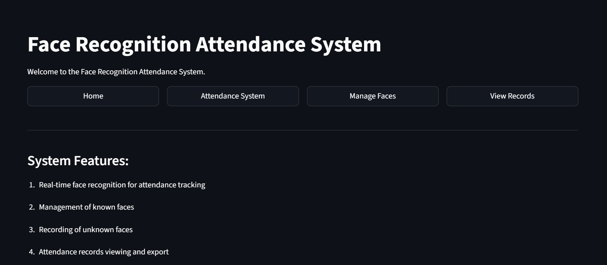
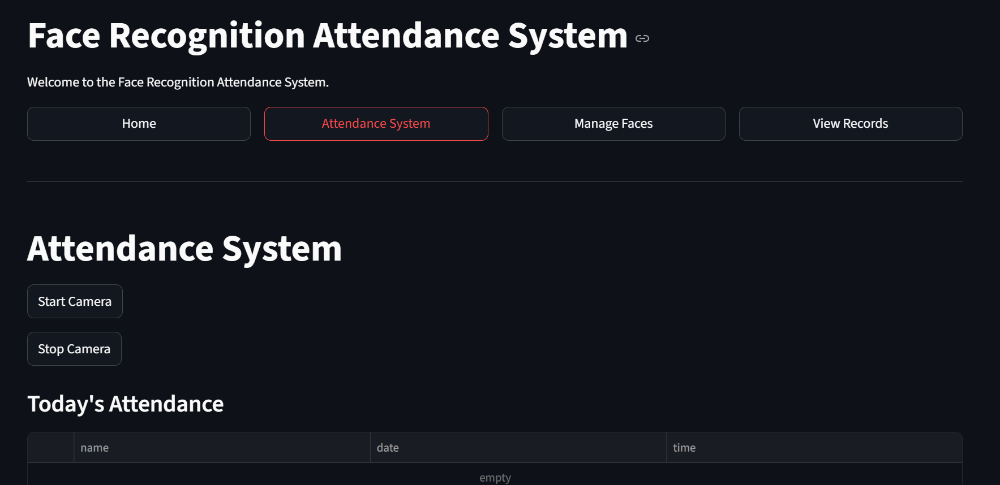
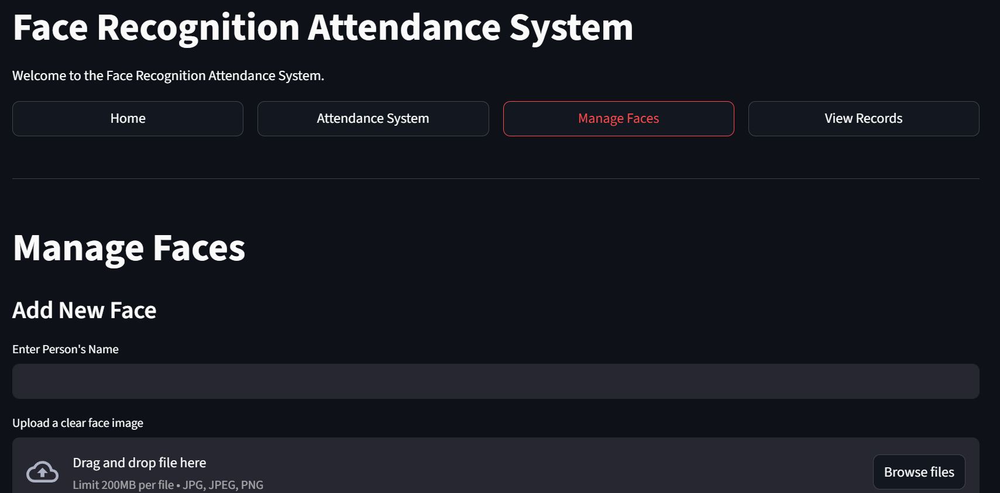
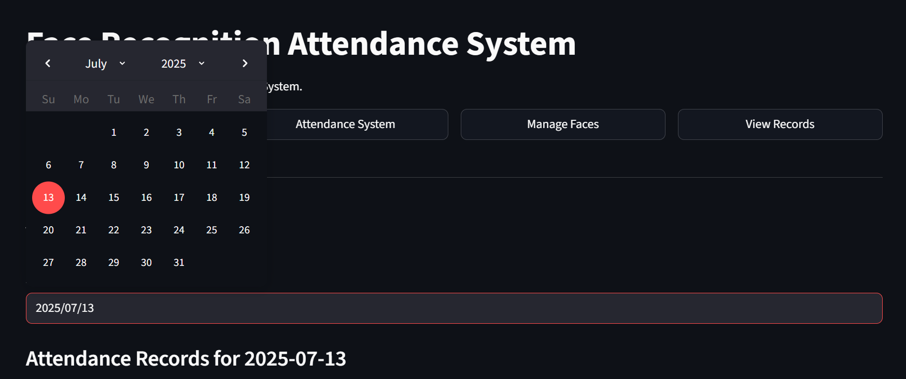
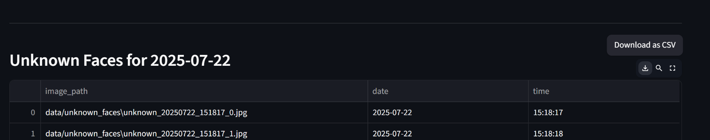

# [Startup_Demo](../../../)/[3rdParty](../../)/[AI_PC](../)/[face-recognition-attendance](./)

# Face Recognition Attendance System

## 📚 Table of Contents
1. [Overview](#1-overview)
2. [Features](#2-features)
3. [Environment Setup](#3-environment-setup)
4. [Source Code Setup Instructions](#4-source-code-setup-instructions)
5. [Project structure](#5-project-structure)
6. [Libraries-used](#6-libraries-used)
7. [Running Application](#7-running-application)
8. [Application Outputs](#8-application-outputs)
   - [Home](#81-home)
   - [Attendance System](#82-attendance-system)
   - [Manage Faces](#83-manage-faces)
   - [View Records](#84-view-records)


# 1. Overview
This project implements a real-time face recognition attendance system using Streamlit for the user interface, OpenCV for video processing, and Facenet-PyTorch for deep learning-based face recognition. It allows for student registration, automatic attendance marking, and viewing attendance records.

# 2. Features

*   **Real-time Face Recognition:** Automatically detects and recognizes faces from a webcam feed.
*   **Attendance Tracking:** Marks attendance for recognized students.
*   **Student Management:** Add new students with their face images and embeddings.
*   **Unknown Face Detection:** Records images and timestamps of unrecognized faces.
*   **Attendance Records:** View and export attendance logs for specific dates.
*   **Intuitive UI:** Built with Streamlit for an easy-to-use web interface.
*   **Local Database:** Uses SQLite to store student information, face embeddings, and attendance records.

# 3. Environment Setup

 To set up the Python environment required for running the application, follow the steps below. This ensures all dependencies are installed in an isolated and reproducible environment.

## Git Configuration

Git is required for version control and collaboration. Proper configuration ensures seamless integration with repositories and development workflows.

For detailed steps, refer to the internal documentation:  
[Setup Git]( ../../../Hardware/Tools.md#git-setup)

---
# 4. Source Code Setup Instructions

To set up and run the project, follow these steps:
1.  **Create your working directory** :
    ```bash
    mkdir my_working_directory
    cd my_working_directory
    ```

2.  **Clone the repository:**

    ```bash
    git clone -n --depth=1 --filter=tree:0 https://github.com/qualcomm/Startup-Demos.git
    cd Startup-Demos
    git sparse-checkout set --no-cone /3rdParty/AI_PC/face-recognition-attendance
    git checkout
    ```

3.  **Create a virtual environment :**
    
    Python 3.10 is recommended.
    ```bash
    python -m venv venv
    ```
    **Reference:** Create a [virtualenv](https://virtualenv.pypa.io/en/latest/) 

4.  **Activate the virtual environment:**

        .\venv\Scripts\activate
         

5.  **Install the required libraries:**

    ```bash
    pip install -r requirements.txt
    ```

# 5. Project Structure

*   `src/app.py`: The main Streamlit application file, handling the user interface, navigation, and interaction with other modules.
*   `src/database.py`: Manages SQLite database operations, including initialization, adding/retrieving student data, marking attendance, and recording unknown faces.
*   `src/clear_db.py`: A utility script to clear the `students` and `unknown_faces` tables in the database.
*   `src/utils.py`: Contains utility functions for image handling, such as loading images from uploads, saving uploaded images, and retrieving images from paths.
*   `src/face_recognition.py`: Implements the core face recognition logic using MTCNN for face detection and InceptionResnetV1 for embedding generation. It also handles similarity comparison, attendance marking, and unknown face recording.
*   `src/requirements.txt`: Lists all Python dependencies required for the project.
*   `data/`: Directory to store database files and face images.
    *   `data/attendance.db`: The SQLite database file.
    *   `data/known_faces/`: Stores images of registered students.
    *   `data/unknown_faces/`: Stores images of unrecognized faces.

# 6. Libraries Used

The project utilizes the following key Python libraries:

*   **`streamlit`**: For creating interactive web applications.
*   **`opencv-python` (`cv2`)**: For real-time video capture, image processing, and drawing on frames.
*   **`numpy`**: For numerical operations, especially with face embeddings and image data.
*   **`pandas`**: For data manipulation and displaying attendance records in tabular format.
*   **`pillow` (`PIL`)**: For image file handling (saving uploaded images).
*   **`facenet-pytorch`**: Provides pre-trained MTCNN (Multi-task Cascaded Convolutional Networks) for face detection and InceptionResnetV1 for face embedding extraction.
*   **`torch`**: The underlying deep learning framework for `facenet-pytorch`.
*   **`torchvision`**: Companion library to `torch` for computer vision tasks.
*   **`scipy`**: Specifically `scipy.spatial.distance.cosine` for calculating similarity between face embeddings.
*   **`pyttsx3`**: For text-to-speech functionality (speaking welcome messages).
*   **`sqlite3` (built-in)**: For local database management.
*   **`datetime` (built-in)**: For handling dates and times in attendance records and file naming.
*   **`os` (built-in)**: For operating system interactions, such as creating directories and managing file paths.
*   **`threading` (built-in)**: For running text-to-speech in a separate thread to prevent UI blocking.

# 7. Running Application
To run the Streamlit application:


## Step 1: Navigate to the Application Directory
First, ensure that you are in the correct directory. You should be in the src folder of the application. If you are not, navigate to the correct directory using the following command.

```bash
cd /3rdParty/AI_PC/face-recognition-attendance/src
```

## Step 2: Run the Streamlit app
```bash
streamlit run app.py
```
# 8. Application Outputs 

The Streamlit application provides four main navigation sections accessible via buttons at the top:

## 8.1 Home
- Displays a welcome message and a summary of system features.
- Provides a general overview of the application's capabilities.


## 8.2 Attendance System

-  Allows users to start and stop the webcam feed for real-time face recognition.
-  Displays the processed camera feed with detected faces and names.
-  Shows today's attendance records in a table.
-  Automatically updates known faces from the database when the camera starts.


## 8.3 Manage Faces
-  Section for registering new students.
-  Users can enter a person's name and upload a clear face image.
-  The system detects and encodes the face from the uploaded image.
-  Once a face is detected, a button allows adding the person and their face embedding to the database.
-  Includes error handling for no face or multiple faces detected.


## 8.4 View Records
-  Enables users to select a specific date to view attendance records.
-  Displays attendance logs for recognized students on the chosen date, with options to download as CSV.
-  Shows images of known faces that were recorded on the selected date.
-  Presents a table of unknown faces recorded on the selected date.

