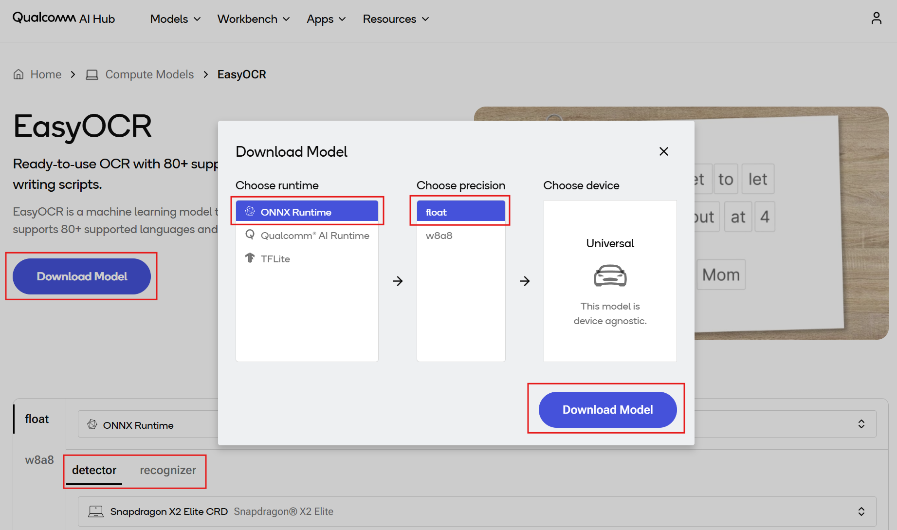
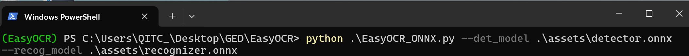
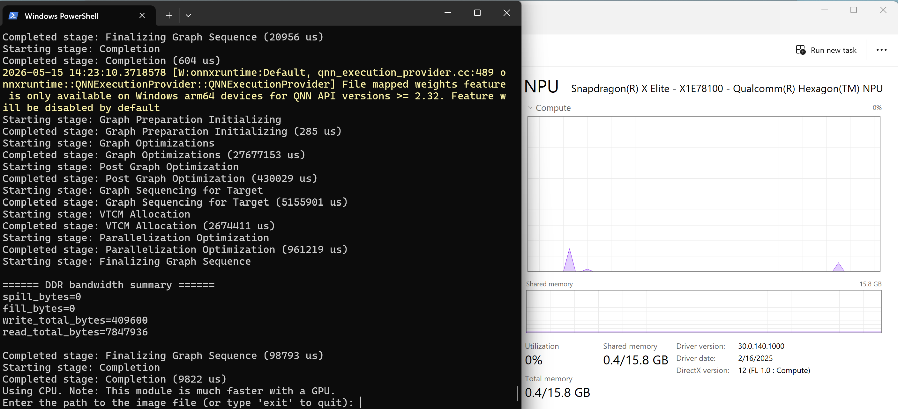
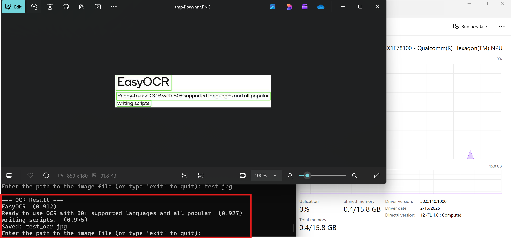

# [Startup-Demos](../../../)/[CV_VR](../../)/[AI_PC](../)/[EasyOCR](./)

## Table of Contents
- [Overview](#1-overview)
- [Requirements](#2-requirements)
   - [Platform](#platform)
   - [Tools and SDK](#tools-and-sdk)
- [Environment setup](#3-environment-setup)
   - [Install Git](#install-git)
   - [Clone the specific subfolder](#clone-the-specific-subfolder)
   - [Set up Python virtual environment](#set-up-python-virtual-environment)
- [Preparing model assets](#4-preparing-model-assets)
   - [Downloading the model from Qualcomm AI Hub](#downloading-the-model-from-qualcomm-ai-hub)
- [Running Python app](#5-running-python-app)
   - [Checking the assets directory](#checking-the-assets-directory)
   - [Running EasyOCR app via CLI](#running-easyocr-app-via-cli)
   - [Example output](#example-output)


## 1. Overview

This demo demonstrates an Optical Character Recognition (OCR) application running on Windows on Snapdragon®, accelerated by ONNX Runtime with [QNN Execution Provider](https://onnxruntime.ai/docs/execution-providers/QNN-ExecutionProvider.html).

It is intended as a reference demo to illustrate how to deploy and run a modern OCR model on Qualcomm Compute platform with Snapdragon® Neural Processing Unit (NPU) acceleration.

The demo highlights both text detection and recognition pipelines commonly used for extracting structured information from images. Depending on the target use case and performance requirements, additional tuning and optimization may be required.

The application follows a typical OCR pipeline:

1. Image Preprocessing – The input image is normalized and resized to meet model requirements, ensuring consistent performance across different image sources and formats.

2. Text Detection Model Inference – A detection model identifies regions of interest (text areas) within the image and generates bounding boxes.

3. Text Recognition Model Inference – Cropped text regions are processed by a recognition model to convert visual text into machine-readable strings.

Optimized for Qualcomm Compute platform, this demo showcases efficient and accurate text extraction using NPU acceleration, making it suitable for scenarios such as:

- Document digitization
- Receipt and invoice processing
- Real-time text recognition for mobile and edge devices
- Accessibility and assistive reading applications
- Industrial and automation workflows involving text extraction


## 2. Requirements

### Platform

- Windows on Snapdragon® (Qualcomm Compute platform, e.g. Snapdragon® X2 Elite, X Elite, and X Plus)
- Windows 11
- This application is tested on ASUS Vivobook S15 (S5507)

### Tools and SDK

- Python
   - This application is tested with Python 3.12.10.
   - Install Python 64-bit by following the [installation guide](../../../Tools/Software/Python_Setup/README.md#21-download-python-installer).
   - Make sure you have Python installed and properly configured in your system path.
      ```bash
      # Check Python version
      python --version
      ```

- Qualcomm AI Runtime SDK : [QNN SDK](https://softwarecenter.qualcomm.com/) (Optional)
  - The required QNN dependency libraries are included in Python onnxruntime-qnn package.
  - This application is tested with `onnxruntime-qnn==1.24.4`.


## 3. Environment setup

This section describes the development environment setup process, including Git installation, selective subdirectory cloning, Python virtual environment creation, and dependencies installation.

### Install Git

Git is required for version control and collaboration. Proper configuration ensures seamless integration with repositories and development workflows.

For detailed steps, refer to the internal documentation: [Setup Git](../../../Hardware/Tools.md#git-setup).

### Clone the specific subfolder

Once Git is installed, clone the project repository, and use `CV_VR/AI_PC/EasyOCR` directory for this application.

Open Windows PowerShell, navigate to your target directory, and run the following commands:

```bash
git clone -n --depth=1 --filter=tree:0 https://github.com/qualcomm/Startup-Demos.git
cd Startup-Demos
git sparse-checkout set --no-cone CV_VR/AI_PC/EasyOCR
git checkout
```

After running these commands, your local directory structure will contain only:

```bash
Startup-Demos/
└── CV_VR/
    └── AI_PC/
        └── EasyOCR/
```

### Set up Python virtual environment

Virtual environments are isolated Python environments that allow you to work on different projects with different dependencies without conflicts.

For detailed steps, refer to the internal documentation: [Virtual Environments](../../../Tools/Software/Python_Setup/README.md#4-virtual-environments).

Once in the virtual environment, install the required Python packages. Manually install onnxruntime-qnn to avoid the specified provider issue.
```bash
cd .\CV_VR\AI_PC\EasyOCR
pip install -r .\requirements.txt
pip install onnxruntime-qnn==1.24.4
```

Your environment is now ready. You can start exploring and running the project inside Startup-Demos directory.


## 4. Preparing model assets

### Downloading the model from Qualcomm AI Hub

The model used in this OCR application is EasyOCR.

Go to [Qualcomm AI Hub](https://aihub.qualcomm.com/compute/models/easyocr) and download EasyOCR model for Qualcomm Compute platform.

Download detector and recognizer model for ONNX Runtime and place model files into `./assets/` directory.




## 5. Running Python app

### Checking the assets directory

Please ensure that you have followed the section above and placed the following assets into the specific directory. You may change the directory if needed.

- `detector.onnx`, `detector.data`, `recognizer.onnx`, and `recognizer.data` from Qualcomm AI Hub: `./assets/`

The project directory should contain:
```bash
./assets
   ├── detector.data
   ├── detector.onnx
   ├── recognizer.data
   └── recognizer.onnx
./EasyOCR_ONNX.py
./<your_test_image>.jpg
```

### Running EasyOCR app via CLI

Run EasyOCR demo from the command line with real-time inference accelerated by Snapdragon® NPU.

Open your terminal and navigate to your target directory.

```bash
cd .\Startup-Demos\CV_VR\AI_PC\EasyOCR
python .\EasyOCR_ONNX.py --det_model .\assets\detector.onnx --recog_model .\assets\recognizer.onnx
```





### Input your test image path

```bash
Enter the path to the image file (or type 'exit' to quit): ./test.jpg
```

### Example output

Inference is accelerated using Snapdragon® NPU, enabling fast and efficient text recognition on device. The application prints the recognized text along with confidence scores in a clear console format.



In addition to the console output, the application automatically generates and saves an image with detected text regions highlighted using bounding boxes. This visualization helps illustrate where the text was identified in the original image and improves interpretability of the OCR results.

The annotated output image is saved in the current working directory using the following naming convention:
<your_test_image>_ocr.jpg

This end-to-end pipeline provides both structured textual output and visual confirmation, making it suitable for debugging, evaluation, and real-world deployment scenarios.
