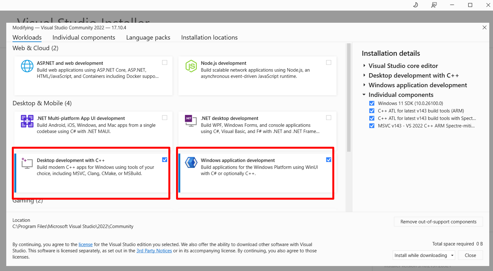
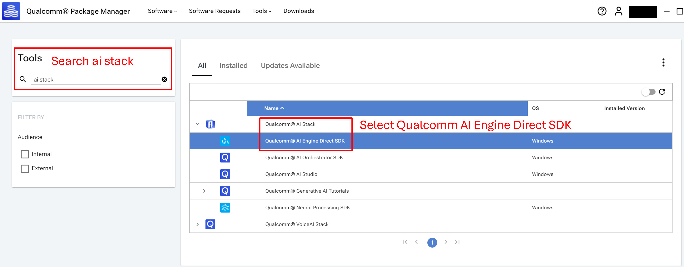
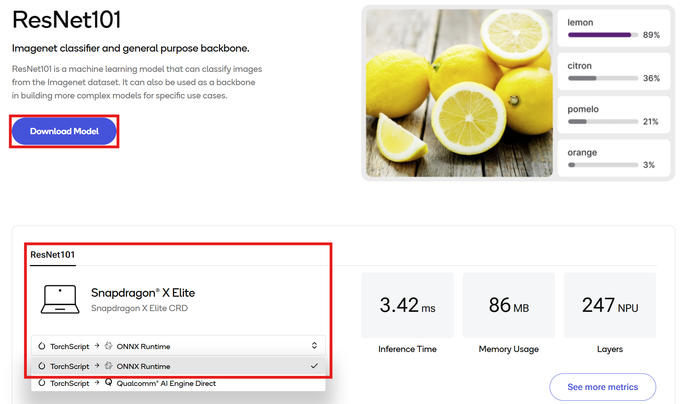
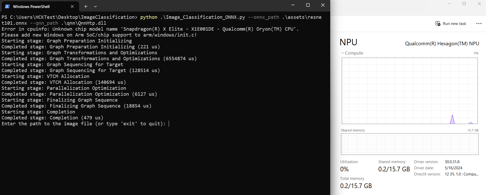
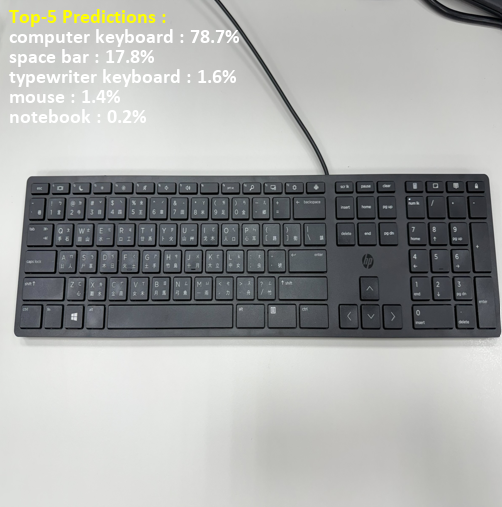

# Image Classification Python CLI Application

## Table of contents
- [Overview](#1-overview)
- [Requirements](#2-requirements)
- [Preparing model assets](#3-preparing-model-assets)
- [Running Python app](#4-running-python-app)

## 1. Overview
Image Classification application for Windows on Snapdragon® with [ResNet101](https://aihub.qualcomm.com/compute/models/resnet101?domain=Computer+Vision&useCase=Image+Classification) using ONNX runtime.

ResNet101 is a machine learning model that can classify images from the Imagenet dataset. It can also be used as a backbone in building more complex models for specific use cases. Optimized for Qualcomm Compute platform, this application enables real-time image classification.

This Python application demonstrates how to use [QNN Execution Provider](https://onnxruntime.ai/docs/execution-providers/QNN-ExecutionProvider.html) to accelerate the model using the Snapdragon® Neural Processing Unit (NPU).

## 2. Requirements

### Platform

- Windows on Snapdragon® (Qualcommm Compute platform, e.g. X Elite and X Plus)
- Windows 11

### Tools and SDK

- Visual Studio 2022
   - Visual Studio is required to build Python ARM64 package.
   - Download any variant of Visual Studio [here](https://visualstudio.microsoft.com/vs/) and install on your Windows on Snapdragon.
   - Make sure **Desktop development with C++ and Windows application development** are selected during the installation or installed separately later.
   
   - Necessary individual components
      - MSVC v143 - VS 2022 C++ ARM64 build tools (latest)
      - MSVC v143 - VS 2022 C++ ARM64 Spectre-mitigated libs (latest)
      - MSVC v143 - VS 2022 C++ x64/x86 build tools (latest)
      - C++ ATL for latest v143 build tools (ARM64)
      - C++ ATL for latest v143 build tools with Spectre Mitigations (ARM64)
      - C++ Universal Windows Platform support for v143 build tools (ARM64/ARM64EC)
      - Windows 11 SDK (10.0.26100.0)

- Python
   - This application is tested with Python 3.11.9.
   - Download and install [Python 3.11.9 ARM64](https://www.python.org/downloads/release/python-3119/) on your Windows on Snapdragon.
   - Required packages.
      - numpy
      - onnxruntime-qnn
      - pillow

- Qualcomm AI Engine Direct : [QNN SDK](https://qpm.qualcomm.com/#/main/tools/details/qualcomm_ai_engine_direct)
  - Download and install Qualcomm AI Engine Direct SDK from Qualcomm Package Manager.
  
  - This Python application is tested with QNN v2.31.0.250130.
  - Find your `QNN_SDK_ROOT`. For example, `QNN_SDK_ROOT = C:\Qualcomm\AIStack\QAIRT\2.31.0.250130`.
  - After QNN installation is finished, copy the following 5 libraries to `./qnn/` directory. You can change to your directory if needed.
      - `<QNN_SDK_ROOT>\lib\aarch64-windows-msvc`
         - QnnHtp.dll
         - QnnHtpPrepare.dll
         - QnnHtpV73Stub.dll
      - `<QNN_SDK_ROOT>\lib\hexagon-v73\unsigned`
         - libqnnhtpv73.cat
         - libQnnHtpV73Skel.so

## 3. Preparing model assets

### Downloading the model from Qualcomm AI Hub

Download ResNet101 ONNX model for Compute from [Qualcomm AI Hub](https://aihub.qualcomm.com/compute/models/resnet101?domain=Computer+Vision&useCase=Image+Classification) and place into `./assets/` directory.



### Image assets
Prepare your test image assets and place into `./assets/` directory.

Model input resolution is 224 x 224.

If input image is in different resolution, it will be resized to 224 x 224.

## 4. Running Python app

### Checking the assets directory

Please ensure that you have followed the section above and placed the following assets into the specific directory. You may change the directory if needed.

   - ONNX model from Qualcomm AI Hub and test images : `./assets/`
   - QNN libraries : `./qnn/`
   
### Installing required Python packages

Open your terminal and navigate to the project directory.

```bash
pip install numpy onnxruntime-qnn pillow
```

### Running image classification app via CLI

```bash
python .\Image_Classification_ONNX.py --onnx_path .\assets\resnet101.onnx --qnn_path .\qnn\QnnHtp.dll
```



### Input your test image path
```bash
Enter the path to the image file (or type 'exit' to quit): ./assets/keyboard.jpg
```
### Example Output


