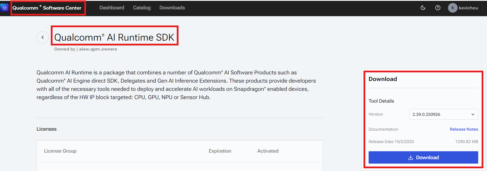
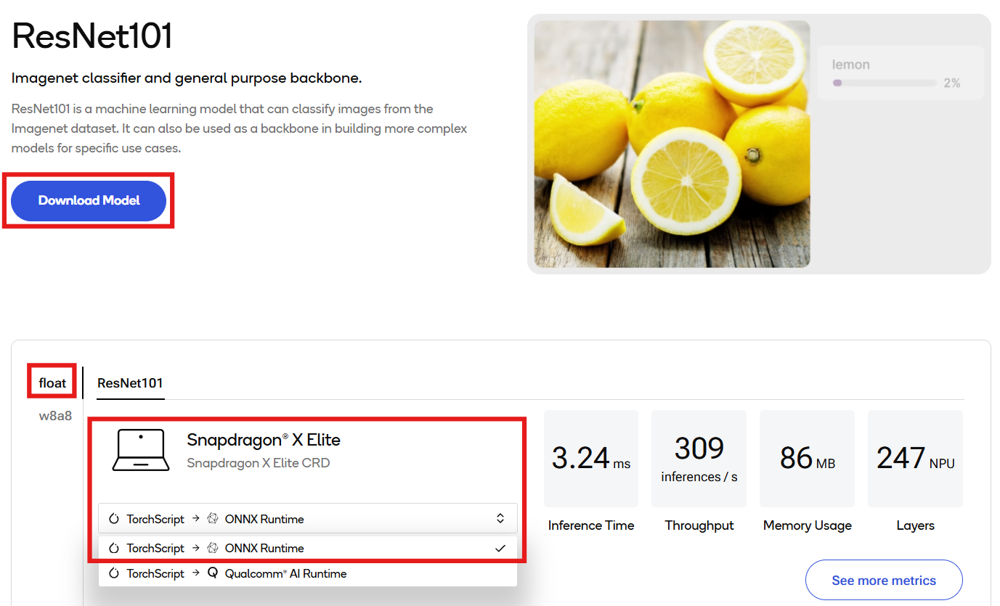
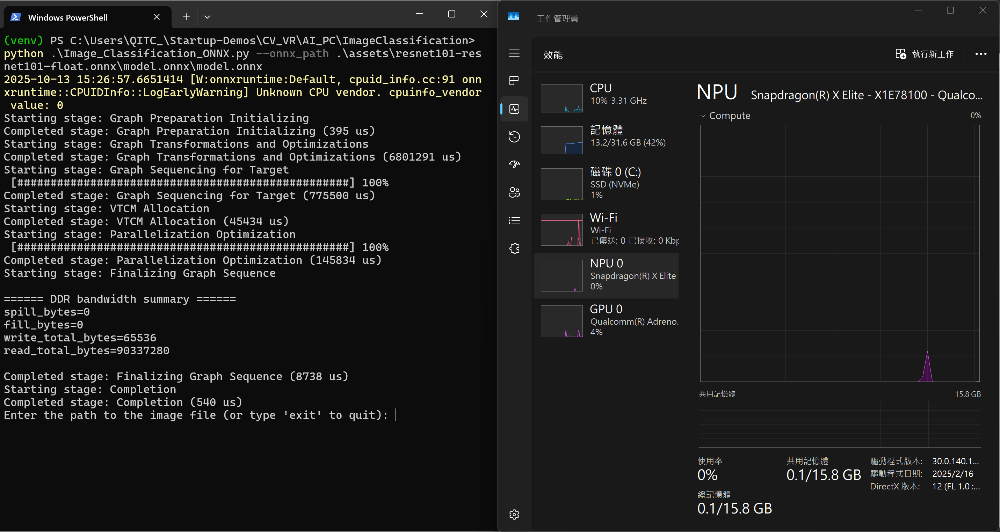
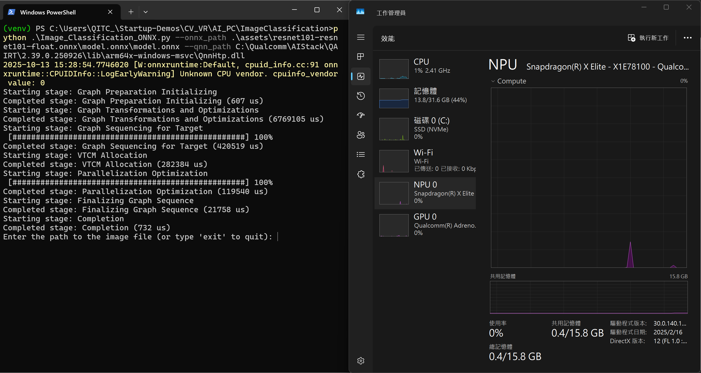
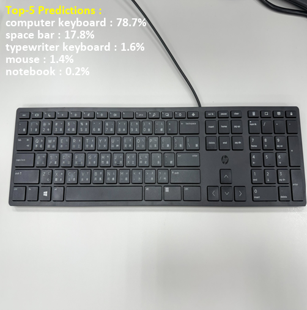

# Image Classification Python CLI Application

## Table of contents
- [Overview](#1-overview)
- [Requirements](#2-requirements)
- [Preparing model assets](#3-preparing-model-assets)
- [Running Python app](#4-running-python-app)

## 1. Overview
Image Classification application for Windows on Snapdragon® with [ResNet101](https://aihub.qualcomm.com/compute/models/resnet101?domain=Computer+Vision&useCase=Image+Classification) using ONNX runtime.

ResNet101 is a machine learning model that can classify images from the Imagenet dataset. It can also be used as a backbone in building more complex models for specific use cases. Optimized for Qualcomm Compute platform, this application enables real-time image classification.

This Python application demonstrates how to use [QNN Execution Provider](https://onnxruntime.ai/docs/execution-providers/QNN-ExecutionProvider.html) to accelerate the model using the Snapdragon® Neural Processing Unit (NPU).

## 2. Requirements

### Platform

- Windows on Snapdragon® (Qualcommm Compute platform, e.g. X Elite and X Plus)
- Windows 11
- This application is tested on ASUS Vivobook S15 (S5507).

### Tools and SDK

- Python
   - This application is tested with Python 3.10.9.
   - Download and install [Python 3.10.9 64-bit](https://www.python.org/downloads/release/python-3109/) on your Windows on Snapdragon.
   - Required packages.
      - numpy
      - onnxruntime-qnn
      - pillow

- Qualcomm AI Runtime SDK : [QNN SDK](https://softwarecenter.qualcomm.com/)
  - The required QNN dependency libraries are included in onnxruntime-qnn package.
  - If you plan to use a specific version of QNN libraries, download and install Qualcomm AI Runtime SDK from Qualcomm Software Center.
  
  - This Python application is tested with default QNN libraries from onnxruntime-qnn and QNN v2.39.0.250926.
  - Find your `QNN_SDK_ROOT`. For example, `QNN_SDK_ROOT = C:\Qualcomm\AIStack\QAIRT\2.39.0.250926`.
  - Remember this directory if you plan to use a specific version of QNN libraries.
      - `<QNN_SDK_ROOT>\lib\arm64x-windows-msvc`


## 3. Preparing model assets

### Downloading the model from Qualcomm AI Hub

Download ResNet101 ONNX model for Compute from [Qualcomm AI Hub](https://aihub.qualcomm.com/compute/models/resnet101?domain=Computer+Vision&useCase=Image+Classification). Extract the zip file and place model files into `./assets/` directory.



### Image assets
Prepare your test image assets and place into `./assets/` directory.

Model input resolution is 224 x 224.

If input image is in different resolution, it will be resized to 224 x 224.

## 4. Running Python app

### Checking the assets directory

Please ensure that you have followed the section above and placed the following assets into the specific directory. You may change the directory if needed.

   - ONNX model from Qualcomm AI Hub and test images : `./assets/`
   
### Installing required Python packages

Open your terminal and navigate to the project directory.

```bash
pip install numpy onnxruntime-qnn pillow
```

### Running image classification app via CLI

Run the application with default QNN libraries from onnxruntime-qnn package.

You may change the path if needed.

```bash
python .\Image_Classification_ONNX.py --onnx_path .\assets\model.onnx
```


You can also run the application with a specific version of QNN libraries.

```bash
python .\Image_Classification_ONNX.py --onnx_path .\assets\model.onnx --qnn_path C:\Qualcomm\AIStack\QAIRT\2.39.0.250926\lib\arm64x-windows-msvc\QnnHtp.dll
```



### Input your test image path
```bash
Enter the path to the image file (or type 'exit' to quit): ./assets/keyboard.jpg
```
### Example Output

