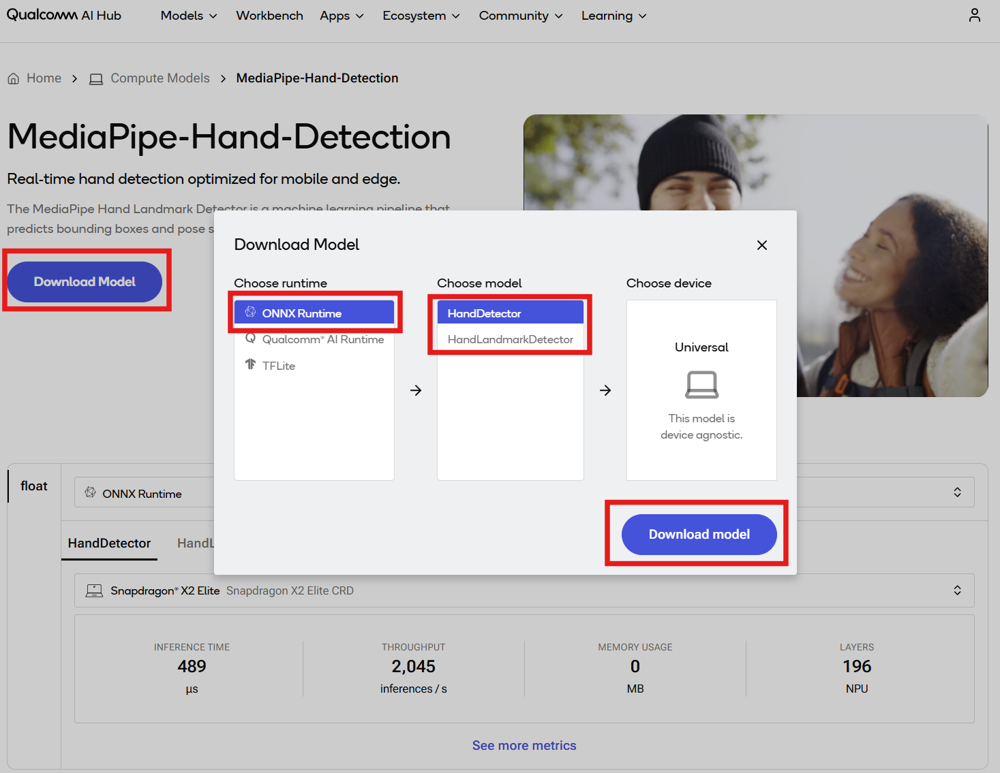
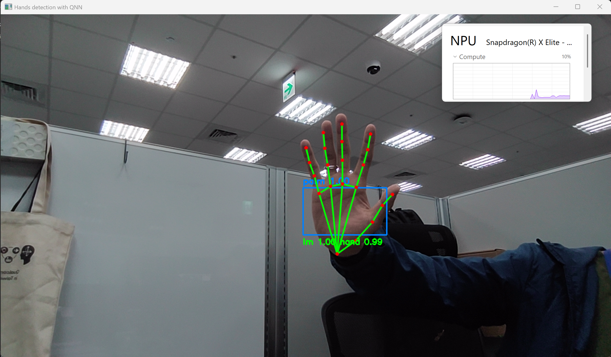

# [Startup-Demos](../../../)/[CV_VR](../../)/[AI_PC](../)/[MediaPipe_Hand_Detection](./)

## Table of Contents
- [Overview](#1-overview)
- [Requirements](#2-requirements)
   - [Platform](#platform)
   - [Tools and SDK](#tools-and-sdk)
- [Environment setup](#3-environment-setup)
   - [Install Git](#install-git)
   - [Clone the specific subfolder](#clone-the-specific-subfolder)
   - [Set up Python virtual environment](#set-up-python-virtual-environment)
- [Preparing model assets](#4-preparing-model-assets)
   - [Downloading the model from Qualcomm AI Hub](#downloading-the-model-from-qualcomm-ai-hub)
   - [Downloading the required anchors_palm.npy file](#downloading-the-required-anchors_palmnpy-file)
- [Running Python app](#5-running-python-app)
   - [Checking the assets directory](#checking-the-assets-directory)
   - [Running MediaPipe Hand Detection app via CLI](#running-mediapipe-hand-detection-app-via-cli)
   - [Example output](#example-output)

## 1. Overview

This demo demonstrates a [MediaPipe Hand Detection](https://aihub.qualcomm.com/compute/models/mediapipe_hand?domain=Computer+Vision&useCase=Object+Detection) application running on Windows on Snapdragon®, accelerated by ONNX Runtime with [QNN Execution Provider](https://onnxruntime.ai/docs/execution-providers/QNN-ExecutionProvider.html).

It is intended as a reference demo to illustrate how to run a MediaPipe-style hand pipeline with Snapdragon® Neural Processing Unit (NPU) acceleration on Qualcomm Compute platform. Depending on the target use case and deployment scenario, additional tuning and optimization may be required to achieve optimal performance.

The application follows the classic two-stage MediaPipe hand pipeline:

1. Hand Detection Model – Detects candidate hand regions
2. Hand Landmark Model – Predicts 21 keypoints per hand for precise tracking

Optimized for Qualcomm Compute platform, this demo showcases real-time hand detection and tracking using NPU, making it suitable for interactive scenarios such as:

- Kiosk interaction
- Gesture control
- AR/VR input
- Smart camera applications

## 2. Requirements

### Platform

- Windows on Snapdragon® (Qualcomm Compute platform, e.g. Snapdragon® X Elite and X Plus)
- Windows 11
- This application is tested on ASUS Vivobook S15 (S5507).

### Tools and SDK

- Python
   - This application is tested with Python 3.12.10.
   - Install Python 64-bit by following the [installation guide](../../../Tools/Software/Python_Setup/README.md#21-download-python-installer).
   - Make sure you have Python installed and properly configured in your system path.
      ```bash
      # Check Python version
      python --version
      ```

- Qualcomm AI Runtime SDK : [QNN SDK](https://softwarecenter.qualcomm.com/) (Optional)
  - The required QNN dependency libraries are included in Python onnxruntime-qnn package.
  - This application is tested with `onnxruntime-qnn==1.24.4`.

## 3. Environment setup

This section describes the development environment setup process, including Git installation, selective subdirectory cloning, Python virtual environment creation, and dependencies installation.

### Install Git

Git is required for version control and collaboration. Proper configuration ensures seamless integration with repositories and development workflows.

For detailed steps, refer to the internal documentation: [Setup Git](../../../Hardware/Tools.md#git-setup).

### Clone the specific subfolder

Once Git is installed, clone the project repository, and use `CV_VR/AI_PC/MediaPipe_Hand_Detection` directory for this application.

Open Windows PowerShell, navigate to your target directory, and run the following commands:

```bash
git clone -n --depth=1 --filter=tree:0 https://github.com/qualcomm/Startup-Demos.git
cd Startup-Demos
git sparse-checkout set --no-cone CV_VR/AI_PC/MediaPipe_Hand_Detection
git checkout
```

After running these commands, your local directory structure will contain only:

```bash
Startup-Demos/
└── CV_VR/
    └── AI_PC/
        └── MediaPipe_Hand_Detection/
```

### Set up Python virtual environment

Virtual environments are isolated Python environments that allow you to work on different projects with different dependencies without conflicts.

For detailed steps, refer to the internal documentation: [Virtual Environments](../../../Tools/Software/Python_Setup/README.md#4-virtual-environments).

Once in the virtual environment, install the required Python packages.
```bash
cd .\CV_VR\AI_PC\MediaPipe_Hand_Detection
pip install -r .\requirements.txt
```

Your environment is now ready. You can start exploring and running the project inside Startup-Demos directory.

## 4. Preparing model assets

### Downloading the model from Qualcomm AI Hub

Go to [Qualcomm AI Hub](https://aihub.qualcomm.com/compute/models/mediapipe_hand?domain=Computer+Vision&useCase=Object+Detection) and download MediaPipe-Hand-Detection model for Qualcomm Compute platform.

1. Download `HandDetector` model for ONNX Runtime and place `model.onnx` and `model.data` files into `./HandD/` directory.
2. Download `HandLandmarkDetector` model for ONNX Runtime and place `model.onnx` and `model.data` files into `./HandL/` directory.



### Downloading the required anchors_palm.npy file

Note that anchors_palm.npy is required for decoding hand detection outputs and must match the model input resolution. Please download the anchors file from this [GitHub](
https://github.com/zmurez/MediaPipePyTorch/).

⚠️Disclaimer: This project builds upon MediaPipe Hand Detection implementation. The original pretrained model and its license remain with the original authors. Please refer to the original license here and ensure compliance with its terms at https://github.com/zmurez/MediaPipePyTorch/blob/master/LICENSE.


## 5. Running Python app

### Checking the assets directory

Please ensure that you have followed the section above and placed the following assets into the specific directory. You may change the directory if needed.

Before running, confirm the following assets exist:
```bash
./HandD
   ├── model.data
   └── model.onnx
./HandL
   ├── model.data
   └── model.onnx
./anchors_palm.npy
```

### Running MediaPipe Hand Detection app via CLI

Run MediaPipe Hand Detection demo from the command line using the front camera of a Snapdragon® X Series laptop as the video input source, with real-time inference accelerated by Snapdragon® NPU.

Open your terminal and navigate to your target directory.

```bash
cd .\Startup-Demos\CV_VR\AI_PC\MediaPipe_Hand_Detection
python ./HandDetection_ONNX.py --palm_model ./HandD/model.onnx --landmark_model ./HandL/model.onnx --anchors_npy ./anchors_palm.npy --mirror
```

`--mirror` is for enabling horizontal mirroring of the input video for front camera preview.

### Example output

The example output shows detected hand bounding boxes, 21 hand landmarks per hand, and a real‑time detection in camera mode. 

Inference is accelerated using Snapdragon® NPU.


