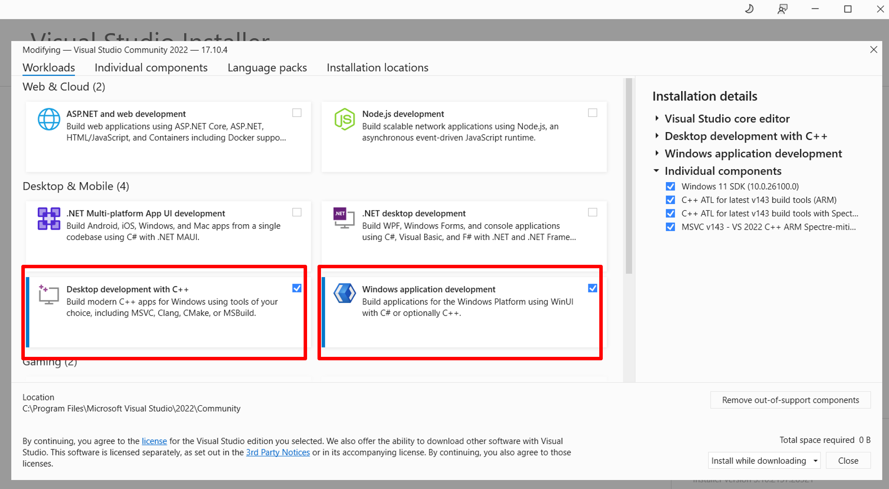
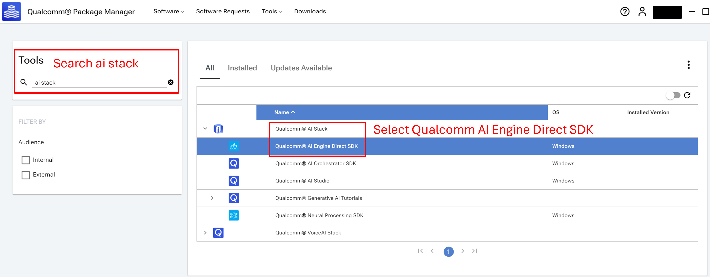

# Object Detection Python CLI Application

## Table of contents
- [Overview](#1-overview)
- [Requirements](#2-requirements)
- [Preparing model assets](#3-preparing-model-assets)
- [Running Python app](#4-running-python-app)

## 1. Overview

Object detection application for Windows on Snapdragon® with [YOLOv8-Detection](https://aihub.qualcomm.com/compute/models/yolov8_det) using ONNX runtime.

Ultralytics YOLOv8 is a machine learning model that predicts object bounding boxes and classes in images. Optimized for Qualcomm Compute platform, this application enables real-time object detection.

This Python application demonstrates how to use [QNN Execution Provider](https://onnxruntime.ai/docs/execution-providers/QNN-ExecutionProvider.html) to accelerate the model using the Snapdragon® Neural Processing Unit (NPU).

## 2. Requirements

### Platform

- Windows on Snapdragon® (Qualcomm Compute platform, e.g. X Elite and X Plus)
- Windows 11

### Tools and SDK

- Visual Studio 2022
   - Visual Studio is required to build Python ARM64 package.
   - Download any variant of Visual Studio [here](https://visualstudio.microsoft.com/vs/) and install on your Windows on Snapdragon.
   - Make sure **Desktop development with C++ and Windows application development** are selected during the installation or installed separately later.
   
   - Necessary individual components
      - MSVC v143 - VS 2022 C++ ARM64 build tools (latest)
      - MSVC v143 - VS 2022 C++ ARM64 Spectre-mitigated libs (latest)
      - MSVC v143 - VS 2022 C++ x64/x86 build tools (latest)
      - C++ ATL for latest v143 build tools (ARM64)
      - C++ ATL for latest v143 build tools with Spectre Mitigations (ARM64)
      - C++ Universal Windows Platform support for v143 build tools (ARM64/ARM64EC)
      - Windows 11 SDK (10.0.26100.0)

- Python
   - This application is tested with Python 3.11.9.
   - Download and install [Python 3.11.9 ARM64](https://www.python.org/downloads/release/python-3119/) on your Windows on Snapdragon.
   - Required packages.
      - numpy
      - onnxruntime-qnn
      - opencv-python

- Qualcomm AI Engine Direct : [QNN SDK](https://qpm.qualcomm.com/#/main/tools/details/qualcomm_ai_engine_direct)
  - Download and install Qualcomm AI Engine Direct SDK from Qualcomm Package Manager.
  
  - This Python application is tested with QNN v2.31.0.250130.
  - Find your `QNN_SDK_ROOT`. For example, `QNN_SDK_ROOT = C:\Qualcomm\AIStack\QAIRT\2.31.0.250130`.
  - After QNN installation is finished, copy the following 5 libraries to `./qnn/` directory.
      - `<QNN_SDK_ROOT>\lib\aarch64-windows-msvc`
         - QnnHtp.dll
         - QnnHtpPrepare.dll
         - QnnHtpV73Stub.dll
      - `<QNN_SDK_ROOT>\lib\hexagon-v73\unsigned`
         - libqnnhtpv73.cat
         - libQnnHtpV73Skel.so

## 3. Preparing model assets

### Compiling and downloading the model from Qualcomm AI Hub

Set up Python environment as described in [Qualcomm AI Hub](https://aihub.qualcomm.com/get-started).

Follow the [instruction](https://github.com/quic/ai-hub-models/tree/main/qai_hub_models/models/yolov8_det) and run the export script to produce a model optimized for on-device deployment.
```bash
python -m qai_hub_models.models.yolov8_det.export --device "Snapdragon X Elite CRD" --target-runtime onnx
```

After the compilation is finished, go to [Qualcomm AI Hub Jobs page](https://app.aihub.qualcomm.com/jobs/) to check compiled result and download the ONNX model to `./assets/` directory.


### Video assets
Prepare your video assets and place into `./assets/` directory.

Model input resolution is 640 x 640.

If input video is in different resolution, it will be resized to 640 x 640.

## 4. Running Python app

### Checking the assets directory

Please ensure that you have followed the section above and placed the following assets into the specific directory. You may change the directory if needed.

   - Video assets : `./assets/`
   - ONNX model from Qualcomm AI Hub : `./assets/`
   - QNN libraries : `./qnn/`
   
### Installing required Python packages

Open your terminal and navigate to the project directory.

```bash
pip install numpy onnxruntime-qnn
pip install opencv-python==4.10.0.84
```

If you are not able to install opencv-python, install the wheel from this [GitHub](https://github.com/axcpy08/opencv-python-4.10.0.84_ARM64_wheel).

### Running object detection app via CLI

The default confidence threshold and IoU threshold for NMS are 0.5 and 0.4, respectively.

```bash
python .\Object_Detection_ONNX.py --onnx_path .\assets\yolov8_det.onnx --qnn_path .\qnn\QnnHtp.dll --video_path .\assets\people_run.mp4
```

Running with the specified confidence and IoU thresholds for NMS.

```bash
python .\Object_Detection_ONNX.py --onnx_path .\assets\yolov8_det.onnx --qnn_path .\qnn\QnnHtp.dll --video_path .\assets\people_run.mp4 --conf_thres 0.6 --iou_thres 0.5
```

### Example Output

Inference is accelerated by Snapdragon® Neural Processing Unit (NPU).

