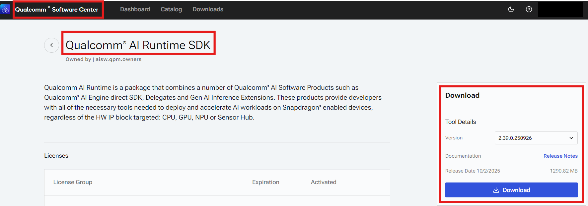
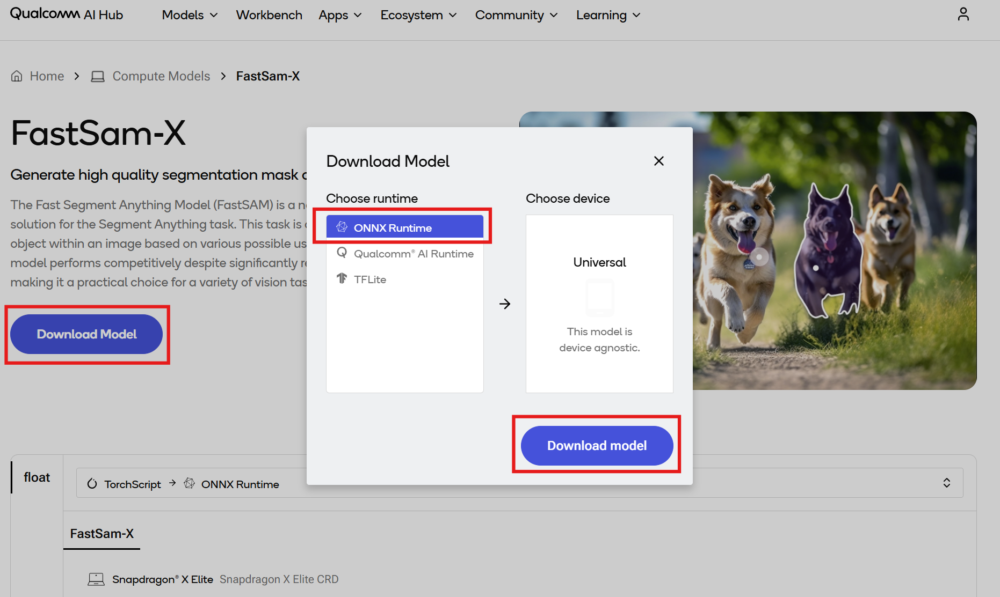
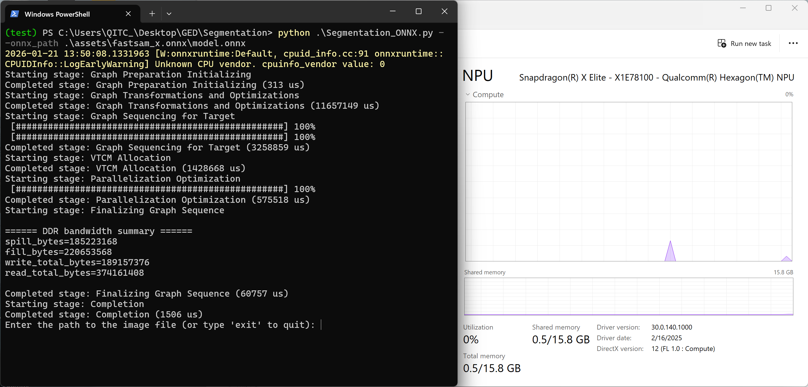
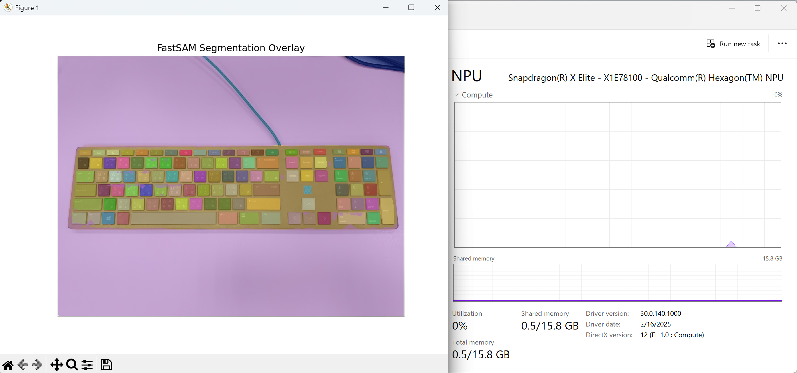

# [Startup_Demo](../../../)/[CV_VR](../../)/[AI_PC](../)/[Segmentation](./)

## Table of Contents
- [Overview](#1-overview)
- [Requirements](#2-requirements)
   - [Platform](#platform)
   - [Tools and SDK](#tools-and-sdk)
- [Environment setup](#3-environment-setup)
   - [Install Git](#install-git)
   - [Clone the specific subfolder](#clone-the-specific-subfolder)
   - [Set up Python virtual environment](#set-up-python-virtual-environment)
- [Preparing model assets](#4-preparing-model-assets)
   - [Downloading the model from Qualcomm AI Hub](#downloading-the-model-from-qualcomm-ai-hub)
   - [Image assets](#image-assets)
- [Running Python app](#5-running-python-app)
   - [Checking the assets directory](#checking-the-assets-directory)
   - [Running segmentation app via CLI](#running-segmentation-app-via-cli)
   - [Input your test image path](#input-your-test-image-path)
   - [Example output](#example-output)

## 1. Overview

Segmentation application for Windows on Snapdragon® with [FastSam-X](https://aihub.qualcomm.com/compute/models/fastsam_x?domain=Computer+Vision&useCase=Semantic+Segmentation) using ONNX runtime.

The Fast Segment Anything Model (FastSAM) is a novel, real‑time CNN‑based solution for the Segment Anything task. Optimized for Qualcomm Compute platform, this application enables real-time object segmentation within an image.

This Python application demonstrates how to use [QNN Execution Provider](https://onnxruntime.ai/docs/execution-providers/QNN-ExecutionProvider.html) to accelerate the model using the Snapdragon® Neural Processing Unit (NPU).

## 2. Requirements

### Platform

- Windows on Snapdragon® (Qualcomm Compute platform, e.g. Snapdragon X Elite and X Plus)
- Windows 11
- This application is tested on ASUS Vivobook S15 (S5507).

### Tools and SDK

- Python
   - This application is tested with Python 3.10.9.
   - Install Python 64-bit by following the [installation guide](../../../Tools/Software/Python_Setup/README.md#21-download-python-installer).
   - Make sure you have Python installed and properly configured in your system path.
      ```bash
      # Check Python version
      python --version
      ```
   - Required packages.
      - torch
      - torchvision
      - numpy
      - onnxruntime-qnn
      - opencv-python
      - matplotlib

- Qualcomm AI Runtime SDK : [QNN SDK](https://softwarecenter.qualcomm.com/) (Optional)
  - The required QNN dependency libraries are included in onnxruntime-qnn package.
  - If you plan to use a specific version of QNN libraries, download and install Qualcomm AI Runtime SDK from Qualcomm Software Center.
  
  - This Python application is tested with default QNN libraries from onnxruntime-qnn and QNN v2.39.0.250926.
  - Find your `QNN_SDK_ROOT`. For example, `QNN_SDK_ROOT = C:\Qualcomm\AIStack\QAIRT\2.39.0.250926`.
  - Remember this directory if you plan to use a specific version of QNN libraries.
      - `<QNN_SDK_ROOT>\lib\arm64x-windows-msvc`

## 3. Environment setup

This section describes the development environment setup process, including Git installation, selective subdirectory cloning, Python virtual environment creation, and dependencies installation.

### Install Git

Git is required for version control and collaboration. Proper configuration ensures seamless integration with repositories and development workflows.

For detailed steps, refer to the internal documentation: [Setup Git](../../../Hardware/Tools.md#git-setup).

### Clone the specific subfolder

Once Git is installed, clone the project repository, and use `CV_VR/AI_PC/Segmentation` directory for this application.

Open Windows PowerShell, navigate to your target directory, and run the following commands:

```bash
git clone -n --depth=1 --filter=tree:0 https://github.com/qualcomm/Startup-Demos.git
cd Startup-Demos
git sparse-checkout set --no-cone CV_VR/AI_PC/Segmentation
git checkout
```

After running these commands, your local directory structure will contain only:

```bash
Startup-Demos/
└── CV_VR/
    └── AI_PC/
        └── Segmentation/
```

### Set up Python virtual environment

Virtual environments are isolated Python environments that allow you to work on different projects with different dependencies without conflicts.

For detailed steps, refer to the internal documentation: [Virtual Environments](../../../Tools/Software/Python_Setup/README.md#4-virtual-environments).

Once in the virtual environment, install the required Python packages.
```bash
cd .\CV_VR\AI_PC\Segmentation
pip install -r .\requirements.txt
```

Your environment is now ready. You can start exploring and running the project inside Startup-Demos directory.

## 4. Preparing model assets

### Downloading the model from Qualcomm AI Hub

Go to [Qualcomm AI Hub](https://aihub.qualcomm.com/compute/models/fastsam_x?domain=Computer+Vision&useCase=Semantic+Segmentation) and download FastSam‑X model for Qualcomm Compute platform.

Download the model for ONNX Runtime and place the ONNX model and model.data file into `./assets/` directory.



### Image assets

Prepare your image assets for segmentation and place into `./assets/` directory.

## 5. Running Python app

### Checking the assets directory

Please ensure that you have followed the section above and placed the following assets into the specific directory. You may change the directory if needed.

   - Image assets : `./assets/`
   - ONNX model and model.data from Qualcomm AI Hub : `./assets/`
   
### Running segmentation app via CLI

The default score threshold and IoU threshold for NMS are 0.5 and 0.7, respectively.

Run the application with default QNN libraries from onnxruntime-qnn package.

Open your terminal and navigate to your target directory.

```bash
cd .\Startup-Demos\CV_VR\AI_PC\Segmentation
python .\Segmentation_ONNX.py --onnx_path .\assets\fastsam_x.onnx\model.onnx
```



Running with the specified score and IoU thresholds for NMS.

```bash
python .\Segmentation_ONNX.py --onnx_path .\assets\fastsam_x.onnx\model.onnx --score_thres 0.6 --iou_thres 0.8
```

You can also run the application with a specific version of QNN libraries.

```bash
python .\Segmentation_ONNX.py --onnx_path .\assets\fastsam_x.onnx\model.onnx --qnn_path C:\Qualcomm\AIStack\QAIRT\2.39.0.250926\lib\arm64x-windows-msvc\QnnHtp.dll
```

### Input your test image path

```bash
Enter the path to the image file (or type 'exit' to quit): ./assets/keyboard.jpg
```

### Example output

Inference is accelerated by Snapdragon® Neural Processing Unit (NPU).
