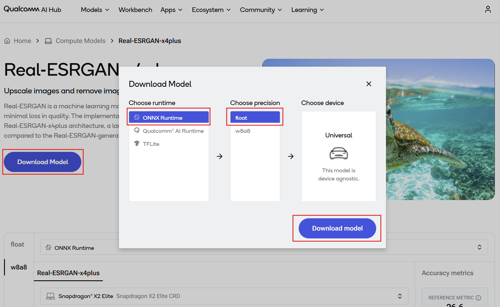
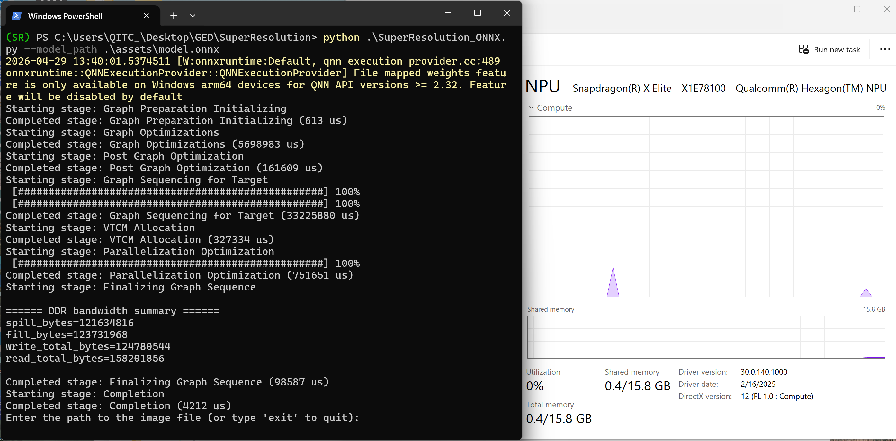
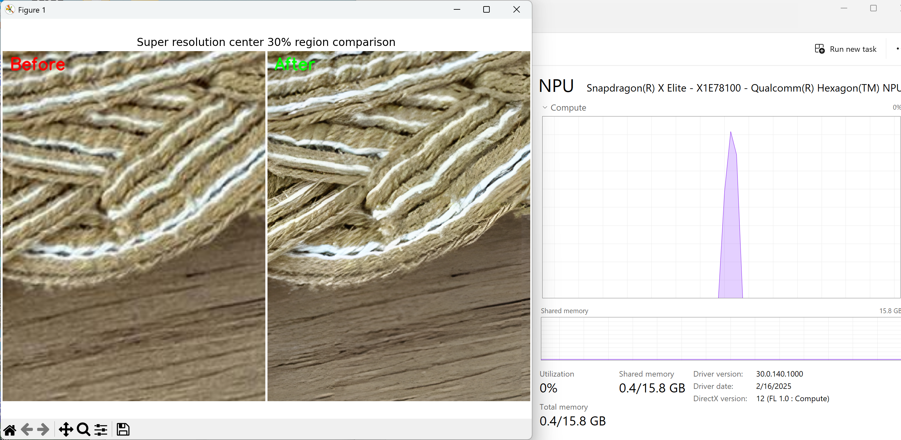

# [Startup-Demos](../../../)/[CV_VR](../../)/[AI_PC](../)/[Super_Resolution](./)

## Table of Contents
- [Overview](#1-overview)
- [Requirements](#2-requirements)
   - [Platform](#platform)
   - [Tools and SDK](#tools-and-sdk)
- [Environment setup](#3-environment-setup)
   - [Install Git](#install-git)
   - [Clone the specific subfolder](#clone-the-specific-subfolder)
   - [Set up Python virtual environment](#set-up-python-virtual-environment)
- [Preparing model assets](#4-preparing-model-assets)
   - [Downloading the model from Qualcomm AI Hub](#downloading-the-model-from-qualcomm-ai-hub)
- [Running Python app](#5-running-python-app)
   - [Checking the assets directory](#checking-the-assets-directory)
   - [Running Super Resolution app via CLI](#running-super-resolution-app-via-cli)
   - [Example output](#example-output)


## 1. Overview

This demo demonstrates a [Super Resolution](https://aihub.qualcomm.com/compute/models/real_esrgan_x4plus?domain=Computer+Vision&useCase=Super+Resolution) application running on Windows on Snapdragon®, accelerated by ONNX Runtime with [QNN Execution Provider](https://onnxruntime.ai/docs/execution-providers/QNN-ExecutionProvider.html).

It is intended as a reference demo to illustrate how to deploy and run a modern super resolution model on Qualcomm Compute platform with Snapdragon® Neural Processing Unit (NPU) acceleration.

The demo highlights both model inference and patch‑based processing techniques commonly used for high resolution image enhancement. Depending on the target use case and performance requirements, additional tuning and optimization may be required.

The application follows a typical super resolution pipeline:

1. Low Resolution Input Processing – The input image is divided into fixed‑size patches to support large images and efficient NPU execution.
2. Real‑ESRGAN‑x4plus Model Inference – Each patch is upscaled by a factor of 4 using the super resolution model and stitched back together to produce a high resolution output.

Optimized for Qualcomm Compute platform, this demo showcases high quality image upscaling using NPU acceleration, making it suitable for scenarios such as:

- Image and photo enhancement
- Media content upscaling
- Digital signage and kiosk displays
- Creative and AI‑assisted imaging workflows


## 2. Requirements

### Platform

- Windows on Snapdragon® (Qualcomm Compute platform, e.g. Snapdragon® X2 Elite, X Elite, and X Plus)
- Windows 11
- This application is tested on ASUS Vivobook S15 (S5507)

### Tools and SDK

- Python
   - This application is tested with Python 3.12.10.
   - Install Python 64-bit by following the [installation guide](../../../Tools/Software/Python_Setup/README.md#21-download-python-installer).
   - Make sure you have Python installed and properly configured in your system path.
      ```bash
      # Check Python version
      python --version
      ```

- Qualcomm AI Runtime SDK : [QNN SDK](https://softwarecenter.qualcomm.com/) (Optional)
  - The required QNN dependency libraries are included in Python onnxruntime-qnn package.
  - This application is tested with `onnxruntime-qnn==1.24.4`.


## 3. Environment setup

This section describes the development environment setup process, including Git installation, selective subdirectory cloning, Python virtual environment creation, and dependencies installation.

### Install Git

Git is required for version control and collaboration. Proper configuration ensures seamless integration with repositories and development workflows.

For detailed steps, refer to the internal documentation: [Setup Git](../../../Hardware/Tools.md#git-setup).

### Clone the specific subfolder

Once Git is installed, clone the project repository, and use `CV_VR/AI_PC/Super_Resolution` directory for this application.

Open Windows PowerShell, navigate to your target directory, and run the following commands:

```bash
git clone -n --depth=1 --filter=tree:0 https://github.com/qualcomm/Startup-Demos.git
cd Startup-Demos
git sparse-checkout set --no-cone CV_VR/AI_PC/Super_Resolution
git checkout
```

After running these commands, your local directory structure will contain only:

```bash
Startup-Demos/
└── CV_VR/
    └── AI_PC/
        └── Super_Resolution/
```

### Set up Python virtual environment

Virtual environments are isolated Python environments that allow you to work on different projects with different dependencies without conflicts.

For detailed steps, refer to the internal documentation: [Virtual Environments](../../../Tools/Software/Python_Setup/README.md#4-virtual-environments).

Once in the virtual environment, install the required Python packages.
```bash
cd .\CV_VR\AI_PC\Super_Resolution
pip install -r .\requirements.txt
```

Your environment is now ready. You can start exploring and running the project inside Startup-Demos directory.


## 4. Preparing model assets

### Downloading the model from Qualcomm AI Hub

The model used in this super resolution application is Real-ESRGAN-x4plus.

Go to [Qualcomm AI Hub](https://aihub.qualcomm.com/compute/models/real_esrgan_x4plus?domain=Computer+Vision&useCase=Super+Resolution) and download Real-ESRGAN-x4plus model for Qualcomm Compute platform.

Download the model for ONNX Runtime and place the `model.onnx` and `model.data` files into `./assets/` directory.




## 5. Running Python app

### Checking the assets directory

Please ensure that you have followed the section above and placed the following assets into the specific directory. You may change the directory if needed.

- `model.onnx` and `model.data` from Qualcomm AI Hub : `./assets/`

The project directory should contain:
```bash
./assets
   ├── model.data
   └── model.onnx
./SuperResolution_ONNX.py
./<your_test_image>.jpg
```

### Running Super Resolution app via CLI

Run Super Resolution demo from the command line with real-time inference accelerated by Snapdragon® NPU.

Open your terminal and navigate to your target directory.

```bash
cd .\Startup-Demos\CV_VR\AI_PC\Super_Resolution
python .\SuperResolution_ONNX.py --model_path .\assets\model.onnx
```



### Input your test image path

```bash
Enter the path to the image file (or type 'exit' to quit): ./texture.jpg
```

### Example output

Inference is accelerated using Snapdragon® NPU and the application automatically displays a side‑by‑side center crop comparison image to highlight the visual differences between the original input image and the super resolution output.



By default, the center 30% region of the image is cropped and used for comparison, allowing finer details and reconstruction quality to be easily inspected.
The crop ratio is configurable and can be adjusted from `0.10` to `1` by modifying the `crop_ratio` parameter at `line 47` in `SuperResolution_ONNX.py`.

```bash
def compare_image(before_rgb: np.ndarray,
                  after_rgb: np.ndarray,
                  labels=("Before", "After"),
                  crop_ratio=0.30,    # Line 47 Configurable crop ratio
                  divider_px=6) -> np.ndarray:
```

In addition to the on‑screen comparison, the full 4× upscaled super resolution output image is saved to the current working directory with the following naming convention:
`<your_test_image>_x4.jpg`

This end-to-end solution provides both qualitative visualization and a persistent high resolution output for further evaluation or downstream use.
