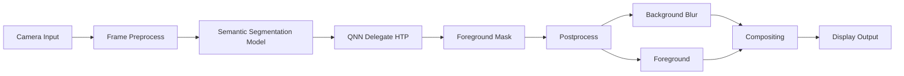
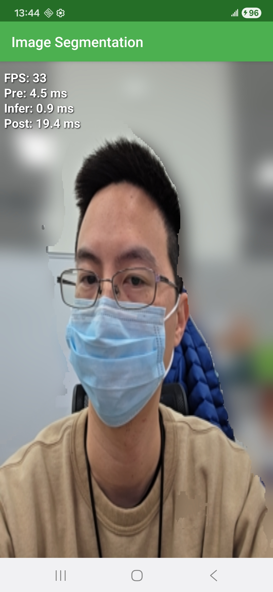

# [Startup_Demo](../../../)/[CV_VR](../../)/[Android](../)/[bokeh](./)
# Selfie Bokeh Sample Using Semantic Segmentation App

### Table of Contents
- [1. Overview](#1-overview)
- [2. System Workflow](#2-system-workflow)
- [3. Setup (Apply Patch)](#3-setup-apply-patch)
- [4. Build the APK](#4-build-the-apk)
- [5. Supported Hardware](#5-supported-hardware)
- [6. AI Model Requirements](#6-ai-model-requirements)
- [7. Technologies Used](#7-technologies-used)
- [8. Demo](#8-demo)

---

## 1. Overview

This sample app performs real-time semantic segmentation on camera input and generates a **selfie bokeh effect**.

This work is based on the official Qualcomm AI Hub sample:
- https://github.com/qualcomm/ai-hub-apps/tree/main/apps/semantic_segmentation_android

Enhancements in this project:
- Convert multi-class segmentation → **foreground mask**
- Apply **background Gaussian blur (bokeh)**
- Real-time compositing pipeline

---

## 2. System Workflow



---

## 3. Setup (Apply Patch)

> 💡 On Windows, it is recommended to use **Git Bash** or **WSL**.

```bash
mkdir bokeh_demo
cd bokeh_demo

git clone https://github.com/qualcomm/ai-hub-apps.git
cd ai-hub-apps

# Windows safe config (important)
git config core.autocrlf false

# apply patch
git apply ../bokeh.patch

```
> 💡 If app/ missing → clone is wrong
> 💡 DO NOT continue

### Verify structure:

```bash
ls apps/semantic_segmentation_android
```

### Must contain:
```bash
app/
build.gradle
settings.gradle
```
---

## 4. Build the APK

- Place `.tflite` model at:

```bash
src/main/assets/<your_model>.tflite
```

- Open Android Studio
- Sync and Build

---

## 5. Supported Hardware

- Qualcomm Hexagon NPU (QNN)
- GPU (GPUv2 delegate)
- CPU (XNNPack)

---

## 6. AI Model Requirements

### Input
- Shape: `[1, H, W, 3]`
- Type: float32

### Output
- Shape: `[1, H, W, 1]`
- Foreground probability mask

---

## 7. Technologies Used

- Android SDK
- TensorFlow Lite
- OpenCV
- QNN Delegate

---

## 8. Demo

 

Example:

Original → Mask → Bokeh Output

---
