# Helmet Detection on Camera with LED

## Table of Contents
- [1. Overview](#1-overview)
- [2. Requirements](#2-requirements)
  - [2.1 Hardware](#21-hardware)
  - [2.2 Software](#22-software)
- [3. Helmet Detection Workflow](#3-helmet-detection-workflow)
- [4. Setup Instructions](#4-setup-instructions)
  - [4.1 Setting Up Visual Studio Code (VS Code)](#41-setting-up-visual-studio-code-vs-code)
  - [4.2 Setting Up Arduino App Lab](#42-setting-up-arduino-app-lab)
  - [4.3 Setting Up Arduino Flasher Cli](#43-setting-up-arduino-flasher-cli)
  - [4.4 Setting Up Arduino UNO-Q Device](#44-setting-up-arduino-uno-q-device)
- [5. Get the Model from Edge Impulse](#5-get-the-model-from-edge-impulse)
  - [5.1 Setup an Edge Impulse Account](#51-setup-an-edge-impulse-account)
  - [5.2 Clone the Edge Impulse Project](#52-clone-the-edge-impulse-project)
  - [5.3 Build and Download Deployable Model](#53-build-and-download-deployable-model)
- [6. Prepare the Application](#6-prepare-the-application)
  - [6.1 Copy Exisiting Video Detection on camera Application](#61-copy-exisiting-video-detection-on-camera-application)
  - [6.2 Copy sketch files from exisiting Air quality on LED matrix Application](#62-copy-sketch-files-from-exisiting-air-quality-on-led-matrix-application)
  - [6.3 Upload Model to the Device](#63-upload-model-to-the-device)
  - [6.4 Modify the Configuration file](#64-modify-the-configuration-file)
  - [6.5 Modify the sketch file](#65-modify-the-sketch-file)
  - [6.6 Modify the main python file](#66-modify-the-main-python-file)
- [7. Run the Helmet Detection with LED application](#7-run-the-helmet-detection-with-led-application)
  - [7.1 Demo Output](#71-demo-output)

## 1. Overview.

The **Helmet Detection** demo showcases the edge AI capabilities of the **Arduino® UNO Q** using a trained model from **Edge Impulse**. This application enables real-time helmet recognition from a live video feed captured by a USB webcam and control the LED matrix for detected helmet and other status.

- 📷 **Live Helmet Detection**: Continuously captures frames from a USB camera and detects helmet using a pre-trained AI model.
- 🧠 **AI-Powered Processing**: Utilizes the `video_objectdetection` Brick to analyze video frames and identify helmets.
- 🖼️ **Real-Time Visualization**: Displays helmet labels around detected faces directly on the video feed.
- 🌐 **Web-Based Interface**: Managed through an web interface for seamless control and monitoring.
- 💡 **LED Matrix Behavior Mapping**: Changes LED patterns and animations based on detection results.

> ⚠️ **Important:** This demo must be run in **Network Mode or SBC** within the Arduino App Lab. It requires:

This demonstration highlights how the Arduino UNO Q can be paired with a USB webcam to perform edge AI tasks such as helmet recognition. It exemplifies the integration of Edge Impulse models with Arduino hardware for intelligent, real-time computer vision applications.

   

## 2. Requirements.

### 2.1 Hardware.

- **[Arduino® UNO Q](../../../Hardware/Arduino_UNO-Q.md#arduino-uno-q)**
- USB camera (x1)
- USB-C® hub adapter with external power (x1)
- A power supply (5 V, 3 A) for the USB hub (e.g., a phone charger)
- Personal computer (x86/AMD64) with internet access #Helmet Detection Setup Workflow


### 2.2 Software.

- [Arduino App Lab](../../../Tools/Software/Arduino_App_Lab/README.md)
- [Edge Impulse](../../../Tools/Software/Edge_Impluse/README.md)
- [Bricks](../../../Tools/Software/Arduino_App_Lab/README.md#25-bricks)
- [VS Code](../../../Hardware/Tools.md#vscode-setup)

## 3. Helmet Detection Workflow.

```mermaid
flowchart LR
    A[Start] --> B[Setting Up Arduino UNO-Q Device]
    B --> C[Download Required Models]
    C --> D[Create the Helmet Detection Application]
    D --> E[Run the Helmet Detection Application]
    E --> F[✅ Helmet Detection Active]
```


## 4. Setup Instructions.

Before proceeding further, please ensure that **all the setup steps outlined below are completed in the specified order**. These instructions are essential for configuring the various tools required to successfully run the application.

Each section provides a reference to internal documentation for detailed guidance. Please follow them carefully to avoid any setup issues later in the process.

## 4.1 Setting Up Visual Studio Code (VS Code).
Visual Studio Code is the recommended IDE for editing, debugging, and managing the project’s source code. It provides essential extensions and integrations that streamline development workflows. Please follow the setup instructions carefully to ensure compatibility with the project environment.

For detailed steps, refer to the internal documentation:
[Set up VS Code](../../../Tools/Software/VScode_Setup/README.md#34-configure-ssh)

## 4.2. Setting Up Arduino App Lab.
Arduino App Lab enables you to create and deploy Apps directly on the Arduino® UNO Q board, which integrates both a microcontroller and a Linux-based microprocessor. The App Lab runs seamlessly on personal computers (Windows, macOS, Linux) and comes pre-installed on the UNO Q, with automatic updates. Please follow the setup instructions carefully to ensure smooth development and deployment of Apps.

For detailed steps, refer to the documentation: 
[Set up Arduino App Lab]( ../../../Tools/Software/Arduino_App_Lab/README.md#4-installation)

## 4.3. Setting Up Arduino Flasher Cli.
Arduino Flasher CLI provides a streamlined way to flash Linux images onto your Arduino UNO Q board. Please follow the setup instructions carefully to avoid flashing errors and ensure proper board initialization.

For detailed steps, refer to the documentation: 
[Arduino Flasher CLI]( ../../../Hardware/Arduino_UNO-Q.md#flashing-a-new-image-to-the-uno-q)

## 4.4. Setting Up Arduino UNO-Q Device.
Arduino UNO-Q must be properly configured to ensure reliable communication with the host system and accurate sensor data acquisition. Please follow the setup instructions carefully to avoid hardware conflicts and ensure seamless integration with the software stack.

For detailed steps, refer to the documentation: 
[Set up Arduino UNO-Q]( ../../../Hardware/Arduino_UNO-Q.md#uno-q-as-a-single-board-computer).

## 5. Get the Model from Edge Impulse.
Edge Impulse empowers you to build datasets, train machine learning models, and optimize libraries for deployment directly on-device.

Click here to know more about [Edge Impluse]( ../../../Tools/Software/Edge_Impluse/README.md)

### 5.1 Setup an Edge Impulse Account.
An Edge Impulse account is required to access the platform’s full suite of tools for building, training, and deploying machine learning models on the Arduino UNO Q. Please follow the setup instructions carefully to ensure proper integration with your device and development workflow.

Follow the instructions to sign up: 
[Signup Instructions]( ../../../Tools/Software/Edge_Impluse/README.md#22-login-or-signup)

### 5.2 Clone the Edge Impulse Project.

Cloning an Edge Impulse project allows you to replicate existing machine learning workflows, datasets, and configurations for customization or deployment on the Arduino UNO Q. Please follow the setup instructions carefully to ensure proper synchronization and compatibility with your device.

Clone the [Helmet Detection Project](https://studio.edgeimpulse.com/public/258261/latest)

For detailed steps, refer to the documentation: 
[Clone the Repository]( ../../../Tools/Software/Edge_Impluse/README.md#29-clone-project-repository)

### 5.3 Build and Download Deployable Model.
Edge Impulse allows you to build optimized machine learning models tailored for deployment on the Arduino UNO Q. Once trained, models can be compiled into efficient libraries and downloaded for direct integration with your device. Please follow the setup instructions carefully to ensure the model is compatible with your hardware and application requirements.

**Mandatory step:**
1. Select Arduino UNO Q Hardware while configuring your deployment at the Deployment stage.
2. Build the model (It automatically downloads the deployable model).


For detailed steps, refer to the documentation: 
[Build and Deploy Model]( ../../../Tools/Software/Edge_Impluse/README.md#28-download-deployable-model)

## 6. Prepare the Application.

This section will guide you on how to create a new application from existing examples, configure Edge Impulse models, set up the application parameters, and build the final App for deployment on the Arduino UNO Q.Starting from pre-built examples is recommended for first-time users to better understand the structure and workflow.

### 6.1 Copy Exisiting Video Detection on camera Application.
Arduino App Lab provides a ready-to-use Video Detection on Camera application that can be copied and customized for your specific use case. This section will guide you through duplicating the existing application, modifying its components, integrating Edge Impulse models, and tailoring the detection logic to suit your deployment on the Arduino UNO Q.

In this example we are taking the Video Detection on camera Application for helmet detection.

  

  

For detailed steps, refer to the documentation: 
[Copy and Edit Exisiting sample]( ../../../Tools/Software/Arduino_App_Lab/README.md#duplicate-an-existing-example)

### 6.2 Copy sketch files from exisiting Air quality on LED matrix Application.
We would like to control the LED matrix on Arduino UNO Q board. Arduino App Lab provides a ready-to-use LED matrix control example Air quality on LED matrix Application that can be copied and customized for your specific use case. This section will guide you through duplicating the existing application, modifying its components, integrating Edge Impulse models, and tailoring the detection logic to suit your deployment on the Arduino UNO Q.

In this example we are coping the LED matrix control sketch from Air quality on LED matrix Application.

```bash
cd /home/arduino/.local/share/arduino-app-cli/examples/air-quality-monitoring/sketch

cp -r sketch/* /home/arduino/ArduinoApps/helmet-detection-on-camera-with-led/sketch
```

### 6.3 Upload Model to the Device.

Once the deployable model is built in Edge Impulse, it must be uploaded to the Arduino UNO Q to enable real-time inference and application integration. This section will guide you through transferring the compiled model to the device, verifying compatibility, and preparing it for execution within your App Lab application.

Here mention about usage of the model which download from edge impluse in the previous step.
[Build and Deploy Model](../../../CV_VR/Arduino_UNO-Q/helmet-detection-on-camera-with-led/README.md#53-build-and-download-deployable-model)

**Upload location**:Make sure to upload the model file to **/home/arduino/.arduino-bricks/ei-models/helmet-detection-linux-aarch64-v8.eim**

For detailed steps, refer to the documentation: 
[Upload Model]( ../../../Tools/Software/Arduino_App_Lab/README.md#upload-model-to-device)

### 6.4 Modify the Configuration file.

The app.yaml file defines the structure, behavior, and dependencies of your Arduino App Lab application. Modifying this configuration allows you to customize how your app interacts with hardware, integrates Edge Impulse models, and launches on the Arduino UNO Q. This section will guide you through editing key parameters such as bricks, model paths, and runtime settings. Please follow the setup instructions carefully to ensure your application runs as expected.

   ```yaml
   name: Helmet Detection with LED Matrix
icon: 🪖
description: Detect Helmet / No Helmet using Edge Impulse and control LED matrix on MCU.

bricks:
- arduino:video_object_detection: {
    variables: {
      EI_OBJ_DETECTION_MODEL: /home/arduino/.arduino-bricks/ei-models/helmet-detection-linux-aarch64-v8.eim
    }
  }
- arduino:web_ui: {}
   ```
### 6.5 Modify the sketch file.

The sketch.ino file contains the main program logic for your Arduino App Lab project. It initializes hardware, communicates with bricks defined in app.yaml, and runs the primary control loop. Use this file to implement custom behaviors, sensor reading, actuator control, and model inference on the Arduino UNO Q.

   ```yaml
#===--sketch.ino----------------------------------------===//
# Part of the Startup-Demos Project, under the MIT License
# See https://github.com/qualcomm/Startup-Demos/blob/main/LICENSE.txt
# for license information.
# Copyright (c) Qualcomm Technologies, Inc. and/or its subsidiaries.
# SPDX-License-Identifier: MIT License
#===----------------------------------------------------------------------===//

#include <Arduino_LED_Matrix.h>
#include <Arduino_RouterBridge.h>
#include "air_quality_frames.h"

Arduino_LED_Matrix matrix;

void setup() {
  matrix.begin();
  matrix.clear();

  Bridge.begin();
  matrix.loadFrame(unknown);
}

void loop() {
  String helmetStatus;
  bool ok = Bridge.call("get_helmet_status").result(helmetStatus);

  if (ok) {
    if (helmetStatus == "Helmet") {
      matrix.loadFrame(good);       // ✓
    } else if (helmetStatus == "No Helmet") {
      matrix.loadFrame(hazardous);  // ✗
    } else {
      matrix.loadFrame(unknown);    // ？
    }
  }
  delay(500);
}
   ```

### 6.6 Modify the main python file.

The main.py file contains the core Python logic for your Arduino App Lab application. It handles communication with connected bricks, runs Edge Impulse model inference, and processes events coming from the App Lab runtime. Use this file to define custom behaviors, manage data flow, and implement high‑level control logic for your application.

   ```yaml
#===--main.py----------------------------------------===//
# Part of the Startup-Demos Project, under the MIT License
# See https://github.com/qualcomm/Startup-Demos/blob/main/LICENSE.txt
# for license information.
# Copyright (c) Qualcomm Technologies, Inc. and/or its subsidiaries.
# SPDX-License-Identifier: MIT License
#===----------------------------------------------------------------------===//

from arduino.app_utils import *
from arduino.app_bricks.web_ui import WebUI
from arduino.app_bricks.video_objectdetection import VideoObjectDetection
from datetime import datetime, UTC
import threading
import time

# ---------------------------------------------------------
# global state
# ---------------------------------------------------------
current_status = "Unknown"      # Helmet / No Helmet / Unknown
status_lock = threading.Lock()

HELMET_LABELS = ["Helmet", "helmet"]
NO_HELMET_LABELS = ["No Helmet", "no helmet", "no_helmet", "no-helmet"]

MIN_CONFIDENCE = 0.5

last_decision = "Unknown"
same_decision_count = 0
DEBOUNCE_COUNT = 3

# Timeout: if no detection occurs beyond this number of seconds, force the status to Unknown
TIMEOUT_SECONDS = 1.0
last_detection_time = time.time()

# ---------------------------------------------------------
# Web UI & Video Object Detection
# ---------------------------------------------------------
ui = WebUI()
detection_stream = VideoObjectDetection(confidence=MIN_CONFIDENCE, debounce_sec=0.0)

ui.on_message("override_th",
              lambda sid, threshold: detection_stream.override_threshold(threshold))


def decide_status_from_detections(detections: dict) -> str:
    global last_detection_time

    # If there are any detections, update last_detection_time
    if detections:
        last_detection_time = time.time()
    else:
        print("[DEBUG] detections is empty (no boxes this frame)")

    found_helmet = False
    found_no_helmet = False

    for label, info in detections.items():
        conf = info.get("confidence", 0.0)
        print(f"[DEBUG] detection label='{label}' confidence={conf}")

        if conf < MIN_CONFIDENCE:
            continue

        l = label.lower()

        if label in HELMET_LABELS or ("helmet" in l and "no" not in l):
            found_helmet = True
        elif label in NO_HELMET_LABELS or ("no" in l and "helmet" in l):
            found_no_helmet = True

    if found_no_helmet and not found_helmet:
        return "No Helmet"
    elif found_helmet and not found_no_helmet:
        return "Helmet"
    elif found_helmet and found_no_helmet:
        return "No Helmet"
    else:
        # Although this frame contains detections, all of them are below the threshold or have unrecognized labels
        return "Unknown"


def update_status_with_debounce(new_status: str):
    global last_decision, same_decision_count, current_status

    if new_status == last_decision:
        same_decision_count += 1
    else:
        last_decision = new_status
        same_decision_count = 1

    if same_decision_count >= DEBOUNCE_COUNT:
        with status_lock:
            if current_status != new_status:
                print(f"[INFO] Helmet status changed: {current_status} -> {new_status}")
            current_status = new_status


# ---------------------------------------------------------
# VideoObjectDetection callback
# ---------------------------------------------------------
def send_detections_to_ui(detections: dict):
    for key, value in detections.items():
        entry = {
            "content": key,
            "confidence": value.get("confidence"),
            "timestamp": datetime.now(UTC).isoformat()
        }
        ui.send_message("detection", message=entry)

    status = decide_status_from_detections(detections)
    update_status_with_debounce(status)


detection_stream.on_detect_all(send_detections_to_ui)

# ---------------------------------------------------------
# Timeout background thread: set status to Unknown if no detection for over 1 second
# ---------------------------------------------------------
def timeout_watcher():
    global current_status
    while True:
        now = time.time()
        dt = now - last_detection_time
        if dt > TIMEOUT_SECONDS:
            with status_lock:
                if current_status != "Unknown":
                    print(f"[INFO] No detections for {dt:.2f}s -> force Unknown")
                    current_status = "Unknown"
        time.sleep(0.1)


# Start the timeout thread
threading.Thread(target=timeout_watcher, daemon=True).start()

# ---------------------------------------------------------
# Bridge: For MCU
# ---------------------------------------------------------
def get_helmet_status():
    with status_lock:
        status = current_status
    print(f"[DEBUG] get_helmet_status -> {status}")
    return status


Bridge.provide("get_helmet_status", get_helmet_status)

# ---------------------------------------------------------
# main
# ---------------------------------------------------------
App.run()
   ```
## 7. Run the Helmet Detection with LED application.

Once your application is configured and built in Arduino App Lab, it can be deployed and executed directly on the Arduino UNO Q. This section will guide you through launching the application, verifying sensor inputform camera, and observing real-time result.

 

For detailed steps, refer to the documentation: 
[Run Application](../../../Tools/Software/Arduino_App_Lab/README.md#run-example-apps-in-arduino-app-lab)

### 7.1 Demo Output.

 
 
 