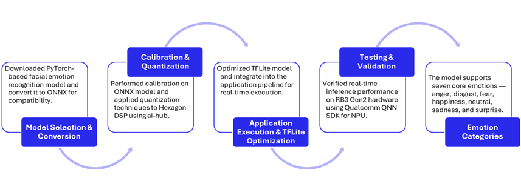

# [Startup_Demo](../../../)/[CV_VR](../../)/[IoT-Robotics](../)/[Facial_Emotion_Detection](./)

---

# Table of Contents

- [Overview](#1-overview)
- [Application Requirements](#2-application-requirements)
- [Setting Up RB3 Gen2 Device](#3-setting-up-rb3-gen2-device)
    - [RB3 Gen2 Ubuntu Setup Guide](#31-rb3-gen2-ubuntu-setup-guide)
    - [Device Network ,USB and SSH Setup ssh](#32-device-network-usb-and-ssh-setup-ssh)
- [Setup: Windows PC for Model Conversion and RB3 Gen2 for Model Deployment](#4--setup-windows-pc-for-model-conversion-and-rb3-gen2-for-model-deployment)
  - [Environment Setup (Windows PC)](#-5-environment-setup-windows-pc)
    - [Miniconda Installation on Windows PC](#-51-miniconda-installation-on-windows-pc)
    - [Git Configuration](#-52-git-configuration)
    - [Source Code Setup Instructions for Windows PCs](#️-53-source-code-setup-instructions-for-windows-pcs)
- [Run the Model Conversation Notebook (Windows PC)](#6-run-the-model-conversation-jupyter-notebook-on-pc)
    - [Login to Qualcomm AI Hub ](#61-login-to-qualcomm-ai-hub)
    - [Launch Anaconda Prompt and Start JupyterLab](#62-launch-anaconda-prompt-and-start-jupyterlab)
    - [Run the Notebook Sequentially](#63-run-the-notebook-sequentially)
    - [Uploading the Model to RB3 Gen2 Device](#64-uploading-the-model-to-rb3-gen2-device)
- [Environment Setup (RB3 Gen2)](#7-environment-setup-rb3-gen2)
    - [Miniconda Installation on Ubuntu](#-71-miniconda-installation-on-ubuntu)
    - [Source Code Setup Instructions for RB3 Gen2](#️-72-source-code-setup-instructions-for-rb3-gen2)
- [Running Facial Emotion Detection Application](#8-running-facial-emotion-detection-application)

# Facial Emotion Detection Application

The Facial Emotion Detection application is designed to analyze human facial expressions and classify them into seven fundamental emotions in real time. It leverages computer vision and deep learning techniques to process video frames from a camera feed and predict emotional states accurately.


# 1. Overview

This Usecase demonstrates how to deploy a facial emotion detection model on the RB3 Gen2 device using the Qualcomm AI Hub and QNN SDK. The application processes live video feeds to detect and classify facial emotions in real time, leveraging edge computing capabilities for low-latency inference. The system uses a pre-trained PyTorch model, converts it to ONNX format, and optimizes it for deployment on the Hexagon DSP using the Qualcomm AI Hub. The final tflite optimized model is then integrated into a GStreamer pipeline for real-time video processing on the RB3 Gen2 platform.

- **Model Selection Conversion** Downloaded a PyTorch-based facial emotion recognition model from Hugging Face and converted it to ONNX format for compatibility using the AI-Hub
- **Calibration & Quantization** Performed calibration on the ONNX model and applied quantization techniques to optimize it for deployment on edge hardware (Hexagon DSP) while maintaining accuracy.
- **TFLite Optimization** Explored TFLite conversion with quantization strategies for efficient inference on RB3 Gen2.
- **Pipeline Integration** Built a GStreamer pipeline using qtiqmmfsrc for live camera input and integrated fallback to CPU if the DSP delegate fails.
- **Testing & Validation** Verified real-time inference performance on RB3 Gen2 hardware using Qualcomm QNN SDK for NPU acceleration.
- **Emotion Categories** The model supports seven core emotions — anger, disgust, fear, happiness, neutral, sadness, and surprise.

   

# 2. Application Requirements

1. **Requirements** Ensure you have one Windows PCs for model conversation and one RB3 Gen2 device for running the application.
2. **Setting Up RB3 Gen2 Device** Ensure the device is properly installed and connected to the PC.
3. **Setting Up Development Environment on PC and RB3** To set up the development environment, utilize the provided source code setup and follow the instructions for compiling and running the application.
4. **Run the Facial Emotion Detection Application** Execute the application on the RB3 Gen2 device to start monitoring facial emotion on the device.


# 3. Setting Up RB3 Gen2 Device

To set up the RB3 Gen2 device, it is essential to ensure that all necessary hardware components are properly connected and configured.

Configure the RB3 Gen2 device in Linux-based environment correctly, refer to the [RB3 Gen2 Device Setup Guide](https://docs.qualcomm.com/doc/80-90441-1/topic/qsg-landing-page.html?product=1601111740013077&facet=Ubuntu%20quickstart) for a comprehensive overview of the setup process.

To ensure the proper functioning of the Facial Emotion Detection application, follow the guides below and complete `sections 3.1 and 3.2`. It is crucial to highlight each step and complete it before moving on to the next one. By doing so, you will be able to successfully set up the device and proceed with the application setup. This will involve carefully following the instructions for setting up the RB3 Gen2 device, including the Ubuntu setup guide and device network, USB, and SSH setup.

## 3.1 RB3 Gen2 Ubuntu Setup Guide

1. **Requirements**: Ensure you have all the necessary hardware and software components as specified in the [Requirements](../../../Hardware/IoT-Robotics/RB3-Gen2.md#2-requirements) section, Additionally needed One Micro-USB to USB Type-A cable for the UART debug port
2. **Tools Installation**: Install the required tools and software as described in the [Tools Installation](../../../Hardware/IoT-Robotics/RB3-Gen2.md#3-tools-installation) section, Additionally need to install [Putty](https://www.putty.org/) and configured the debug UART.
3. **Download the Ubuntu OS image and boot firmware**: Download the ubuntu os image and firmware 24.04 version as outlined in the [Download OS Image and Boot Firmware](https://docs.qualcomm.com/doc/80-90441-1/topic/Integrate_and_flash_software_2.html?product=1601111740013077&facet=Ubuntu%20quickstart#panel-0-0-0tab$download-the-ubuntu-os-image-and-boot-firmware) section.

### List of Downloadable Files

- [Download Ubuntu raw image](https://people.canonical.com/~platform/images/qualcomm-iot/ubuntu-24.04/ubuntu-24.04-x06/ubuntu-server-24.04/iot-qualcomm-dragonwing-classic-server-2404-x06-20251024.img.xz)
- [Download Boot Firmware](https://artifacts.codelinaro.org/artifactory/qli-ci/flashable-binaries/ubuntu-fw/QCM6490/QLI.1.5-Ver.1.1/QLI.1.5-Ver.1.1-ubuntu-nhlos-bins.tar.gz)
- [Download dtb.bin file](https://people.canonical.com/~platform/images/qualcomm-iot/ubuntu-24.04/ubuntu-24.04-x06/ubuntu-server-24.04/dtb.bin)
- [Download Partition file](https://people.canonical.com/~platform/images/qualcomm-iot/ubuntu-24.04/ubuntu-24.04-x06/ubuntu-server-24.04/rawprogram0.xml) (Right click and save the file as rawprogram0.xml)

4. **Integrate flashable images on Windows host**: Integrate flashable images as described in the [Integrate Flashable Images ](https://docs.qualcomm.com/doc/80-90441-1/topic/Integrate_and_flash_software_2.html?product=1601111740013077&facet=Ubuntu%20quickstart#panel-0-v2luzg93cybob3n0tab$integrate-flashable-images-on-windows-host) section.
5. **Flash RB3 Gen 2 on Windows host**: Flash RB3 Gen 2 on Windows host as described in the [Flash RB3 Gen 2 on Windows host](https://docs.qualcomm.com/doc/80-90441-1/topic/Integrate_and_flash_software_2.html?product=1601111740013077&facet=Ubuntu%20quickstart#panel-0-v2luzg93cybob3n0tab$flash-rb3-gen-2-on-windows-host) section.

## 3.2 Device Network ,USB and SSH Setup ssh

To configure the RB3 Gen2 device correctly, refer to the [Use Ubuntu on RB3 Gen2](https://docs.qualcomm.com/doc/80-90441-1/topic/Use_Ubuntu_on_RB3_Gen2_3.html?product=1601111740013077&facet=Ubuntu%20quickstart) for a comprehensive overview of the setup process, which includes detailed instructions on network connection, USB setup, and SSH setup, ensuring a proper and successful configuration of the device.

1. **Verify reboot and log in to the RB3 Gen2 Ubuntu console**: After flashing the device, it is crucial to verify that the RB3 Gen2 reboots correctly and that you can successfully log in to the Ubuntu console,as outlined in the [Verify reboot and log in to RB3 Gen2](https://docs.qualcomm.com/doc/80-90441-1/topic/Use_Ubuntu_on_RB3_Gen2_3.html?product=1601111740013077&facet=Ubuntu%20quickstart#verify-reboot-and-sign-in-to-the-rb3-gen-2-ubuntu-console) section.
2. **Wifi-Setup**: To ensure seamless connectivity, update the device software to the latest version as outlined in the [WiFi-Setup](https://docs.qualcomm.com/doc/80-90441-1/topic/Use_Ubuntu_on_RB3_Gen2_3.html?product=1601111740013077&facet=Ubuntu%20quickstart#access-ubuntu-and-update-packages) section.
3. **Activate Renesas USB hub**: Activating the Renesas USB hub is necessary to enable USB connectivity on the device. Refer to the [Activate Renesas USB hub](https://docs.qualcomm.com/doc/80-90441-1/topic/Use_Ubuntu_on_RB3_Gen2_3.html?product=1601111740013077&facet=Ubuntu%20quickstart#activate-renesas-usb-hub) section.
4. **How to use SSH**: Configuring SSH on the device enables secure remote access, allowing you to access the device remotely. and it is outlined in the [How to use SSH](https://docs.qualcomm.com/doc/80-90441-1/topic/Use_Ubuntu_on_RB3_Gen2_3.html?product=1601111740013077&facet=Ubuntu%20quickstart#sign-in-to-the-rb3-gen-2-console-using-ssh) section.
5. **Enable display and camera**: set up the display and camera interfaces on your RB3 Gen 2 device to begin visual output and image capture [Enable display and camera](https://docs.qualcomm.com/doc/80-90441-1/topic/Use_Ubuntu_on_RB3_Gen2_3.html?product=1601111740013077&facet=Ubuntu%20quickstart#enable-display-and-camera) section.

By following these instructions, you will be able to set up SSH and access the device remotely, which will greatly simplify the development and testing process.


# 4. 💻 Setup: Windows PC for Model Conversion and RB3 Gen2 for Model Deployment

This guide outlines the setup process for deploying facial emotion detection using the Qualcomm RB3 Gen2 platform. The setup process involves two environments:

#### **Windows PC Environment Setup:**
- Used for model conversion and configuration.
- Requires AI Hub installation for converting models to ONNX/TFLite formats.

#### **RB3 Gen2 Environment Setup:**
- Used for real-time inference with NPU acceleration.
- Runs the optimized model and GStreamer pipeline.

# 🧪 5 Environment Setup (Windows PC)

To set up the Python environment required for running the application, follow the steps below. This ensures all dependencies are installed in an isolated and reproducible environment.

## 📦 5.1 Miniconda Installation on Windows PC

Miniconda is required to manage the application's Python environment and dependencies. Please follow the setup instructions carefully to ensure a consistent and reproducible environment.

For detailed steps, refer to the internal documentation:  
[Set up Miniconda]( ../../../Hardware/Tools.md#miniconda-setup)

## 🔧 5.2 Git Configuration

Git is required for version control and collaboration. Proper configuration ensures seamless integration with repositories and development workflows.

For detailed steps, refer to the internal documentation:  
[Setup Git]( ../../../Hardware/Tools.md#git-setup)

---

## 🛠️ 5.3 Source Code Setup Instructions for Windows PCs

The following steps are required to set up the source code for the application on Windows PCs.


## 🔧 Steps

1. **Create your working directory** :
   ```bash
   mkdir my_working_directory
   cd my_working_directory
   ```

2. **Download Your Application** :
   ```bash
    git clone -n --depth=1 --filter=tree:0 https://github.com/qualcomm/Startup-Demos.git
    cd Startup-Demos
    git sparse-checkout set --no-cone /CV_VR/IoT-Robotics/Facial_Emotion_Detection/
    git checkout
   ```
   
3. **Navigate to Application Directory** :
   ```bash
   cd ./CV_VR/IoT-Robotics/Facial_Emotion_Detection/
   ```

4. **Create a new Conda environment** with Python 3.10:
   ```bash
   conda create -n myenv python=3.10
   ```

5. **Activate the environment**:
   ```bash
   conda activate myenv
   ```

6. **Install the required dependencies**:
   ```bash
   pip install -r model_conversion_requirements.txt
   ```

# 6. Run the Model Conversation Jupyter Notebook on PC

This step involves executing the prepared Jupyter notebook on your Windows PC to perform model conversion tasks. The notebook will sequentially export the PyTorch model to ONNX, apply quantization using calibration data, and compile the model into TFLite format. The resulting .tflite file will be ready for deployment on the RB3 Gen2 device.

## 6.1 Login to Qualcomm AI Hub
If you have access to Qualcomm AI Hub, logging in is essential for submitting jobs and converting models for optimized deployment on RB3 hardware. This step enables you to use Qualcomm’s cloud-based optimization tools. For more information, visit [Qualcomm AI Hub](https://aihub.qualcomm.com/). 

- Visit Qualcomm AI Hub and create an account.
- Complete [Account Setup](https://aihub.qualcomm.com/get-started#account-setup).
- Generate your API token from the Settings page.

Run the following command with the API token from your Settings page:

1. **Steps to Login and Configure** :

   ```bash
   qai-hub configure --api_token API_TOKEN
   qai-hub list-devices
   ```

## 6.2 Launch Anaconda Prompt and Start JupyterLab

- Open Anaconda Prompt.
- Navigate to the project directory

   ```bash
   cd ./CV_VR/IoT-Robotics/Facial_Emotion_Detection/src/
   jupyter lab
   ```

## 6.3 Run the Notebook Sequentially
Follow these steps to execute the notebook in sequence:

- **Download the ResNet-50 Model Architecture**:  Ensure the required architecture files are available for model loading.
- **Load the Pretrained Model (.pt)**:  Obtain the .pt model from the Hugging face and run the second cell in the notebook to load it.
- **Export the Model to ONNX Format**:  Convert the PyTorch model to ONNX for compatibility with edge deployment.
- **Submit the ONNX Model for Calibration**:  Perform calibration to prepare the model for quantization and optimization.
- **Optimize the ONNX Model**:  Apply optimization techniques to improve inference performance.
- **Convert the Optimized Model to TFLite**:  Generate a TFLite version for deployment on RB3 Gen2 with DSP acceleration.

Execute this notebook to convert the model into TFLite format, which can then be deployed on the RB3 Gen2 device.
1. **Run the Notebook Cell by Cell** :

   ```bash
   Model_Conversion.ipynb
   ```

## 6.4 Uploading the Model to RB3 Gen2 Device

After converting the model to emotion_quant_model.tflite you need to transfer it to the RB3 Gen2 device for deployment.

- Push the conveted tflite model to the RB3 Gen 2 device.
- On the RB3 Gen 2 Ubuntu, use the nmcli command to access a Wi-Fi network and then run ifconfig to get the network IP address.
- On the host PC, Using the RB3 IP address run the following command that pushes the tflite model to RB3 Gen 2:

1. **Transfer the Model to RB3 Gen2** :

   ```bash
   scp emotion_quant_model.tflite ubuntu@<ip address>:/home/ubuntu
   ```


# 7. Environment Setup (RB3 Gen2)

The following steps are required to set up the source code for the application on RB3 Gen2.

Login to the RB3 Gen2 Device via SSH or direct terminal access. Ensure that the device is powered on and connected to the network. The default username is `ubuntu` and password is `ubuntu` unless changed. You can also use the IP address of the device to connect via SSH.

## 📦 7.1 Miniconda Installation on Ubuntu

1. **Create your working directory** :
   ```bash
   cd /home/ubuntu/
   mkdir my_working_directory
   cd my_working_directory
   ```
2. **Install the Conda in ubuntu**
   ```bash
   wget https://repo.anaconda.com/miniconda/Miniconda3-latest-Linux-aarch64.sh
   ./Miniconda3-latest-Linux-aarch64.sh
   source ~/.bashrc
   conda tos accept --override-channels --channel https://repo.anaconda.com/pkgs/main
   conda tos accept --override-channels --channel https://repo.anaconda.com/pkgs/r
   ```
3. **Create a new Conda environment** with Python 3.10:
   ```bash
   conda create -n rb3_env python=3.10
   ```

4. **Activate the environment**:
   ```bash
   conda activate rb3_env
   ```

5. **Install the Packages**:
   ```   
   sudo apt install -y build-essential gcc pkg-config python3-dev libcairo2-dev libffi-dev libgirepository1.0-dev meson ninja-build gir1.2-gstreamer-1.0 gstreamer1.0-tools git
   ```

## 🛠️ 7.2 Source Code Setup Instructions for RB3 Gen2

1. **Download Your Application** :
   ```bash
    git clone -n --depth=1 --filter=tree:0 https://github.com/qualcomm/Startup-Demos.git
    cd Startup-Demos
    git sparse-checkout set --no-cone /CV_VR/IoT-Robotics/Facial_Emotion_Detection/
    git checkout
   ```
   
2. **Navigate to Application Directory** :
   ```bash
   cd ./CV_VR/IoT-Robotics/Facial_Emotion_Detection/src
   ```

3. **Install the required dependencies**:
   ```bash
   pip install -r inference_requirements.txt
   ```

# 8. Running Facial Emotion Detection Application

This step launches the facial emotion detection pipeline using the optimized tflite model and camera feed. The application performs real-time inference, draws bounding boxes with emotion labels, and displays latency information on the video stream.

1. **Running the application on RB3 Gen2**:

   ```bash
   export XDG_RUNTIME_DIR=/run/user/$(id -u ubuntu)
   export QT_QPA_PLATFORM=xcb
   python3 facial_emotion_detection_inference.py  --model ./emotion_quant_model.tflite  --backend htp  --src qti --width 640 --height 480 --fps 30  --detect-every 0 --det-scale 0.6 --show cv --timing
   ```


__Note__ : You can utilize different input options based on your setup:

---
