# Gesture Detection on Camera

## Table of Contents
- [1. Overview](#1-overview)
- [2. Requirements](#2-requirements)
  - [2.1 Hardware](#21-hardware)
  - [2.2 Software](#22-software)
- [3. Gesture Detection Workflow](#3-gesture-detection-workflow)
- [4. Setup Instructions](#4-setup-instructions)
  - [4.1 Setting Up Visual Studio Code (VS Code)](#41-setting-up-visual-studio-code-vs-code)
  - [4.2 Setting Up Arduino App Lab](#42-setting-up-arduino-app-lab)
  - [4.3 Setting Up Arduino Flasher Cli](#43-setting-up-arduino-flasher-cli)
  - [4.4 Setting Up Arduino UNO-Q Device](#44-setting-up-arduino-uno-q-device)
- [5. Get the Model from Edge Impulse](#5-get-the-model-from-edge-impulse)
  - [5.1 Setup an Edge Impulse Account](#51-setup-an-edge-impulse-account)
  - [5.2 Clone the Edge Impulse Project](#52-clone-the-edge-impulse-project)
  - [5.3 Build and Download Deployable Model](#53-build-and-download-deployable-model)
- [6. Prepare the Application](#6-prepare-the-application)
  - [6.1 Copy Exisiting Video Detection on camera Application](#61-copy-exisiting-video-detection-on-camera-application)
  - [6.2 Upload Model to the Device](#62-upload-model-to-the-device)
  - [6.3 Modify the Configuration file](#63-modify-the-configuration-file)
- [7. Run the Gesture Detection application](#7-run-the-gesture-detection-application)
  - [7.1 Demo Output](#71-demo-output)

## 1. Overview.

The **Gesture Detection** demo showcases the edge AI capabilities of the **Arduino® UNO Q** using a trained model from **Edge Impulse**. This application enables real-time hand gesture recognition from a live video feed captured by a USB webcam.

- 📷 **Live Gesture Detection**: Continuously captures frames from a USB camera and detects hand gestures using a pre-trained AI model.
- 🧠 **AI-Powered Processing**: Utilizes the `video_objectdetection` Brick to analyze video frames and identify gestures.
- 🖼️ **Real-Time Visualization**: Displays bounding boxes and gesture labels around detected hands directly on the video feed.
- 🌐 **Web-Based Interface**: Managed through an interactive web interface for seamless control and monitoring.

> ⚠️ **Important:** This demo must be run in **Network Mode or SBC** within the Arduino App Lab. It requires:

This demonstration highlights how the Arduino UNO Q can be paired with a USB webcam to perform edge AI tasks such as gesture recognition. It exemplifies the integration of Edge Impulse models with Arduino hardware for intelligent, real-time computer vision applications.

   

## 2. Requirements.

### 2.1 Hardware.

- **[Arduino® UNO Q](../../../Hardware/Arduino_UNO-Q.md#arduino-uno-q)**
- USB camera (x1)
- USB-C® hub adapter with external power (x1)
- A power supply (5 V, 3 A) for the USB hub (e.g., a phone charger)
- Personal computer (x86/AMD64) with internet access #Gesture Detection Setup Workflow


### 2.2 Software.

- [Arduino App Lab](../../../Tools/Software/Arduino_App_Lab/README.md)
- [Edge Impulse](../../../Tools/Software/Edge_Impluse/README.md)
- [Bricks](../../../Tools/Software/Arduino_App_Lab/README.md#25-bricks)
- [VS Code](../../../Hardware/Tools.md#vscode-setup)

## 3. Gesture Detection Workflow.

```mermaid
flowchart LR
    A[Start] --> B[Setting Up Arduino UNO-Q Device]
    B --> C[Download Required Models]
    C --> D[Create the Gesture Detection Application]
    D --> E[Run the Gesture Detection Application]
    E --> F[✅ Gesture Detection Active]
```


## 4. Setup Instructions.

Before proceeding further, please ensure that **all the setup steps outlined below are completed in the specified order**. These instructions are essential for configuring the various tools required to successfully run the application.

Each section provides a reference to internal documentation for detailed guidance. Please follow them carefully to avoid any setup issues later in the process.

## 4.1 Setting Up Visual Studio Code (VS Code).
Visual Studio Code is the recommended IDE for editing, debugging, and managing the project’s source code. It provides essential extensions and integrations that streamline development workflows. Please follow the setup instructions carefully to ensure compatibility with the project environment.

For detailed steps, refer to the internal documentation:
[Set up VS Code](../../../Tools/Software/VScode_Setup/README.md#34-configure-ssh)

## 4.2. Setting Up Arduino App Lab.
Arduino App Lab enables you to create and deploy Apps directly on the Arduino® UNO Q board, which integrates both a microcontroller and a Linux-based microprocessor. The App Lab runs seamlessly on personal computers (Windows, macOS, Linux) and comes pre-installed on the UNO Q, with automatic updates. Please follow the setup instructions carefully to ensure smooth development and deployment of Apps.

For detailed steps, refer to the documentation: 
[Set up Arduino App Lab]( ../../../Tools/Software/Arduino_App_Lab/README.md#4-installation)

## 4.3. Setting Up Arduino Flasher Cli.
Arduino Flasher CLI provides a streamlined way to flash Linux images onto your Arduino UNO Q board. Please follow the setup instructions carefully to avoid flashing errors and ensure proper board initialization.

For detailed steps, refer to the documentation: 
[Arduino Flasher CLI]( ../../../Hardware/Arduino_UNO-Q.md#flashing-a-new-image-to-the-uno-q)

## 4.4. Setting Up Arduino UNO-Q Device.
Arduino UNO-Q must be properly configured to ensure reliable communication with the host system and accurate sensor data acquisition. Please follow the setup instructions carefully to avoid hardware conflicts and ensure seamless integration with the software stack.

For detailed steps, refer to the documentation: 
[Set up Arduino UNO-Q]( ../../../Hardware/Arduino_UNO-Q.md#uno-q-as-a-single-board-computer).

## 5. Get the Model from Edge Impulse.
Edge Impulse empowers you to build datasets, train machine learning models, and optimize libraries for deployment directly on-device.

Click here to know more about [Edge Impluse]( ../../../Tools/Software/Edge_Impluse/README.md)

### 5.1 Setup an Edge Impulse Account.
An Edge Impulse account is required to access the platform’s full suite of tools for building, training, and deploying machine learning models on the Arduino UNO Q. Please follow the setup instructions carefully to ensure proper integration with your device and development workflow.

Follow the instructions to sign up: 
[Signup Instructions]( ../../../Tools/Software/Edge_Impluse/README.md#22-login-or-signup)

### 5.2 Clone the Edge Impulse Project.

Cloning an Edge Impulse project allows you to replicate existing machine learning workflows, datasets, and configurations for customization or deployment on the Arduino UNO Q. Please follow the setup instructions carefully to ensure proper synchronization and compatibility with your device.

Clone the [Hand Gesture Project](https://studio.edgeimpulse.com/public/812977/live/)

For detailed steps, refer to the documentation: 
[Clone the Repository]( ../../../Tools/Software/Edge_Impluse/README.md#29-clone-project-repository)

### 5.3 Build and Download Deployable Model.
Edge Impulse allows you to build optimized machine learning models tailored for deployment on the Arduino UNO Q. Once trained, models can be compiled into efficient libraries and downloaded for direct integration with your device. Please follow the setup instructions carefully to ensure the model is compatible with your hardware and application requirements.

**Mandatory step:**
1. Select Arduino UNO Q Hardware while configuring your deployment at the Deployment stage.
2. Build the model (It automatically downloads the deployable model).


For detailed steps, refer to the documentation: 
[Build and Deploy Model]( ../../../Tools/Software/Edge_Impluse/README.md#28-download-deployable-model)

## 6. Prepare the Application.

This section will guide you on how to create a new application from an existing example, configure Edge Impulse models, set up the application parameters, and build the final App for deployment on the Arduino UNO Q.Starting from a pre-built example is recommended for first-time users to better understand the structure and workflow.

### 6.1 Copy Exisiting Video Detection on camera Application.
Arduino App Lab provides a ready-to-use Video Detection on Camera application that can be copied and customized for your specific use case. This section will guide you through duplicating the existing application, modifying its components, integrating Edge Impulse models, and tailoring the detection logic to suit your deployment on the Arduino UNO Q.

In this example we are taking the Video Detection on camera Application for gesture detection.

  

  

For detailed steps, refer to the documentation: 
[Copy and Edit Exisiting sample]( ../../../Tools/Software/Arduino_App_Lab/README.md#duplicate-an-existing-example)

### 6.2 Upload Model to the Device.

Once the deployable model is built in Edge Impulse, it must be uploaded to the Arduino UNO Q to enable real-time inference and application integration. This section will guide you through transferring the compiled model to the device, verifying compatibility, and preparing it for execution within your App Lab application.

Here mention about usage of the model which download from edge impluse in the previous step.
[Build and Deploy Model](../../../CV_VR/Arduino_UNO-Q/GestureDetection/README.md#53-build-and-download-deployable-model)

**Upload location**:Make sure to upload the model file to **/home/arduino/.arduino-bricks/ei-models/hand_gesture.eim**

For detailed steps, refer to the documentation: 
[Upload Model]( ../../../Tools/Software/Arduino_App_Lab/README.md#upload-model-to-device)

### 6.3 Modify the Configuration file.

The app.yaml file defines the structure, behavior, and dependencies of your Arduino App Lab application. Modifying this configuration allows you to customize how your app interacts with hardware, integrates Edge Impulse models, and launches on the Arduino UNO Q. This section will guide you through editing key parameters such as bricks, model paths, and runtime settings. Please follow the setup instructions carefully to ensure your application runs as expected.

   ```yaml
   name: Gesture Detector
   description: "Gesture Detector by Edge Impulse"
   ports: []
   bricks:
   - arduino:video_object_detection: {
       variables: {
         EI_OBJ_DETECTION_MODEL: /home/arduino/.arduino-bricks/ei-models/hand_gesture.eim
       }
     }
   - arduino:web_ui: {}

   icon: 😀
   ```

## 7. Run the Gesture Detection application.

Once your gesture detection application is configured and built in Arduino App Lab, it can be deployed and executed directly on the Arduino UNO Q. This section will guide you through launching the application, verifying sensor inputform camera, and observing real-time gesture recognition.

 

For detailed steps, refer to the documentation: 
[Run Application](../../../Tools/Software/Arduino_App_Lab/README.md#run-example-apps-in-arduino-app-lab)

### 7.1 Demo Output.

 
