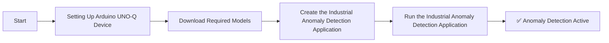
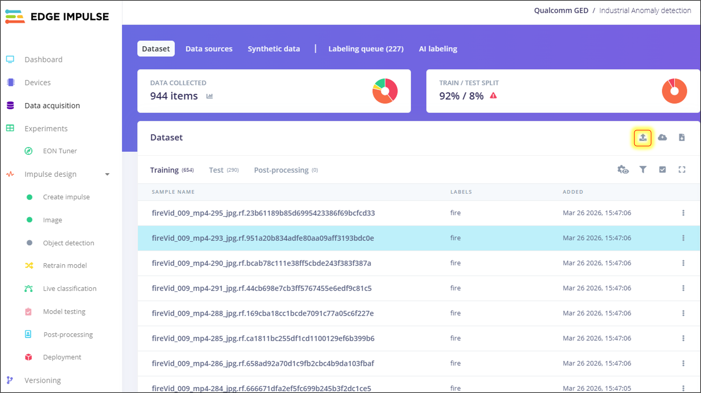
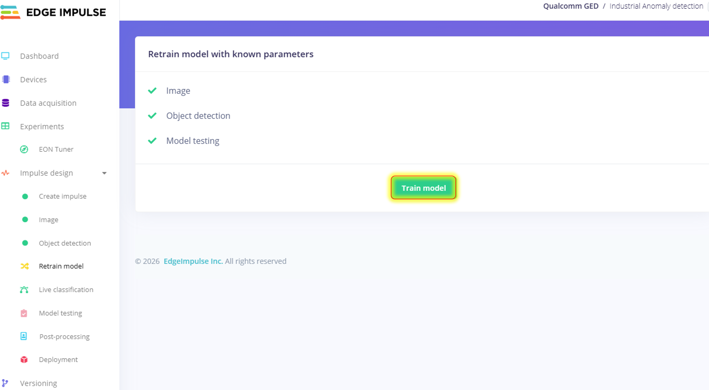
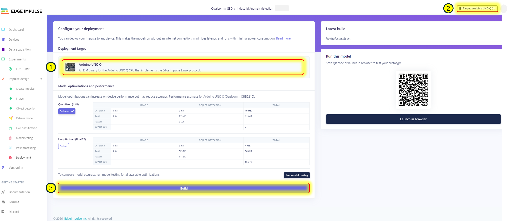
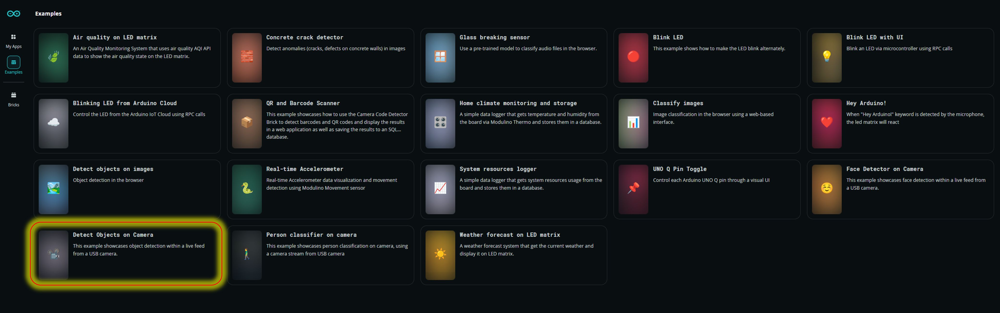
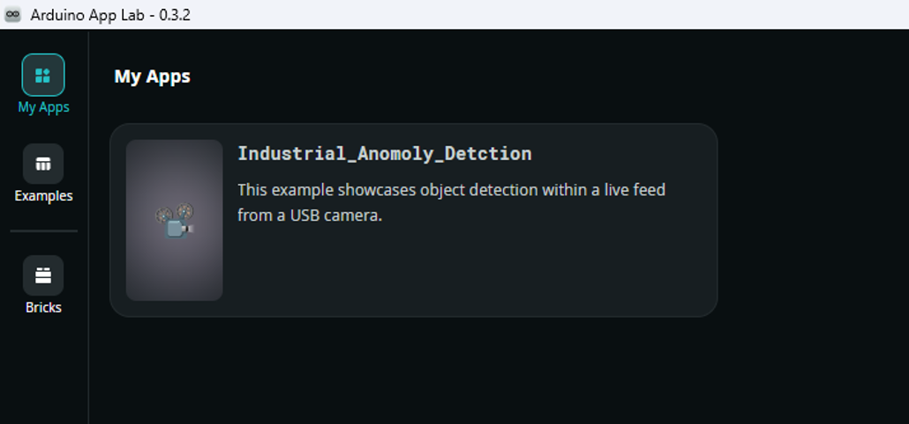

# [Startup_Demo](../../../)/[CV_VR](../../)/[IoT-Robotics](../)/[Industrial_Anomoly_Detection](./)

# Industrial Anomaly Detection with LED Matrix

## Table of Contents
- [1. Overview](#1-overview)
- [2. Requirements](#2-requirements)
  - [2.1 Hardware](#21-hardware)
  - [2.2 Software](#22-software)
- [3. Industrial Anomaly Detection Workflow](#3-industrial-anomaly-detection-workflow)
- [4. Setup Instructions](#4-setup-instructions)
  - [4.1 Setting Up Visual Studio Code (VS Code)](#41-setting-up-visual-studio-code-vs-code)
  - [4.2 Setting Up Arduino App Lab](#42-setting-up-arduino-app-lab)
  - [4.3 Setting Up Arduino Flasher Cli](#43-setting-up-arduino-flasher-cli)
  - [4.4 Setting Up Arduino UNO-Q Device](#44-setting-up-arduino-uno-q-device)
- [5. Get the Model from Edge Impulse](#5-get-the-model-from-edge-impulse)
  - [5.1 Setup an Edge Impulse Account](#51-setup-an-edge-impulse-account)
  - [5.2 Clone the Edge Impulse Project](#52-clone-the-edge-impulse-project)
- [6. Dataset Collection and Training](#6-dataset-collection-and-training)
  - [6.1 Download the Dataset](#61-download-the-dataset)
- [7. Uploading the Dataset and Retraining the Model in Edge Impulse](#7-uploading-the-dataset-and-retraining-the-model-in-edge-impulse-optional-step-to-train-the-model-with-new-dataset)
- [8. Build and Download Deployable Model](#8-build-and-download-deployable-model)
- [9. Prepare the Application](#9-prepare-the-application)
  - [9.1 Copy Existing Video Detection on Camera Application](#91-copy-existing-video-detection-on-camera-application)
  - [9.2 Upload Model to the Device](#92-upload-model-to-the-device)
  - [9.3 Modify application configuration file](#93-modify-application-configuration-file)
  - [9.4 Modify the sketch file](#94-modify-the-sketch-file)
  - [9.5 Modify the main python file](#95-modify-the-main-python-file)
- [10. Run the Industrial Anomaly Detection Application](#10-run-the-industrial-anomaly-detection-application)
  - [10.1 Demo Output](#101-demo-output)

## 1. Overview

The **Industrial Anomaly Detection** demo showcases the edge AI capabilities of the **Arduino® UNO Q** using a trained model from **Edge Impulse**. This application enables real-time detection of industrial anomalies such as fire and leakage from a live video feed captured by a USB webcam and controls the LED matrix to indicate the detected status.

- 📷 **Live Anomaly Detection**: Continuously captures frames from a USB camera and detects fire and leakage anomalies using a pre-trained AI model.
- 🧠 **AI-Powered Processing**: Utilizes the `video_objectdetection` Brick to analyze video frames and identify industrial anomalies.
- 🖼️ **Real-Time Visualization**: Displays detection labels around identified anomalies directly on the video feed.
- 🌐 **Web-Based Interface**: Managed through a web interface for seamless control and monitoring.
- 💡 **LED Matrix Status Indication**: Changes LED patterns and animations based on detection results (Fire, No Fire, Leakage, No Leakage, Unknown).

> **Important:** This demo must be run in **Network Mode or SBC** within the Arduino App Lab.


## 2. Requirements

### 2.1 Hardware

- **[Arduino® UNO Q](../../../Hardware/Arduino_UNO-Q.md#arduino-uno-q)**
- USB camera (x1)
- USB-C® hub adapter with external power (x1)
- A power supply (5 V, 3 A) for the USB hub (e.g., a phone charger)
- Personal computer (x86/AMD64) with internet access

### 2.2 Software

- Arduino App Lab
- Edge Impulse
- Bricks
- VS Code

## 3. Industrial Anomaly Detection Workflow



## 4. Setup Instructions

Before proceeding further, please ensure that **all the setup steps outlined below are completed in the specified order**. These instructions are essential for configuring the various tools required to successfully run the application.

Each section provides a reference to internal documentation for detailed guidance. Please follow them carefully to avoid any setup issues later in the process.

### 4.1 Setting Up Visual Studio Code (VS Code)

Visual Studio Code is the recommended IDE for editing, debugging, and managing the project's source code. It provides essential extensions and integrations that streamline development workflows. Please follow the setup instructions carefully to ensure compatibility with the project environment.

For detailed steps, refer to the internal documentation:
[Set up VS Code](../../../Tools/Software/VScode_Setup/README.md#34-configure-ssh)

### 4.2 Setting Up Arduino App Lab

Arduino App Lab enables you to create and deploy Apps directly on the Arduino® UNO Q board, which integrates both a microcontroller and a Linux-based microprocessor. The App Lab runs seamlessly on personal computers (Windows, macOS, Linux) and comes pre-installed on the UNO Q, with automatic updates. Please follow the setup instructions carefully to ensure smooth development and deployment of Apps.

For detailed steps, refer to the documentation: 
[Set up Arduino App Lab](../../../Tools/Software/Arduino_App_Lab/README.md#4-installation)

### 4.3 Setting Up Arduino Flasher Cli

Arduino Flasher CLI provides a streamlined way to flash Linux images onto your Arduino UNO Q board. Please follow the setup instructions carefully to avoid flashing errors and ensure proper board initialization.

For detailed steps, refer to the documentation: 
[Arduino Flasher CLI](../../../Hardware/Arduino_UNO-Q.md#flashing-a-new-image-to-the-uno-q)

### 4.4 Setting Up Arduino UNO-Q Device

Arduino UNO-Q must be properly configured to ensure reliable communication with the host system and accurate sensor data acquisition. Please follow the setup instructions carefully to avoid hardware conflicts and ensure seamless integration with the software stack.

For detailed steps, refer to the documentation: 
[Set up Arduino UNO-Q](../../../Hardware/Arduino_UNO-Q.md#uno-q-as-a-single-board-computer)

## 5. Get the Model from Edge Impulse

Edge Impulse empowers you to build datasets, train machine learning models, and optimize libraries for deployment directly on-device.

Click here to know more about [Edge Impulse](../../../Tools/Software/Edge_Impluse/README.md)

### 5.1 Setup an Edge Impulse Account

An Edge Impulse account is required to access the platform's full suite of tools for building, training, and deploying machine learning models on the Arduino UNO Q. Please follow the setup instructions carefully to ensure proper integration with your device and development workflow.

Follow the instructions to sign up: 
[Signup Instructions](../../../Tools/Software/Edge_Impluse/README.md#22-login-or-signup)

### 5.2 Clone the Edge Impulse Project

Cloning an Edge Impulse project allows you to replicate existing machine learning workflows, datasets, and configurations for customization or deployment on the Arduino UNO Q. Please follow the setup instructions carefully to ensure proper synchronization and compatibility with your device.

Clone the Industrial Anomaly Detection Project [Industrial Anomaly](https://studio.edgeimpulse.com/public/940377/live)

For detailed steps, refer to the documentation: 
[Clone the Repository](../../../Tools/Software/Edge_Impluse/README.md#29-clone-project-repository)


## 6. Dataset Collection and Training

This section explains how to prepare, convert, and upload a private dataset into Edge Impulse Studio for model training.
As an example, we demonstrate this process using the Vibration Faults Dataset from Kaggle.

### 6.1 Download the Dataset.

Follow the steps below to download the sample dataset:

- Visit the Kaggle dataset page: 
  - [Fire Dataset](https://www.kaggle.com/datasets/trnphmhong/fire-detection-dataset) -kaggle .
  - [Leakage Dataset](https://universe.roboflow.com/virajmodi/gas_leak) - Roboflow .

**For Kaggle Datasets (Fire and Non-fire):**
- Download the entire dataset as a ZIP file by clicking the "Download" button at the top right of the page.
- Extract the ZIP file and organize the files into a folder structure similar to `C:\Dataset`.

**For Roboflow Dataset (Leakage):**
- Create a free Roboflow account if you don't have one (sign up at [roboflow.com](https://roboflow.com)).
- Once logged in, navigate to the [Gas Leak Dataset](https://universe.roboflow.com/virajmodi/gas_leak).
- Click the "Download" button on the dataset page.
- Select your preferred export format (e.g., "COCO JSON" or "Pascal VOC XML" for Edge Impulse compatibility).
- Choose the dataset version and click "Continue", then "Download ZIP to Computer".
- Extract the downloaded ZIP file to your local directory (e.g., `C:\Dataset\Leakage`).
- The extracted folder will contain train/valid/test splits with images and annotations.

⚠️ **Disclaimer:** The dataset referenced in this project is hosted on Kaggle. Kindly review and comply with the dataset’s license terms and conditions as specified on the Kaggle dataset page before accessing, using, or redistributing the data.

## 7. Uploading the Dataset and Retraining the Model in Edge Impulse (Optional Step to train the model with new dataset)
This section provides instructions for uploading a new dataset and retraining the model in Edge Impulse Studio. This step is optional but useful when you want to enhance the model's performance with additional data or customize it for specific use cases.

> **Note:** If you are using the pre-trained model provided in the project, you can skip this section. However, if you wish to customize or improve the model with your own dataset, proceed with the following steps.

#### Step 1: Verify the Impulse Configuration

- Go to edge impulse project
- select Data acquisition tab.
- Select the "Add data" option to upload the dataset.
- Lable the data set.



#### Step 2: Retrain the Model

- Navigate to Retrain model section in Edge Impulse Studio.
- Click on Start Training to train the model with the newly uploaded dataset.




## 8. Build and Download Deployable Model
Edge Impulse allows you to build optimized machine learning models tailored for deployment on the Arduino UNO Q. Once trained, models can be compiled into efficient libraries and downloaded for direct integration with your device. Please follow the setup instructions carefully to ensure the model is compatible with your hardware and application requirements.

**Mandatory step:**
1. Select Arduino UNO Q Hardware while configuring your deployment at the Deployment stage.
2. Build the model (It automatically downloads the deployable model).



For detailed steps, refer to the documentation: 
[Build and Deploy Model]( ../../../Tools/Software/Edge_Impluse/README.md#28-download-deployable-model)

## 9. Prepare the Application
This section will guide you on how to create a new application from existing examples, configure Edge Impulse models, set up the application parameters, and build the final App for deployment on the Arduino UNO Q.Starting from pre-built examples is recommended for first-time users to better understand the structure and workflow.

### 9.1 Copy Existing Video Detection on Camera Application
Arduino App Lab provides a ready-to-use Video Detection on Camera application that can be copied and customized for your specific use case. This section will guide you through duplicating the existing application, modifying its components, integrating Edge Impulse models, and tailoring the detection logic to suit your deployment on the Arduino UNO Q.

In this example, we are using the Video Detection on Camera application for industrial anomaly detection.

  

Click on the Copy and Edit button to modify the application and name it Industrial Anomaly Detection.

  

For detailed steps, refer to the documentation: 
[Copy and Edit Existing Sample]( ../../../Tools/Software/Arduino_App_Lab/README.md#duplicate-an-existing-example)

### 9.2 Upload Model to the Device
Once the deployable model is built in Edge Impulse, it must be uploaded to the Arduino UNO Q to enable real-time inference and application integration. This section will guide you through transferring the compiled model to the device, verifying compatibility, and preparing it for execution within your App Lab application.

**Upload location**: Make sure to upload the model file to **/home/arduino/.arduino-bricks/ei-models/industrial-Anomoly-linux-aarch64-v1.eim**

For detailed steps, refer VScode SSH configuration section in the documentation: 
[Upload Model](../../../Tools/Software/Arduino_App_Lab/README.md#upload-model-to-device)

### 9.3 Modify application configuration file

#### Steps

1. **Create your working directory**:
```bash
mkdir my_working_directory
cd my_working_directory
   ```
2. **Download Your Application**:
Clone the Industrial_Anomaly_Detection application from the repository to get started with the project. This will provide you with all the necessary files including the application code, LED matrix patterns, and configuration files needed for anomaly detection.

```bash
cd ~
git clone -n --depth=1 --filter=tree:0 https://github.com/qualcomm/Startup-Demos.git
cd Startup-Demos
git sparse-checkout set --no-cone /CV_VR/IoT-Robotics/Industrial_Anomaly_Detection/
git checkout
  ```

3. **Navigate to Application Directory**:
 
 ```bash
cd ./CV_VR/IoT-Robotics/Industrial_Anomaly_Detection/
 ```
4. **Modify the Configuration Files and main functions**:

The app.yaml file defines the structure, behavior, and dependencies of your Arduino App Lab application. Modifying this configuration allows you to customize how your app interacts with hardware, integrates Edge Impulse models, and launches on the Arduino UNO Q. This section will guide you through editing key parameters such as bricks, model paths, and runtime settings.

 ```bash
cp app.yaml /home/arduino/ArduinoApps/Industrial_Anomaly_Detection/
   ```
### 9.4 Modify the sketch file

The sketch.ino file contains the main program logic for your Arduino App Lab project. It initializes hardware, communicates with bricks defined in app.yaml, and runs the primary control loop. Use this file to implement custom behaviors, sensor reading, actuator control, and model inference on the Arduino UNO Q.

```bash
cp sketch.ino /home/arduino/ArduinoApps/Industrial_Anomaly_Detection/sketch/
   ```

### 9.5 Modify the main python file

The main.py file contains the core Python logic for your Arduino App Lab application. It handles communication with connected bricks, runs Edge Impulse model inference, and processes events coming from the App Lab runtime. Use this file to define custom behaviors, manage data flow, and implement high‑level control logic for your application.

   ```bash
cp main.py /home/arduino/ArduinoApps/Industrial_Anomaly_Detection/python/
   ```

## 10. Run the Industrial Anomaly Detection Application

Once your application is configured and built in Arduino App Lab, it can be deployed and executed directly on the Arduino UNO Q. This section will guide you through launching the application, verifying sensor input from the camera, and observing real-time anomaly detection results.


For detailed steps, refer to the documentation: 
[Run Application](../../../Tools/Software/Arduino_App_Lab/README.md#run-example-apps-in-arduino-app-lab)

### 10.1 Demo Output

When running the application, the LED matrix will display different patterns based on the detected anomalies:

- **Fire**: Fire animation displayed on the LED matrix
- **Leakage**: Water leakage animation displayed on the LED matrix
- **No Fire and No Leakage**: Right arrow (OK) animation displayed on the LED matrix

The web interface will also display the live video feed with detection boxes and labels around identified anomalies.

Once the application is running, you can observe the following outputs in the terminal:

'OK' Animation will be displayed on the LED Matrix when the application launches.

'Fire' Animation will be displayed on the LED Matrix when fire detected.


'Leakage' Animation will be displayed on the LED Matrix when leakage are detected.


'OK' Animation will be displayed on the LED Matrix when no-fire and no-leakage detected.


