# Object Detection on IoT (RB3 Gen2) with YOLOv8-Quantized
Summarize the AI application object detection development process using Qualcomm AI Hub and Qualcomm Linux on RB3 Gen 2.
The gst-ai-object-detection application allows you to detect objects within images and videos. The use cases show the execution of YOLOv8 using LiteRT.

## Table of Contents
- [Introduction and AI Model to Deploy](#1-introduction-and-ai-model-to-deploy)
  - [AI use case and the selected AI model to deploy](#11-ai-use-case-and-the-selected-ai-model-to-deploy)
- [Qualcomm AI Hub](#2-qualcomm-ai-hub)
  - [Use the AI Hub scripts to export the YOLOv8 quantized model](#21-use-the-ai-hub-scripts-to-export-the-yolov8-quantized-model)
  - [AI Hub Overview Job Results](#211-ai-hub-overview-job-results)
  - [AI Hub Verification - Detailed Steps](#212-ai-hub-verification---detailed-steps)
- [On-Device Deployment](#3-on-device-deployment)
  - [Deploy On-Device: Use the AI Hub scripts to export the YOLOv8 quantized model](#31-deploy-on-device-use-the-ai-hub-scripts-to-export-the-yolov8-quantized-model)
  - [Deploy On-Device: Overall Results](#311-deploy-on-device-overall-results)
  - [Deploy On-Device: Detailed Steps](#312-deploy-on-device-detailed-steps)
  - [Deploy On-Device: Example Results](#32-deploy-on-device-example-results)

## 1. Introduction and AI Model to Deploy
Overview of the AI Use Case and the Selected AI Model to Deploy

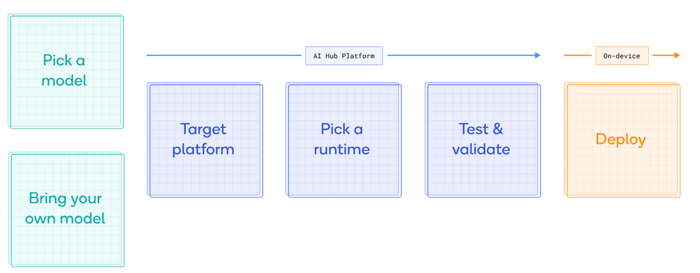

### 1.1 AI use case and the selected AI model to deploy?
- <a href="https://aihub.qualcomm.com/iot/models/yolov8_det?domain=Computer+Vision&useCase=Object+Detection"> YOLOv8-Detection </a>
- Quantized real‑time object detection optimized for mobile and edge by Ultralytics.
- Ultralytics YOLOv8 is a machine learning model that predicts bounding boxes and classes of objects in an image.
- This model is post‑training quantized to int8 using samples from the COCO dataset.

## 2. Qualcomm AI Hub
Steps to optimize, validate, and deploy selected AI models on hosted Qualcomm devices through Qualcomm AI Hub

### 2.1 Use the AI Hub scripts to export the YOLOv8 quantized model
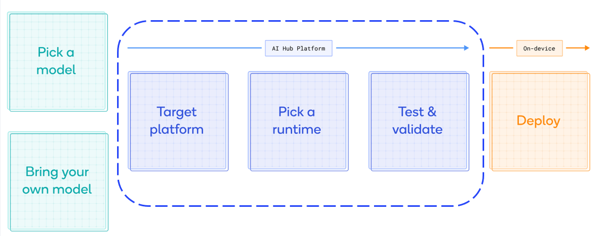

#### 2.1.1 AI Hub Overview Job Results
- Hosted target device to verify: RB3 Gen 2
- <a href="https://app.aihub.qualcomm.com/docs/hub/getting_started.html"> Set up an environment </a> for Qualcomm AI Hub on your host machine (Ubuntu22.04)
- AI Hub on-device deployment :
```
python -m qai_hub_models.models.yolov8_det.export --quantize w8a8 --device "RB3 Gen 2 (Proxy)"
```

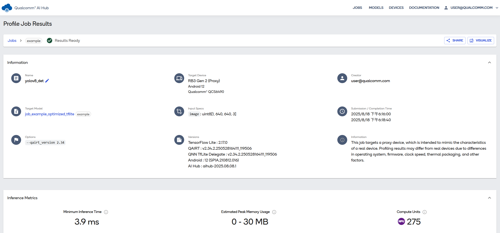

#### 2.1.2 AI Hub Verification - Detailed Steps
- Run with:
```
python -m qai_hub_models.models.yolov8_det.export --quantize w8a8 --device "RB3 Gen 2 (Proxy)"
```
- Compile job result

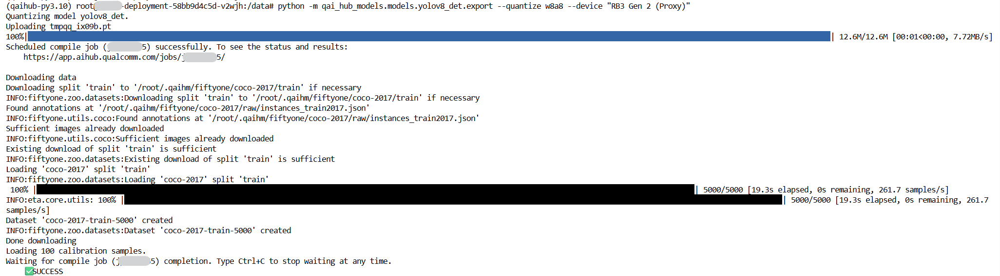

- Profile job result
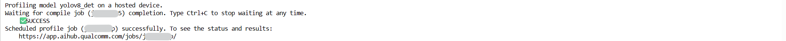
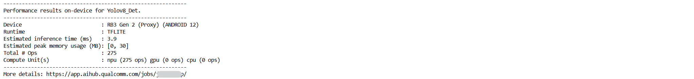

- Inference job result
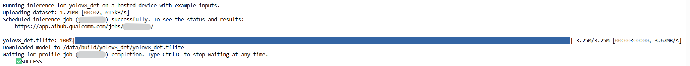
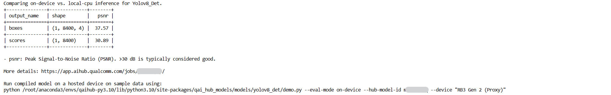

## 3. On-Device Deployment
Steps to deploy the AI model from Qualcomm AI Hub to a physical device

### 3.1 Deploy On-Device: Use the AI Hub scripts to export the YOLOv8 quantized model

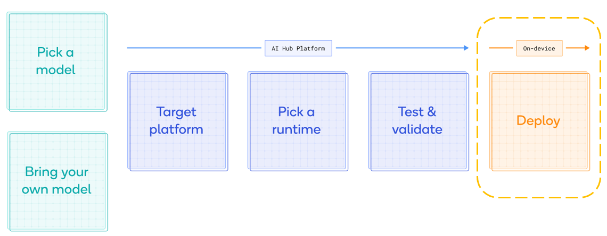

#### 3.1.1 Deploy On-Device: Overall Results

- Physical device to deploy : <a href="https://www.qualcomm.com/developer/hardware/rb3-gen-2-development-kit"> RB3 Gen 2 Vision kit </a>
- OS : <a href="https://docs.qualcomm.com/nav/home?product=895724676033554725&version=1.5"> Qualcomm Linux 1.5 </a>
- Set up the host machine for Android Debug Bridge (ADB) connection to the RB3 Gen 2 Vision kit.
- Connect the RB3 Gen 2 Vision kit to a monitor through HDMI.
- Download and copy the models, labels file, and image to the /etc/ directory on the device

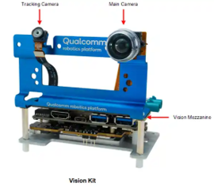

#### 3.1.2 Deploy On-Device: Detailed Steps

- Download AI model from Qualcomm AI Hub
  - Visit previous profile job webpage
  - Download TFlite Runtime model

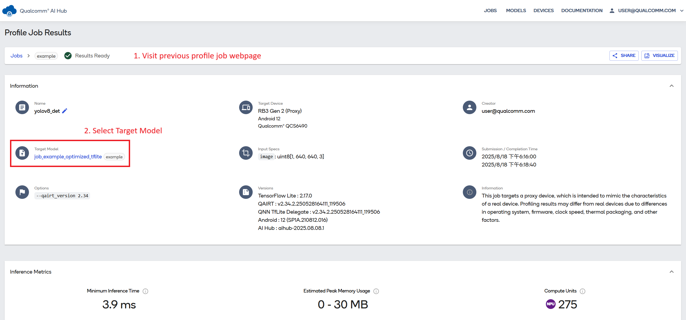


- Use the following command to enter the shell and execute the use cases:
  ```
  adb shell
  ```

- Run the following command to enable the Permissive mode:
  ```
  setenforce 0
  ```

- Run the following command to enable the display:
  ```
  export XDG_RUNTIME_DIR=/dev/socket/weston && export WAYLAND_DISPLAY=wayland-1
  ```

- Download the labels file or you have your own labels file

  - https://github.com/quic/ai-hub-models/tree/4341d5da006b7aeaa3c11a287ead54d091c4faac/qai_hub_models/labels

- Prepare your own test_video file

- Run the following command to push the files from host machine:
    ```
    adb push coco_labels.txt /etc
    adb push YOLOv8-Detection-Quantized.tflite /etc
    adb push test_video.mp4 /etc
    ```
- Or you can push your own model to /etc

- The sample application uses the /etc/config_detection.json file to read the input parameters.
- Create the /etc/config_detection.json file
 ```json
{
  "file-path": "<input video path>",
  "ml-framework": "<snpe, or tflite or qnn framework>",
  "yolo-model-type": "<yolov8 or yolonas or yolov5 or yolox>",
  "model": "<Model Path>",
  "labels": "<Label Path>",
  "constants": "<Model Constants for LiteRT Model>",
  "threshold": <Post-processing threshold, integer value from 1-100>,
  "runtime": "<dsp, cpu or gpu runtime>"
}
```

- For information on updating the q_offset and q_scale constants of the quantized model:
  - Open the downloaded TFLite model with a graph viewer tool like <a href="https://netron.app/"> Netron </a> and open model. Check post-processing requirements for the specific model, which needs to be updated into reference application. 
  - Here is a screenshot of above-mentioned model. Click on input node of the model to see model properties. Copy the values from output node of the model.

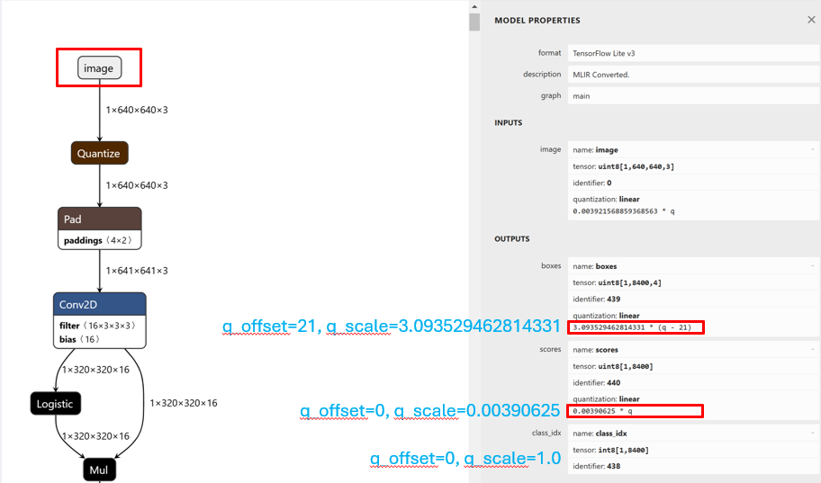

  - Use the following config(for Qualcomm linux 1.5) to execute the use case (camera source):
  ```json
  {
      "camera": 0,
      "ml-framework": "tflite",
      "yolo-model-type": "yolov8",
      "model": "/etc/YOLOv8-Detection-Quantized.tflite ",
      "labels": "/etc/coco_labels.txt",
      "constants": "YOLOv8,q-offsets=<21.0, 0.0, 0.0>,q-scales=<3.0546178817749023, 0.003793874057009816, 1.0>;",
      "threshold": 40,
      "runtime": "dsp"
  }
  ```

  - Use the following config(for Qualcomm linux 1.5) to execute the use case (video source):
  ```json
  {
      "file-path": "/etc/test_video.mp4",
      "ml-framework": "tflite",
      "yolo-model-type": "yolov8",
      "model": "/etc/YOLOv8-Detection-Quantized.tflite ",
      "labels": "/etc/coco_labels.txt",
      "constants": "YOLOv8,q-offsets=<21.0, 0.0, 0.0>,q-scales=<3.0546178817749023, 0.003793874057009816, 1.0>;",
      "threshold": 40,
      "runtime": "dsp"
  }
  ```


- Running object detection with QIMSDK and TFLite
    ```
    gst-ai-object-detection --config-file=/etc/config_detection.json
    ```

- To stop the use case, press CTRL + C
- To display the available help options, run the following command:
    ```
    gst-ai-object-detection –h
    ```
- The GStreamer debug output is controlled by the GST_DEBUG environment variable. Set the required level to enable logging. For example, to log all warnings, run the following command.
    ```
    export GST_DEBUG=2
    ```


> For more detail: <a href="https://www.qualcomm.com/developer/software/qualcomm-intelligent-multimedia-sdk"> Qualcomm intelligent multimedia software development kit (QIM SDK) </a>
This SDK uses GStreamer, an open-source multimedia framework and exposes easy APIs and plug-ins in both multimedia and AI/ML domain.

### 3.2 Deploy On-Device: Example Results


