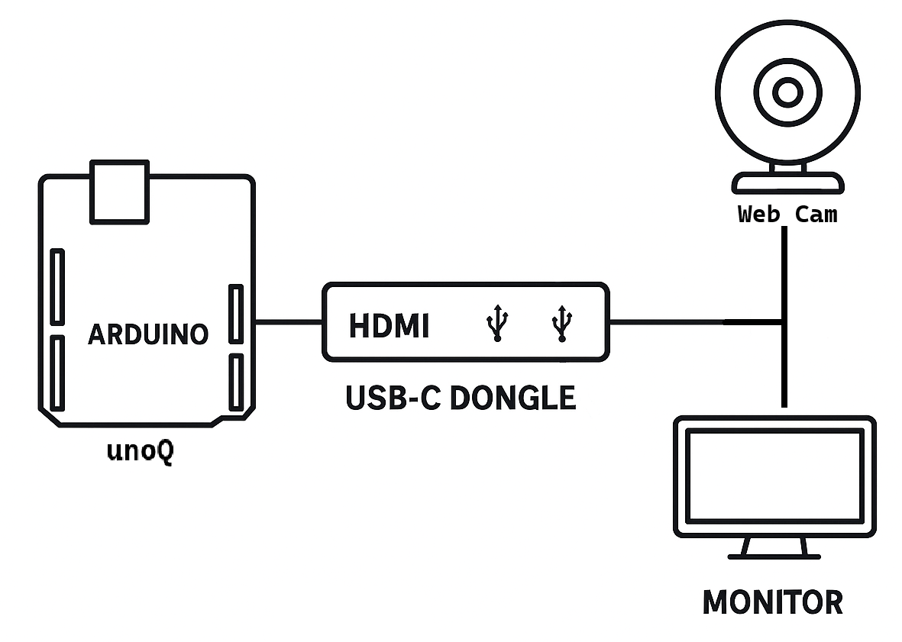
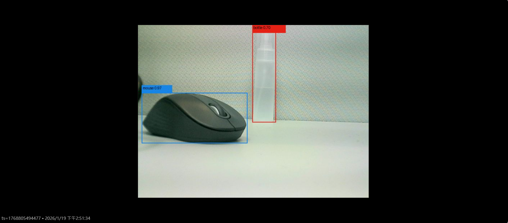
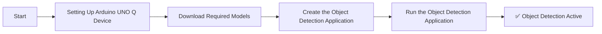
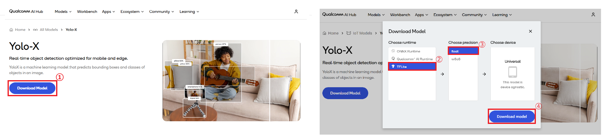
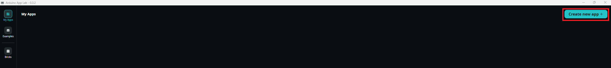
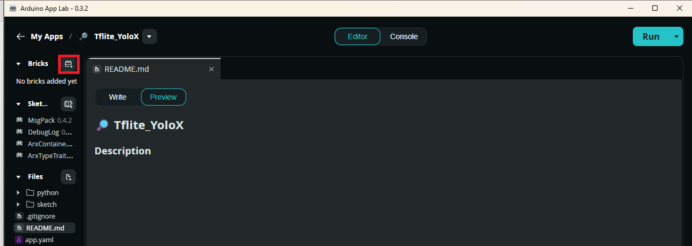
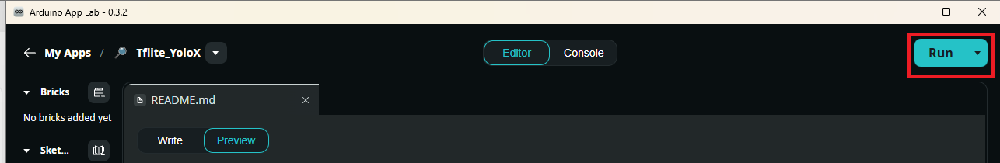

# [Startup_Demo](../../../)/[CV_VR](../../)/[IoT-Robotics](../)/[Object_detection_via_Tflite_model](./)

## Table of Contents
- [1. Overview](#1-overview)
- [2. Requirements](#2-requirements)
  - [2.1 Hardware](#21-hardware)
  - [2.2 Software](#22-software)
- [3. Object Detection Workflow](#3-object-detection-workflow)
- [4. Setup Instructions](#4-setup-instructions)
  - [4.1 Setting Up Arduino App Lab](#41-setting-up-arduino-app-lab)
  - [4.2 Setting Up Arduino Flasher CLI](#42-setting-up-arduino-flasher-cli)
  - [4.3 Setting Up Arduino UNO-Q Device](#43-setting-up-arduino-uno-q-device)
- [5. Download the Model from Qualcomm AI Hub](#5-download-the-model-from-qualcomm-ai-hub)
- [6. Prepare the Application](#6-prepare-the-application)
  - [6.1 Create a New Application](#61-create-a-new-application)
  - [6.2 Add a Web UI Brick to Your Application](#62-add-a-web-ui-brick-to-your-application)
  - [6.3 Download Required Files form Github](#63-download-required-files-form-github)
  - [6.4 Transferred model and files to UNO Q](#64-transferred-model-and-files-to-uno-q)
- [7. Run the Object Detection Application](#7-run-the-object-detection-application)
  - [7.1 Demo Output](#71-demo-output)

## 1. Overview

This demo showcases the edge AI capabilities of the **Arduino® UNO Q** using a trained model from **Qualcomm AI Hub**. This application enables real-time object detection from a live video feed captured by a USB webcam.

> ⚠️ **Important:** This demo must be run in [**Network Mode or SBC**](https://docs.arduino.cc/tutorials/uno-q/single-board-computer/) within the Arduino App Lab.

   
   

## 2. Requirements

### 2.1 Hardware

- **[Arduino® UNO Q](../../../Hardware/Arduino_UNO-Q.md#arduino-uno-q)**
- USB camera (x1)
- USB-C® hub adapter with external power (x1)
- A power supply (5V, 3A) for the USB hub (e.g., a phone charger)
- Personal computer with internet access


### 2.2 Software

- [Arduino App Lab](../../../Tools/Software/Arduino_App_Lab/README.md)
- [Bricks](../../../Tools/Software/Arduino_App_Lab/README.md#62-bricks)
- [Ai-Hub](https://aihub.qualcomm.com/)

## 3. Object Detection Workflow


## 4. Setup Instructions

Before proceeding further, please ensure that **all the setup steps outlined below are completed in the specified order**. These instructions are essential for configuring the various tools required to successfully run the application.

Each section provides a reference to internal documentation for detailed guidance. Please follow them carefully to avoid any setup issues later in the process.

## 4.1. Setting Up Arduino App Lab
Arduino App Lab enables you to create and deploy Apps directly on the Arduino® UNO Q board, which integrates both a microcontroller and a Linux-based microprocessor. The App Lab runs seamlessly on personal computers (Windows, macOS, Linux) and comes pre-installed on the UNO Q, with automatic updates. Please follow the setup instructions carefully to ensure smooth development and deployment of Apps.

For detailed steps, refer to the documentation: 
[Set up Arduino App Lab]( ../../../Tools/Software/Arduino_App_Lab/README.md#4-installation)

## 4.2. Setting Up Arduino Flasher Cli
Arduino Flasher CLI provides a streamlined way to flash Linux images onto your Arduino UNO Q board. Please follow the setup instructions carefully to avoid flashing errors and ensure proper board initialization.

For detailed steps, refer to the documentation: 
[Arduino Flasher CLI]( ../../../Hardware/Arduino_UNO-Q.md#flashing-a-new-image-to-the-uno-q)

## 4.3. Setting Up Arduino UNO-Q Device
Arduino UNO-Q must be properly configured to ensure reliable communication with the host system and accurate sensor data acquisition. Please follow the setup instructions carefully to avoid hardware conflicts and ensure seamless integration with the software stack.

For detailed steps, refer to the documentation: 
[Set up Arduino UNO-Q]( ../../../Hardware/Arduino_UNO-Q.md#uno-q-as-a-single-board-computer).

## 5. Download the Model from Qualcomm AI-Hub

Qualcomm AI Hub empowers you to discover pre‑optimized models, optimize and profile your own AI models, and seamlessly deploy them across Qualcomm‑powered devices for efficient on‑device AI.

Open **Models → IoT**, select **Object Detection** from the left‑hand category list, locate **YOLOX**, enter its model page, and download the **TFLite → float** version of the model.



## 6. Prepare the Application

This section will guide you on how to create a new application from an empty project, write your own components—including Python code, HTML code, and imported official bricks—set up the Python environment, and build a complete App from scratch. Starting from a clean project gives you full control over the structure and design of your application; however, for first‑time users, we recommend trying the built‑in examples first to understand the workflow before returning to this guide.

### 6.1 Create a new application
Arduino App Lab allows you to start from a clean, empty project and build your application entirely from scratch, giving you full flexibility over its structure and functionality. This section will guide you through creating a brand‑new application, adding your own Python code and HTML code, importing official bricks, setting up the Python environment, and assembling everything into a functional App ready for deployment on the Arduino UNO Q.

In this example, we are starting with a completely new project to demonstrate how to build an application step‑by‑step.

  

For detailed steps, refer to the documentation: 
[Create a New App](https://docs.arduino.cc/software/app-lab/tutorials/getting-started/#create-a-new-app)

### 6.2 Add a Web UI Brick to Your Application

After creating a new application in App Lab, you can extend its functionality by adding a Web UI interface. To do this, open your application and click the “Bricks” button located in the upper-left corner of the App Lab interface. From the available brick categories, select **WebUI-HTML** to insert an HTML brick into your project.

This HTML brick will serve as the entry point for your user interface and will automatically link to the index.html file you created earlier under the assets directory.


For detailed steps, refer to the documentation: 
[Understanding the Brick Concept](https://docs.arduino.cc/software/app-lab/tutorials/bricks/#understanding-the-brick-concept)

### 6.3 Download Required Files form Github

This step guides you through downloading the required application files from Qualcomm’s official GitHub repository. The repository contains multiple demo projects, so we use Git sparse checkout to fetch only the files needed for this demo, keeping the workspace clean and lightweight.

1. **Create your working directory**:
   ```bash
   mkdir my_working_directory
   cd my_working_directory
   ```

2. **Download Your Application**:
   ```bash
   git clone -n --depth=1 --filter=tree:0 https://github.com/qualcomm/Startup-Demos.git
   cd Startup-Demos
   git sparse-checkout set --no-cone /CV_VR/IoT-Robotics/Object_detection_via_Tflite_model/
   git checkout
   ```

### 6.4 Transferred model and files to UNO Q 

Once you have obtained the optimized model in the previous step, transfer it to the Arduino UNO Q to enable real‑time inference and seamless integration within your application. Upload both the **model file** (e.g., `yolox-float.tflite`) and the **require file** (e.g., `coco_labels.txt`, `main.py`) to the application directory on the device.

You can upload the files from your host PC using either ADB or SCP, depending on your setup:
```
# Host PC → UNO Q (via ADB)
adb push <path/to/file> <destination/path/on/device>

# Host PC → UNO Q (via SCP)
scp <path/to/file> arduino@<UNOQ_IP>:<destination/path/on/device>
````

**Upload location:**Make sure to upload the model file to:**/home/arduino/ArduinoApps/\<app name\>**

For detailed steps, refer to the documentation: 
[File Transfer](https://docs.arduino.cc/tutorials/uno-q/ssh/#file-transfer)

## 7. Run the Object Detection application

Before running the application, verify that all required files are present in your project directory. If you followed this guide, your folder should include (you may have additional files, but these are mandatory):
```

/home/arduino/ArduinoApps/<app name>/
├─ python/
│  ├─ main.py
│  ├─ yolox-float.tflite
│  ├─ coco_labels.txt
│  └─ requirements.txt
└─ assets/
   └─ index.html

```

Once your application is configured and built in Arduino App Lab, it can be deployed and executed directly on the Arduino UNO Q. This section will guide you through launching the application, verifying camera input, and observing real‑time object recognition.
 

### 7.1 Demo Output

 
