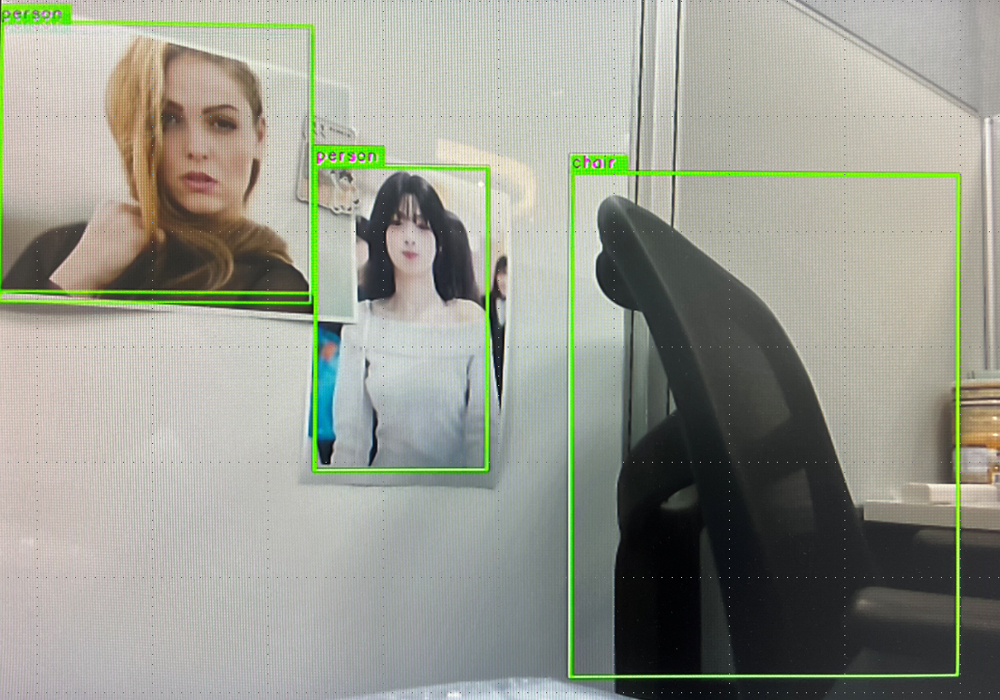

# [Startup_Demo](../../../)/[CV_VR](../../)/[IoT-Robotics](../)/[Implementing Object Detection with RealSense(D435i)](./)
# Implementing Object Detection with RealSense(D435i)

## 📘Table of Contents
- [🚀Overview](#1-overview)
- [✨Features](#2-features)
- [🔧Hardware requirements](#3hardware-requirements)
- [🔧Install Dependencies and Build SDK/Plugin](#4install-dependencies-and-build-sdkplugin)
- [🔀Setup the GStreamer Environment](#5setup-the-gstreamer-environment)
- [📥Download the Pre-compiled Object detection Model](#6download-the-pre-compiled-object-detection-model)
- [📥Prepare to Run the Sample Script](#7prepare-to-run-the-sample-script)
- [🚀Demo](#8demo)
- [🚀Result](#9result)
---

## 1.🚀Overview

This guide outlines the steps for implementing object detection using Python and GStreamer with a <strong>`RealSense D435i device`</strong> on the RB3 Gen2 platform running Ubuntu 22.04.

---

## 2.✨Features

- Understand how to install the Intel RealSense SDK and resolve build issues.
- Understand how to compile and use the RealSense GStreamer element plugin.
- Run a GStreamer command-line demo using RealSense as the input source.
- Build a sample Python application that uses the RealSense `D435i` as the input source.


<div align="center"> <strong> Figure : Pipeline for object detection and preview </strong></div>

---

## 3.🔧Hardware requirements
This sample application uses two hardware devices: the **RB3 Gen 2** and the **RealSense D435i**.

### 3.1 RB3 Gen 2

You can find more details about the specifications and other information on the Qualcomm official website at the link below:

👉 [RB3 Gen 2 Specifications](https://www.qualcomm.com/developer/hardware/rb3-gen-2-development-kit)


### 3.2 RealSense - D435i

You can find more details about the specifications and other information on the official website at the link below:

👉 [RealSense D435i Specifications](https://www.intel.com/content/www/us/en/products/sku/190004/intel-realsense-depth-camera-d435i/specifications.html)


---

## 4.🔧Install Dependencies and Build SDK/Plugin

Before installing dependencies and building the SDK or plugin, make sure your RB3 Gen 2 device has already been flashed.

💡 **Note:**
Follow the official Qualcomm RB3 Gen 2 Dev Kit guide to flash the image.

👉 [Qualcomm RB3 Gen 2 Dev Kit Quick Start](https://docs.qualcomm.com/bundle/publicresource/topics/80-82645-1/Integrate_and_flash_software_2.html#panel-0-V2luZG93cyBob3N0)

### Step 1: Install required packages and dependencies
Install these dependencies to enable building the RealSense SDK and GStreamer plugin.
```bash
sudo apt install meson
sudo apt install cmake
sudo apt install libgstreamer1.0-dev libgstreamer-plugins-base1.0-dev
sudo apt-get install libssl-dev libusb-1.0-0-dev libudev-dev pkg-config libgtk-3-dev
sudo apt-get install libglfw3-dev libgl1-mesa-dev libglu1-mesa-dev
sudo apt install v4l-utils
sudo apt install librealsense2 librealsense2-utils librealsense2-dev *
```
---
### Step 2: Build RealSense SDK
Compile and install the SDK to access RealSense camera streams and enable advanced features.
```bash
git clone https://github.com/IntelRealSense/librealsense.git
cd librealsense
./scripts/setup_udev_rules.sh
mkdir build && cd build   
cmake ../ -DBUILD_EXAMPLES=true
make -j4
sudo make install
```
### Step 3: Build Realsense Gstreamer Plugin
Build this plugin to integrate RealSense streams into GStreamer pipelines for video processing.
```bash
git clone https://github.com/WKDSMRT/realsense-gstreamer.git
cd realsense-gstreamer
meson . build
sudo ninja -C build install
```
⚠️Note:
If the Plugin build fails and the log shows a type error, you can try the following method to fix it.
```bash
nano ./src/gstrealsensemeta.cpp
```

Find the line `static volatile GType type;` and replace it with the following line.
```bash
static GType type;
```

* Verify plugin and SDK build success
  1. Check if the GStreamer element was built successfully:
    ```bash
    gst-inspect-1.0 build/src/libgstrealsensesrc.so
    ```
  2. A simple test to confirm that the device, plugin, and SDK are working properly:
    ```bash
    gst-launch-1.0 -v -m realsensesrc ! videoconvert ! autovideosink
    ```
⚠️Note: If the test fails and the log shows an unknown GStreamer element, you need to proceed to [Step 5.](#5-setup-the-gstreamer-environment) Once it's done, re-run the test to confirm that the element works properly.

---
## 5.🔀Setup the GStreamer Environment
Ensure that the plugin can be detected by GStreamer by setting the path to the build output directory.
```bash
export GST_PLUGIN_PATH=/your project path/realsense-gstreamer/build/src
```
---
## 6.📥Download the Pre-compiled Object detection Model

Follow the official Qualcomm IM SDK guide to download the precompiled model and labels, which also helps you export models.

👉 [Qualcomm Intelligent Multimedia Software Development Kit Reference](https://docs.qualcomm.com/bundle/publicresource/topics/80-70018-50/download-model-and-label-files.html)

---
## 7.📥Prepare to Run the Sample Script

Use `git clone` to download the repository, or directly copy the file gst-ai-object-detection-with-realsense.py from this repository.


### 7.1 Source code setup

```bash
cd ~
git clone -n --depth=1 --filter=tree:0 https://github.com/qualcomm/Startup-Demos.git
cd Startup-Demos
git sparse-checkout set --no-cone /CV_VR/IoT-Robotics/object_detection_with_RealSense/
git checkout
```

---
## 8.🚀Demo

Check your <strong> RealSense device node number</strong>, update the -c argument accordingly, and modify the model, label, and constant paths to match your environment.

💡*This sample uses the RealSense D435i and RB3 Gen 2 running Qualcomm Ubuntu 22.04 to execute the demo application.*

```bash
./gst-ai-object-detection-with-realsense.py -c 6 -cw 640 -ch 480 -cf 30 -f 2 -m /etc/models/yolov8_det_quantized.tflite -l /etc/labels/yolov8.labels -ml "yolov8" -k "YOLOv8,q-offsets=<33.0, 0.0, 0.0>,q-scales=<3.093529462814331, 0.00390625, 1.0>"
```

💡 **Note**
You can follow the steps below to check your RealSense device node.
1. Run the following command to list connected RealSense devices:
```bash
$ rs-enumerate-devices
```
This command helps you verify whether your RealSense device supports image formats.


2. Use the following command to check available video device nodes:
```bash
$ ls /dev/video*
```


3. Finally, confirm which device node supports the required image format and use it:
```bash
$ v4l2-ctl --list-formats-ext -d /dev/video6
```
4. In this example, the RealSense device node is /dev/video6.


---
## 9.🚀Result:
✅ Once all steps are complete, you can view the result on the screen as shown in the image below, where the object detection output is displayed.

