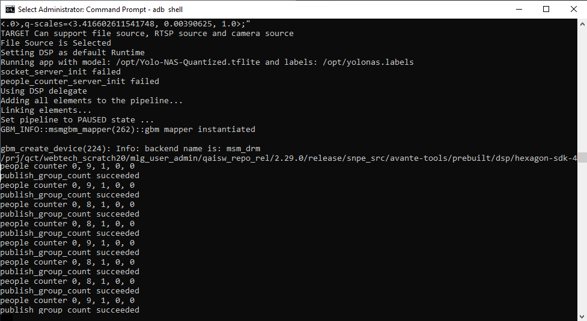
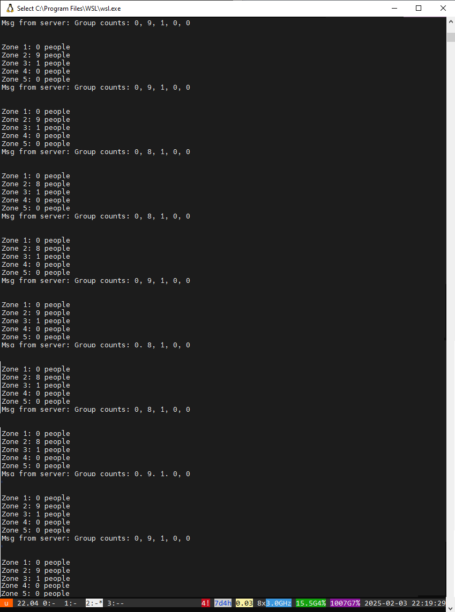
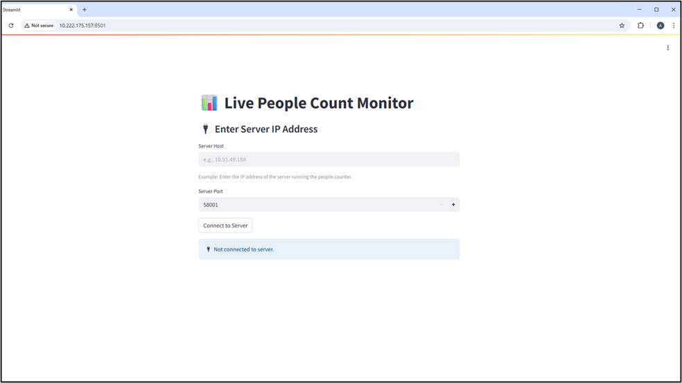
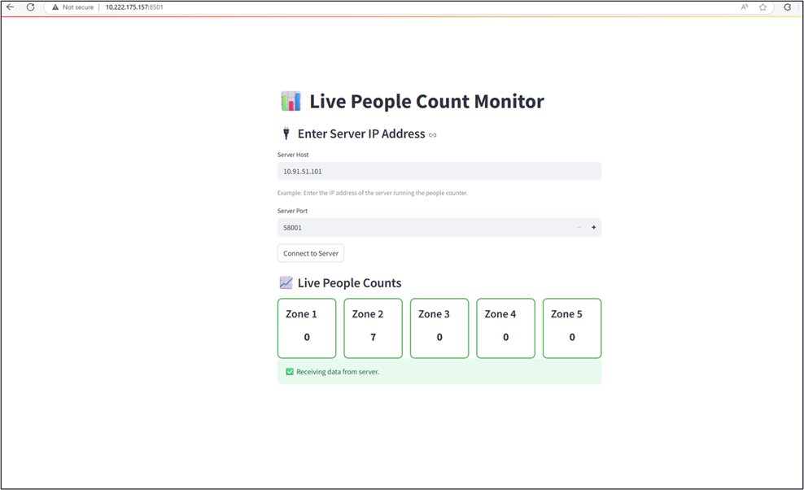

# [Startup_Demo](../../../)/[CV_VR](../../)/[IoT-Robotics](../)/[people_detection](./)

# People Detection Solutions for Retail Store Use Case

## Table of Contents
- [Overview](#1-Overview)
  - [Application Configuration](#11-Application-Configuration)
- [Setting Up RB3 Gen2 Device](#2-Setting-Up-RB3-Gen2-Device)
- [Download models and label files](#3-Download-models-and-label-files)
- [Application Development Overview](#4-Application-Development-Overview)
- [eSDK Installation and Setup Guide](#5-eSDK-Installation-and-Setup-Guide)
  - [Overview](#51-Overview)
  - [Ubuntu Setup](#52-Ubuntu-Setup)
  - [ESDK Installation Guide](#53-ESDK-Installation-Guide)
- [Application Development Implementation Guide](#6-Application-Development-Implementation-Guide)
  - [Setup File Directory and Source Code](#61-Setup-File-Directory-and-Source-Code)
  - [Integrating and Packaging Components](#62-Integrating-and-Packaging-Components)
  - [Compilation Procedure](#63-Compilation-Procedure)
- [Transferring Installers to Target Device](#7-Transferring-Installers-to-Target-Device)
- [Install Application Installers on RB3 Gen2](#8-Install-Application-Installers-on-RB3-Gen2)
- [Running People Counter Application](#9-Running-People-Counter-Application)
  - [Compile Client Application](#91-Compile-Client-Application)
  - [Run People Counter Application](#92-Run-People-Counter-Application)

## 1. Overview

This project utilizes the RB3 Gen2 device to analyze people in queues. The RB3 captures frames or images from the camera feed, and the YOLO model detects and counts the number of people. It leverages CPU, DSP, and GPU runtimes, as well as the Enhanced SDK (ESDK), providing developers with tools and resources to download and compile the AI applications.

### 1.1 Application Configuration

To set up the people detection solution, follow these steps:
1. **Configure the RB3 Gen2 Device**: Ensure the device is properly installed and connected to the camera feed.
2. **Download Required Models**: Access the AI-HUB platform to download the necessary YOLO models for people detection.
3. **Develop the Smart People Counter Application**: Utilize the Enhanced SDK (ESDK) to create a custom application that integrates people detection with the people counter system.
4. **Run the Smart People Counter Application**: Execute the application on the RB3 Gen2 device to start detecting and counting people in queues.

## 2. Setting Up RB3 Gen2 Device

To set up the RB3 Gen2 device, it is essential to ensure that all necessary hardware components are properly connected and configured.

To configure the RB3 Gen2 device correctly, refer to the [RB3 Gen2 Device Setup Guide](../../../Hardware/IoT-Robotics/RB3-Gen2.md#RB3-Gen2-Device-Setup-Guide) for a comprehensive overview of the setup process. This guide includes detailed instructions on the installation of required software and tools, ensuring a proper setup. By following the guide, you can ensure that your device is properly set up, which is crucial for the successful functioning of the people detection solution.

To ensure the proper functioning of the people detection application, follow the 6 setup steps. The application requires all necessary tools and software to be installed and configured correctly. Carefully follow all the step by step instructions listed below and complete device setup.

1. **Requirements**: Ensure you have all the necessary hardware and software components as specified in the [Requirements](../../../Hardware/IoT-Robotics/RB3-Gen2.md#2-Requirements) section.
2. **Tools Installation**: Install the required tools and software as described in the [Tools Installation](../../../Hardware/IoT-Robotics/RB3-Gen2.md#3-Tools-Installation) section.
3. **Powering On Device**: Power up the RB3 Gen2 device according to the instructions in the [Powering On Device](../../../Hardware/IoT-Robotics/RB3-Gen2.md#4-Powering-On-Device) section.
4. **Software Updates**: Update the device software to the latest version as outlined in the [Software updates](../../../Hardware/IoT-Robotics/RB3-Gen2.md#5-Software-Updates) section.
5. **Access DeviceShell**: Access the DeviceShell as described in the [Access DeviceShell](../../../Hardware/IoT-Robotics/RB3-Gen2.md#6-Access-DeviceShell) section.
6. **Network Connectivity**: Establish network connectivity as specified in the [Network Connectivity](../../../Hardware/IoT-Robotics/RB3-Gen2.md#7-Network-Connectivity) section.

## 3. Download models and label files

This section will guide you through downloading the <a href="https://docs.qualcomm.com/bundle/publicresource/topics/80-70017-253/demo_app.html?vproduct=1601111740013072&version=1.3#ai-applications" target="_blank"> Models and Labels </a> from AI-HUB:
which is a platform that provides various AI models for different applications.

To facilitate the use of the Yolo-NAS and Yolov8 models on the RB3 Gen2 device, follow these steps to download the necessary label files on linux host machine, set permissions, and transfer the files to the device.

    curl -L -O https://raw.githubusercontent.com/quic/sample-apps-for-qualcomm-linux/refs/heads/main/download_artifacts.sh
    chmod +x download_artifacts.sh
    ./download_artifacts.sh -v GA1.3-rel -c QCS6490
    cp yolonas.labels yolov8.labels
    scp <model filename and labels> root@<IP addr of the target device>:/opt/

### Note

To obtain the YOLOv8 model, follow these steps to set up the model for use with the RB3 Gen2 device
1. Visit the Qualcomm AI Hub website at [https://aihub.qualcomm.com/iot/models](https://aihub.qualcomm.com/iot/models).
2. Log in to your account. If you don't have an account, Familiarize yourself with the AI-HUB [Getting Started](https://app.aihub.qualcomm.com/docs/hub/getting_started.html#installation) Guide for setting up your account.
3. Export the YOLOv8 model by following the instructions provided in the documentation.
4. Additionally, you can refer to the GitHub repository for the YOLOv8 model at [https://github.com/quic/ai-hub-models/tree/main/qai_hub_models/models/yolov8_det](https://github.com/quic/ai-hub-models/tree/main/qai_hub_models/models/yolov8_det), which provides more detailed information on how to export the model.
5. Once you have completed the export process, it submitting to the AI Hub cloud.
6. Download the model from the [Compile JOB](https://app.aihub.qualcomm.com/jobs/?type=compile) by clicking on the Target Model option.
7. Transfer the model and label files to the RB3 Gen2 device using the scp command.

## 4. Application Development Overview

This section explains how to create people counter new application and create a custom mlvdetection plugin and compile it as part of the Qualcomm Intelligent Multimedia Product SDK. explain the required steps to add custom model postprocessing to the qtimlvdetection plugin.

- Setting up the ESDK.
- Create and Download the QIM SDK <a href="https://docs.qualcomm.com/bundle/publicresource/topics/80-70017-51/content-develop-your-first-application.html#develop-using-devtool-method" target="_blank"> Application </a> and <a href="https://docs.qualcomm.com/bundle/publicresource/topics/80-70017-50/develop-plugins-for-sdk.html#create-a-plugin" target="_blank"> Plugin </a>
- After customizing,rebuild the sample application
- Generate the application and plugin installer(ipk)
- Transfer the ipk to RB3 gen2 device
- Install the application on the target device:
- Run application by starting it from the terminal.

__Reference:__
 Qualcomm Linux includes various sample applications.<a href="https://docs.qualcomm.com/bundle/publicresource/topics/80-70017-50/example-applications.html?vproduct=1601111740013072&version=1.3&facet=Qualcomm%20Intelligent%20Multimedia%20SDK" target="_blank"> Sample applications </a>

## 5. eSDK Installation and Setup Guide

### 5.1. Overview

The figure below illustrates the SDK workflow from setting up the device to developing your application, providing a comprehensive overview of the entire process. This guide is designed to help developers navigate the various stages of setting up the Enhanced SDK (ESDK) and creating a custom application for people detection. By following the steps outlined in this guide, developers can ensure a seamless and efficient development experience, leveraging the capabilities of the RB3 Gen2 device and the Qualcomm Intelligent Multimedia Product SDK.

### 5.2. Ubuntu Setup

To set up the ESDK on a Linux machine, refer to the [Ubuntu Setup Section](../../../Hardware/IoT-Robotics/RB3-Gen2.md#8-Ubuntu-Setup) for the required tools and software installation.

### 5.3. ESDK Installation Guide

For the ESDK installation, follow the [ESDK Installation Section](../../../Hardware/IoT-Robotics/RB3-Gen2.md#9-ESDK-Installation-Guide) to ensure a proper setup. This guide provides a step-by-step process for installing the required tools and software.

## 6. Application Development Implementation Guide

This section is needed for custom application development for people detection, which involves creating a tailored solution to integrate people detection with the people counter system,
After installing the ESDK, proceed to set up the development environment,This includes setting up the file directory and source code, as well as configuring the necessary environment variables. These steps are essential for building and running the GStreamer applications on the RB3 device.

### 6.1. Setup File Directory and Source Code

This step ensures that all necessary components are in place for building and running the GStreamer applications on the RB3 device. Properly setting up the source code is crucial for the successful execution of the people counter application.

### Step1: Create Directories

Create the necessary directories for the gstreamer files:

    mkdir -p $ESDK_ROOT/layers/meta-qcom-qim-product-sdk/recipes-gst/gstreamer/files
    mkdir -p $ESDK_ROOT/layers/meta-qcom-qim-product-sdk/recipes-gst/gstreamer-sample-apps/files

### Step2: Source Code Setup

Copy the Qualcomm IM SDK application and plugin source code to the eSDK:

Clone the repository:

    cd ~
    git clone -n --depth=1 --filter=tree:0 https://github.com/qualcomm/Startup-Demos.git
    cd Startup-Demos
    git sparse-checkout set --no-cone /CV_VR/IoT-Robotics/people_detection/
    git checkout

Copy the people counter application source code:

    cp -r ~/Startup-Demos/CV_VR/IoT-Robotics/people_detection/gst-ai-people-detection/ $ESDK_ROOT/layers/meta-qcom-qim-product-sdk/recipes-gst/gstreamer-sample-apps/files/

Copy the mlvpeopledetection plugin source code:

    cp -r ~/Startup-Demos/CV_VR/IoT-Robotics/people_detection/gst-plugin-mlvpeopledetection/ $ESDK_ROOT/layers/meta-qcom-qim-product-sdk/recipes-gst/gstreamer/files/

### Step3: Adding Bitbake Files

Bitbake files are used to define how software packages are built and integrated into the system. Copy the necessary bitbake files to the appropriate directories:

Copy the bitbake file for the AI people detection application:

    cp ~/Startup-Demos/CV_VR/IoT-Robotics/people_detection/bitbake_files/qcom-gst-ai-people-detection.bb $ESDK_ROOT/layers/meta-qcom-qim-product-sdk/recipes-gst/gstreamer-sample-apps/

Copy the bitbake file for the gstreamer plugin:

    cp ~/Startup-Demos/CV_VR/IoT-Robotics/people_detection/bitbake_files/qcom-gstreamer1.0-plugins-oss-mlvpeopledetection.bb $ESDK_ROOT/layers/meta-qcom-qim-product-sdk/recipes-gst/gstreamer/

### 6.2. Integrating and Packaging Components

This steps is to include the applications and plugins are part of the build process and are included in the final image, making them available for deployment on the target device.

### Step1: Application and Plugin Configuration

The purpose of this step is to include the qcom-gst-ai-people-detection and qcom-gstreamer1.0-plugins-oss-mlvpeopledetection components in the package group.

#### Adding qcom-gst-ai-people-detection

Navigate to the packagegroups directory and open the packagegroup-qcom-gst-sample-apps.bb file using the vi editor.

    $ESDK_ROOT/layers/meta-qcom-qim-product-sdk/recipes-gst/packagegroups/packagegroup-qcom-gst-sample-apps.bb

Add the following line at the end of the `RDEPENDS:${PN}:qcom-custom-bsp` for including the project as part of the custom bsp packages.

    RDEPENDS:${PN}:qcom-custom-bsp += "qcom-gst-ai-people-detection"

#### Adding qcom-gstreamer1.0-plugins-oss-mlvpeopledetection

Navigate to the packagegroups directory and open the packagegroup-qcom-gst.bb file using the vi editor.

    $ESDK_ROOT/layers/meta-qcom-qim-product-sdk/recipes-gst/packagegroups/packagegroup-qcom-gst.bb

Add the following line at the end of the `RDEPENDS:${PN}:qcom-custom-bsp` for including the project as part of the custom bsp packages.
    
    RDEPENDS:${PN}:qcom-custom-bsp += "qcom-gstreamer1.0-plugins-oss-mlvpeopledetection"

### Step2: Configure IPK Installer

This step is crucial for generating the necessary IPK files, which are the installable packages for these components. By doing this, ensure that the applications and plugins are correctly packaged and ready for deployment.

To include qcom-gst-ai-people-detection and qcom-gstreamer1.0-plugins-oss-mlvpeopledetection in the package writing process, follow these steps:

Navigate to the classes directory and open the qimsdk-pkg.bbclass file using the vi editor.

    $ESDK_ROOT/layers/meta-qcom-qim-product-sdk/classes/qimsdk-pkg.bbclass

Add the following line at the end of the `GST_PLUGINS` to generate the IPK:

    GST_PLUGINS = " \
        qcom-gstreamer1.0-plugins-oss-mlvpeopledetection:do_package_write_ipk \
        ..."

Add the following line at the end of the `GST_SAMPLE_APPS` to generate the IPK:

    GST_SAMPLE_APPS = " \
        qcom-gst-ai-people-detection:do_package_write_ipk \
        ..."

### 6.3. Compilation Procedure

The following steps guide you through downloading, compiling, packaging, and verifying the Qualcomm IM SDK application and plugin. This ensures that the application and plugin are correctly built and ready for deployment on the target device.

### Step1: Copy Application and Plugin Source Code

First, navigate to the ESDK root directory and copy the code to source directory

    cd $ESDK_ROOT
    devtool modify qcom-gst-ai-people-detection
    devtool modify qcom-gstreamer1.0-plugins-oss-mlvpeopledetection

### Step2: Build the Application and Plugin

Build the application and plugin using the following commands:

    devtool build qcom-gst-ai-people-detection
    devtool build qcom-gstreamer1.0-plugins-oss-mlvpeopledetection

### Step3: Generate the Plugin Installer (ipk)

To install the application on the target device, generate the plugin installer:

    devtool package qcom-gst-ai-people-detection
    devtool package qcom-gstreamer1.0-plugins-oss-mlvpeopledetection

### Step4: Verify the Installable Packages

On the host machine, verify the application and plugin installer:

    ls $ESDK_ROOT/tmp/deploy/ipk/armv8-2a | grep qcom-gst-ai-people-detection
    ls $ESDK_ROOT/tmp/deploy/ipk/armv8-2a | grep qcom-gstreamer1.0-plugins-oss-mlvpeopledetection

## 7. Transferring Installers to Target Device

The purpose of this step is to transfer the compiled application and plugin installers from the host machine to the target RB3 Gen2 device using the scp. This ensures that the necessary files are available on the target device for installation and execution.

__Note__: Before proceeding, verify that the command `mount -o remount,rw /` has been executed to enable read and write permissions on RB3 using SSH or ADB shell, as detailed in section 1.4.2.

    cd $ESDK_ROOT/tmp/deploy/ipk/armv8-2a/
    scp qcom-gst-ai-people-detection_1.0-r0_armv8-2a.ipk root@<ip_address>:/opt/
    scp qcom-gstreamer1.0-plugins-oss-mlvpeopledetection_1.0-r0_armv8-2a.ipk root@<ip_address>:/opt/

Replace <ip_address> with the actual IP address of the target RB3 Gen2 device.

## 8. Install Application Installers on RB3 Gen2

This section explains how to set up the Wayland display on RB3 Gen2 to view the application execution on the HDMI display and install the necessary packages. This setup also includes enabling logging for debugging purposes.

### Step1: Set Up Wayland Display

Execute the following commands to set up the Wayland display and enable logging on RB3 Gen2

    adb shell
    export GST_DEBUG=6
    export GST_DEBUG_FILE=/opt/gstlogs_act_deact.txt
    export XDG_RUNTIME_DIR=/dev/socket/weston && export WAYLAND_DISPLAY=wayland-1
    mount -o remount,rw /
    mount -o remount, rw /usr

### Step2: Install the Packages

In the RB3 shell, run the following commands to install the application and plugin:

    opkg --force-depends --force-reinstall --force-overwrite install /opt/qcom-gst-ai-people-detection_1.0-r0_armv8-2a.ipk
    opkg --force-depends --force-reinstall --force-overwrite install /opt/qcom-gstreamer1.0-plugins-oss-mlvpeopledetection_1.0-r0_armv8-2a.ipk

## __Optional__

### Rebuild the Application

This step ensures that any changes or customizations are incorporated into the build, and the updated application and plugin are ready for deployment on the target device.

If any customizations have been made, rebuild the application and plugin using the following commands. After rebuilding, package the files and transfer them to the target device for execution:

    devtool build qcom-gst-ai-people-detection
    devtool build qcom-gstreamer1.0-plugins-oss-mlvpeopledetection

## 9. Running People Counter Application

This section demonstrates the process of setting up and running the people counter application,The gst-ai-people-detection application is used as the server, and the socket application works as the client. First, run the server application by executing the gst-ai-people-detection command. Ensure that the server is properly initialized and running. Next, run the client application by executing the socket_client command. The client will connect to the server and start receiving data for people detection

### 9.1. Compile Client Application

To compile the client application, follow these steps:

    cd ~/Startup-Demos/CV_VR/IoT-Robotics/people_detection/client-application
    make
    tree

### 9.2. Run People Counter Application

This section demonstrates the execution of the people counter application on the RB3 device, which includes both the client and server applications.

### Step1 : Run Server Application

The objective of this step is to run the server application on RB3 using the YOLOV8 model from the TFLite framework,
Before running the server application, it is crucial to update the Q-offset and Q-scale values to ensure accurate post-processing of the model’s output.

- q_scale: This represents the scale factor used to map the floating-point values to integers.
- q_offset: This is the offset value used in the quantization process.

For more details,refer to the Qualcomm documentation on <a href="https://docs.qualcomm.com/bundle/publicresource/topics/80-70017-15B/integrate-ai-hub-models.html#obtain-model-constants" target="_blank"> obtain-model-constants</a>

#### Steps to Update Q-Offset and Q-Scale Values

This step is necessary to align with the specific requirements of the Qualcomm implementation and to maintain the accuracy and reliability of the object detection results.

Open the downloaded TFLite model with a graph viewer tool like <a href="https://netron.app/" target="_blank"> Netron</a>

Check the output node and update the q-offsets and q-scales values in the following command according to the model output properties..

    gst-ai-people-detection -t 2 -f 2 --model=/opt/yolov8_det_quantized.tflite --labels=/opt/yolov8.labels -k "YOLOv8,q-offsets=<-107.0, -128.0, 0.0>,q-scales=<3.093529462814331, 0.00390625, 1.0>;"

### Note: Handling qtimlvpeopledetection Plugin Error

If you encounter the following error on the RB3 Gen2 device:

`Failed to create qtimlvpeopledetection`
`ERROR: failed to create GST pipe.`

This typically indicates that the libgstqtimlvpeopledetection.so plugin is missing or outdated.

__Resolution Steps__
From your host PC, push the plugin to the RB3 Gen2 device using scp:

    scp $ESDK_ROOT/workspace/sources/qcom-gstreamer1.0-plugins-oss-mlvpeopledetection/oe-workdir/image/usr/lib/gstreamer-1.0/libgstqtimlvpeopledetection.so root@<ip_address>:/usr/lib/gstreamer-1.0

Replace <ip_address> with the actual IP address of your RB3 Gen2 device.

On the RB3 Gen2 device, verify that the plugin is present and up to date:

    ls -l /usr/lib/gstreamer-1.0/libgstqtimlvpeopledetection.so

### Step 2: Run Client Application

The client application will continue to receive updates from the server, providing a live feed of people detection data. This enables users to monitor the people counter application in real-time.

There are two methods available to run the people counter application: command line and Web UI using Streamlit. Both methods can be used to execute the application.

You can try one of the options below to run the client application. The first option is to use the command line method, which involves running the application using the C Program. The second option is to use the Web UI using Streamlit method, which involves creating a web-based interface to interact with the application.

### Option1: Command Line

To run the application on an Intel architecture Linux host machine, use the `./socket_client_x86` binary. If you are running it on an ARM architecture, use the `./socket_client_aarch64` binary. Pass the RB3Gen2 IP address as the second argument. This will establish a connection to the server and start receiving data for people detection.

    cd ~/Startup-Demos/CV_VR/IoT-Robotics/people_detection/client-application/build_x86/
    ./socket_client_x86 <IP address of RB3Gen2>

### Option2: Web UI using Streamlit

Alternatively, you can use Web UI using Streamlit to run the client application. To do this, navigate to the client application directory and execute the `streamlit run` command. Ensure that your environment has python and pip installed to install Streamlit using `pip install streamlit` and run the application. This will create a web-based interface to interact with the application, allowing you to monitor the people counter in real-time.

    cd ~/Startup-Demos/CV_VR/IoT-Robotics/people_detection/client-application/src
    streamlit run receive_people_count_dashboard.py

The streamlit application will be running on the default port 8501. If you want to change the port, you can do so by modifying the file and then copying the URL. After that, you can paste the URL into your Windows PC browser to access the application. 

### People counter application output

After launching the application, you need to connect to the server using the provided button. Once connected, you will be able to see the output in the client application, which will display the people detection data received from the server.

To connect to the server, follow these steps:

1. Ensure the server application is running on the RB3 Gen2 device.
2. Enter the server IP address (RB3 IP address) in the client application.
3. Click the "Connect" button in the client application to establish a connection to the server.

After connecting to the server, the client application will display the people detection data received from the server. The application will show the number of people detected in each zone, allowing for real-time monitoring and analysis of the people counter application on the RB3 Gen2 device.

After there is no data from the server application, the socket will automatically close, and the client application will prompt the user to restart the connection to the server. This ensures that the client application remains active and ready to reconnect to the server as soon as new data becomes available, allowing for continuous monitoring and analysis of the people counter application.

## Optional

### Running the Server Application

These models can be tested with the YOLO-NAS model using the Qualcomm Neural Processing SDK runtime and the YOLO-NAS and YOLOv8 models from the TFLite framework. This can be done using both camera and file sources.

#### Executing with Camera Source

To execute the application using a camera source, run the following commands:

    cd /usr/bin/
    gst-ai-people-detection --yolo-model-type=3 --model=/opt/yolonas.dlc --labels=/opt/yolonas.labels

    gst-ai-people-detection -t 2 -f 2 --model=/opt/yolov8_det_quantized.tflite --labels=/opt/yolov8.labels -k "YOLOv8,q-offsets=<-107.0, -128.0, 0.0>,q-scales=<3.093529462814331, 0.00390625, 1.0>;"

    gst-ai-people-detection -t 3 -f 2 --model=/opt/Yolo-NAS-Quantized.tflite --labels=/opt/yolonas.labels -k "yolo-nas,q-offsets=<37.0,0.0, 0.0>,q-scales=<3.416602611541748, 0.00390625, 1.0>;"

#### Executing with File Source

To execute the application using a file source, run the following commands:

    gst-ai-people-detection --file-path=/opt/video.mp4 --ml-framework=1 --yolo-model-type=3 --model=/opt/yolonas.dlc --labels=/opt/yolonas.labels

    gst-ai-people-detection --file-path=/opt/video.mp4 -t 2 -f 2 --model=/opt/yolov8_det_quantized.tflite --labels=/opt/yolov8.labels -k "YOLOv8,q-offsets=<-107.0, -128.0, 0.0>,q-scales=<3.093529462814331, 0.00390625, 1.0>;"

    gst-ai-people-detection --file-path=/opt/video.mp4 -t 3 -f 2 --model=/opt/Yolo-NAS-Quantized.tflite --labels=/opt/yolonas.labels -k "yolo-nas,q-offsets=<37.0,0.0, 0.0>,q-scales=<3.416602611541748, 0.00390625, 1.0>;"

### Configuring ROI and Port Address

This section provides guidelines for configuring the ROI and port address to suit your specific requirements. You can adjust the coordinates and dimensions of the ROIs as needed to match your application’s needs. Similarly, you can change the port number to avoid conflicts with other services or to meet your network configuration requirements.

#### Configuring ROI (Regions of Interest)
In the $ESDK_ROOT/workspace/sources/qcom-gstreamer1.0-plugins-oss-mlvpeopledetection/roi/roi_config.h file, you can define Regions of Interest (ROI) for different groups. Each ROI is specified using the following format:

    static ROI rois_groupX[] = {
    {x, y, width, height, color},
    // Add more ROIs as needed
    };

- Coordinates and Dimensions: The x and y values represent the starting coordinates of the ROI, while width and height define its size.
- These values are on a scale from 0 to 1, relative to the frame size.

#### Configuring Port Address
In the $ESDK_ROOT/workspace/sources/qcom-gstreamer1.0-plugins-oss-mlvpeopledetection/socket_utils/socket_utils.h file, you can configure the port address.The port number is defined using the SOCKET_PORT_NO macro:

    #define SOCKET_PORT_NO <PORT_NUMBER>

SOCKET_PORT_NO: This defines the port number used for socket communication.
