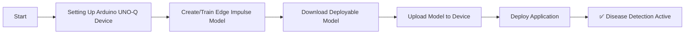
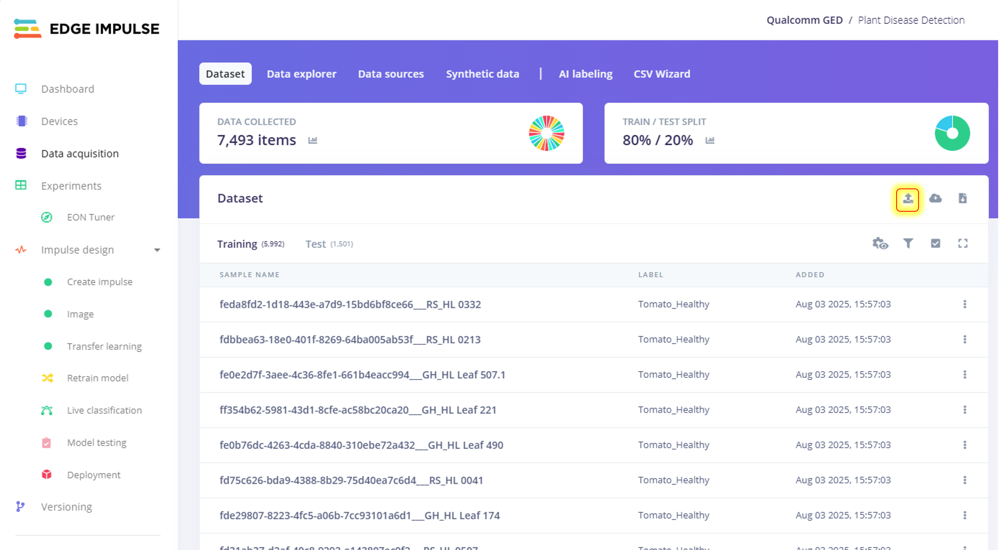
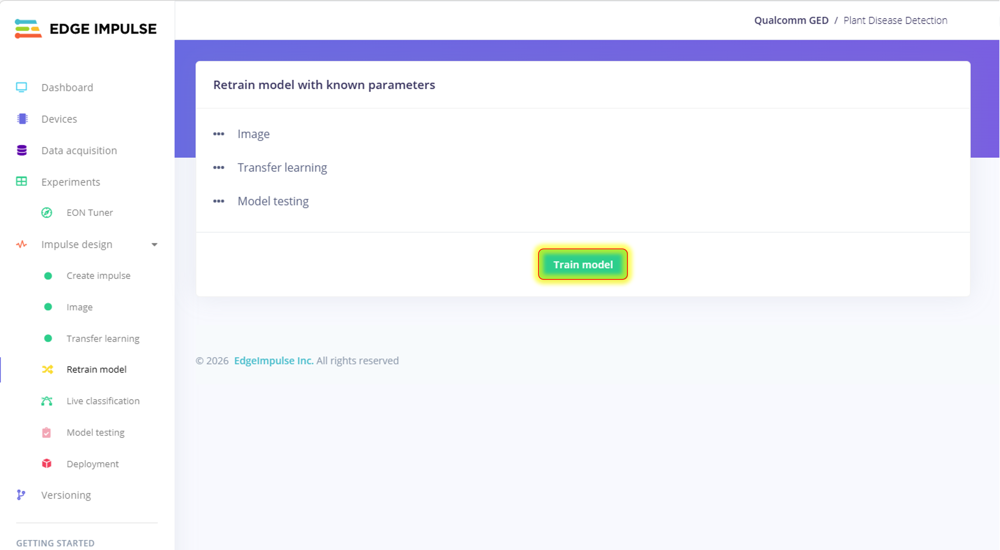
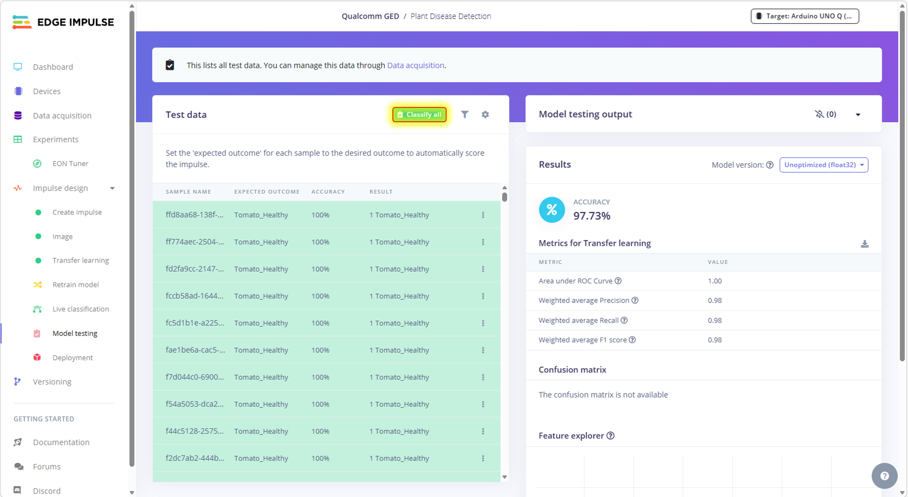
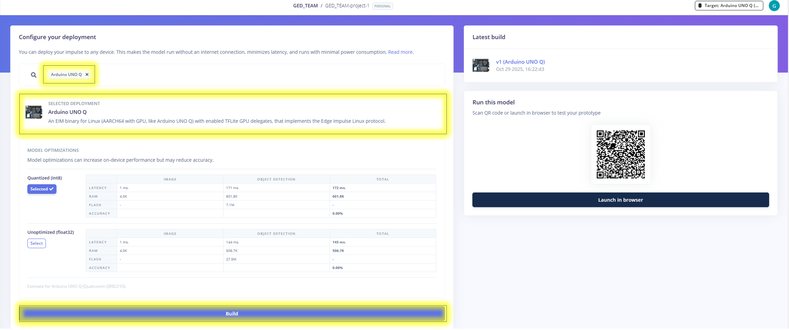
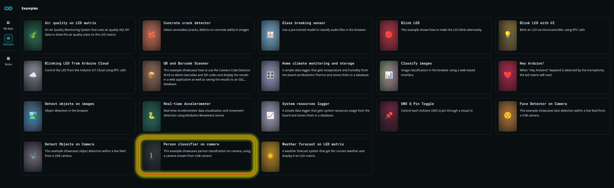
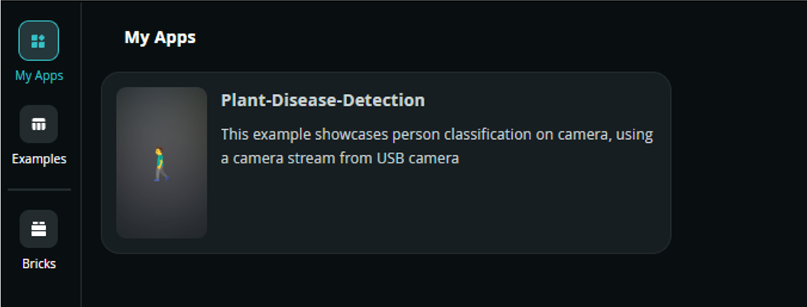
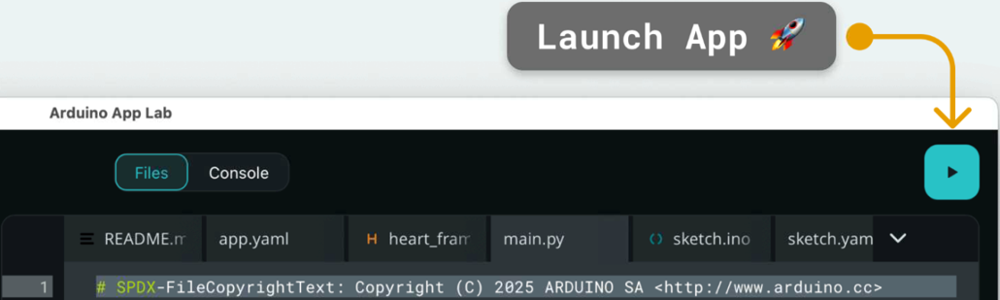

# [Startup_Demo](../../../)/[CV_VR](../../)/[IoT-Robotics](../)/[Plant_Disease_Detection](./)

# Plant Disease Detection with Arduino UNO Q

## Table of Contents
- [1. Overview](#1-overview)
- [2. Classification Scenarios](#2-classification-scenarios)
- [3. Requirements](#3-requirements)
  - [3.1 Hardware](#31-hardware)
  - [3.2 Software](#32-software)
- [4. Plant Disease Detection Workflow](#4-plant-disease-detection-workflow)
- [5. Setup Instructions](#5-setup-instructions)
  - [5.1 Setting Up Visual Studio Code (VS Code)](#51-setting-up-visual-studio-code-vs-code)
  - [5.2 Setting Up Arduino App Lab](#52-setting-up-arduino-app-lab)
  - [5.3 Setting Up Arduino Flasher Cli](#53-setting-up-arduino-flasher-cli)
  - [5.4 Setting Up Arduino UNO-Q Device](#54-setting-up-arduino-uno-q-device)
- [6. Get the Model from Edge Impulse](#6-get-the-model-from-edge-impulse)
  - [6.1 Setup an Edge Impulse Account](#61-setup-an-edge-impulse-account)
  - [6.2 Clone the Edge Impulse Project](#62-clone-the-edge-impulse-project)
- [7. Dataset Collection and Training](#7-dataset-collection-and-training)
  - [7.1 Download the Dataset](#71-download-the-dataset)
- [8. Uploading the Dataset and Retraining the Model in Edge Impulse (Optional Step to train the model with new dataset)](#8-uploading-the-dataset-and-retraining-the-model-in-edge-impulse-optional-step-to-train-the-model-with-new-dataset)
- [9. Build and Download Deployable Model](#9-build-and-download-deployable-model)
- [10. Prepare the Application](#10-prepare-the-application)
  - [10.1 Copy Existing Video Classification on Camera Application](#101-copy-existing-video-classification-on-camera-application)
  - [10.2 Upload Model to the Device](#102-upload-model-to-the-device)
  - [10.3 Clone the Plant Disease Detection Application](#103-clone-the-plant-disease-detection-application)
  - [10.4 Modify the Sketch File](#104-modify-the-sketch-file)
  - [10.5 Modify the Main Python File](#105-modify-the-main-python-file)
- [11. Run the Plant Disease Detection Application](#11-run-the-plant-disease-detection-application)
  - [11.1 Demo Output](#111-demo-output)

## 1. Overview

The **Plant Disease Detection** demo showcases the edge AI capabilities of the **Arduino® UNO Q** using a trained model from **Edge Impulse**. This application enables real-time detection and classification of plant diseases from a live video feed captured by a USB webcam, with audible alerts via a buzzer when diseases are detected.

- 📷 **Live Disease Detection**: Continuously captures frames from a USB camera and classifies plant diseases using a pre-trained AI model.
- 🧠 **AI-Powered Processing**: Utilizes the `video_imageclassification` Brick to analyze video frames and identify plant diseases.
- 🌐 **Web-Based Interface**: Managed through a web interface for seamless control and monitoring.
- 🔊 **Buzzer Alert System**: Activates buzzer for 5 seconds when a disease is detected.
- 🎯 **24 Classification Scenarios**: Detects 16 different diseases and 8 healthy plant states across 8 plant types.

> **Important:** This demo must be run in **Network Mode or SBC** within the Arduino App Lab.

This demonstration highlights how the Arduino UNO Q can be paired with a USB webcam to perform edge AI tasks such as plant disease detection. It exemplifies the integration of Edge Impulse models with Arduino hardware for intelligent, real-time computer vision applications in agriculture.

## 2. Classification Scenarios

The application supports **24 different classification scenarios** across 8 plant types:

### 🍎 Apple (3 scenarios)
1. **Apple_Black_Rot** - Fungal disease causing dark, circular lesions on fruit and leaves
2. **Apple_Scab** - Fungal disease with olive-green to brown lesions on leaves and fruit
3. **Apple_Healthy** - Healthy apple plant with no visible disease symptoms

### 🌶️ Bell Pepper (2 scenarios)
4. **Bell_Pepper_Bacterial_Spot** - Bacterial disease causing leaf spots and fruit lesions
5. **Bell_Pepper_Healthy** - Healthy bell pepper plant

### 🍒 Cherry (2 scenarios)
6. **Cherry_Powdery_Mildew** - Fungal disease causing white powdery growth on leaves
7. **Cherry_Healthy** - Healthy cherry plant

### 🌽 Corn (3 scenarios)
8. **Corn_Common_Rust** - Fungal disease causing rust-colored pustules on leaves
9. **Corn_Northern_Leaf_Blight** - Fungal disease with long, elliptical lesions
10. **Corn_Healthy** - Healthy corn plant

### 🍇 Grape (3 scenarios)
11. **Grape_Black_Rot** - Fungal disease affecting leaves, shoots, and fruit
12. **Grape_Leaf_Blight** - Fungal disease causing leaf spots and blight
13. **Grape_Healthy** - Healthy grape plant

### 🍅 Tomato (3 scenarios)
14. **Tomato_Late_Blight** - Devastating fungal-like disease with water-soaked lesions
15. **Tomato_Mosaic_Virus** - Viral disease causing mottled leaves and stunted growth
16. **Tomato_Healthy** - Healthy tomato plant

### 🥔 Potato (3 scenarios)
17. **Potato_Late_Blight** - Devastating fungal-like disease with water-soaked lesions
18. **Potato_Early_Blight** - Fungal disease causing dark brown spots with concentric rings
19. **Potato_Healthy** - Healthy potato plant

### 🍓 Strawberry (2 scenarios)
20. **Strawberry_Scorch** - Fungal disease causing leaf scorch and browning
21. **Strawberry_Healthy** - Healthy strawberry plant

### Detection Features
- **Minimum Confidence**: 50% threshold for disease detection
- **Debouncing**: Requires 3 consecutive frames for stable classification
- **Timeout**: Resets to "Unknown" after 1 second of no detection
- **Buzzer Alert**: 5-second alert when disease is detected (not triggered for healthy states)

## 3. Requirements

### 3.1 Hardware

- **[Arduino® UNO Q](../../../Hardware/Arduino_UNO-Q.md#arduino-uno-q)**
- **Modulino Buzzer** (for audio alerts)
- USB camera (x1)
- USB-C® hub adapter with external power (x1)
- A power supply (5 V, 3 A) for the USB hub (e.g., a phone charger)
- Personal computer (x86/AMD64) with internet access

### 3.2 Software

- Arduino App Lab
- Edge Impulse
- Bricks
- VS Code

## 4. Plant Disease Detection Workflow



## 5. Setup Instructions

Before proceeding further, please ensure that **all the setup steps outlined below are completed in the specified order**. These instructions are essential for configuring the various tools required to successfully run the application.

### 5.1 Setting Up Visual Studio Code (VS Code)

Visual Studio Code is the recommended IDE for editing, debugging, and managing the project's source code.

For detailed steps, refer to the internal documentation:
[Set up VS Code](../../../Tools/Software/VScode_Setup/README.md#34-configure-ssh)

### 5.2 Setting Up Arduino App Lab

Arduino App Lab enables you to create and deploy Apps directly on the Arduino® UNO Q board.

For detailed steps, refer to the documentation: 
[Set up Arduino App Lab](../../../Tools/Software/Arduino_App_Lab/README.md#4-installation)

### 5.3 Setting Up Arduino Flasher Cli

Arduino Flasher CLI provides a streamlined way to flash Linux images onto your Arduino UNO Q board.

For detailed steps, refer to the documentation: 
[Arduino Flasher CLI](../../../Hardware/Arduino_UNO-Q.md#flashing-a-new-image-to-the-uno-q)

### 5.4 Setting Up Arduino UNO-Q Device

Arduino UNO-Q must be properly configured to ensure reliable communication with the host system.

For detailed steps, refer to the documentation: 
[Set up Arduino UNO-Q](../../../Hardware/Arduino_UNO-Q.md#uno-q-as-a-single-board-computer)

## 6. Get the Model from Edge Impulse

Edge Impulse empowers you to build datasets, train machine learning models, and optimize libraries for deployment directly on-device.

Click here to know more about [Edge Impulse](../../../Tools/Software/Edge_Impluse/README.md)

### 6.1 Setup an Edge Impulse Account

An Edge Impulse account is required to access the platform's full suite of tools for building, training, and deploying machine learning models.

Follow the instructions to sign up: 
[Signup Instructions](../../../Tools/Software/Edge_Impluse/README.md#22-login-or-signup)

### 6.2 Clone the Edge Impulse Project

Cloning an Edge Impulse project allows you to replicate existing machine learning workflows, datasets, and configurations for customization or deployment on the Arduino UNO Q. Please follow the setup instructions carefully to ensure proper synchronization and compatibility with your device.

Clone the Industrial plant disease detection project [Plant disease detection](https://studio.edgeimpulse.com/public/940384/live)

For detailed steps, refer to the documentation: 
[Clone Project](../../../Tools/Software/Edge_Impluse/README.md#29-clone-project-repository)

## 7. Dataset Collection and Training

This section explains how to prepare, convert, and upload a dataset into Edge Impulse Studio for model training.

### 7.1 Download the Dataset

You'll need to collect or download datasets for all 24 classification scenarios. Here are some recommended sources:

#### Plant Disease Datasets:
- **PlantVillage Dataset**: Comprehensive dataset with multiple plant diseases
  - [PlantVillage on Kaggle](https://www.kaggle.com/datasets/emmarex/plantdisease)
- **Plant Pathology Dataset**: High-quality images of plant diseases
  - [Plant Pathology 2020](https://www.kaggle.com/c/plant-pathology-2020-fgvc7)

#### Specific Disease Datasets:
- **Apple Diseases**: Search for apple scab and black rot datasets
- **Tomato Diseases**: Late blight and mosaic virus datasets
- **Corn Diseases**: Common rust and northern leaf blight datasets
- **Grape Diseases**: Black rot and leaf blight datasets
- **Bell Pepper Diseases**: Bacterial spot datasets

⚠️ **Disclaimer:** Please review and comply with each dataset's license terms and conditions before accessing, using, or redistributing the data.

#### Dataset Organization:
Organize your dataset into folders matching the classification labels:
```
Dataset/
├── Apple_Black_Rot/
├── Apple_Scab/
├── Apple_Healthy/
├── Bell_Pepper_Bacterial_Spot/
├── Bell_Pepper_Healthy/
├── Cherry_Powdery_Mildew/
├── Cherry_Healthy/
├── Corn_Common_Rust/
├── Corn_Northern_Leaf_Blight/
├── Corn_Healthy/
├── Grape_Black_Rot/
├── Grape_Leaf_Blight/
├── Grape_Healthy/
├── Tomato_Late_Blight/
├── Tomato_Mosaic_Virus/
├── Tomato_Healthy/
├── Potato_Late_Blight/
├── Potato_Early_Blight/
├── Potato_Healthy/
├── Strawberry_Scorch/
└── Strawberry_Healthy/
```

## 8. Uploading the Dataset and Retraining the Model in Edge Impulse (Optional Step to train the model with new dataset)
This section provides instructions for uploading a new dataset and retraining the model in Edge Impulse Studio. This step is optional but useful when you want to enhance the model's performance with additional data or customize it for specific use cases.

> **Note:** If you are using the pre-trained model provided in the project, you can skip this section. However, if you wish to customize or improve the model with your own dataset, proceed with the following steps.

### Step 1: Upload Dataset to Edge Impulse

1. Go to your Edge Impulse project
2. Navigate to **Data acquisition** tab
3. Click **Upload data**
4. Select your organized dataset folders
5. Ensure each image is labeled correctly according to the folder name



### Step 2: Retrain  the Model

1. Go to **Transfer Learning** under Impulse design
2. Click **Start training**
3. Wait for training to complete
4. Review accuracy metrics



### Step 3: Test the Model

1. Go to **Model testing** tab
2. Click **Classify all**
3. Review classification accuracy for each scenario
4. If accuracy is low, consider:
   - Adding more training data
   - Adjusting training parameters
   - Using data augmentation



## 9. Build and Download Deployable Model

Edge Impulse allows you to build optimized machine learning models tailored for deployment on the Arduino UNO Q.

### Build Steps:

1. Navigate to **Deployment** tab in Edge Impulse Studio
2. Select **Ardduino UNO Q** as the deployment target
3. Click **Build** to create the deployable model
4. The model will automatically download as a `.eim` file



For detailed steps, refer to the documentation: 
[Build and Deploy Model](../../../Tools/Software/Edge_Impluse/README.md#28-download-deployable-model)

## 10. Prepare the Application

### 10.1 Copy Existing Video Classification on Camera Application

Arduino App Lab provides a ready-to-use Video Image Classification on Camera application that can be copied and customized for your specific use case. This section will guide you through duplicating the existing application, modifying its components, integrating Edge Impulse models, and tailoring the classification logic to suit your deployment on the Arduino UNO Q.

In this example, we are using the Person classifer on Camera application for Plant Disease Detection.



Click on the Copy and Edit button to modify the application and name it Plant Disease Detection.

 

 For detailed steps, refer to the documentation: 
[Copy and Edit Existing Sample]( ../../../Tools/Software/Arduino_App_Lab/README.md#duplicate-an-existing-example)

### 10.2 Upload Model to the Device

After obtaining the deployable model from [Section 9](#9-build-and-download-deployable-model), upload it to the Arduino UNO Q using one of the following options:

**Option 1: Manual Upload via SSH or File Transfer**
1. Connect to your Arduino UNO Q via SSH or file transfer
2. Upload the `.eim` file to: `/home/arduino/.arduino-bricks/ei-models/plant-disease-detection-linux-aarch64-v1.eim`

**Option 2: Upload via Arduino App Lab UI**
- Use the Arduino App Lab UI to upload the model directly to the device

For detailed steps, refer to the documentation: 
[Upload Model](../../../Tools/Software/Arduino_App_Lab/README.md#upload-model-to-device)

### 10.3 Clone the Plant Disease Detection Application

This section will guide you through cloning the Plant Disease Detection application from the repository, modifying its components, and deploying it to your Arduino UNO Q device.

#### Steps

1. **Create your working directory**:

```bash
mkdir my_working_directory
cd my_working_directory
```

2. **Download the Application**:

Clone the Plant Disease Detection application from the repository to get started with the project. This will provide you with all the necessary files including the application code, buzzer control logic, and configuration files needed for plant disease detection.

```bash
cd ~
git clone -n --depth=1 --filter=tree:0 https://github.com/qualcomm/Startup-Demos.git
cd Startup-Demos
git sparse-checkout set --no-cone /CV_VR/IoT-Robotics/plant_disesase_detection/
git checkout
```

3. **Navigate to Application Directory**:

```bash
cd ./CV_VR/IoT-Robotics/plant_disesase_detection/
```

4. **Modify the Configuration Files and Main Functions**:

The `app.yaml` file defines the structure, behavior, and dependencies of your Arduino App Lab application. Modifying this configuration allows you to customize how your app interacts with hardware, integrates Edge Impulse models, and launches on the Arduino UNO Q. This section will guide you through editing key parameters such as bricks, model paths, and runtime settings.

```bash
cp app.yaml /home/arduino/ArduinoApps/Plant_Disease_Detection/
```

### 10.4 Modify the Sketch File

The `sketch.ino` file contains the main program logic for your Arduino App Lab project. It initializes hardware, communicates with bricks defined in `app.yaml`, and runs the primary control loop. This file implements the buzzer control system that alerts users when plant diseases are detected on the Arduino UNO Q.

```bash
cp sketch.ino /home/arduino/ArduinoApps/Plant_Disease_Detection/sketch/
```

### 10.5 Modify the Main Python File

The `main.py` file contains the core Python logic for your Arduino App Lab application. It handles communication with connected bricks, runs Edge Impulse model inference, and processes events coming from the App Lab runtime. Use this file to define custom behaviors, manage data flow, and implement high-level control logic for your application.

```bash
cp main.py /home/arduino/ArduinoApps/Plant_Disease_Detection/python/
```

## 11. Run the Plant Disease Detection Application

Once your application is configured and deployed in Arduino App Lab, you can run it directly on the Arduino UNO Q.

### Running the Application:

1. Open Arduino App Lab
2. Navigate to your Plant Disease Detection application
3. Click **Run** to start the application
4. The web interface will open showing the live camera feed
5. Point the camera at plants to detect diseases



For detailed steps, refer to the documentation: 
[Run Application](../../../Tools/Software/Arduino_App_Lab/README.md#run-example-apps-in-arduino-app-lab)

### 11.1 Demo Output

When running the application:

#### Web Interface:
- **Live video feed** from the USB camera
- **Classification results** displayed in real-time
- **Confidence scores** for each detection
- **Timestamp** for each classification

#### Buzzer Behavior:
- **Disease Detected**: Buzzer sounds for 5 seconds
- **Healthy Plant**: No buzzer sound
- **Unknown**: No buzzer sound
- **Debouncing**: Same disease won't re-trigger buzzer within 5 seconds

#### Console Output:
```
[INFO] Detection status changed: Unknown -> Tomato_Late_Blight
[INFO] New plant disease detected: Tomato_Late_Blight (confidence: 0.87)
[DEBUG] should_trigger_buzzer -> true (disease: Tomato_Late_Blight, time_since: 0.12s)
Buzzer activated - Disease detected!
```

