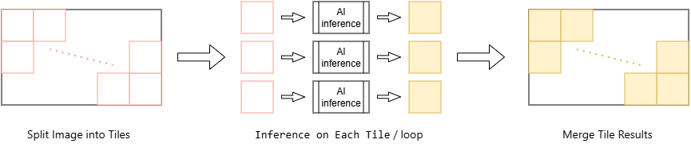
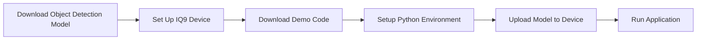
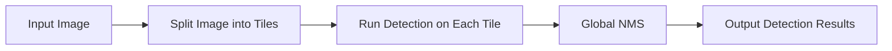
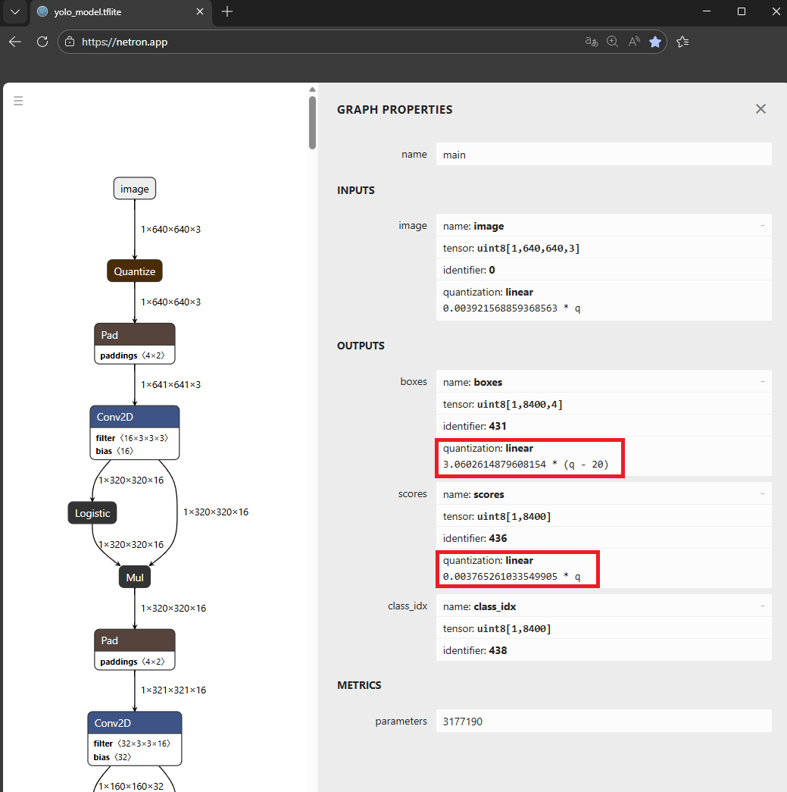
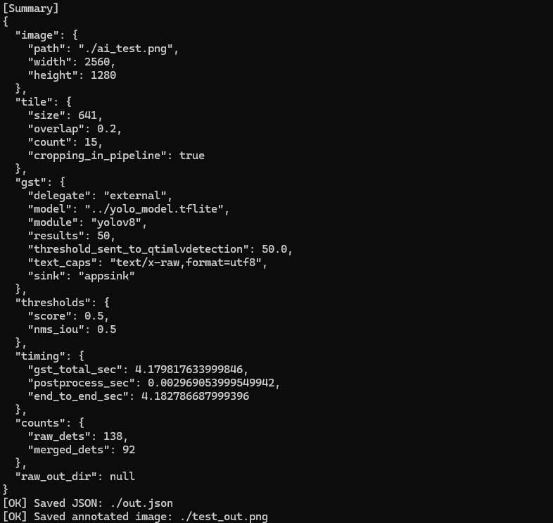

# [Startup_Demo](../../../)/[CV_VR](../../)/[IoT-Robotics](../)/[tile_based_small_object_detection](./)

# Tile-Based Image Processing for Improving Small Object Detection Performance

## Table of Contents
- [1. Overview](#1-overview)
- [2. Workflow Chart](#2-workflow-chart)
  - [2.1 Application Setup Flow](#21-application-setup-flow)
  - [2.2 Application Runtime Flow](#22-application-runtime-flow)
- [3. Prepare the Object Detection Model](#3-prepare-the-object-detection-model)
  - [3.1 Download the Model](#31-download-the-model)
  - [3.2 Download the Label File](#32-download-the-label-file)
- [4. Setup Instructions](#4-setup-instructions)
  - [4.1 Setup IQ9 Device](#41-setup-iq9-device)
  - [4.2 Network Configuration](#42-network-configuration)
  - [4.3 Download Required Files from GitHub](#43-download-required-files-from-github)
  - [4.4 Setup Python Environment](#44-setup-python-environment)
- [5. Upload Model to the Device](#5-upload-model-to-the-device)
- [6. Run the Object Detection Application](#6-run-the-object-detection-application)
  - [6.1 Verify Required Files](#61-verify-required-files)
  - [6.2 Activate Python Environment and Run Application](#62-activate-python-environment-and-run-application)
  - [6.3 Demo Output](#63-demo-output)

## 1. Overview
This demo demonstrates a tile-based image processing pipeline designed to improve small object detection performance on the IQ9 platform.
The pipeline is implemented in Python by constructing a GStreamer-based inference pipeline, where high‑resolution images are split into tiles for more reliable detection of small and densely packed objects.
To better understand the underlying components, please refer to Qualcomm documentation on [Qualcomm GStreamer plugins](https://docs.qualcomm.com/doc/80-80021-50/topic/qim-sdk-plugins.html?product=895724676033554725&facet=Intelligent_Multimedia_SDK.SDK.2.0&version=2.0-rc2).



## 2. Workflow Chart
This section illustrates the workflow from application setup to runtime execution, followed by the internal processing flow of the tile‑based object detection pipeline.
### 2.1 Application Setup Flow
This flow describes the steps required to prepare the environment and launch the demo application on the IQ9 platform.

### 2.2 Application Runtime Flow
This flow shows how the application processes a single input image using a tile‑based inference strategy.


## 3. Prepare the Object Detection Model
Download a pre‑optimized object detection model from **Qualcomm AI Hub**.  
This demo uses **YOLOv8** by default, but other supported object detection models (e.g. **YOLOX**) can also be used.


### 3.1 Download the Model
Since model generation and download involve multiple steps, it is **recommended to perform these operations on a host PC** and then transfer the generated model files to the IQ9 device.

References:
- [Download YOLOv8](https://github.qualcomm.com/Innovationlab/qilab_platform_apps/tree/main/CV_VR/IoT-Robotics/ObjectDetection_on_IoT#211-ai-hub-overview-job-results)
- [Download YOLOX](https://github.qualcomm.com/Innovationlab/qilab_platform_apps/tree/main/CV_VR/IoT-Robotics/Object_detection_via_Tflite_model#5-download-the-model-from-qualcomm-ai-hub)


### 3.2 Download the Label File
The label file can be downloaded from the Qualcomm AI Hub GitHub repository:
- [AI Hub model labels](https://github.com/qualcomm/ai-hub-models/tree/4341d5da006b7aeaa3c11a287ead54d091c4faac/qai_hub_models/labels)

For YOLOv8 or YOLOX models, please download the `coco_labels.txt` file and use it as the label input for this demo


## 4. Setup Instructions

This section describes how to set up the runtime environment on the **IQ9 device**.  
All commands below are executed **directly on the device** to prepare the system, source code, and Python environment before running inference.

Complete all steps in order to ensure the device, dependencies, and runtime are correctly configured.

### 4.1 Setup IQ9 Device

Ensure the IQ9 device is running Ubuntu and has been flashed correctly. This guarantees driver compatibility and proper execution of Qualcomm GStreamer plugins.

References:
- [Qualcomm Dragonwing IQ-9075 Evaluation Kit quickstart – Ubuntu](https://docs.qualcomm.com/doc/80-90441-252/topic/iq9-ubuntu-qsg-landing-page-1.html?product=1601111740076074&facet=Ubuntu%20quickstart)

### 4.2 Network Configuration

Configure network connectivity so the device can install packages and access required repositories.

Example (connect to Wi‑Fi):
```
# On device
nmcli device wifi list
sudo nmcli device wifi connect <SSID> password <PASSWORD>
```

### 4.3 Download Required Files from GitHub
Download only the files required for this demo using Git sparse checkout to minimize disk usage.
```
# On device
cd /home/ubuntu/
git clone -n --depth=1 --filter=tree:0 https://github.com/qualcomm/Startup-Demos.git
cd Startup-Demos
git sparse-checkout set --no-cone /CV_VR/IoT-Robotics/tile-based-small-object-detection/
git checkout
```

### 4.4 Setup Python Environment 
Navigate to the downloaded project directory and create a Python virtual environment.
Install the required GStreamer runtime libraries and Python venv support.
These are system packages and must be installed via `apt` before setting up the Python environment.

```
# On device
cd /home/ubuntu/Startup-Demos/CV_VR/IoT-Robotics/tile-based-small-object-detection/
sudo apt update && sudo apt upgrade -y
sudo apt install -y \
  python3-gi \
  gir1.2-gstreamer-1.0 \
  gir1.2-gst-plugins-base-1.0 \
  gstreamer1.0-tools \
  gstreamer1.0-plugins-base \
  gstreamer1.0-plugins-good \
  gstreamer1.0-qcom-sample-apps \
  python3.12-venv
```
All Python dependencies are managed in a single virtual environment
using requirements.txt. The --system-site-packages flag is used so that the system-installed python3-gi (GObject Introspection bindings) remains accessible
inside the virtual environment.
```
# On device
cd /home/ubuntu/Startup-Demos/CV_VR/IoT-Robotics/tile-based-small-object-detection/
python3 -m venv --system-site-packages env
source env/bin/activate
pip install -r requirements.txt
```
References:
- [Virtual Environments](https://github.qualcomm.com/Innovationlab/qilab_platform_apps/tree/main/Tools/Software/Python_Setup#4-virtual-environments)

## 5. Upload Model to the Device

In this step, transfer the generated model and label file from the **host PC** to the IQ9 device so they can be loaded at runtime.
```
# On host
scp <model> root@<device_ip>:<device_path>
```
Upload location:
`/home/ubuntu/Startup-Demos/CV_VR/IoT-Robotics/tile-based-small-object-detection/`

## 6. Run the Object Detection Application

This section describes how to verify the deployment and execute the object detection pipeline on the IQ9 device.

### 6.1 Verify Required Files

Confirm that all required files are present in the application directory before execution.
```
/home/.../tile-based-small-object-detection/
├─ main.py
├─ lib.py
├─ test.png
├─ labels.label
└─ model.tflite
```

### 6.2 Activate Python Environment and Run Application
Activate the Python virtual environment and start the application.
This will launch the Python‑based GStreamer pipeline for tile‑based object detection.
```
# On device
cd /home/ubuntu/Startup-Demos/CV_VR/IoT-Robotics/tile-based-small-object-detection/
source env/bin/activate
```
The command must specify the input image, model file, label file, and the constants required by the detection model. 
Example Command:
```
# On device
python main.py \
  --image ./Images/test.png \
  --model ./yolov8.tflite \
  --labels ./yolov8.labels \
  --module yolov8 \
  --constants "YOLOv8,q-offsets=<20.0, 0.0, 0.0>,q-scales=<3.0602614879608154, 0.003765261033549905, 1.0>;"
```
The `--constants` argument specifies model‑specific quantization parameters and follows the format:
`<model>,q-offsets=<...>,q-scales=<...>;`
The model name should match the selected parser (e.g. `YOLOv8` or `YOLOX`).  
The values for `q-offsets` and `q-scales` can be obtained by opening the model file in [Netron](https://netron.app/) and inspecting the corresponding output tensor parameters.

References:[Deploy On-Device: Detailed Steps](https://github.qualcomm.com/Innovationlab/qilab_platform_apps/tree/main/CV_VR/IoT-Robotics/ObjectDetection_on_IoT#312-deploy-on-device-detailed-steps)


In addition to the required arguments, various runtime parameters can be configured via command‑line options, such as module, tile size, tile overlap ratio, score threshold, NMS thresholds, and other inference‑related settings.
If the application runs successfully, the following information will be printed in the terminal.


### 6.3 Demo Output
The following image shows an example of the object detection result generated by the application.


