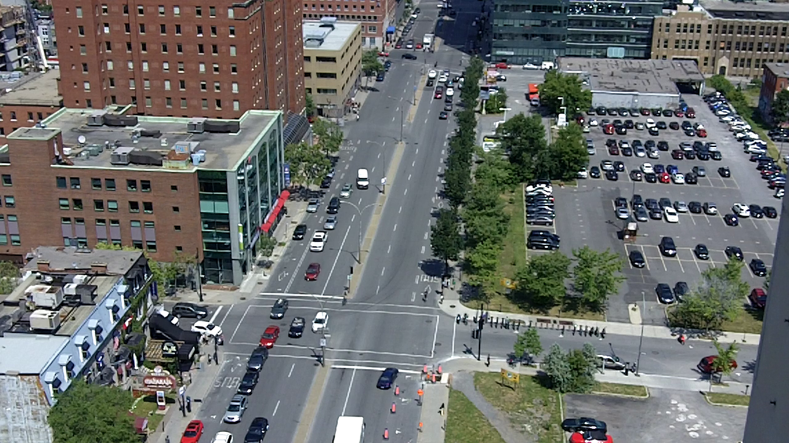
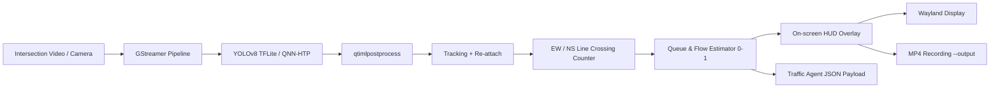

# [Startup_Demo](../../../)/[CV_VR](../../)/[IoT-Robotics](../)/[traffic_intersection_analytics](./)
# RB3 Intersection Traffic Flow & Queue Measurement Demo

## Table of Contents
- [1. Overview](#1-overview)
- [2. System Workflow](#2-system-workflow)
- [3. Setting Up RB3 Gen2 Device](#3-setting-up-rb3-gen2-device)
  - [3.1 RB3 Gen2 Ubuntu Setup Guide](#31-rb3-gen2-ubuntu-setup-guide)
  - [3.2 Device Network ,USB and SSH Setup ssh](#32-device-network-usb-and-ssh-setup-ssh)
- [4. Qualcomm AI Hub & YOLOv8 Model Preparation](#4-qualcomm-ai-hub--yolov8-model-preparation)
- [5. Label Files for Detection Models](#5-label-files-for-detection-models)
- [6. Environment Setup (RB3 Gen2)](#6-environment-setup-rb3-gen2)
  - [6.1 Miniconda Installation on Ubuntu](#61-miniconda-installation-on-ubuntu)
  - [6.2 Source Code Setup Instructions for RB3 Gen2](#62-source-code-setup-instructions-for-rb3-gen2)
- [7. Running the Traffic Intersection Analytics Demo (RB3 Gen2)](#7-running-the-traffic-intersection-analytics-demo-rb3-gen2)
- [8. Demo Output](#8-demo-output)

---



## 1. Overview
This sample demonstrates a **real-time traffic intersection measurement pipeline** running on **Qualcomm RB3 Gen2**, including vehicle detection, tracking, directional flow counting, and queue estimation.

> ⚠️ **Important Note (Model Accuracy)**  
> This sample uses a **general YOLOv8 detection model from Qualcomm AI Hub**. If higher accuracy is required (for different camera angles, lane layouts, lighting conditions, or vehicle types), you should **re-train or fine-tune YOLOv8 using your own dataset**, then convert and replace the TFLite model accordingly.

> ⚠️ **Design Note (Measurement Only)**  
> The RB3 side performs **measurement only** (queue / flow). Traffic congestion judgment, signal timing, and control policy decisions are intentionally left to an external traffic agent.

---

## 2. System Workflow


---

## 3. Setting Up RB3 Gen2 Device

To set up the RB3 Gen2 device, it is essential to ensure that all necessary hardware components are properly connected and configured.

Configure the RB3 Gen2 device in Linux-based environment correctly, refer to the [RB3 Gen2 Device Setup Guide](https://docs.qualcomm.com/doc/80-90441-1/topic/qsg-landing-page.html?product=1601111740013077&facet=Ubuntu%20quickstart) for a comprehensive overview of the setup process.

To ensure the proper functioning of the application, follow the guides below and complete `sections 3.1 and 3.2`. It is crucial to highlight each step and complete it before moving on to the next one. By doing so, you will be able to successfully set up the device and proceed with the application setup. This will involve carefully following the instructions for setting up the RB3 Gen2 device, including the Ubuntu setup guide and device network, USB, and SSH setup.

## 3.1 RB3 Gen2 Ubuntu Setup Guide

1. **Requirements**: Ensure you have all the necessary hardware and software components as specified in the [Requirements](../../../Hardware/IoT-Robotics/RB3-Gen2.md#2-requirements) section, Additionally needed One Micro-USB to USB Type-A cable for the UART debug port
2. **Tools Installation**: Install the required tools and software as described in the [Tools Installation](../../../Hardware/IoT-Robotics/RB3-Gen2.md#3-tools-installation) section, Additionally need to install [Putty](https://www.putty.org/) and configured the debug UART.
3. **Download the Ubuntu OS image and boot firmware**: Download the ubuntu os image and firmware 24.04 version as outlined in the [Download OS Image and Boot Firmware](https://docs.qualcomm.com/doc/80-90441-1/topic/Integrate_and_flash_software_2.html?product=1601111740013077&facet=Ubuntu%20quickstart#panel-0-0-0tab$download-the-ubuntu-os-image-and-boot-firmware) section.

### List of Downloadable Files

- [Download Ubuntu raw image](https://people.canonical.com/~platform/images/qualcomm-iot/ubuntu-24.04/ubuntu-24.04-x06/ubuntu-server-24.04/iot-qualcomm-dragonwing-classic-server-2404-x06-20251024.img.xz)
- [Download Boot Firmware](https://artifacts.codelinaro.org/artifactory/qli-ci/flashable-binaries/ubuntu-fw/QCM6490/QLI.1.5-Ver.1.1/QLI.1.5-Ver.1.1-ubuntu-nhlos-bins.tar.gz)
- [Download dtb.bin file](https://people.canonical.com/~platform/images/qualcomm-iot/ubuntu-24.04/ubuntu-24.04-x06/ubuntu-server-24.04/dtb.bin)
- [Download Partition file](https://people.canonical.com/~platform/images/qualcomm-iot/ubuntu-24.04/ubuntu-24.04-x06/ubuntu-server-24.04/rawprogram0.xml) (Right click and save the file as rawprogram0.xml)

4. **Integrate flashable images on Windows host**: Integrate flashable images as described in the [Integrate Flashable Images ](https://docs.qualcomm.com/doc/80-90441-1/topic/Integrate_and_flash_software_2.html?product=1601111740013077&facet=Ubuntu%20quickstart#panel-0-v2luzg93cybob3n0tab$integrate-flashable-images-on-windows-host) section.
5. **Flash RB3 Gen 2 on Windows host**: Flash RB3 Gen 2 on Windows host as described in the [Flash RB3 Gen 2 on Windows host](https://docs.qualcomm.com/doc/80-90441-1/topic/Integrate_and_flash_software_2.html?product=1601111740013077&facet=Ubuntu%20quickstart#panel-0-v2luzg93cybob3n0tab$flash-rb3-gen-2-on-windows-host) section.

## 3.2 Device Network ,USB and SSH Setup ssh

To configure the RB3 Gen2 device correctly, refer to the [Use Ubuntu on RB3 Gen2](https://docs.qualcomm.com/doc/80-90441-1/topic/Use_Ubuntu_on_RB3_Gen2_3.html?product=1601111740013077&facet=Ubuntu%20quickstart) for a comprehensive overview of the setup process, which includes detailed instructions on network connection, USB setup, and SSH setup, ensuring a proper and successful configuration of the device.

1. **Verify reboot and log in to the RB3 Gen2 Ubuntu console**: After flashing the device, it is crucial to verify that the RB3 Gen2 reboots correctly and that you can successfully log in to the Ubuntu console,as outlined in the [Verify reboot and log in to RB3 Gen2](https://docs.qualcomm.com/doc/80-90441-1/topic/Use_Ubuntu_on_RB3_Gen2_3.html?product=1601111740013077&facet=Ubuntu%20quickstart#verify-reboot-and-sign-in-to-the-rb3-gen-2-ubuntu-console) section.
2. **Wifi-Setup**: To ensure seamless connectivity, update the device software to the latest version as outlined in the [WiFi-Setup](https://docs.qualcomm.com/doc/80-90441-1/topic/Use_Ubuntu_on_RB3_Gen2_3.html?product=1601111740013077&facet=Ubuntu%20quickstart#access-ubuntu-and-update-packages) section.
3. **Activate Renesas USB hub**: Activating the Renesas USB hub is necessary to enable USB connectivity on the device. Refer to the [Activate Renesas USB hub](https://docs.qualcomm.com/doc/80-90441-1/topic/Use_Ubuntu_on_RB3_Gen2_3.html?product=1601111740013077&facet=Ubuntu%20quickstart#activate-renesas-usb-hub) section.
4. **How to use SSH**: Configuring SSH on the device enables secure remote access, allowing you to access the device remotely. and it is outlined in the [How to use SSH](https://docs.qualcomm.com/doc/80-90441-1/topic/Use_Ubuntu_on_RB3_Gen2_3.html?product=1601111740013077&facet=Ubuntu%20quickstart#sign-in-to-the-rb3-gen-2-console-using-ssh) section.
5. **Enable display and camera**: set up the display and camera interfaces on your RB3 Gen 2 device to begin visual output and image capture [Enable display and camera](https://docs.qualcomm.com/doc/80-90441-1/topic/Use_Ubuntu_on_RB3_Gen2_3.html?product=1601111740013077&facet=Ubuntu%20quickstart#enable-display-and-camera) section.

By following these instructions, you will be able to set up SSH and access the device remotely, which will greatly simplify the development and testing process.

---

## 4. Qualcomm AI Hub & YOLOv8 Model Preparation

**Qualcomm AI Hub** provides pre-optimized models and tools for deploying AI workloads on Qualcomm platforms.

- Website: https://aihub.qualcomm.com/?cmpid=pdsrc-yEUgLjFVt5&utm_medium=pdsrc&utm_source=AW&utm_campaign=FY26_AIHub

### Using YOLOv8 from AI Hub

You can obtain a ready-to-use **YOLOv8 detection model** from AI Hub and use it directly on RB3 Gen2.

Official YOLOv8 model repository:
- https://github.com/qualcomm/ai-hub-models/tree/main/qai_hub_models/models/yolov8_det

### Converting Your Own Trained YOLOv8 Model

If you already have a **custom-trained YOLOv8 PyTorch (.pt) model**, you can follow the link for these steps below: 
https://workbench.aihub.qualcomm.com/docs/hub/compile_examples.html#compiling-pytorch-to-tflite

1. Export the model from PyTorch
2. Convert it to TensorFlow / TensorFlow Lite
3. Apply optimization and quantization
4. Deploy the optimized TFLite model on RB3 Gen2

Please refer to the AI Hub documentation and YOLOv8 conversion guides above for the complete workflow.

---

## 5. Label Files for Detection Models

Detection models require a **label file** that maps class indices to human-readable names.

Qualcomm provides guidance on downloading and matching **model files and label files** here:
- https://docs.qualcomm.com/doc/80-70020-50/topic/download-model-and-label-files.html

Make sure that the label file matches the classes used during model training and conversion.

---

## 6. Environment Setup (RB3 Gen2)

The following steps are required to set up the source code for the application on RB3 Gen2.

Login to the RB3 Gen2 Device via SSH or direct terminal access. Ensure that the device is powered on and connected to the network. The default username is `ubuntu` and password is `ubuntu` unless changed. You can also use the IP address of the device to connect via SSH.

## 6.1 Miniconda Installation on Ubuntu

1. **Create your working directory** :
   ```bash
   cd /home/ubuntu/
   mkdir my_working_directory
   cd my_working_directory
   ```
2. **Install the Conda in ubuntu**
   ```bash
   wget https://repo.anaconda.com/miniconda/Miniconda3-latest-Linux-aarch64.sh
   ./Miniconda3-latest-Linux-aarch64.sh
   source ~/.bashrc
   conda tos accept --override-channels --channel https://repo.anaconda.com/pkgs/main
   conda tos accept --override-channels --channel https://repo.anaconda.com/pkgs/r
   ```
3. **Create a new Conda environment** with Python 3.10:
   ```bash
   conda create -n rb3_env python=3.10
   ```

4. **Activate the environment**:
   ```bash
   conda activate rb3_env
   ```

5. **Install the Packages**:
   ```   
   sudo apt install -y build-essential gcc pkg-config python3-dev libcairo2-dev libffi-dev libgirepository1.0-dev meson ninja-build gir1.2-gstreamer-1.0 gstreamer1.0-tools git
   ```

## 6.2 Source Code Setup Instructions for RB3 Gen2

1. **Download Your Application** :
   ```bash
    git clone -n --depth=1 --filter=tree:0 https://github.com/qualcomm/Startup-Demos.git
    cd Startup-Demos
    git sparse-checkout set --no-cone /CV_VR/IoT-Robotics/traffic_intersection_analytics/
    git checkout
   ```
   
2. **Navigate to Application Directory** :
   ```bash
   cd ./CV_VR/IoT-Robotics/traffic_intersection_analytics/
   ```

3. **Install the required dependencies**:
   ```bash
   pip install -r requirements.txt
   ```


---

## 7. Running the Traffic Intersection Analytics Demo (RB3 Gen2)
```bash
python3 rb3_intersection_traffic_measure.py \
  --input /your_input/input.mp4 \
  --model /etc/models/yolov8_det_quantized.tflite \
  --labels /etc/labels/coco_labels.txt \
  --x-v 0.43 \
  --y-h 0.70 \
  --v-ymin 0.58 \
  --v-ymax 0.88 \
  --h-xmin 0.30 \
  --h-xmax 0.95 \
```

---

## 8. Demo Output
- Real-time bounding boxes and track IDs
- Yellow virtual counting lines for EW / NS
- HUD showing queue / flow values (measurement only)


---

