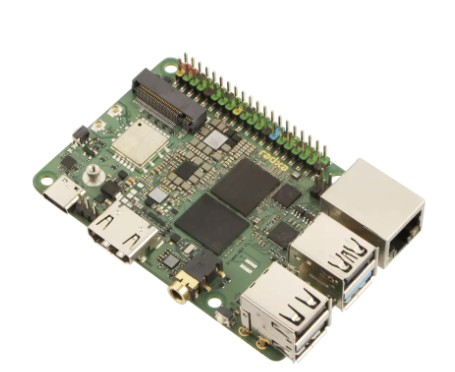
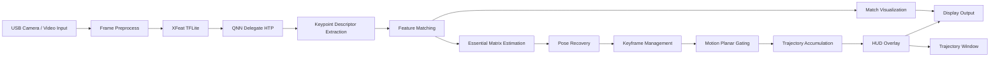

# [Startup_Demo](../../../)/[CV_VR](../../)/[IoT-Robotics](../)/[vslam-npu-6490](./)

## Visual SLAM Demo on QCS6490 (Monocular VO with NPU Acceleration)

### Table of Contents
- [1. Overview](#1-overview)
- [2. System Workflow](#2-system-workflow)
- [3. Hardware Setup](#3-hardware-setup)
- [4. Software & SDK Setup](#4-software--sdk-setup)
- [5. Model Preparation](#5-model-preparation)
- [6. Environment Setup](#6-environment-setup)
- [7. Running the Demo](#7-running-the-demo)
- [8. Demo Output](#8-demo-output)

---



## 1. Overview

This sample demonstrates a **real-time Visual SLAM (monocular Visual Odometry) pipeline** running on **Radxa Dragon Q6A (QCS6490 platform)**.

The system leverages:

- ✅ XFeat-based feature extraction model
- ✅ TFLite + Qualcomm QNN delegate (HTP/NPU acceleration)
- ✅ Real-time feature matching and pose estimation
- ✅ Live trajectory visualization

> ⚠️ Important Notes
> - Monocular system → trajectory is up-to-scale
> - No loop closure → long-term drift is expected
> - Designed for demo / reference use case

---

## 2. System Workflow

---

## 3. Hardware Setup

Platform:
Radxa Dragon Q6A (QCS6490)

### Required
- Radxa Dragon Q6A board
- Power supply
- Display
- USB camera (/dev/video*)
- Keyboard & mouse

---

## 4. Software & SDK Setup

### NPU Setup
Follow:
https://docs.radxa.com/dragon/q6a/app-dev/npu-dev/fastrpc-setup

Purpose:
- Enable communication between CPU ↔ DSP/NPU
- Required for QNN delegate

### TFLite Delegate Validation
Follow:
https://docs.radxa.com/dragon/q6a/app-dev/npu-dev/tflite-delegate-demo

Purpose:
- Ensure TFLite + QNN delegate is working
- Validate NPU execution path

---

## 5. Model Preparation

Refer to:
https://github.com/qualcomm/Startup-Demos/tree/main/CV_VR/IoT-Robotics/xfeat_qcs6490#3model-conversion-overview

This includes:
- PyTorch → ONNX → TFLite
- Quantization (INT8 recommended for NPU)

---

## 6. Environment Setup

Create environment:

```bash
python3 -m venv .venv
source .venv/bin/activate
```

**Download Your Application** :
   ```bash
    git clone -n --depth=1 --filter=tree:0 https://github.com/qualcomm/Startup-Demos.git
    cd Startup-Demos
    git sparse-checkout set --no-cone /CV_VR/IoT-Robotics/vslam-npu-6490/
    git checkout
   ```
   
**Navigate to Application Directory** :
   ```bash
   cd ./CV_VR/IoT-Robotics/vslam-npu-6490/
   ```

**Install the required dependencies**:
   ```bash
   pip install -r requirements.txt
   ```

**Put model to folder models**:
   ```bash
   mv xfeat_quant_int8.tflite models/
   ```

---

## 7. Running the Demo

```bash

python3 xfeat_vo_tflite_delegate.py \
  --model ./models/xfeat_quant_int8.tflite \
  --backend htp \
  --delegate_path libQnnTFLiteDelegate.so \
  --camera_index 2 \
  --fov_deg 110

```

**Recommended Parameters (Stable Demo Mode)**:
```bash
--planar_ratio 2.0 \
--max_median_flow 50 \
--max_rot_deg 35 \
--kf_parallax_px 40 \
--display_scale 1.1

```

---

## 8. Demo Output

Main Window:
- Keypoints (green)
- Matching lines (blue)
- HUD stats

Trajectory Window:
- Real-time camera path
- Auto-centered visualization


---

## Summary

This demo shows a real-time Visual SLAM pipeline using NPU acceleration on QCS6490.
