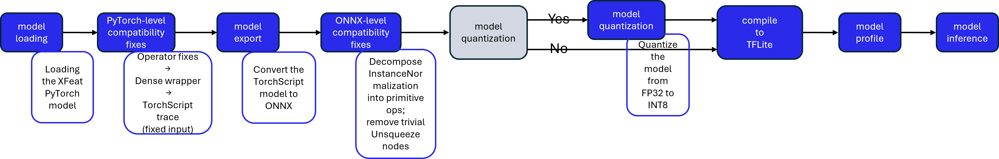
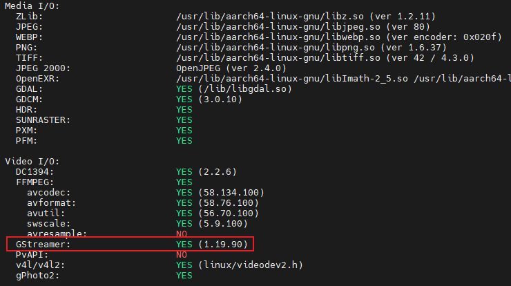

# [Startup_Demo](../../../)/[CV_VR](../../)/[IoT-Robotics](../)/[XFeat Deployment Toolkit for QCS6490](./)

# XFeat Deployment Toolkit for QCS6490

## 📘Table of Contents
- [🚀Overview](#1overview)
- [✨Features](#2features)
- [📘Model Conversion Overview](#3model-conversion-overview)
- [🔧Model Conversion Requirements](#4model-conversion-requirements)
- [🔀Model Export](#5model-export)
- [🔧Inference Requirements](#6inference-requirements)
- [🚀Demo](#7demo)
---

## 1.🚀Overview

This project aims to achieve two main objectives:

- Port the official XFeat model to the Qualcomm platform(QCS6490) via Qualcomm AI Hub, ensuring maximum utilization of NPU acceleration for as many layers as possible.
- Develop an application on the RB3 Gen 2 device that uses the XFeat model for feature point detection.


<div align="center"> <strong> Figure : XFeat Model Integration and Inference Process on RB3 Gen 2  </strong></div>

---

## 2.✨Features

- **End-to-End Model Conversion:** PyTorch → ONNX → (INT8) TFLite via Qualcomm AI Hub with graph optimizations and optional quantization.
- **Compatibility Fixes:** Replace unsupported ops, decompose InstanceNorm, and simplify ONNX graph.
- **Flexible Calibration:** Supports real images, synthetic data, or FP32 mode.
- **Pre-Deployment Profiling:** Validate latency, memory, and NPU utilization before deployment.
- **Realtime Inference on RB3 Gen 2**: MIPI camera input, QNN (HTP) acceleration, and TFLite runtime.

💡*This toolkit is divided into two parts: Chapters 3 to 5, which run on the host machine, and Chapters 6 and 7, which run on the RB3 Gen 2.*
- On the *host machine*, you can run the steps on Windows or Linux systems.
- For *RB3 Gen 2*, simply follow [Chapter 6](#6inference-requirements) to install the environment.

---
## 3.📘Model Conversion Overview

- Model Loading: Loading the XFeat PyTorch model from the [official XFeat open-source repository](https://github.com/verlab/accelerated_features)
- PyTorch-level Compatibility: 
  * ✅ Replace the original InstanceNorm2d operator with a custom implementation to avoid generating unsupported operators during ONNX export.
  * ✅ Wrap the model to ensure that the output has a fixed shape for all dense feature maps (heatmap, descriptor, reliability), which is required for downstream processing.
  * ✅ Perform TorchScript conversion using a fixed input size to maintain consistency during later conversion and deployment stages.
- Model Export: Convert the model from TorchScript format to ONNX format using Qualcomm AI Hub. This step ensures the model is compatible with subsequent optimization, quantization, and deployment stages.
- ONNX-level Compatibility Fixes:
  * ✅ Decompose InstanceNormalization into primitive operations (such as ReduceMean, Sub, Div) to improve compatibility with downstream frameworks.
  * ✅ Remove trivial Unsqueeze nodes that do not affect computation, simplifying the graph and reducing unnecessary complexity.
- Model Quantization: Perform INT8 quantization using Qualcomm AI Hub when calibration mode is enabled.
- Compile the Model to TFLite Format: After quantization (or if using an FP32 model), compile the model into TFLite format using Qualcomm AI Hub and save the output file for deployment.
- Model Profile: Use Qualcomm AI Hub to profile the model and measure key performance metrics such as inference time, peak memory, and hardware utilization (CPU/GPU/NPU).
- Model Inference: Use Qualcomm AI Hub to run inference on the compiled TFLite model. This step validates performance metrics such as minimum inference time and estimated peak memory usage in a controlled environment before deploying to the target device.


<div align="center"> <strong> Figure : XFeat Model Conversion: From Official PyTorch Model to QAI Hub TFLite Model </strong></div><br>

💡*This toolkit will automatically download the official XFeat model, so you don’t need to download it manually. If you want, you can refer to the link below, which is the official XFeat repository.*
👉 [XFeat: Accelerated Features for Lightweight Image Matching](https://github.com/verlab/accelerated_features.git)

---

## 4.🔧Model Conversion Requirements
Follow the instructions below to install Qualcomm AI Hub on the **host machine** before converting your XFeat model using this repository.

### 4.1 Source code setup

```bash
cd ~
git clone -n --depth=1 --filter=tree:0 https://github.com/qualcomm/Startup-Demos.git
cd Startup-Demos
git sparse-checkout set --no-cone /CV_VR/IoT-Robotics/xfeat_qcs6490/
git checkout
```

### 4.2 Follow the link below to install Qualcomm AI Hub on the host machine:
👉 [Qualcomm AI Hub - Get Started](https://aihub.qualcomm.com/get-started)

### 4.3 Install the Python packages using requirements.txt, which contains the dependencies required for model conversion:

```bash
pip install -r model_convert_requirements.txt
```

---
## 5.🔀Model Export
Convert the model by running the following command on the **host machine**:
This script will convert and quantize the XFeat model by default.
```bash
python xfeat_to_qcs6490_tflite.py --calib_mode random --height 480 --width 640 --device "QCS6490 (Proxy)"
```

If you do not want to quantize the model, execute the command below:
```bash
python xfeat_to_qcs6490_tflite.py --calib_mode none --height 480 --width 640 --device "QCS6490 (Proxy)"
```

Or, you can use the following command to view and try other options:
```bash
python xfeat_to_qcs6490_tflite.py --help
```

You can reference the result generated by this script, which converts and quantizes the model and provides profiling results on Qualcomm AI Hub.

---
## 6.🔧Inference Requirements
Follow the steps below to set up the execution environment on the **RB3 Gen 2**.

### 6.1 Follow the official Qualcomm RB3 Gen 2 Dev Kit guide to flash the image
👉 [Qualcomm RB3 Gen 2 Dev Kit Quick Start](https://docs.qualcomm.com/bundle/publicresource/topics/80-82645-1/Integrate_and_flash_software_2.html#panel-0-V2luZG93cyBob3N0)

### 6.2 Follow the official Qualcomm evaluation kit to install the Artificial Intelligence environment
👉 [Qualcomm AI Developer Workflow for Ubuntu](https://docs.qualcomm.com/bundle/publicresource/topics/80-90441-15/sample-app-evk.html)

### 6.3 Install the Python environment and the necessary packages

  1. Install OpenCV with GStreamer support.
     ```sudo apt install python3-opencv```
     Use the following command to verify if GStreamer support is available.
    ```python3 -c "import cv2; print(cv2.getBuildInformation())"```
     
  2. Create a Python virtual environment to install other packages.
     ``` bash
     python3 -m venv xfeat_infer --system-site-packages
     source xfeat_infer/bin/activate
     pip3 install -r inference_requirements.txt
     ```

### 6.4 Use the following command to push the downloaded model files and the Python file to the device
This step is executed on the **host machine** to push the converted model, or the model previously cloned from the repository, along with the Python code (also cloned from the repository) to the **RB3 Gen 2**.

  ```bash
  scp <model filename> ubuntu@<IP addr of the target device>:/home/ubuntu
  ```
  **Example:**
  ```bash
  scp ./xfeat_realtime_inference_qcs6490.py ubuntu@<IP addr of the target device>:/home/ubuntu
  scp ./models/xfeat_fp32.tflite ubuntu@<IP addr of the target device>:/home/ubuntu
  ```

---
## 7.🚀Demo

Use the following command to run the sample application:
```bash
  python3 xfeat_realtime_inference_qcs6490.py \
  --model ./models/xfeat_quant_int8.tflite --backend htp \
  --src qti --width 640 --height 480 \
  --cell 8 --k1-idx 1 --h1-idx 2 \
  --use-reli --reli-act sigmoid \
  --blur 3 --nms 2 --threshold 0.15 \
  --preproc 01 --color-order rgb
```
💡If you don’t have the sample application on the RB3 Gen 2, you can follow [Chapter 4.1](#41-source-code-setup) to clone the repository and then follow [Chapter 6.4](#64-use-the-following-command-to-push-the-downloaded-model-files-and-the-python-file-to-the-device) to push the files.
| Original Picture | Inference Result |
| -- | -- |
|  |  |


💡*This demo uses the RB3 Gen 2 with its original MIPI camera, running a custom XFeat model on Qualcomm Ubuntu 22.04 to execute the demo application.*
