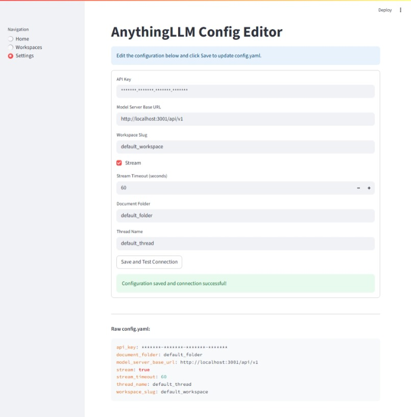

## [Startup_Demo](../../../)/[GenAI](../../)/[AI PC](../)/[AnythingLLMChat_RAG](./)

---

# AnythingLLM Chat + RAG

## Table of Contents
- [1. Overview](#1-overview)
- [2. Features](#2-features)
- [3. Setup Instructions](#3-setup-instructions)
  - [3.1 Miniconda Installation](#31-miniconda-installation)
  - [3.2 Git Configuration](#32-git-configuration)
  - [3.3 AnythingLLM Configuration](#33-anythingllm-configuration)
- [4. Environment Setup](#4-environment-setup)
- [5. Getting API Access](#5-getting-api-access)
  - [5.1 AnythingLLM](#51-anythingllm)
- [6. Usage](#6-usage)
- [7. File Structure](#7-file-structure)
- [8. Run the Application](#8-run-the-application)

---

# 1. Overview

A modular, Streamlit-based LLM chat application with RAG (Retrieval-Augmented Generation) and AnythingLLM API integration. Features robust config management, PDF upload, document and thread management, and a modern UI.

---

## 2. Features
- **Chat with LLM**: Conversational interface with chatbot-style history.
- **RAG (Retrieval-Augmented Generation)**: Query your own documents and PDFs.
- **PDF Upload**: Upload and manage PDFs for context-aware chat.
- **Thread Management**: Create, delete, and reset chat threads.
- **Document Management**: View, clear, and manage uploaded documents.
- **Config Editor**: Edit all app and API settings in a user-friendly UI.
- **Sidebar Navigation**: Switch between Home and Settings pages.

---

# 3. Setup Instructions

Before proceeding further, please ensure that **all the setup steps outlined below are completed in the specified order**. These instructions are essential for configuring the various tools required to successfully run the application.

Each section provides a reference to internal documentation for detailed guidance. Please follow them carefully to avoid any setup issues later in the process.

---

## 3.1 Miniconda Installation

Miniconda is required to manage the application's Python environment and dependencies. Please follow the setup instructions carefully to ensure a consistent and reproducible environment.

For detailed steps, refer to the internal documentation:  
[Set up Miniconda]( ../../../Hardware/Tools.md#miniconda-setup)

## 3.2 Git Configuration

Git is required for version control and collaboration. Proper configuration ensures seamless integration with repositories and development workflows.

For detailed steps, refer to the internal documentation:  
[Setup Git]( ../../../Hardware/Tools.md#git-setup)

## 3.3 AnythingLLM Configuration

AnythingLLM is required as the backend server for this application. You need access to a running AnythingLLM instance to provide the LLM and RAG capabilities.

You can use either a local or remote AnythingLLM server:

- **Local:** Follow the [AnythingLLM installation guide](https://github.com/Mintplex-Labs/anything-llm#installation) to set up and run the server on your machine.
- **Remote:** Obtain the API URL and API key from your administrator.

For detailed setup instructions, refer to the internal documentation:  
[Setup AnythingLLM]( ../../../Hardware/AI_PC/LLMClientSetup.md#anythingllm-setup)

---

# 4. Environment Setup

To set up the Python environment required for running the application, follow the steps below. This ensures all dependencies are installed in an isolated and reproducible environment.

## Steps

1. **Create your working directory**:
   ```bash
   mkdir my_working_directory
   cd my_working_directory
   ```

2. **Download Your Application**:
   ```bash
   git clone -n --depth=1 --filter=tree:0 https://github.com/qualcomm/Startup-Demos.git
   cd Startup-Demos
   git sparse-checkout set --no-cone /GenAI/AI_PC/AnythingLLMChat_RAG
   git checkout
   ```
   
3. **Navigate to Application Directory**:
   ```bash
   cd ./GenAI/AI_PC/AnythingLLMChat_RAG
   ```

4. **Create a new Conda environment** with Python 3.12:
   ```bash
   conda create -n myenv python=3.12
   ```

5. **Activate the environment**:
   ```bash
   conda activate myenv
   ```

6. **Install the required dependencies**:
   ```bash
   pip install -r requirements.txt
   ```

> 💡 Make sure you have Miniconda or Anaconda installed before running these commands.

---

# 5. Getting API Access

To use the application features that rely on external AI services, you need to obtain API keys from the respective platforms. Follow the instructions below for each platform.

Each section provides a reference to internal documentation for detailed guidance. Please follow them carefully to ensure proper API configuration.

---

## 5.1 AnythingLLM

AnythingLLM provides access to various AI models and services through both local and remote configurations. You need to obtain an API key to authenticate your requests and access the available AI capabilities.

For detailed steps to retrieve your API key and configure local LLM setup, refer to the internal documentation:  
[AnythingLLM API Configuration](../../../Hardware/AI_PC/LLMClientSetup.md#anythingllm-api-configuration)

---

# 6. Usage

- **Home**: Chat with the LLM, upload PDFs, manage documents, and reset threads.
- **Settings**: Edit API keys, server URLs, folders, and other config in a UI editor.

The application provides two main interfaces:

1. **Chat Interface (Home)**:
   - Send messages to the LLM and receive responses
   - Upload PDF documents for context-aware conversations
   - View and manage uploaded documents
   - Reset conversation threads when needed

2. **Settings Interface**:
   - Configure API keys and server URLs
   - Set workspace and document folder names
   - Enable/disable streaming responses
   - Adjust timeout settings
   - Test connection to the AnythingLLM server

---

# 7. File Structure

```
requirements.txt
src/
    app_config.yaml        # Application configuration file
    main.py                # Main entry point for the Streamlit app
    llm/
        config_manager.py      # Manages configuration and authentication
        conversation_manager.py # Handles chat threads and history
        document_manager.py     # Manages document uploads and embeddings
        llm_client.py           # Client for AnythingLLM API
        pdf_utils.py            # Utilities for PDF processing
    ui/
        __init__.py
        chat_ui.py              # UI components for chat interface
        config_ui.py            # UI components for settings
        sidebar_ui.py           # UI components for sidebar navigation
```

# 8. Run the Application

To launch the application, execute the following command from the application directory:

```bash
streamlit run src/main.py
```

This will start the interactive web interface where you can configure and use the application.

## 8.1 Configure the Connections and Test

- Navigate to the Settings page using the sidebar navigation
- Configure the following settings based on your AnythingLLM setup:
  - API Key: Enter your AnythingLLM API key
  - Model Server Base URL: Enter the URL of your AnythingLLM server
  - Workspace Slug: Enter your workspace name
  - Document Folder: Specify where documents should be stored
  - Thread Name: Set your default conversation thread name
  - Stream: Enable/disable streaming responses
  - Stream Timeout: Set the timeout for streaming responses
- Click "Save and Test Connection" to verify your configuration



## 8.2 Upload Your PDF File

Upload one or more PDF documents that you want the application to process. These documents will be parsed and embedded for querying.


## 8.3 Application Demo

> ✅ Once all configurations are complete, you can begin interacting with the application through the chat interface.


---
