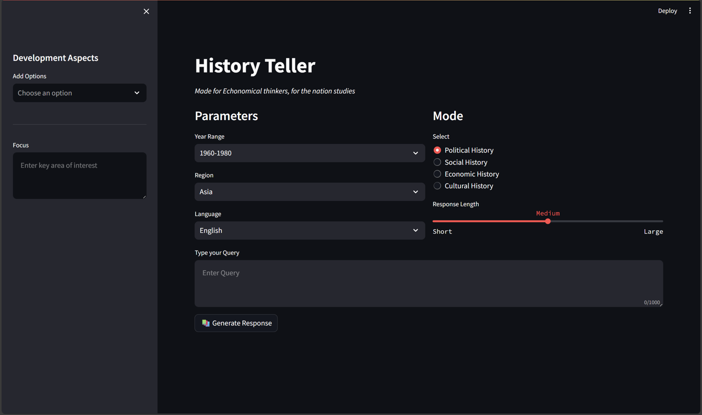
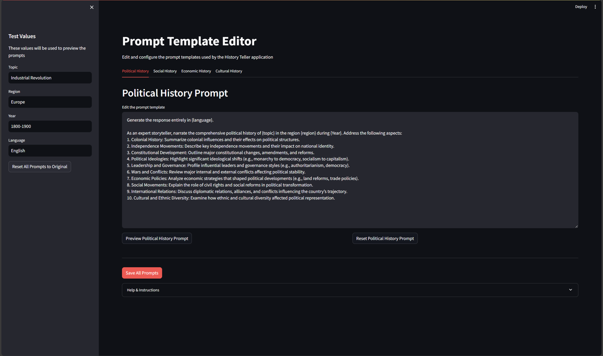
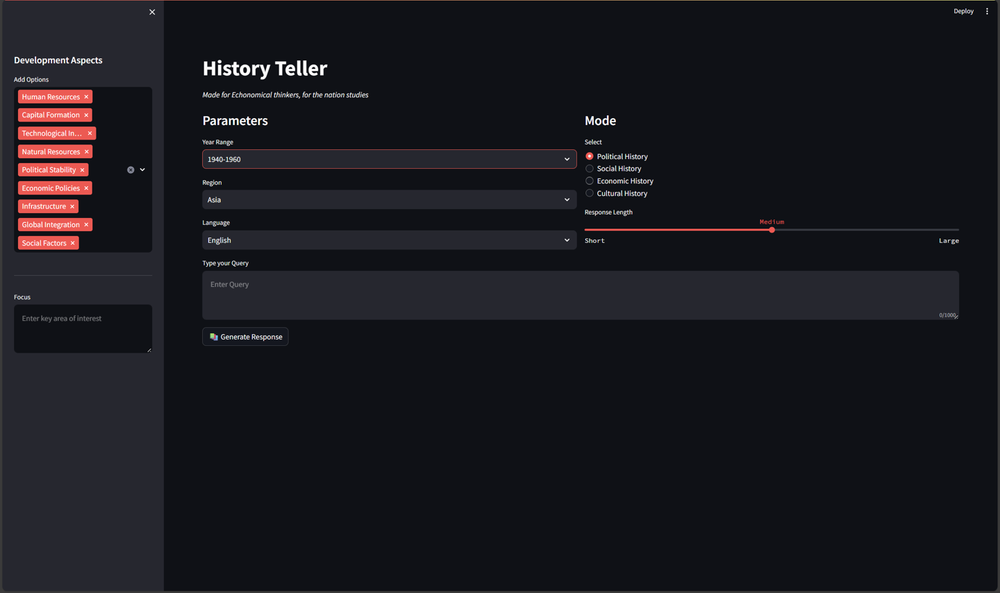

## [Startup_Demos](../../../)/[GenAI](../../)/[AI PC](../)/[History_LLM](./)

## Table of Contents
- [Overview](#1-overview)
- [Features](#2-features)
- [Setup Instructions](#%EF%B8%8F-3-setup-instructions)
  - [Miniconda Installation](#-31-miniconda-installation)
  - [Git Configuration](#-32-git-configuration)
- [Environment Setup](#-4-environment-setup)
- [LLM Suite](#-5-LM-suite)
  - [Download and install LM Studio](#-51-Download-and-Install-LM-Studio)
  - [Download LLM's](#-52-Download-LLMs)
  - [Select LLM](#-53-Select-LLM)
  - [Load models](#-54-Load-models)
  - [Start server](#55-start-server)
- [Set up QNN SDK (Qualcomm AI stack)](#6-set-up-qnn-sdk-qualcomm-ai-stack)
  - [How to Set QNN SDK](#how-to-set-qnn-sdk)
- [Run the Application](#7-run-the-application)
  - [Application Demo](#73-application-demo)


---

# 1. Overview

This demo application demonstrates how to integrate a Large Language Model (LLM) locally. It enables users to query aspects using natural language and receive contextually enriched responses.

---

# 2. Features

- Task customization enabled through configurable prompt file.
- Support for multiple languages.
- Support for multiple LLM from Hugging face.
- Choose between various models.

---

# 🛠️ 3. Setup Instructions

Before proceeding further, please ensure that **all the setup steps outlined below are completed in the specified order**. These instructions are essential for configuring the various tools required to successfully run the application.

Each section provides a reference to internal documentation for detailed guidance. Please follow them carefully to avoid any setup issues later in the process.

---

## 📦 3.1 Miniconda Installation

Miniconda is required to manage the application's Python environment and dependencies. Please follow the setup instructions carefully to ensure a consistent and reproducible environment.

For detailed steps, refer to the internal documentation: [Set up Miniconda]( ../../../Hardware/Tools.md#miniconda-setup)

## 🔧 3.2. Git Configuration

Git is required for version control and collaboration. Proper configuration ensures seamless integration with repositories and development workflows.

For detailed steps, refer to the internal documentation: [Setup Git]( ../../../Hardware/Tools.md#git-setup)

---
# 🧪 4. Environment Setup

To set up the Python environment required for running the application, follow the steps below. This ensures all dependencies are installed in an isolated and reproducible environment.

## 🔧 Steps

1. **Create your working directory** :
   ```bash
   mkdir my_working_directory
   cd my_working_directory
   ```

1. **Download Your Application** :
   ```bash
   git clone -n --depth=1 --filter=tree:0 https://github.com/qualcomm/Startup-Demos.git
   cd Startup-Demos
   git sparse-checkout set --no-cone /GenAI/AI_PC/History_LLM
   git checkout
   ```
   
1. **Navigate to Application Directory** :
   ```bash
   cd ./GenAI/AI_PC/History_LLM
   ```

1. **Create a new Conda environment** with Python 3.12:
   ```bash
   conda create -n myenv python=3.12
   ```

1. **Activate the environment**:
   ```bash
   conda activate myenv
   ```

1. **Install the required dependencies**:
   ```bash
   pip install -r requirements.txt
   ```

> 💡 Make sure you have Miniconda or Anaconda installed before running these commands.

# 🔑 5. LLM suite

You can use openly available Large Language Models (LLMs) like locally in LM Studio.

## 💾 5.1. Download and Install LM Studio.

To retrieve your API key for the Cloud AI Playground, refer to the documentation: 
[Download and Install](../../../Hardware/LLM_Suite/Readme.md#installation)

## 👉 5.2. Download LLMs.

To retrieve your API key for the Cloud AI Playground, refer to the documentation: [Download_Models](../../../Hardware/LLM_Suite/README.md#24-getting-started)

> Once you have obtained the keys, make sure to securely store them in your environment configuration or secrets manager as per your project’s security guidelines.

## 🧬 5.3. Select LLM.

After selecting the provider, choose the specific model (e.g., `Llama-3.3-70B`, `Llama-3.1-8B`, etc.) that best suits your use case:   [Select_Models](../../../Hardware/LLM_Suite/README.md#24-getting-started)

## 📦 5.4. Load models

To retrieve your API key for the Cloud AI Playground, refer to the documentation:[Load_models](../../../Hardware/LLM_Suite/README.md#24-getting-started)


## 🔐 5.5. Start server

Enter the API key associated with the selected LLM instance. This is required to authenticate and access the model's capabilities: [Start_Local_server](../../../Hardware/LLM_Suite/README.md#24-getting-started)

> Once you have obtained the keys, make sure to securely store them in your environment configuration or secrets manager as per your project’s security guidelines.

# 🛡️ 6. Set up Qualcomm AI stack

The Qualcomm AI Engine Direct SDK is a software development kit that enables developers to efficiently deploy and optimize AI models directly on Qualcomm® Snapdragon™ platforms, leveraging on-device acceleration for enhanced performance and power efficiency.

## 🔧 How to download QNN SDK
For instructions on setting environment variables on your system, refer to the documentation: [QNN_SDK](../../../Hardware/AI_PC/LLM_Stack/AI_Stack.md#3-Qualcomm-AI-Engine-Direct-SDK)

> 💡 Once set, check your application can access API server in your functions.

# 🚀 7. Run the Application

To launch the application, execute the following command from the application directory:

```bash
streamlit run .\src\ChatApp.py
```
This will start the interactive web interface where you can configure and use the application.



## 📄 7.1. Prepare Your Prompts File.

Prepare the context prompt file with keywords that specify all user inputs you want the application to process. This file will be parsed and embedded for querying.

```bash
streamlit run .\src\Prompts_Utils\prompt_editor.py
```



---

## 🗃️ 7.2. Choose Options for Use and Configure Database

Decide how you want to manage the Query data in the database. The following options are available:

1. **Use Existing** – Query the existing database without modifying it.
1. **Add development aspects** – Append some development acpects to the current database to make it perticular.
1. **Select the mode/Topic** – Select the perticular Topic.
1. **Select the region** – Select the geographical regions.
1. **Select the language** – Select the language.
1. **Select the respose** – Select the response length based on the requirement.



---
## ✅ 7.3. Application Demo
> ✅ Once all configurations are complete, you can begin interacting with the application through the chat interface.


