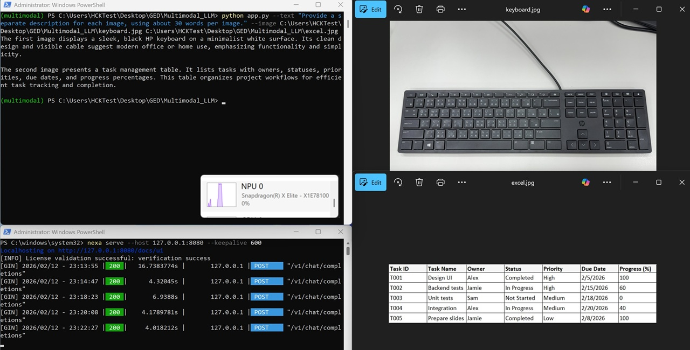

# [Startup_Demo](../../../)/[GenAI](../../)/[AI_PC](../)/[Multimodal_LLM](./)

## Table of Contents
- [Overview](#1-overview)
- [Requirements](#2-requirements)
   - [Platform](#platform)
   - [Python](#python)
   - [Nexa SDK](#nexa-sdk)
- [Environment setup](#3-environment-setup)
   - [Install Git](#install-git)
   - [Clone the specific subfolder](#clone-the-specific-subfolder)
   - [Set up Python virtual environment](#set-up-python-virtual-environment)
- [Start the local Nexa server](#4-start-the-local-nexa-server)
- [Running Python App](#5-running-python-app)

## 1. Overview

Enable an on-device multimodal large language model using [Nexa SDK](https://sdk.nexa.ai/) and interact with it through a local OpenAI-compatible endpoint.

Multimodal large language model unlocks powerful capabilities by combining visual understanding with natural language reasoning. It enables applications such as interactive visual chatbots and assistants, automated image captioning and scene interpretation, and intelligent analysis of charts, documents, and screenshots.

This Python application uses `Qwen3-VL-4B-Instruct-NPU` as an example and leverages the Snapdragon® Neural Processing Unit (NPU) to accelerate multimodal large language model inference.

In this guide, you will:
1. Install Nexa SDK and activate the license.
2. Download a multimodal LLM (`NexaAI/Qwen3-VL-4B-Instruct-NPU`).
3. Start the local server (`127.0.0.1:8080`).
4. Run a Python app that sends text + image inputs to the model.

## 2. Requirements

### Platform

- Windows on Snapdragon® (Qualcomm Compute platform, e.g. X Elite and X Plus)
- Windows 11
- This application is tested on ASUS Vivobook S15 (S5507).

### Python

- This application is tested with Python 3.10.9.
- Install Python 64-bit by following the [installation guide](../../../Tools/Software/Python_Setup/README.md#21-download-python-installer).
- Make sure you have Python installed and properly configured in your system path.
  ```bash
  # Check Python version
  python --version
  ```
- Required package.
  - openai

### Nexa SDK

- Visit [Nexa SDK website](https://sdk.nexa.ai/#sdk-download), download `Nexa CLI Windows ARM` installer, and install it on your Qualcomm Compute platform.
- Sign up an account at [sdk.nexa.ai](https://sdk.nexa.ai/).
- Log in and go to your account `Profile`.
- Click `+ Create Token` and copy your key.
- Open your terminal and test if Nexa SDK is installed successfully. 
  ```bash
  nexa version
  ```
- This Python application is tested with:
  - `NexaSDK Bridge Version: v1.0.36`
  - `NexaSDK CLI Version:    v0.2.64`
- Configure your token key.
  ```bash
  nexa config set license '<your_token_here>'
  ```
- Download the multimodal model and test the license validation.
  ```bash
  nexa infer NexaAI/Qwen3-VL-4B-Instruct-NPU
  ```
- When the model loads, you should see the following output:
  ```bash
  [INFO] License validation successful: verification success
  >
  ```
- You can enter anything to test the model, and type `/exit` to end the conversation.
  ```bash
  > /exit
  ```
  
## 3. Environment setup

This section describes the development environment setup process, including Git installation, selective subdirectory cloning, Python virtual environment creation, and dependencies installation.

### Install Git

Git is required for version control and collaboration. Proper configuration ensures seamless integration with repositories and development workflows.

For detailed steps, refer to the internal documentation: [Setup Git](../../../Hardware/Tools.md#git-setup).

### Clone the specific subfolder

Once Git is installed, clone the project repository, and use `GenAI/AI_PC/Multimodal_LLM` directory for this application.

Open Windows PowerShell, navigate to your target directory, and run the following commands:

```bash
git clone -n --depth=1 --filter=tree:0 https://github.com/qualcomm/Startup-Demos.git
cd Startup-Demos
git sparse-checkout set --no-cone GenAI/AI_PC/Multimodal_LLM
git checkout
```

After running these commands, your local directory structure will contain only:

```bash
Startup-Demos/
└── GenAI/
    └── AI_PC/
        └── Multimodal_LLM/
```

### Set up Python virtual environment

Virtual environments are isolated Python environments that allow you to work on different projects with different dependencies without conflicts.

For detailed steps, refer to the internal documentation: [Virtual Environments](../../../Tools/Software/Python_Setup/README.md#4-virtual-environments).

Once in the virtual environment, install the required Python packages.
```bash
cd .\GenAI\AI_PC\Multimodal_LLM
pip install -r .\requirements.txt
```

Your environment is now ready. You can start exploring and running the project inside Startup-Demos directory.

## 4. Start the local Nexa server

Start Nexa server so it exposes an OpenAI-compatible REST API at `http://127.0.0.1:8080/v1`.

Open another terminal and start the local server. --keepalive 600 keeps model in memory for 10 minutes between requests.
```bash
nexa serve --host 127.0.0.1:8080 --keepalive 600
```

Verify the endpoint is reachable:
```bash
curl http://127.0.0.1:8080/v1/models
```

You should see `NexaAI/Qwen3-VL-4B-Instruct-NPU` listed.

## 5. Running Python App

The Python file of `app.py` in the directory is a minimal Python script that sends the text prompt and the image to the local Nexa server using the OpenAI client. 

After starting the server, run the command in the virtual environment via the terminal, ensuring that at least one text prompt and one image file path are provided.
```bash
python app.py --text "Provide a separate description for each image, using about 30 words per image." --image C:\path\to\your\image1.jpg C:\path\to\your\image2.jpg
```
Inference is accelerated by Snapdragon® Neural Processing Unit (NPU).


### Notes
- **API key:** Leave blank for local deployments.
- **First-time loading:** It may take some time to load the model into memory.
- **Image paths:** The `image_url` items must be local file paths. Leave a space between image paths.
- **Model name:** Must exactly match the model served by Nexa.
- **Streaming:** Multimodal models currently do not support streaming.

---

**You’re all set.** Start the Nexa server, run `app.py`, and your on-device multimodal model should be accelerated by Snapdragon® Neural Processing Unit (NPU).