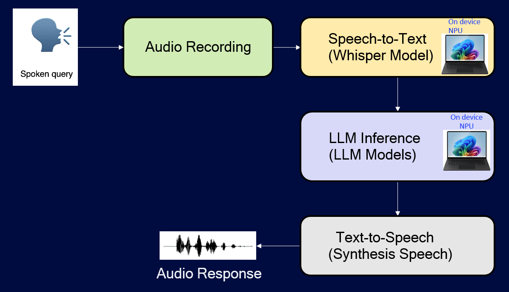
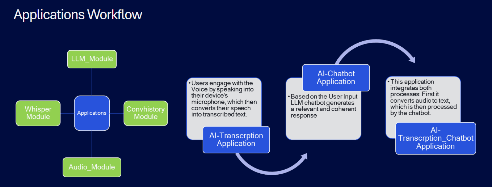

## [Startup_Demo](../../../)/[GenAI](../../)/[AI PC](../)/[Transcribe_AIChatBot](./)

---

# Voice Transcription Chatbot

## Table of Contents
- [1. Overview](#1-overview)
- [2. Features](#2-features)
- [3. Setup Instructions](#3-setup-instructions)
  - [3.1 Miniconda Installation](#31-miniconda-installation)
  - [3.2 Git Configuration](#32-git-configuration)
  - [3.3 AnythingLLM Configuration](#33-anythingllm-configuration)
- [4. Environment Setup](#4-environment-setup)
- [5. File Structure](#5-file-structure)
- [6. Run the Application](#6-run-the-application)
  - [6.1 Running AI Chatbot Application](#61-running-ai-chatbot-application)
  - [6.2 Running AI Transcription Application](#62-running-ai-transcription-application)
  - [6.3 Running AI_Transcrption_ChatBot Application](#63-running-ai_transcrption_chatbot-application)

---

# 1. Overview

The Voice Transcribe ChatBot enables users to convert spoken audio into text, which is then processed by a large language model for further interaction. By leveraging speech recognition and natural language processing, the Voice Transcribe ChatBot can understand and respond to voice commands, engage in discussions, and provide personalized recommendations.



# 2. Features

This project is built using the **LM Studio**, a cutting-edge development environment, and is powered by the **Snapdragon Xelite laptop**, which enables seamless execution of the Llama model and Whisper model locally on Edge. By utilizing these advanced tools, this application is made possible through the integration of four key modules: **Whisper Handler**, **LLM Handler**, **ConvHistoryHandler** and **Audio Handler**, which work in tandem to provide a seamless and interactive user experience.

* **LLM Module:**

  * Handles Large Language Model (LLM) related tasks
  * Processes text inputs to generate responses
  * Provides personalized recommendations and engages in discussions

* **Whisper Audio to Text Module:**

  * Utilizes the Whisper model to transcribe user voice inputs into text format
  * Sends the transcribed text to the LLM module for processing

* **Audio Module (TTS):**

  * Records audio inputs from the user
  * Handles Text-to-Speech (TTS) related tasks
  * Plays the audio output to the user

* **Conversation History:**

  * Stores previous conversations and interactions
  * Allows users to retrieve and review previous discussions




# 3. Setup Instructions

Before proceeding further, please ensure that **all the setup steps outlined below are completed in the specified order**. These instructions are essential for configuring the various tools required to successfully run the application.

Each section provides a reference to internal documentation for detailed guidance. Please follow them carefully to avoid any setup issues later in the process.

---

## 3.1 Miniconda Installation

Miniconda is required to manage the application's Python environment and dependencies. Please follow the setup instructions carefully to ensure a consistent and reproducible environment.

For detailed steps, refer to the internal documentation:  
[Set up Miniconda]( ../../../Hardware/Tools.md#miniconda-setup)

## 3.2 Git Configuration

Git is required for version control and collaboration. Proper configuration ensures seamless integration with repositories and development workflows.

For detailed steps, refer to the internal documentation:  
[Setup Git]( ../../../Hardware/Tools.md#git-setup)

## 3.3 AnythingLLM Configuration

AnythingLLM is required as the backend server for this application. You need access to a running AnythingLLM instance to provide the LLM and RAG capabilities.

You can use either a local or remote AnythingLLM server:

- **Local:** Follow the [AnythingLLM installation guide](https://github.com/Mintplex-Labs/anything-llm#installation) to set up and run the server on your machine.
- **Remote:** Obtain the API URL and API key from your administrator.

For detailed setup instructions, refer to the below steps

### ✅ Step-by-Step: Create Workspace in AnythingLLM

**🖥️ 1. Launch AnythingLLM**
   - Open the AnythingLLM Desktop App or access your self-hosted instance in a browser.

**🆕 2. Create a New Workspace**
   - Click on “New Workspace”.
   - Enter a Workspace Name (e.g., test).
   - Click Create.

**⚙️ 3. Configure the Workspace**
   - Go to the Workspace Settings.
   - Navigate to Agent Configuration.
   - Under LLM Provider, select AnythingLLM NPU (or your preferred provider).
   - Choose your model (e.g., LLaMA 3.1).
   - Click Update Workspace Agent.

**🔑 Step-by-Step: Get API Key and Base URL**
   - 🔐 4. Generate API Key
   - Go to Settings → API Keys.
   - Click “Generate New API Key”.
   - Copy the key and store it securely.

### 🧪 Testing in AnythingLLM Chat

Once your workspace is created and configured:

- Go to the Chat tab in AnythingLLM.
- Select your workspace from the dropdown.
- Type a message (e.g., “What is the capital of India?”).
- The response should come from the configured LLaMA model.
---

# 4. Environment Setup

To set up the Python environment required for running the application, follow the steps below. This ensures all dependencies are installed in an isolated and reproducible environment.

## Steps

1. **Create your working directory**:
   ```bash
   mkdir my_working_directory
   cd my_working_directory
   ```

2. **Download and Prepare Whisper ONNX Models from Qualcomm AI-HUB**:

- This guide walks you through installing dependencies, exporting the Whisper ONNX model, and validating speech-to-text functionality on the Snapdragon X Elite platform.
 It includes setting up the Conda environment, installing FFmpeg, Python dependencies, QNN runtime, and downloading the Whisper-base model.

- Follow the [Run Whisper on Snapdragon X Elite guide](https://github.com/quic/ai-hub-apps/tree/main/apps/windows/python/Whisper#run-whisper-on-snapdragon-x-elite) to set up and export the whisper model from the qualcomm ai-hub-apps repository.

**Setup Steps**

- **Step 1**: Clone the repository - git clone https://github.com/quic/ai-hub-apps.git
- **Step 2**: Navigate to the Whisper app directory -cd ai-hub-apps/apps/windows/python/Whisper
- **Step 3**: Run the setup script to install all necessary dependencies.
- **Step 4**: Export the Whisper ONNX model using the provided script
- **Step 5**: Validate speech-to-text functionality using demo.py

**Move Build Directory to C Drive**

- After exporting the Whisper ONNX models, you will have a folder named build in your current working directory. To make it accessible for your application, `move it to the C drive`.

- Create the following repository structure to run the application.This will move the entire build directory — including the whisper_base model ONNX files, corresponding encoder/decoder folders, and model.bin — to `C:\build`.

  🔍 Resulting Structure

  ```
  C:\
  └── build\
      └── whisper_base\
          ├── HfWhisperEncoder\
          │   ├── model.onnx
          │   └── model.bin
          │
          ├── HfWhisperDecoder\
          │   ├── model.onnx
          │   └── model.bin
  ```

3. **Download Your Application**:
   ```bash
   git clone -n --depth=1 --filter=tree:0 https://github.com/qualcomm/Startup-Demos.git
   cd Startup-Demos
   git sparse-checkout set --no-cone /GenAI/AI_PC/Transcribe_AIChatBot
   git checkout
   ```
   
4. **Navigate to Application Directory**:
   ```bash
   cd ./GenAI/AI_PC/Transcribe_AIChatBot
   ```

5. **Install the required dependencies**:
   ```bash
   pip install -r requirements.txt
   ```

> 💡 Make sure you have Miniconda or Anaconda installed before running these commands.

---

# 5. File Structure

```
requirements.txt                  → Project dependencies
Transcribe_AIChatBot/
└── src/
    ├── Audio_Module/
    │   ├── Record.py             → Audio recording logic
    │   └── TTS.py                → Text-to-speech functionality
    │
    ├── Whisper_Module/
    │   └── whisper_npu.py        → Whisper model with NPU support
    │
    ├── LLM_Module/
    │   └── LLM_Utils.py          → LLM interaction utilities
    │
    ├── ConvHistory_Module/
    │   └── Conversation_Handler.py → Chat history management
    │
    ├── ai_transcription.py       → Transcription-only pipeline
    ├── ai_chatbot.py             → Chatbot-only pipeline
    ├── ai_transcription_chatbot.py → Combined transcription + chatbot
    └── config.yaml               → Configuration settings
```

# 6 Running Voice Transcribe ChatBot Applications

To run the Voice Transcribe ChatBot application, follow these steps,this section will guide you through the process of executing the application.

They are 3 applications are available in the source directory.

- AIChatBot.py
- AI_Transcription.py
- AI_Transcription_ChatBot.py

## 6.1 Running AI Chatbot Application

The application will provide real-time responses generated by the LLM based on your input.

Once the application is running, you can interact with the chatbot by typing your questions or comments into the input box and clicking the "Send" button.
The chatbot will respond ,These responses are generated using AnythingLLM models, which process the transcribed voice input from the Whisper model.
To enable this functionality, you must provide a valid API key for the AnythingLLM integration.

Run the AI_Transcription.py file using the command:

    streamlit run AI_ChatBot.py


## 6.2 Running AI Transcription Application

The application uses the Whisper model to transcribe user voice inputs into text format.
Once running, you can interact with the LLM using voice commands. Speak into the microphone, and the app will transcribe your voice input into text.

Run the AI_Transcription.py file using the command:

    streamlit run AI_Transcription.py


## 6.3 Running AI_Transcrption_ChatBot Application

The application uses the Whisper model to transcribe user voice inputs into text format. This transcribed text is then processed by a large language model (LLM) — specifically using AnythingLLM models — to generate appropriate responses.
To enable this functionality, you need to provide the API key for the AnythingLLM integration.

Once the application is running, you can interact with the LLM using voice commands. Speak into the microphone, and the app will transcribe your voice input using the Whisper model and display the response from the LLM.

Run the AI_Transcription.py file using the command:

    streamlit run AI_Transcription_ChatBot.py


__Note__: Make sure to test the application in a quiet environment with minimal background noise to ensure accurate transcription results.