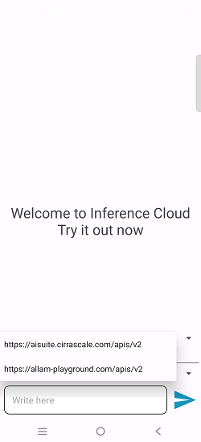
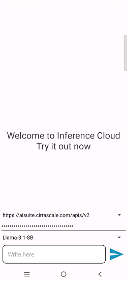
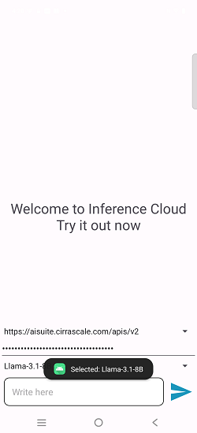

# Playground Chat + RAG + ChromaDB Demo Application

## Table of Contents
- [Overview](#1-overview)
- [Features](#2-features)
- [Setup Instructions](#%EF%B8%8F-3-setup-instructions)
  - [Android Studio Installation](#-31-android-studio-installation)
  - [Git Configuration](#-32-git-configuration)
- [Environment Setup](#-4-environment-setup)
- [Getting API Access](#-5-getting-api-access)
  - [Cloud AI Playground](#%EF%B8%8F-51-cloud-ai-playground)
  - [Allam Playground](#-52-allam-playground)
- [Build and Install the Application on a Physical Device](#-6-build-and-install-the-application-on-a-physical-device)
- [Run the Application](#-7-run-the-application)
  - [Application Demo](#-75-application-demo)


---

# 1. Overview

This demo application showcases how to integrate a Large Language Model (LLM) with an Android application using the AI Playground. It allows users to query documents in natural language and receive contextually enriched responses based on the content.

---

# 2. Features

- **Modular architecture** with easily pluggable components for flexibility and customization.  
- **Seamless integration with AI Playground** for intelligent document querying.  
- **Support for multiple LLM backends**, including Cloud AI Playground and Allam Playground.
- **Model selection flexibility**, allowing users to choose from various AI models based on their needs.

---

# 🛠️ 3. Setup Instructions

Before proceeding further, please ensure that **all the setup steps outlined below are completed in the specified order**. These instructions are essential for configuring the various tools required to successfully run the application.

Each section provides a reference to internal documentation for detailed guidance. Please follow them carefully to avoid any setup issues later in the process.

---
## 📱 3.1 Android Studio Installation

Android Studio is required to develop and run the Android application. Please follow the setup instructions carefully to ensure a consistent and functional development environment.

For detailed steps, refer to the internal documentation:  
[Set up Android Studio]( ../../../Hardware/Tools.md#android-studio-setup)

## 🔧 3.2. Git Configuration

Git is required for version control and collaboration. Proper configuration ensures seamless integration with repositories and development workflows.

For detailed steps, refer to the internal documentation:  
[Setup Git]( ../../../Hardware/Tools.md#git-setup)

---
# 🧪 4. Environment Setup

To set up the Python environment required for running the application, follow the steps below. This ensures all dependencies are installed in an isolated and reproducible environment.

## 🔧 Steps

1. **Create your working directory** :
   ```bash
   mkdir my_working_directory
   cd my_working_directory
   ```

1. **Download the Application Source Code** :
   ```bash
   git clone -n --depth=1 --filter=tree:0 https://github.com/qualcomm/Startup-Demos.git
   cd Startup-Demos
   git sparse-checkout set --no-cone /GenAI/Android/InferenceCloudChat
   git checkout
   ```
   
1. **Open the Project in Android Studio:** :
- Launch Android Studio.
- Select *New -> Import Project*
- Navigate to:
   ```bash
   cd ./GenAI/Android/InferenceCloudChat
   ```

1. **Allow Gradle to Sync and Download Dependencies:** :
- Android Studio will automatically sync Gradle and download necessary dependencies.
- Ensure you have a stable internet connection.
- Wait for the sync to complete.

# 🔑 5. Getting API Access

To use the application features that rely on external AI services, you need to obtain API keys from the respective playgrounds. Follow the instructions below for each platform.

## ☁️ 5.1. Cloud AI Playground

To retrieve your API key for the Cloud AI Playground, refer to the documentation: 
[API Key for Cloud AI Playground](../../../Hardware/Cloud%20AI%20Playground.md#APIKey-for-CloudAI-Playground)

## 🧠 5.2. Allam Playground

To retrieve your API key for the Cloud AI Playground, refer to the documentation: 
[API Key for Allam Playground](../../../Hardware/Cloud%20AI%20Playground.md#APIKey-for-Allam-Playground)

> Once you have obtained the keys, make sure to securely store them in your environment configuration or secrets manager as per your project’s security guidelines.

---

# 📲 6. Build and Install the Application on a Physical Device
   - Connect your Android device via USB and enable **USB debugging** in developer options.  
   - In Android Studio, click **Run > Run 'app'** or press **Shift + F10**.  
   - Select your connected device from the list.  
   - Android Studio will build the APK and install it on your device automatically.  
   - Once installed, the app will launch on your device.

---

# 🚀 7. Run the Application


To launch the application on your Android device:

📱 **Tap the app icon** from the app drawer or home screen after installation.

This will start the Android application and allow you to begin interacting with the AI-powered features.


---

## 🧠 7.1. Select LLM Instance

Choose the Large Language Model (LLM) provider you want to use (e.g., CloudAI Playground, Allam Playground, etc.). This determines the backend service that will process your queries.



---

## 🔐 7.2. Configure API Key

Enter the API key associated with the selected LLM instance. This is required to authenticate and access the model's capabilities.



---

## 🧬 7.3. Select LLM Model

After selecting the provider, choose the specific model (e.g., `Llama-3.3-70B`, `Llama-3.1-8B`, etc.) that best suits your use case.



---

## ✅ 7.5. Application Demo
> ✅ Once all configurations are complete, you can begin interacting with the application through the chat interface.


