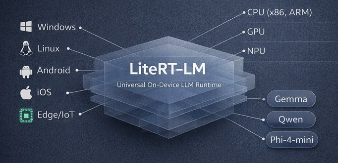
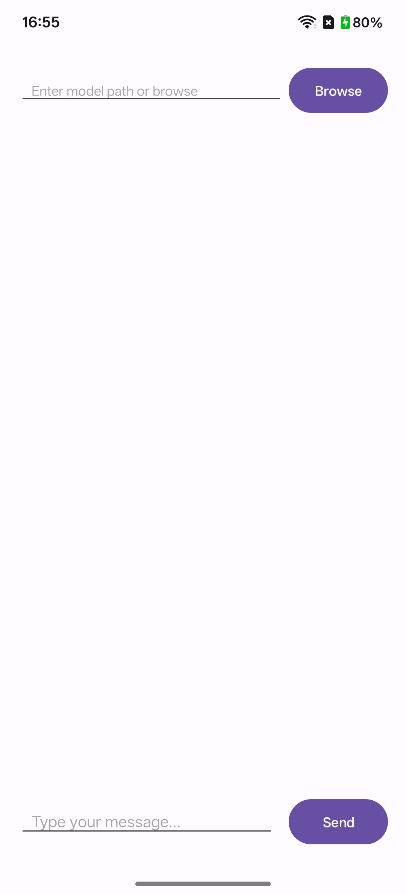
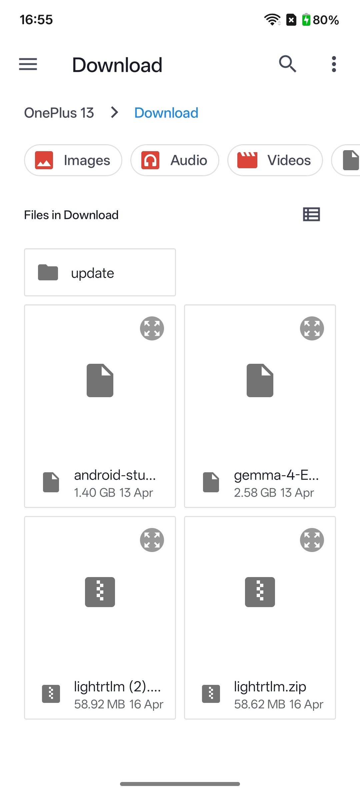
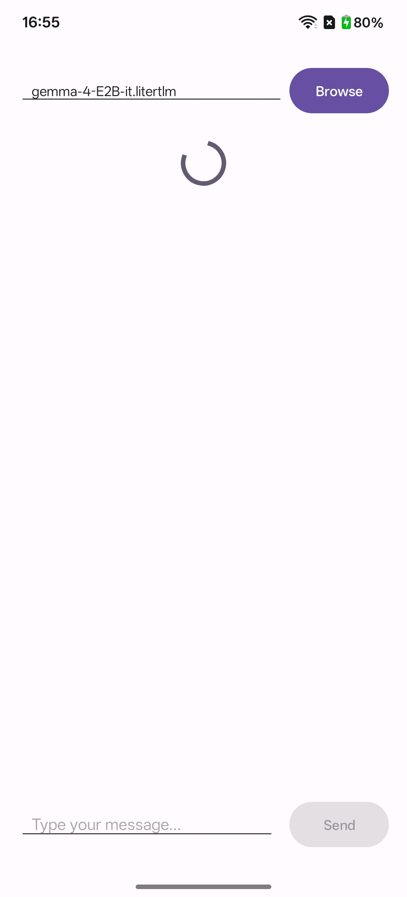
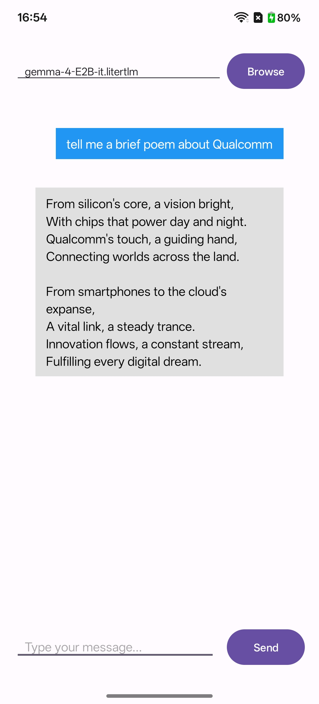

## [Startup_Demo](../../../)/[GenAI](../../)/[Android](../)/[LiteRT_LM](./)

# LiteRT-LM On-Device Chat Application

## Table of Contents
- [LiteRT-LM On-Device Chat Application](#litert-lm-on-device-chat-application)
  - [Table of Contents](#table-of-contents)
- [1. Overview](#1-overview)
- [2. Features](#2-features)
- [3. Setup Instructions](#3-setup-instructions)
  - [3.1 Android Studio Installation](#31-android-studio-installation)
  - [3.2 Git Configuration](#32-git-configuration)
- [4. Project Setup](#4-project-setup)
  - [4.1 Steps Download the Application Source Code](#41-steps-download-the-application-source-code)
  - [4.2 Create android studio project from the source files](#42-create-android-studio-project-from-the-source-files)
- [5. Model Files](#5-model-files)
  - [Download and Transfer Steps](#download-and-transfer-steps)
  - [Available Models](#available-models)
- [6. Build and Install the Application on a Physical Device](#6-build-and-install-the-application-on-a-physical-device)
- [7. Run the Application](#7-run-the-application)
  - [7.1 Launch the App](#71-launch-the-app)
  - [7.2 Browse and Select the Model](#72-browse-and-select-the-model)
  - [7.3 Model Loading](#73-model-loading)
  - [7.4 Application Demo](#74-application-demo)
  - [Resources](#resources)

# 1. Overview

LiteRT-LM is an open-source inference framework designed for efficient, high-performance deployment of large language models across diverse edge devices and platforms.



This demo application showcases how to run a Large Language Model (LLM) entirely on-device using **LiteRT-LM** on **Android**. We will use Google's **Gemma-4** model for demonstration here. All inference happens locally — no internet connection or cloud API key is required, ensuring complete data privacy and instant responses.

# 2. Features

- **Fully offline inference** — the model runs entirely on the device with no network dependency.
- **On-device privacy** — user data never leaves the phone.
- **LiteRT-LM integration** — leverages Google's LiteRT-LM runtime for efficient on-device LLM execution.
- **Simple model loading** — browse and select any compatible `.litertlm` model file directly from device storage.
- **Chat interface** — clean conversational UI for interacting with the model.

# 3. Setup Instructions

Please ensure that **all the setup steps outlined below are completed in the specified order**. 

## 3.1 Android Studio Installation

Android Studio is required to develop and run the Android application. Please follow the setup instructions carefully to ensure a consistent and functional development environment.

For detailed steps, refer to the internal documentation:  
[Set up Android Studio](../../../Hardware/Tools.md#android-studio-setup)

## 3.2 Git Configuration

Git is required for version control and collaboration. Proper configuration ensures seamless integration with repositories and development workflows.

For detailed steps, refer to the internal documentation:  
[Setup Git](../../../Hardware/Tools.md#git-setup)

# 4. Project Setup

To set up the project required for running the application, follow the steps below. For this project one needs to create an Empty Activity project in android studio and modify its files with the given source files and instructions in this document.

## 4.1 Steps Download the Application Source Code

```bash
git clone -n --depth=1 --filter=tree:0 https://github.com/qualcomm/Startup-Demos.git
cd Startup-Demos
git sparse-checkout set --no-cone /GenAI/Android/LiteRT_LM
git checkout
```

## 4.2 Create android studio project from the source files

Create the Empty Activity project in android studio. We are using this project as a template. We will modify its files with the source files provided with this project to get the desired application.
- Follow [project creation instructions](./resource/setup.md)

# 5. Model Files

The app requires a LiteRT-LM formatted model file (`.litertlm` format) to be present on the device.

## Download and Transfer Steps

1. Visit the HuggingFace link for the model you want.
2. Download the `.litertlm` file to your computer.
3. Copy the file to your device's `Downloads` folder via USB file transfer.

> **Device Requirements:** 6 GB+ RAM, ~3 GB free storage. Tested on OnePlus 13 (Android 15, 12 GB RAM).

## Available Models

| Model | Size | HuggingFace Link | Recommended |
|-------|------|------------------|-------------|
| **Gemma-4 Elite 2B** | ~2.5 GB | [litert-community/gemma-4-E2B-it-litert-lm](https://huggingface.co/litert-community/gemma-4-E2B-it-litert-lm) | Yes (faster) |
| **Gemma-4 Elite 4B** | ~4.5 GB | [litert-community/gemma-4-E4B-it-litert-lm](https://huggingface.co/litert-community/gemma-4-E4B-it-litert-lm) | Optional (better quality) |

⚠️ Disclaimer: This project refers the huggingface resource for model download. Users are responsible for reviewing and complying with the licensing terms, usage conditions, and distribution requirements of huggingface before using, modifying, or distributing this application.

# 6. Build and Install the Application on a Physical Device

- Connect your Android device via USB and enable **USB debugging** in developer options.
- In Android Studio, click **Run > Run 'app'** or press **Shift + F10**.
- Select your connected device from the list.
- Android Studio will build the APK and install it on your device automatically.
- Once installed, the app will launch on your device.

# 7. Run the Application

## 7.1 Launch the App

Tap the app icon from the app drawer or home screen after installation. The main screen displays a model path field with a **Browse** button at the top and a chat input field at the bottom.

<div style="max-width: 200px;">



</div>

## 7.2 Browse and Select the Model

Tap the **Browse** button to open the system file picker. Navigate to the folder where you placed the `.litertlm` model file (e.g., `Downloads`) and select it.

<div style="max-width: 200px;">



</div>

## 7.3 Model Loading

After selecting the model file, the app will begin loading it into memory. A loading spinner is displayed while the model initialises. The **Send** button remains disabled until loading is complete.

<div style="max-width: 200px;">



</div>

## 7.4 Application Demo

> Once the model is loaded, the chat interface becomes active. Type a message and tap **Send** to receive a response from the on-device Gemma-4 model — entirely offline.

<div style="max-width: 200px;">



</div>

## Resources

- [LiteRT-LM Reference](https://ai.google.dev/edge/litert-lm)
- [Get Started with LiteRT-LM on Android](https://ai.google.dev/edge/litert-lm/android)
- [LiteRT-LM Compatible Models](https://huggingface.co/models?library=litert-lm)
- [google-ai-edge/LiteRT-LM GitHub](https://github.com/google-ai-edge/LiteRT-LM)
