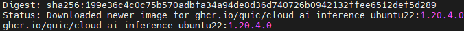
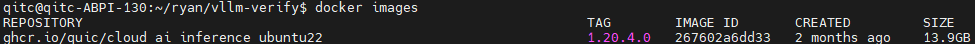
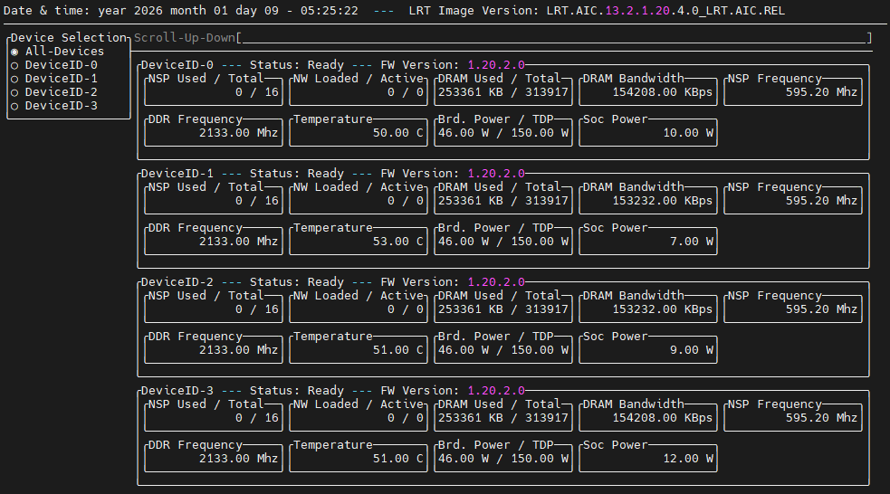
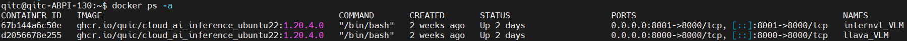
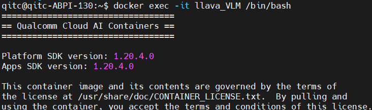
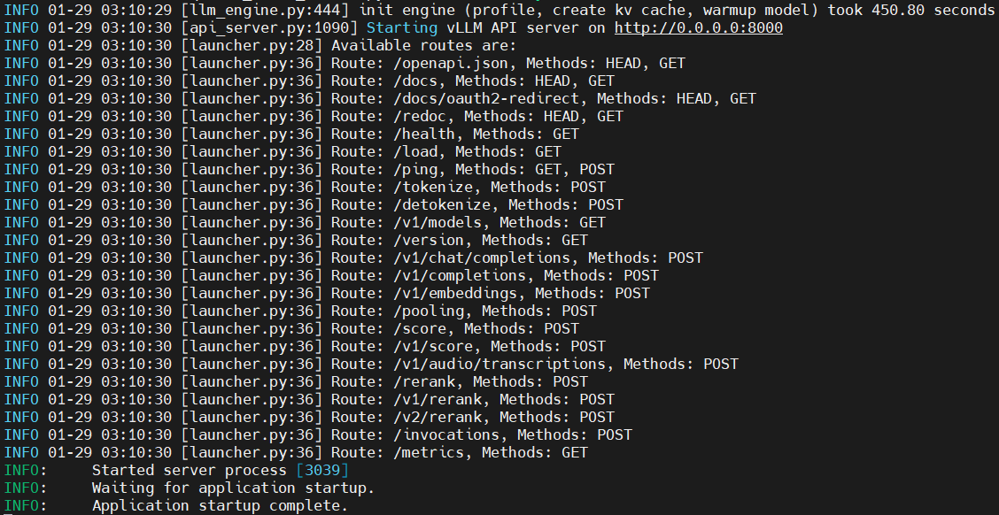
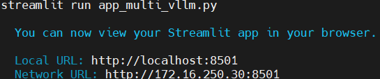
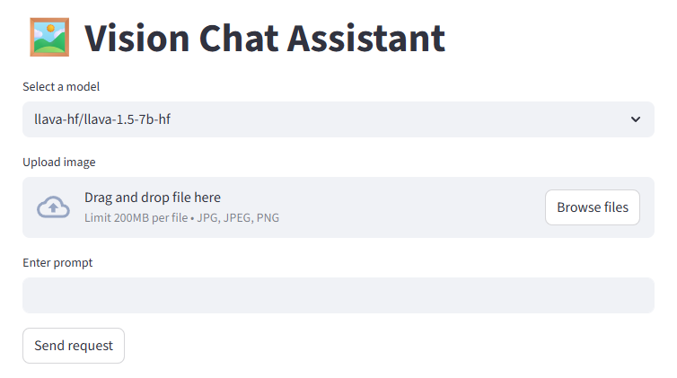

# [Startup_Demo](../../../)/[GenAI](../../)/[CloudAI-Playground](../)/[Multi‑VLM Serving on AIC100 with vLLM](./)
# Multi‑VLM Serving on AIC100 with vLLM

## 📘Table of Contents
- [🧭Overview](#1overview)
- [✨Features](#2features)
- [🐳Enviroment Setup](#3enviroment-setup)
- [📡Launching the Server](#4-launching-the-server)
- [🌐Web Client Setup](#5-web-client-setup)
- [🚀Demo](#6-demo)

---
## 1.🧭Overview

This project demonstrates how to deploy multiple vLLM-based inference servers (e.g. LLaVA and InternVL) on a Qualcomm AIC100 using Docker containers. Each model runs inside its own isolated container with dedicated QAIC device assignments (/dev/accel/*), enabling clean hardware partitioning and predictable performance.

A unified Streamlit web client is also provided, allowing users to interact with different models through a single UI. The client runs on the same AIC100 host and communicates with each vLLM server via HTTP APIs.

This setup is ideal for validating multi-model deployment, visual-language inference workflows, and general vLLM operation on AIC100 hardware.


---
## 2.✨Features

- **Multi‑Model Deployment:** Run multiple VLM models (e.g., LLaVA, InternVL) on a single AIC100 host, with each model using multiple QAIC accelerator devices.

- **Dedicated QAIC Device Assignment:** Each inference server is assigned to a group of /dev/accel/* devices, ensuring clean hardware isolation and stable performance.

- **Independent Model Endpoints:** Each model exposes its own HTTP API, allowing the client to dynamically route requests.

- **Unified Streamlit Web Client:** A single web interface for interacting with all deployed models.

- **Vision-Language Model Inference (VLM Support):** Enables multimodal (image + text) inference via models such as LLaVA and InternVL.

---
## 3.🐳Enviroment Setup
> ✅ Before you begin following this guide, you need to pre‑install the [Qualcomm Cloud AI SDK](https://quic.github.io/cloud-ai-sdk-pages/1.20/Getting-Started/Installation/Cloud-AI-SDK/Cloud-AI-SDK/index.html) on the AIC100.

### 3.1 Download the Docker Image

To enable multi‑model deployment, you need to install the Docker image from the [Cloud AI Containers](https://github.com/quic/cloud-ai-containers/pkgs/container/cloud_ai_inference_ubuntu22).

Follow the command below to install the image:
```bash
docker pull ghcr.io/quic/cloud_ai_inference_ubuntu22:1.20.4.0
```


Use the following command to verify that the image was downloaded successfully:
```bash
docker images
```
If successful, you will see the repository listed as shown in the image:


💡*This sample uses the Docker image version cloud_ai_inference_ubuntu22:1.20.4.0.*

### 3.2 Verify Available QAIC Devices
Before creating a container with the downloaded image, you need to check which QAIC devices are available by using the command below:
```bash
sudo /opt/qti-aic/tools/qaic-util -t 1
```

💡*If you want to follow this sample to build a multi‑model server, you will need at least two QAIC devices.*

### 3.3 Create Two Containers for Model Deployment

In this sample, two VLM models are used by the Web Client, so two containers need to be created to establish the servers.


#### 3.3.1 Setting Up the First Container

Since the first model used in this sample is the VLM model **llava-hf/llava-1.5-7b-hf**, and its number of attention heads (16) can be evenly divided by the two QAIC devices, it supports distributed inference across both devices. 

Therefore, when creating the container, we map two QAIC devices to the Docker container and leave the remaining two QAIC devices for the other VLM model.

Additionally, we need to map a port for client access and querying.

Use the following command to create the container:
```bash
docker run -dit --name llava_VLM --device=/dev/accel/accel0 --device=/dev/accel/accel1 -v /home/qitc/:/home/qitc/ -p 8000:8000 ghcr.io/quic/cloud_ai_inference_ubuntu22:1.20.4.0
```

💡*Note: Multi‑device execution requires the model’s number of attention heads to be divisible by the number of QAIC devices.*

#### 3.3.2 Setting Up the Second Container

Since the first container uses the two devices accel0 and accel1, we can only use the remaining two devices, accel2 and accel3, for this container.

The second point to notice is the port mapping. Since each container exposes the same internal service port, we need to change the host‑side port when mapping this container so that the Web Client can access it properly.

Use the following command to create the container:
```bash
docker run -dit --name internvl_VLM --device=/dev/accel/accel2 --device=/dev/accel/accel3 -v /home/qitc/:/home/qitc/ -p 8001:8000 ghcr.io/quic/cloud_ai_inference_ubuntu22:1.20.4.0
```

---
## 4. 📡Launching the Server

In this section, we will enter both containers to launch the two servers.

You can use the following command to check the existing containers and their status, and you should see results similar to the image below:
```bash
docker ps -a
```


### 4.1 Setting Up the llava‑hf Model Server
Enter the first container named llava_VLM, which was created earlier.
```bash
docker exec -it llava_VLM /bin/bash
```
If it succeeds, you should see a message similar to the one below.


Open the Python virtual environment that is already included in the image.
```bash
source /opt/vllm-env/bin/activate
```

Below is the command used to start the llava-hf/llava-1.5-7b-hf model server on QAIC devices (accel0 & accel1).

In this sample, I use the OpenAI‑compatible API provided by vLLM to quickly launch a VLM server.
vLLM also supports additional API server modes depending on your deployment needs.

In this command, the options --device qaic and --device-group 0,1 specify that the model will run on QAIC hardware and use a device group consisting of device 0 and device 1.
This is required because the model’s attention heads must be evenly divisible across the selected QAIC devices.
```bash
python3 -m vllm.entrypoints.openai.api_server  \
--host 0.0.0.0 \
--port 8000 \
--device qaic \
--device-group 0,1 \
--model llava-hf/llava-1.5-7b-hf \
--max-model-len 4096 \
--block-size 32 \
--quantization mxfp6 \
--kv_cache_dtype auto \
--limit-mm-per-prompt image=1 \
--disable-sliding-window \
--disable-mm-preprocessor-cache \
--max-num-seqs 1 \
--trust_remote_code
```

### 4.2 Setting Up the InternVL Model Server

Enter the second container named internvl_VLM, which was created earlier:
```bash
docker exec -it internvl_VLM /bin/bash
```

Activate the Python virtual environment included in the image:
```bash
source /opt/vllm-env/bin/activate
```

Since the InternVL model currently does not support multi-device execution on QAIC, this server runs using a single QAIC device.

The overall configuration is similar to the first model server, except for the device selection and port mapping.

Below is the command used to start the OpenGVLab/InternVL2_5-1B model server:
```bash
python3 -m vllm.entrypoints.openai.api_server  \
--host 0.0.0.0 \
--port 8000 \
--device qaic \
--device-group 0 \
--model OpenGVLab/InternVL2_5-1B \
--max-model-len 4096 \
--block-size 32 \
--quantization mxfp6 \
--kv_cache_dtype auto \
--limit-mm-per-prompt image=1 \
--disable-sliding-window \
--disable-mm-preprocessor-cache \
--max-num-seqs 1 \
--trust_remote_code
```

💡*You can modify the server or model settings as needed. To check which models and arguments are supported, please refer to the [Qualcomm AI SDK User Guide (vLLM section)](https://quic.github.io/cloud-ai-sdk-pages/latest/Getting-Started/Installation/vLLM/vLLM/index.html#).*


If everything works properly, you should see the log look like this:


---
## 5. 🌐Web Client Setup

The project includes a Streamlit‑based Web Client that allows you to interact with all deployed VLM model servers through a single unified interface.

This client runs directly on the AIC100 host and communicates with each vLLM server via HTTP APIs (e.g., 8000 for LLaVA and 8001 for InternVL).

On the AIC100 host, run the following command:
1. Follow the commands below to set up the source code:
```bash
cd ~
git clone -n --depth=1 --filter=tree:0 https://github.com/qualcomm/Startup-Demos.git
cd Startup-Demos
git sparse-checkout set --no-cone /GenAI/CloudAI-Playground/multi-vlm_serving_on_aic100_with_vllm/
git checkout
```

2. Install the Python packages using requirements.txt, which contains the dependencies required for model conversion:
```bash
pip3 install -r client_requirements.txt
```

3. Launch the Web Client:
```bash
python3 -m streamlit run app_multi_vllm.py
```
If the client application is working properly, the log output will look similar to the example below:


4. Once started, the Web Client will be available at:
```bash
http://localhost:8501
```


If everything works properly, it should look like the image below, and you can start using the client.



---
## 6. 🚀Demo

Once you follow this guide and complete the setup, you can begin interacting with the application through the website.

<p align="center">

</p>