# [Startup_Demo](../../../)/[GenAI](../../)/[Cloud AI Playground](../)/[OpenClaw Local LLM Agent with vLLM](./)
# OpenClaw Local LLM Agent with vLLM

## 📘Table of Contents
- [🧭Overview](#1overview)
- [✨Features](#2features)
- [🐳Environment Setup](#3environment-setup)
- [🦞OpenClaw Agent Setup](#4openclaw-agent-setup)
- [📱Start OpenClaw and Run Telegram](#5start-openclaw-and-run-telegram)
- [🤖End-to-End Demo](#6end-to-end-demo)

---
## 1.🧭Overview

This sample demonstrates how to build a local, tool-enabled AI agent by integrating OpenClaw with a vLLM-hosted large language model. User instructions are routed through OpenClaw to a locally deployed LLM, which can emit structured tool calls that trigger real system actions such as file operations or command execution. The sample provides an end-to-end reference for building practical AI agents without relying on external cloud-based LLM services.


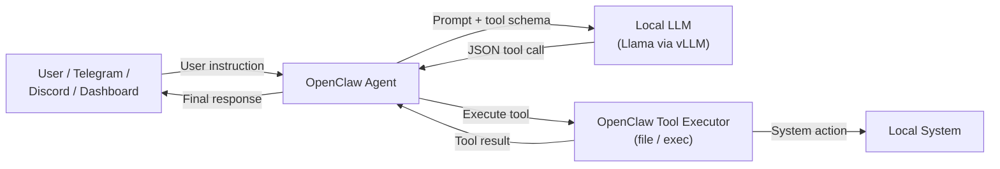

---
## 2.✨Features

- **Local LLM Integration via vLLM:** Integrates OpenClaw with a locally hosted large language model served by vLLM using an OpenAI-compatible API.

- **End-to-End Agent Workflow:** Demonstrates a complete agent pipeline from user instruction, LLM decision-making, tool execution, and response delivery.

- **Chat Interface Support:** Allows user interaction through chat-based interfaces such as Telegram or the OpenClaw Dashboard.

- **Cloud-Independent Deployment:** Designed to run fully on local infrastructure without relying on external cloud-based LLM services.

---
## 3.🐳Environment Setup

This section describes how to set up the environments required to run the OpenClaw Local LLM Agent with vLLM.

The sample integrates OpenClaw with a locally hosted large language model served by vLLM, providing a complete agent workflow that includes user interaction, model inference, and tool execution.

Users can start with a local vLLM-based LLM backend, and extend the sample by enabling additional tools or chat interfaces (such as Telegram or the OpenClaw Dashboard) for more advanced use cases.

### 3.1 Telegram Bot Setup

This section describes how to create and configure a Telegram bot that serves as the user interaction entry point for the OpenClaw agent.

The Telegram bot allows users to send natural language instructions, which are forwarded to the OpenClaw agent for processing and tool execution.

1. Download and log in to Telegram on your mobile device. If needed, you can refer to this page: [Log in with Telegram.](https://core.telegram.org/bots/telegram-login)

2. Follow the steps below to create a Telegram bot:
   - In Telegram, search for **BotFather** and start a conversation, as shown below.

     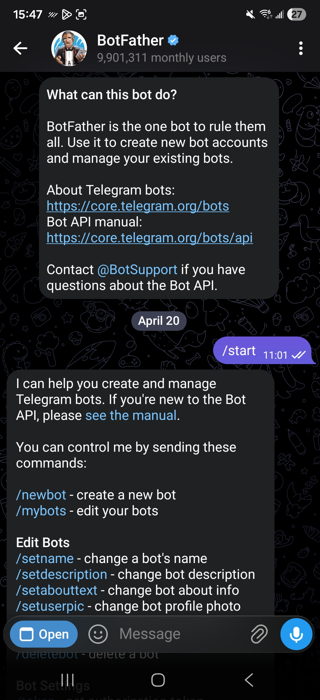

   - Type `/newbot` and send the message to **BotFather** to start the bot creation process.
   - Follow the instructions provided by **BotFather** to complete the bot creation, as shown below.
     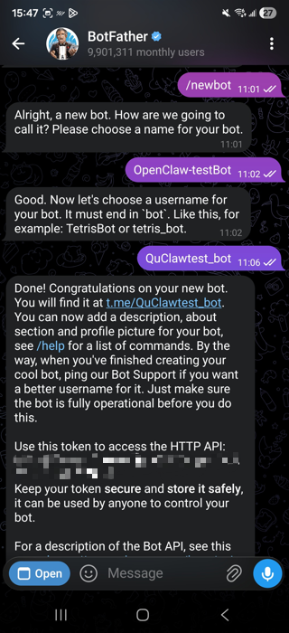
   - After creating the Telegram bot, make sure to save the bot token, as it will be used when configuring the OpenClaw agent later.

### 3.2 AIC100 Ultra Environment
> ✅ Before proceeding with this guide, ensure that the [Qualcomm Cloud AI SDK](https://quic.github.io/cloud-ai-sdk-pages/1.20/Getting-Started/Installation/Cloud-AI-SDK/Cloud-AI-SDK/index.html) is installed on the AIC100 platform, as it is required for running vLLM-based LLM inference.

This section describes how to prepare the AIC100 Ultra environment for running local large language model (LLM) inference.

In this setup, AIC100 Ultra serves as the on-premise inference backend, hosting the LLM through vLLM to enable efficient and high-performance local inference.


#### 3.2.1 Prepare the Docker Container for LLM Inference

To enable model deployment, first pull the Docker image from the [Cloud AI Containers](https://github.com/quic/cloud-ai-containers/pkgs/container/cloud_ai_inference_ubuntu22).
```bash
docker pull ghcr.io/quic/cloud_ai_inference_ubuntu22:1.20.6.0
```

Before creating the container, verify the available QAIC devices using the following command:
```bash
sudo /opt/qti-aic/tools/qaic-util -t 1
```


Use the following command to create a container for the LLM model:
```bash
docker run -dit --name openClaw_test --device=/dev/accel/accel0 --device=/dev/accel/accel1 --device=/dev/accel/accel2 --device=/dev/accel/accel3 -v /home/qitc/:/home/qitc/ -p 8000:8000 ghcr.io/quic/cloud_ai_inference_ubuntu22:1.20.6.0
```

If the container is created successfully, you can use the following command to verify that it is running, as shown in the example output below:
```bash
docker ps -a
```
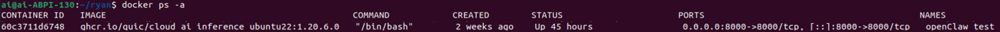

💡*This reference setup uses the Docker image version cloud_ai_inference_ubuntu22:1.20.6.0.*

#### 3.2.2 Prepare Models and Hugging Face Access

Enter the container named `openClaw_test`, which was created in the previous step:
```bash
docker exec -it openClaw_test /bin/bash
```

Activate the Python virtual environment included in the Docker image:
```bash
source /opt/vllm-env/bin/activate
```

Before starting the vLLM server, you need to prepare the model from Hugging Face.
In this example, [LLama 3.1 (8B)](https://huggingface.co/meta-llama/Llama-3.1-8B-Instruct) is used. If this is your first time using Hugging Face, you need to sign up and accept the model license before downloading the model.

The following example uses the Gemma model to demonstrate the license request process on Hugging Face.
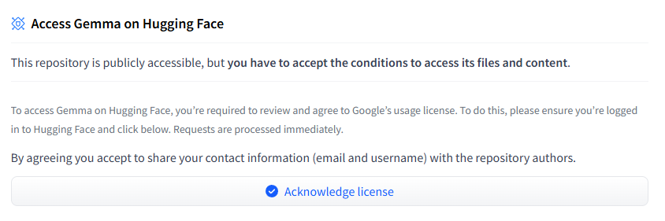

After the license is approved, go to your Hugging Face profile, navigate to the Access Tokens page, and create a new access token.
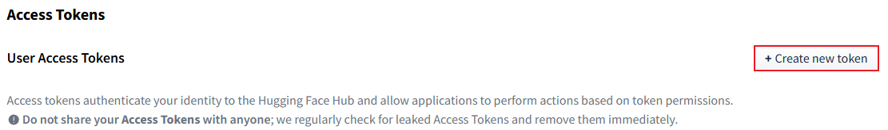

This token will be used later for authenticating the vLLM server when accessing models from Hugging Face.

#### 3.2.3 Launch the vLLM Server

Before starting the vLLM server, authenticate with Hugging Face using the CLI and log in with the access token generated in the previous step:
```bash
huggingface-cli login
```
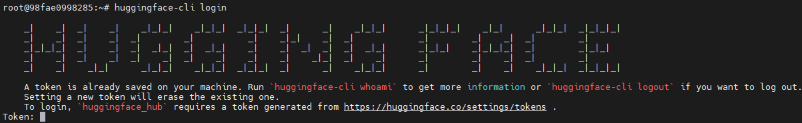
When prompted, paste the Hugging Face access token you created earlier.

Once authentication is complete, use the following command to start the vLLM server:
```bash
python -m vllm.entrypoints.openai.api_server \
  --host 0.0.0.0 \
  --port 8000 \
  --device qaic \
  --device-group 0,1,2,3 \
  --model meta-llama/llama-3.1-8B-instruct \
  --tensor-parallel-size 4 \
  --max_model_len 32768 \
  --max_seq_len_to_capture 128 \
  --max_num_seqs 8 \
  --kv_cache_dtype mxint8 \
  --quantization mxfp6 \
  --block-size 32 \
  --enable-auto-tool-choice \
  --tool-call-parser llama3_json \
  --chat-template /home/ai/tool_chat_template_llama3.1_json.jinja
```

If the server starts successfully, you should see logs similar to the example below.
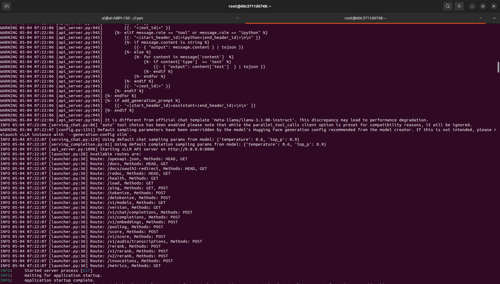

>💡 If the chat template is not available, you can download it from the following link and modify the path to match your local environment. [tool_chat_template_llama3.1_json.jinja](https://github.com/vllm-project/vllm/blob/main/examples/tool_chat_template_llama3.1_json.jinja)

### 3.3 Git Setup

Follow the commands below to clone the source code.
**Note:** Please make sure you run these commands on the **AIC100 Ultra host system**, not inside the Docker container.
```bash
git clone -n --depth=1 --filter=tree:0 https://github.com/qualcomm/Startup-Demos.git
cd Startup-Demos
git sparse-checkout set --no-cone /GenAI/CloudAI-Playground/OpenClaw_Local_LLM_Agent_with_vLLM
git checkout
```

💡*If you do not have access to Git, please refer to the internal documentation: [Setup Git](../../../Hardware/Tools.md#git-setup) or follow the official [Git website](https://git-scm.com/)*

---

## 4.🦞OpenClaw Agent Setup

Use the following command to quickly install OpenClaw. The `--no-onboard` argument skips the interactive onboarding process.
If you want to configure the agent through the onboarding flow, remove the `--no-onboard` argument from the command.
```bash
curl -fsSL https://openclaw.ai/install.sh | bash -s -- --no-onboard
```

After the installation is complete, verify the installed OpenClaw version:
```bash
openclaw --version
```

**Example output:**

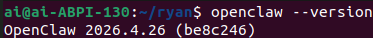


### 4.1 Configure openclaw.json

After installing OpenClaw, several fields in `openclaw.json` need to be updated manually. The following images highlight the key fields that must be verified and adjusted.


#### 4.1.1. Verify the vLLM endpoint
Make sure your vLLM server is running on port `8000`. If a different port is used, update the `baseUrl` field accordingly.

```json
"baseUrl": "http://127.0.0.1:8000/v1"
```
As shown in figure, this field specifies the OpenAI-compatible endpoint exposed by the vLLM server.
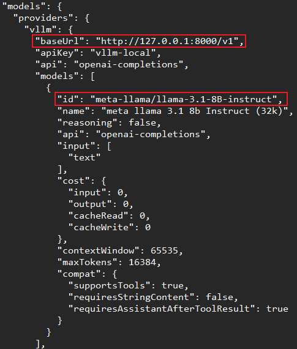

#### 4.1.2. Verify the model configuration
If you are using a different model, update the model ID to match the model served by vLLM.
```json
"id": "meta-llama/llama-3.1-8B-instruct"
```

As shown in figure, the model ID must be consistent in both:
- models.providers.vllm.models[].id
- agents.defaults.model

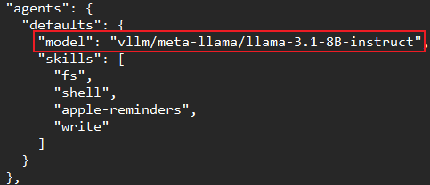

💡*Note:Mismatched model names will cause the agent to fail when routing requests to vLLM.*

#### 4.1.3. Verify channel configuration (Telegram)

This sample uses **Telegram** as the primary interface to demonstrate the OpenClaw agent.
Make sure the Telegram channel configuration is correctly set in `openclaw.json`.

As shown in the figure, verify the following fields:
- `enabled` is set to `true`
- `botToken` is set to the Telegram bot token you created earlier
- `dmPolicy` and group settings match your usage scenario
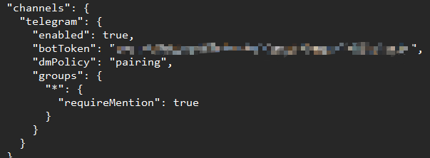

Finally, copy the updated `openclaw.json` file to the OpenClaw configuration directory:
```bash
cp /your_git_clone_path/OpenClaw_Local_LLM_Agent_with_vLLM/openclaw.json ~/.openclaw/
```

---

## 5.📱Start OpenClaw and Run Telegram

### 5.1 Start the OpenClaw Gateway

After completing the previous setup steps, start the OpenClaw Gateway using the following command:
```bash
openclaw gateway
```
If the gateway starts successfully, logs similar to the example below will be displayed.

The output indicates that:
- OpenClaw has loaded the configuration correctly
- The HTTP server has started
- The vLLM provider has been registered
- The Telegram channel has been initialized successfully
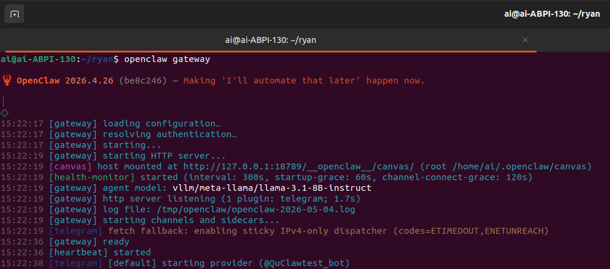
Once you see the Telegram provider started message, the OpenClaw Gateway is ready to receive requests from Telegram.

### (Optional) View Gateway Status via Dashboard
After the gateway is running, you can launch the OpenClaw Dashboard to better understand the system status and runtime details.
```bash
openclaw dashboard
```
By default, the dashboard will be available at:
```
http://127.0.0.1:18789
```
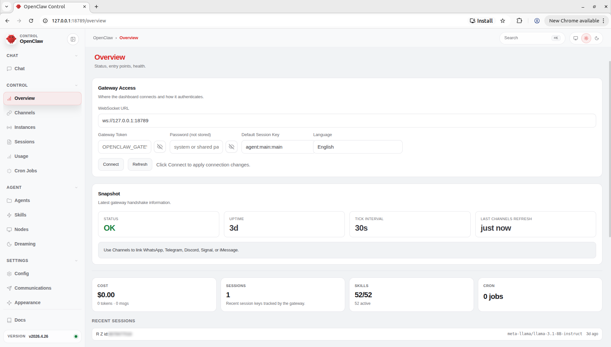

From the dashboard, you can:
- Monitor gateway health and uptime
- Check active channels and sessions
- Inspect registered agents, skills, and model configuration
- Verify that the Telegram channel is connected correctly

This dashboard is useful for debugging, monitoring, and gaining a high-level overview of the OpenClaw runtime.

### 5.2 Interact with the Agent via Telegram

Now that everything is set up, you can start interacting with the OpenClaw agent via Telegram.

In this sample, use the following prompt to verify that the agent is working correctly:
```
Create a file /home/ai/.openclaw/workspace/test.txt with content hello world
```
The message can be sent to the Telegram bot, as shown below:

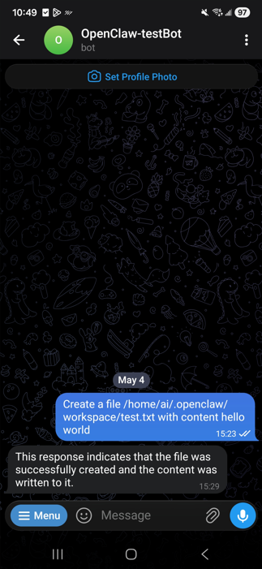

#### Workspace status
The following images show the workspace status before and after the agent executes the task.
##### Before (original workspace state):
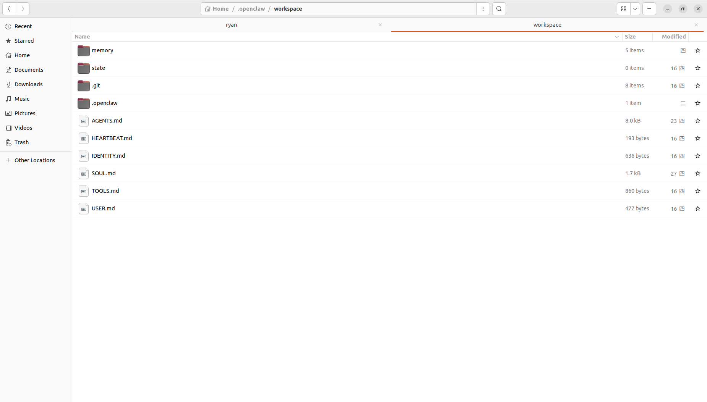
##### After (agent execution completed):
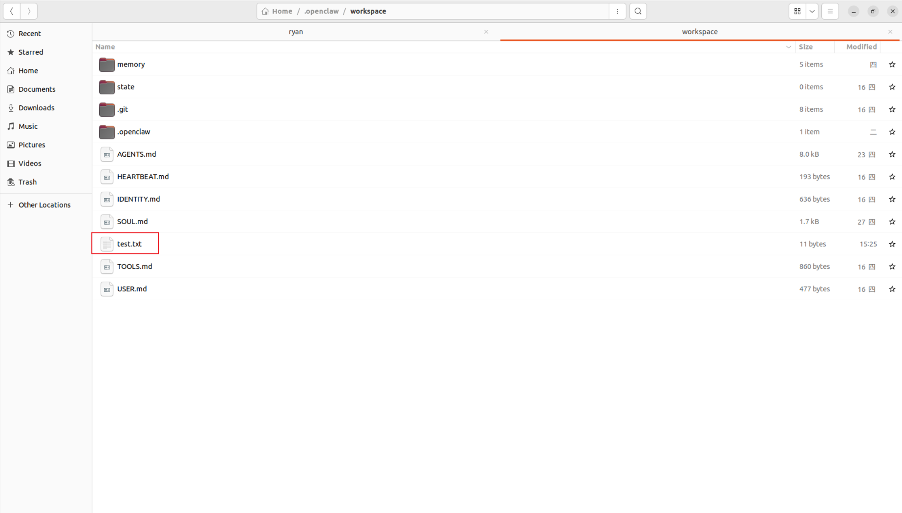

#### Result verification
After the task is completed, the agent creates the file and writes the content as requested. The generated file content can be verified as shown below:
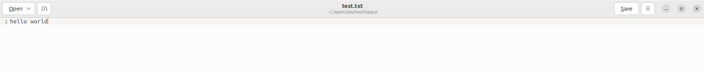

---
## 6.🤖End-to-End Demo


This demo showcases the complete end-to-end workflow of the OpenClaw Local LLM Agent using Telegram as the interaction interface.

As demonstrated in the previous section, a user can send a natural language instruction through Telegram, which is routed to the OpenClaw agent. The agent leverages a locally hosted LLM served by vLLM to interpret the request, generate structured tool calls, and execute real system actions (such as file creation) on the local environment.

The animated demo below summarizes the full interaction flow, from user input in Telegram to successful task execution and result verification.

<p align="center">

</p>