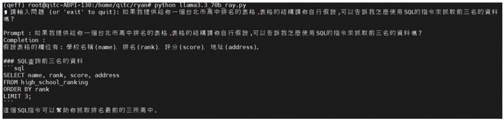

# Implementing a Chatbot with Llama 3.3 70B on AIC100 Ultra

## Table of Contents
- [Overview](#1-overview)
- [Features](#2-features)
- [Install Platform and App SDK](#3-install-platform-and-app-sdk)
- [Enable Root Access](#4-enable-root-access)
- [Activate the `qeff` Environment](#5-activate-the-qeff-environment)
- [Download the Pre-compiled Llama 3.3 70B Model](#6-download-the-pre-compiled-llama-33-70b-model)
- [Extract the Model](#7-extract-the-model)
- [Download the code demo.py in this repository](#8-download-the-code-demopy-in-this-repository)
- [Demo](#9-demo)
- [Example](#10-example)

---

# 1. Overview

This guide outlines the steps to implement a chatbot using the Llama 3.3 70B model on the AIC100 Ultra platform.

---

# 2. Features

- Pre-compiled Llama3.3 70B models with 8k ctx_len.
- Python API "QEfficient.generation.text_generation_inference.cloud_ai_100_exec_kv".
- Enabling steam function for smooth inference result.
- while loop to avoid reload model to AIC100 Ultra card.

---


# 3. Install Platform and App SDK

Follow the official installation guide from Efficient Transformers:  
👉 https://quic.github.io/efficient-transformers/source/installation.html

# 4. Enable Root Access

```bash
sudo -i
```

# 5. Activate the `qeff` Environment

```bash
source /opt/qti-aic/dev/python/qeff/bin/activate
```

# 6. Download the Pre-compiled Llama 3.3 70B Model

Download from:  
https://qualcom-qpc-models.s3-accelerate.amazonaws.com/SDK1.19.6/meta-llama/Llama-3.3-70B-Instruct/qpc_16cores_128pl_8192cl_1fbs_4devices_mxfp6_mxint8.tar.gz

# 7. Extract the Model

Extract the tarball to your desired directory:

```bash
tar -xzvf qpc_16cores_128pl_8192cl_1fbs_4devices_mxfp6_mxint8.tar.gz -C /your/target/folder
```

# 8. Download the code demo.py in this repository

Download or directly copy the code demo.py in this repository

# 9. Demo

```bash
python demo.py
```

# 10. Example:





