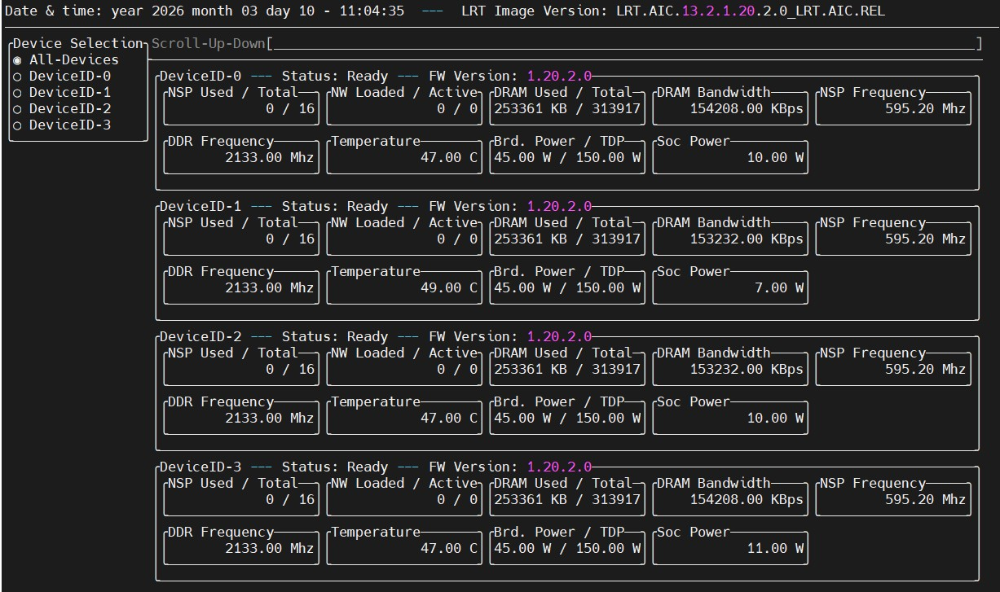
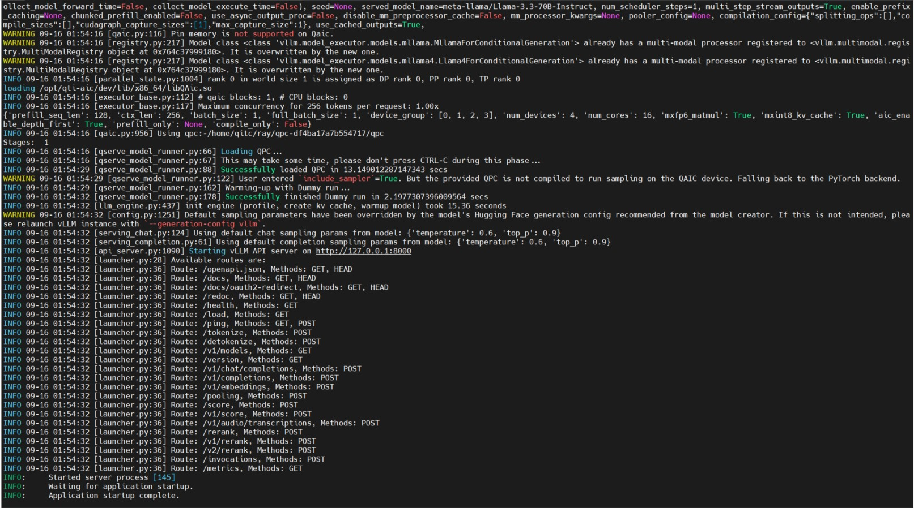

# [Startup_Demo](../../../)/[GenAI](../../)/[CloudAI-Playground](../)/[online_server_endpoint_stream](./)

# Online OpenAI-Compatible Streaming Server on AIC100 Ultra

## Table of Contents
- [1. Overview](#1-overview)
- [2. Requirements](#2-requirements)
  - [2.1 Hardware](#21-hardware)
  - [2.2 Software](#22-software)
- [3. Model Optimization & Inference Stack](#3-model-optimization--inference-stack)
- [4. System Workflow](#4-system-workflow)
- [5. Setup Instructions](#5-setup-instructions)
  - [5.1 Clone the Repository](#51-clone-the-repository)
  - [5.2 Download Pre-compiled Model (QPC)](#52-download-pre-compiled-model-qpc)
  - [5.3 Pull Docker Image](#53-pull-docker-image)
  - [5.4 Run Server Container](#54-run-server-container)
  - [5.5 LLM: Enter Container & Build vLLM Environment](#55-llm-enter-container--build-vllm-environment)
- [6. Run the Demo](#6-run-the-demo)
  - [6.1 Launch Server Endpoint](#61-launch-server-endpoint)
  - [6.2 Run Streaming Client](#62-run-streaming-client)
- [7. Demo Output](#7-demo-output)

---

## 1. Overview

This sample demonstrates an **on‑prem OpenAI‑compatible online inference endpoint with streaming support (`stream=true`)** running on **Qualcomm Cloud AI 100 Ultra (AIC100 Ultra)**.

It uses **vLLM with QAIC backend** to serve **Llama 3.3 70B (32K context length)** and supports **token‑by‑token streaming responses** suitable for chat, agent, and interactive applications.

This demo **does not fork or redistribute vLLM source code**. Instead, it provides a **patch** that adds streaming output support to the official vLLM OpenAI chat completion Python client example.

---

## 2. Requirements

### 2.1 Hardware

- Qualcomm **Cloud AI 100 Ultra (AIC100 Ultra)** PCIe cards
- Devices exposed as `/dev/accel/accel*`
- Optimized for **LLM inference** workloads

Reference:
https://www.qualcomm.com/artificial-intelligence/data-center/cloud-ai-100-ultra#Overview

### 2.2 Software

- Ubuntu Linux host
- Docker
- Qualcomm Cloud AI SDK (Platform & Apps) **v1.20.2**
- **vLLM (QAIC backend)**

### Hardware Status Check (QAIC)

```bash
sudo /opt/qti-aic/tools/qaic-util -t 1
```
Expected behavior:

QAIC devices are detected successfully
No error messages are reported
Driver, firmware, and SDK are operating normally




---

## 3. Model Optimization & Inference Stack
This sample uses the standard Qualcomm Cloud AI software stack:

- **Cloud AI SDK (Platform & Apps)**: device drivers, runtime, and tooling

Reference (Software section):
https://www.qualcomm.com/artificial-intelligence/data-center/cloud-ai-100-ultra#Software
- **Efficient Transformer Library**: Transformer optimizations for QAIC

Documentation: https://quic.github.io/efficient-transformers/source/release_docs.html

Validated models: https://quic.github.io/efficient-transformers/source/validate.html
- **vLLM**: OpenAI‑compatible serving with streaming support

Reference:
https://quic.github.io/cloud-ai-sdk-pages/latest/Getting-Started/Installation/vLLM/vLLM/
- **Pre‑compiled QPC artifacts** for fast bring‑up

Model catalog:
http://qualcom-qpc-models.s3-website-us-east-1.amazonaws.com/QPC/catalog-index/

---

## 4. System Workflow


---

## 5. Setup Instructions

### 5.1 Clone the Repository

```bash
mkdir yourname/
cd yourname/
git clone -n --depth=1 --filter=tree:0 https://github.com/qualcomm/Startup-Demos.git
cd Startup-Demos
git sparse-checkout set --no-cone /GenAI/CloudAI-Playground/online_server_endpoint_stream/
git checkout
cd GenAI/CloudAI-Playground/online_server_endpoint_stream
```

---

### 5.2 Download Pre-compiled Model (QPC)

Download from:  
https://qualcom-qpc-models.s3-accelerate.amazonaws.com/SDK1.19.6/meta-llama/Llama-3.3-70B-Instruct/qpc_16cores_128pl_8192cl_1fbs_4devices_mxfp6_mxint8.tar.gz

Extract the tarball to your desired directory:

```bash
tar -xzvf qpc_16cores_128pl_8192cl_1fbs_4devices_mxfp6_mxint8.tar.gz -C /path to yourname folder/Startup-Demos/GenAI/CloudAI-Playground/online_server_endpoint_stream
```

---

### 5.3 Pull Docker Image

```bash
docker pull ghcr.io/quic/cloud_ai_inference_ubuntu22:1.20.2.0
```

---

### 5.4 Run Server Container

```bash
docker run -dit \
  --name yourname \
  --device=/dev/accel/accel0 \
  --device=/dev/accel/accel1 \
  --device=/dev/accel/accel2 \
  --device=/dev/accel/accel3 \
  -v /path to yourname folder/Startup-Demos/GenAI/CloudAI-Playground/online_server_endpoint_stream/:/path to yourname folder/Startup-Demos/GenAI/CloudAI-Playground/online_server_endpoint_stream/ \
  -p 8000:8000 \
  ghcr.io/quic/cloud_ai_inference_ubuntu22:1.20.2.0
```

### 5.5 LLM: Enter Container & Build vLLM Environment
```bash
docker exec -it yourname /bin/bash
cd /path to yourname folder/Startup-Demos/GenAI/CloudAI-Playground/online_server_endpoint_stream
python3.10 -m venv qaic-vllm-venv
source qaic-vllm-venv/bin/activate
pip install -U pip
pip install git+https://github.com/quic/efficient-transformers@release/v1.20.0

git clone https://github.com/vllm-project/vllm.git
cd vllm
git checkout v0.8.5
git apply /opt/qti-aic/integrations/vllm/qaic_vllm.patch
git apply /path to yourname folder/Startup-Demos/GenAI/CloudAI-Playground/online_server_endpoint_stream/0001-add-streaming-support-to-openai-client.patch
export VLLM_TARGET_DEVICE="qaic"
pip install -e .
```
> ⚠️ If you encounter Torch/Inductor compiler errors, install a compiler inside the container:
```bash
apt update
apt install -y build-essential
```

---

## 6. Run the Demo

### 6.1 Launch Server Endpoint

```bash
python -m vllm.entrypoints.openai.api_server  \
--host 0.0.0.0 \
--port 8000 \
--device-group 0,1,2,3 \
--max_model_len 8192 \
--max_seq_len_to_capture 128 \
--max_num_seqs 1 \
--kv_cache_dtype mxint8 \
--quantization mxfp6 \
--model meta-llama/Llama-3.3-70B-Instruct \
--tensor-parallel-size 4 \
--device qaic \
--block-size 32 \
--gpu-memory-utilization 0.5 \
--override-qaic-config "qpc_path=/path to yourname folder/Startup-Demos/GenAI/CloudAI-Playground/online_server_endpoint_stream/qpc-47fbd6f53bf548c7/qpc" \
```



---

### 6.2 Run Streaming Client

```bash
python examples/online_serving/openai_chat_completion_client.py
```

---

## 7. Demo Output

- Server starts successfully on port `8000`
- Client receives **token-by-token streaming output**


