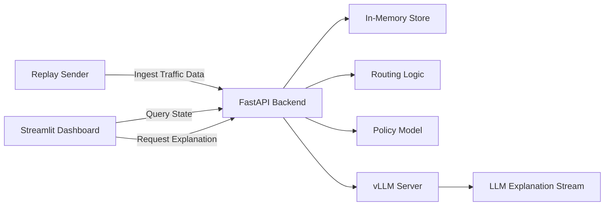

# [Startup_Demo](../../../)/[GenAI](../../)/[CloudAI-Playground](../)/[traffic_ai_agent](./)

# Traffic AI Agent – Dual Intersection (On‑Prem, Analysis)

## Table of Contents
- [1. Overview](#1-overview)
- [2. Requirements](#2-requirements)
  - [2.1 Hardware](#21-hardware)
  - [2.2 Software](#22-software)
- [3. Model Optimization & Inference Stack](#3-model-optimization--inference-stack)
  - [3.1 Cloud AI SDK (Platform & Apps) v1.20.2.0](#31-cloud-ai-sdk-platform--apps-v12020)
  - [3.2 Efficient Transformer Library](#32-efficient-transformer-library)
  - [3.3 vLLM (OpenAI-Compatible Serving)](#33-vllm-openai-compatible-serving)
  - [3.4 Pre-Compiled Model Binaries (QPC)](#34-pre-compiled-model-binaries-qpc)
- [4. System Workflow](#4-system-workflow)
- [5. Setup Instructions](#5-setup-instructions)
  - [5.1 Clone the Repository](#51-clone-the-repository)
  - [5.2 Host: Create Python Virtual Environment](#52-host-create-python-virtual-environment)
  - [5.3 Host: Install Python Dependencies](#53-host-install-python-dependencies)
  - [5.4 Host: (Optional) Train Policy Model](#54-host-optional-train-policy-model)
  - [5.5 LLM: Download the Pre-compiled model and Start vLLM Docker Container (QAIC)](#55-llm-download-the-pre-compiled-model-and-start-vllm-docker-container-qaic)
  - [5.6 LLM: Enter Container & Build vLLM Environment](#56-llm-enter-container--build-vllm-environment)
  - [5.7 LLM: Launch vLLM OpenAI-Compatible Server](#57-llm-launch-vllm-openai-compatible-server)
- [6. Run the Demo (Daily Startup)](#6-run-the-demo-daily-startup)
- [7. Remote Access via SSH Port Forwarding](#7-remote-access-via-ssh-port-forwarding)
- [8. How to Read the Dashboard](#8-how-to-read-the-dashboard)
- [9. Project Files](#9-project-files)
- [10. Troubleshooting](#10-troubleshooting)
- [11. Demo Output](#11-demo-output)

---
## 1. Overview
This project is an **on‑prem traffic AI demo** that:
- Ingests dual‑intersection traffic state (A/B) via a replay sender.
- Serves a FastAPI backend that stores a sliding window of state in memory.
- Computes a **route recommendation** (direct vs via_B) and streams an **LLM explanation**.
- Displays metrics, time‑series charts, route decision, and explanation history in a Streamlit dashboard.

Analysis mode behavior:
- ✅ Route decision appears first
- ✅ LLM explanation streams token‑by‑token
- ✅ Keeps a bounded history (e.g., last 3) per intersection

---

## 2. Requirements

### 2.1 Hardware

This demo is intended for an **on‑premise deployment** scenario, where all AI inference, control logic, and data handling are executed locally on dedicated hardware rather than relying on public cloud services.

**On‑Prem Deployment Characteristics**
- Local execution with predictable latency for real‑time traffic decisions
- Data privacy and locality (traffic states and decisions stay on the host)
- Full control over hardware resources, scaling, and software stack

The hardware platform used in this sample is based on **Qualcomm Cloud AI 100 Ultra (AIC100 Ultra)** accelerators. These are purpose‑built PCIe inference cards optimized for high‑performance and power‑efficient AI inference workloads, including Generative AI and Large Language Models (LLMs).

**Qualcomm Cloud AI 100 Ultra in This Demo**
- Optimized specifically for AI **inference** (not training)
- Suitable for large Transformer and LLM workloads
- Supports multi‑SoC configurations on a single card
- Exposed to Linux through the compute accelerator framework as `/dev/accel/accel*`

Reference (Cloud AI 100 Ultra Overview):
https://www.qualcomm.com/artificial-intelligence/data-center/cloud-ai-100-ultra#Overview

### 2.2 Software

- Linux host (Ubuntu recommended)
- Python 3.10 (host)
- Docker (host)
- vLLM with QAIC backend (inside Docker)
- Streamlit (host)

---

## 3. Model Optimization & Inference Stack

This demo uses a standard Qualcomm Cloud AI software toolchain to **prepare models**, **serve them**, and **execute inference on Cloud AI 100 Ultra**.

### 3.1 Cloud AI SDK (Platform & Apps) v1.20.2.0

- **Platform SDK** provides the Linux driver, runtime, and system‑level tools required to access Cloud AI devices.
- **Apps SDK** provides model preparation, compilation, and deployment workflows for Cloud AI accelerators.

Reference (Software section):
https://www.qualcomm.com/artificial-intelligence/data-center/cloud-ai-100-ultra#Software

### 3.2 Efficient Transformer Library

This sample uses Qualcomm’s **Efficient Transformer Library** to optimize Transformer‑based models for Cloud AI 100 Ultra. The library enables model transformations and optimizations that make large models executable and efficient on QAIC hardware.

- Documentation: https://quic.github.io/efficient-transformers/source/release_docs.html
- Validated models: https://quic.github.io/efficient-transformers/source/validate.html

### 3.3 vLLM (OpenAI-Compatible Serving)

LLMs are served using **vLLM** with QAIC backend support, exposing an OpenAI‑compatible API and enabling token‑by‑token streaming responses used by the dashboard.

Reference:
https://quic.github.io/cloud-ai-sdk-pages/latest/Getting-Started/Installation/vLLM/vLLM/

### 3.4 Pre-Compiled Model Binaries (QPC)

For faster bring‑up and validation, this demo supports **pre‑compiled QPC artifacts**, which can be used instead of compiling models from source.

Model catalog:
http://qualcom-qpc-models.s3-website-us-east-1.amazonaws.com/QPC/catalog-index/

---

## 4. System Workflow

> **Note**: This diagram uses Mermaid. If it is not rendered in your viewer, please view this README on GitHub.



---

## 5. Setup Instructions

### 5.1 Clone the Repository

```bash
mkdir /home/qitc/yourfolder/
cd /home/qitc/yourfolder/
git clone -n --depth=1 --filter=tree:0 https://github.com/qualcomm/Startup-Demos.git
cd Startup-Demos
git sparse-checkout set --no-cone /GenAI/CloudAI-Playground/traffic_ai_agent/
git checkout
cd GenAI/CloudAI-Playground/traffic_ai_agent
```


### 5.2 Host: Create Python Virtual Environment
```bash
cd /home/qitc/yourfolder/traffic_ai_agent
python3.10 -m venv .venv
```

### 5.3 Host: Install Python Dependencies
```bash
cd /home/qitc/yourfolder/traffic_ai_agent
source .venv/bin/activate
pip install -U pip
pip install -r requirements.txt
```

### 5.4 Host: (Optional) Train Policy Model
Skip if `app/policy/policy_model.pt` already exists.
```bash
cd /home/qitc/yourfolder/traffic_ai_agent
source .venv/bin/activate
cd app/policy
python train_policy.py
cd ../../
```

### 5.5 LLM: Download the Pre-compiled model and Start vLLM Docker Container (QAIC)

Download from:  
https://qualcom-qpc-models.s3-accelerate.amazonaws.com/SDK1.19.6/meta-llama/Llama-3.3-70B-Instruct/qpc_16cores_128pl_8192cl_1fbs_4devices_mxfp6_mxint8.tar.gz


Extract the tarball to your desired directory:

```bash
tar -xzvf qpc_16cores_128pl_8192cl_1fbs_4devices_mxfp6_mxint8.tar.gz -C /home/qitc/yourfolder/
```

download the docker image and run the container:

```bash
docker pull ghcr.io/quic/cloud_ai_inference_ubuntu22:1.20.2.0
```


```bash
docker run -dit --name yourname \
  --device=/dev/accel/accel0 \
  --device=/dev/accel/accel1 \
  --device=/dev/accel/accel2 \
  --device=/dev/accel/accel3 \
  -v /home/qitc/:/home/qitc/ \
  -p 8000:8000 \
  ghcr.io/quic/cloud_ai_inference_ubuntu22:1.20.2.0
```

### 5.6 LLM: Enter Container & Build vLLM Environment
```bash
docker exec -it yourname /bin/bash
python3.10 -m venv qaic-vllm-venv
source qaic-vllm-venv/bin/activate
pip install -U pip
pip install git+https://github.com/quic/efficient-transformers@release/v1.20.0

git clone https://github.com/vllm-project/vllm.git
cd vllm
git checkout v0.8.5
git apply /opt/qti-aic/integrations/vllm/qaic_vllm.patch
export VLLM_TARGET_DEVICE="qaic"
pip install -e .
```
> ⚠️ If you encounter Torch/Inductor compiler errors, install a compiler inside the container:
```bash
apt update
apt install -y build-essential
```

### 5.7 LLM: Launch vLLM OpenAI-Compatible Server
```bash
python -m vllm.entrypoints.openai.api_server  \
--host 0.0.0.0 \
--port 8000 \
--device-group 0,1,2,3 \
--max_model_len 8192 \
--max_seq_len_to_capture 128 \
--max_num_seqs 1 \
--kv_cache_dtype mxint8 \
--quantization mxfp6 \
--model meta-llama/Llama-3.3-70B-Instruct \
--tensor-parallel-size 4 \
--device qaic \
--block-size 32 \
--gpu-memory-utilization 0.5 \
--override-qaic-config "qpc_path=/home/qitc/yourfolder/qpc-47fbd6f53bf548c7/qpc" \
--speculative-config '{"num_speculative_tokens":5,"model":"meta-llama/Llama-3.2-1B-Instruct","quantization":"mxfp6","draft_override_qaic_config":{"device_group":[0,1,2,3],"num_cores":8,"kv_cache_dtype":"mxint8", "mos":2}}'
```

---

## 6. Run the Demo (Daily Startup)

```bash
# Terminal 1: FastAPI
source .venv/bin/activate
uvicorn app.main:app --host 0.0.0.0 --port 9000

# Terminal 2: Replay sender
source .venv/bin/activate
python replay_sender_dual.py

# Terminal 3: Streamlit UI
source .venv/bin/activate
streamlit run ui/dashboard_dual.py
```

---

## 7. Remote Access via SSH Port Forwarding

### 8.1 How to Access the Dashboard Remotely
If the demo is running on a **remote host** (For example: `172.16.250.30`) and you want to view the Streamlit UI on **your local computer**, you must create an SSH tunnel.

On your **local machine**, open CMD / Terminal and run:
```bash
ssh -L 8501:localhost:8501 remotehost@IPaddress
```
Then enter your SSH password.

After this command succeeds, open your local browser and go to:
```
http://localhost:8501
```

### 8.2 Why This Is Required
- Streamlit binds to `localhost:8501` **on the remote host only**.
- Firewalls typically block direct access to that port.
- SSH port forwarding creates a secure tunnel that maps:
  - `localhost:8501` (your laptop)
  - → `localhost:8501` (remote host)

This allows you to access the demo **without exposing ports publicly**.

---

## 8. How to Read the Dashboard

### 8.1 Metrics
- **NS/EW queue (0–1)**: congestion level
- **NS/EW flow (0–1)**: throughput
- **Current phase**: active signal phase

### 8.2 Time-Series Charts
- Each point represents one replay ingest.
- Rising queue → accumulating congestion.

### 8.3 Explain (Route First, Then LLM Streaming)
- Route decision appears immediately.
- LLM explanation streams token‑by‑token.

---

## 9. Project Files
- `app/main.py` – FastAPI backend
- `app/store.py` – In‑memory store
- `app/context.py` – Trend / event context
- `app/routing.py` – Route comparison
- `app/llm_agent.py` – vLLM streaming client
- `app/policy/infer.py` – Policy inference
- `dashboard_dual.py` – Streamlit analysis UI
- `replay_sender_dual.py` – Data replay

---

## 10. Troubleshooting

### Replay running but UI empty
- Check `/state` endpoint returns 200

### Route shows but no text
- Ensure Streamlit placeholders use `markdown()` not `write(a,b)`

---

## 11. Demo Output

- Dashboard overview
- Explain (route first, streaming text)
- Explanation history

