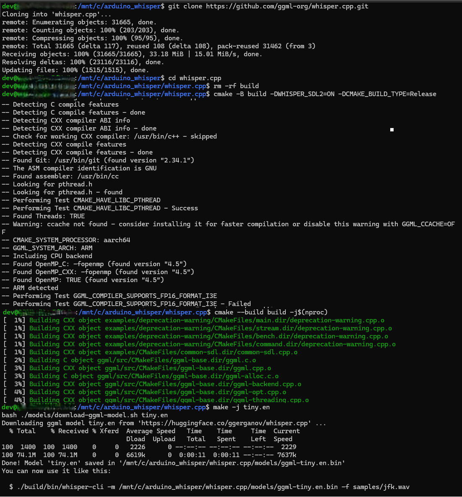
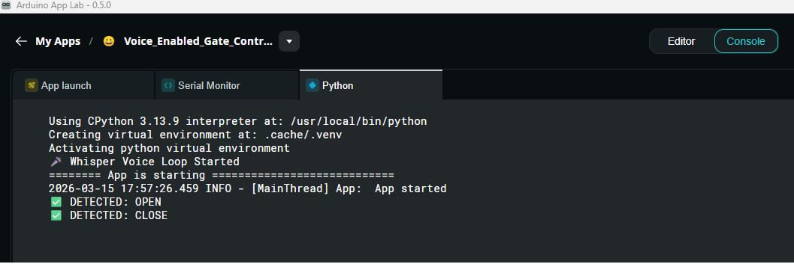

# [Startup_Demo](../../../)/[GenAI](../../)/[IoT-Robotics](../)/[Voice_Enabled_Gate_Control_System](./)

# Voice Enabled Gate Control System 

## Table of Contents
- [1. Overview](#1-overview)
- [2. Requirements](#2-requirements)
  - [2.1 Hardware Requirements](#21-hardware-requirements)
  - [2.2 Software Requirements](#22-software-requirements)
- [3. System Workflow](#3-system-workflow)
- [4. Setup Instructions](#4-setup-instructions)
  - [4.1 Setting Up Visual Studio Code (VS Code)](#41-setting-up-visual-studio-code-vs-code)
  - [4.2 Setting Up Arduino App Lab](#42-setting-up-arduino-app-lab)
  - [4.3 Setting Up Arduino Flasher Cli](#43-setting-up-arduino-flasher-cli)
  - [4.4 Setting Up Arduino UNO-Q Device](#44-setting-up-arduino-uno-q-device)
- [5. Whisper Binary Compilation on WSL](#5-whisper-binary-compilation-on-wsl)
- [6. Source Code Setup on Device](#6-source-code-setup-on-device)
- [7. Upload the Model and Required .so Files to the Device](#7-upload-the-model-and-required-so-files-to-the-device)
- [8. Optional: Compile Whisper Directly on the Arduino UNO Q.](#8-optional-compile-whispercpp-directly-on-the-arduino-uno-q)
- [9. Run the Voice_Enabled_Gate_Control_System Application.](#9-run-the-voice_enabled_gate_control_system-application)
- [10 Application Output.](#10-application-output)

## 1. Overview.

The **Voice Enabled Gate Control System** demonstrates how speech commands can be used to control a physical gate mechanism using the **Arduino® UNO Q**  platform.
The system captures voice input through a USB Mic, converts speech to text using the Whisper speech‑to‑text model, and interprets predefined commands such as:

- **Open Gate**
- **Close Gate**

Based on the recognized command, the Arduino UNO Q controls a motor driver to open or close the gate safely while providing visual and audible feedback using LEDs.

## 2. Requirements.

- 🎙️ Voice Command Recognition: Converts spoken commands into text using the Whisper model.
- 🧠 Command Interpretation: Identifies valid gate commands from transcribed text.
- 🔒 Safety Mechanisms: Limit switches prevent over‑travel of the gate.

### 2.1. Hardware Requirements. 

- **[Arduino® UNO Q](../../../Hardware/Arduino_UNO-Q.md#arduino-uno-q)**
- USB Microphone (x1)
- USB-C® hub adapter with external power (x1)
- A power supply (5 V, 3 A) for the USB hub (e.g., a phone charger)
- Snapdragon (Arm64) Windows PC for Compile the Binary.

### Arduino® UNO Q + USB Microphone Setup.

- Connect an USB-C® hub to the board
- Connect a USB microphone or headset to the USB-C® hub.
- Power the USB-C hub from a 5V power source (e.g. phone charger).

### 2.2. Software Requirements.

- Arduino App Lab
- Bricks
- VS Code

## 3. System Workflow.

```mermaid
flowchart LR
    A[Start System] --> B[Initialize Arduino UNO-Q with App-Bricks]
    B --> C[Capture Voice Input using USB Microphone]
    C --> D[Process Audio using Whisper.cpp]
    D --> E[Convert Speech to Text]
    E --> F[Detect Command: Open Gate / Close Gate]
    F --> G[Send Command to MCU via App-Bricks Bridge]
    G --> H[Display Gate Status on LED Matrix]
    H --> J[✅ Voice Enabled Gate Operation]
```



## 4. Setup Instructions.

Before proceeding further, please ensure that **all the setup steps outlined below are completed in the specified order**. These instructions are essential for configuring the various tools required to successfully run the application.

Each section provides a reference to internal documentation for detailed guidance. Please follow them carefully to avoid any setup issues later in the process.

## 4.1. Setting Up Visual Studio Code (VS Code).
Visual Studio Code is the recommended IDE for editing, debugging, and managing the project’s source code. It provides essential extensions and integrations that streamline development workflows. Please follow the setup instructions carefully to ensure compatibility with the project environment.

For detailed steps, refer to the internal documentation:
[Set up VS Code](../../../Tools/Software/VScode_Setup/README.md#34-configure-ssh)

## 4.2. Setting Up Arduino App Lab.
Arduino App Lab enables you to create and deploy Apps directly on the Arduino® UNO Q board, which integrates both a microcontroller and a Linux-based microprocessor. The App Lab runs seamlessly on personal computers (Windows, macOS, Linux) and comes pre-installed on the UNO Q, with automatic updates. Please follow the setup instructions carefully to ensure smooth development and deployment of Apps.

For detailed steps, refer to the documentation: 
[Set up Arduino App Lab]( ../../../Tools/Software/Arduino_App_Lab/README.md#4-installation)

## 4.3. Setting Up Arduino Flasher Cli.
Arduino Flasher CLI provides a streamlined way to flash Linux images onto your Arduino UNO Q board. Please follow the setup instructions carefully to avoid flashing errors and ensure proper board initialization.

For detailed steps, refer to the documentation: 
[Arduino Flasher CLI]( ../../../Hardware/Arduino_UNO-Q.md#flashing-a-new-image-to-the-uno-q)

## 4.4. Setting Up Arduino UNO-Q Device.
Arduino UNO-Q must be properly configured to ensure reliable communication with the host system and accurate sensor data acquisition. Please follow the setup instructions carefully to avoid hardware conflicts and ensure seamless integration with the software stack.

For detailed steps, refer to the documentation: 
[Set up Arduino UNO-Q]( ../../../Hardware/Arduino_UNO-Q.md#uno-q-as-a-single-board-computer).

# 5. Whisper Binary Compilation on WSL.

### 🛠️  Setup Instructions 

Before proceeding further, please ensure that **all the setup steps outlined below are completed in the specified order**. These instructions are essential for configuring the various tools required to successfully run the application.

Each section provides a reference to internal documentation for detailed guidance. Please follow them carefully to avoid any setup issues later in the process.

---

### 📦 Step1: WSL Installation on ARM‑Based Windows PC

Windows Subsystem for Linux (WSL) is required to run and manage the application’s Linux‑based environment on Windows 11. 

Please follow the WSL setup instructions carefully to ensure a consistent and reproducible development environment. 
[WSL](https://docs.qualcomm.com/doc/80-70017-41/topic/set-up-windows-subsystem-for-linux-on-windows-11.html)

### 🔧 Step2: Git Configuration

Git is required for version control and collaboration. Proper configuration ensures seamless integration with repositories and development workflows.

For detailed steps, refer to the internal documentation:  
[Setup Git]( ../../../Hardware/Tools.md#git-setup)

### Steps to Configure Whisper.cpp in WSL: 

After installing WSL on the PC, Follow the steps below. This ensures all dependencies are installed in an isolated and reproducible environment.

1. **Run the following command in Windows PowerShell:**:
   ```bash
   wsl
   ```

2. **Create your working directory** :
   ```bash
   cd /mnt/c
   mkdir my_working_directory
   cd my_working_directory
   ```

3. **Download Whisper Application** :
   ```bash
   sudo apt update
   sudo apt install -y cmake build-essential pkg-config libsdl2-dev libasound2 libasound2-dev 
   git clone https://github.com/ggml-org/whisper.cpp.git
   cd whisper.cpp
   ```
   
3. **Compile the Applications** :
   ```bash
   rm -rf build
   cmake -B build -DWHISPER_SDL2=ON -DCMAKE_BUILD_TYPE=Release
   cmake --build build -j$(nproc)
   ```

4. **Download the Model**
   ```bash
   make -j tiny.en
   ```



__Note__: Use the appropriate make -j <model> command to download and build the required Whisper model (tiny, base, small, medium, or large variants) based on your accuracy and performance needs.

⚠️ Disclaimer: This project uses the open‑source whisper.cpp implementation for speech‑to‑text processing. The source code and binaries are provided by the whisper.cpp project. Users are responsible for reviewing and complying with the licensing terms, usage conditions, and distribution requirements of whisper.cpp before using, modifying, or distributing this application.

Reference: [whisper.cpp](https://github.com/ggml-org/whisper.cpp)

## 6. Source Code Setup on Device.

Clone the repository and transfer the source code to the device’s application directory. The following commands should be run in the terminal or command prompt. Ensure that the device is connected via ADB before proceeding.

   ```bash
   adb shell
   ```

   ```bash
   cd /home/arduino/ArduinoApps
   git clone -n --depth=1 --filter=tree:0 https://github.com/qualcomm/Startup-Demos.git
   cd Startup-Demos
   git sparse-checkout set --no-cone /GenAI/IoT-Robotics/Voice_Enabled_Gate_Control_System 
   git checkout
   ```

## 7. Upload the Model and Required .so Files to the Device.

Once the deployable model is built on the PC, it must be uploaded to the Arduino UNO Q to enable real-time inference and seamless integration with the App Lab application. This step explains how to transfer the compiled model and required shared libraries, verify compatibility, and prepare them for execution on the device.

Here mention about usage of the model which downloaded in the previous step.

### 1. Model Usage

Use the Whisper model that was downloaded in the previous step (ggml-tiny.en.bin or ggml-base.en.bin) for on-device speech-to-text inference. This model will be loaded by whisper-cli during runtime and used by the Python application for voice processing.

### 2. Copy the Whisper Binaries from Windows PowerShell to the Device

Use the SCP command to securely transfer the required Whisper CLI binaries and model files from your Windows system to the Arduino UNO‑Q device.

   ```bash
   sudo scp /mnt/c/my_working_directory/whisper.cpp/build/bin/whisper-cli arduino@DEVICE_IP:/home/arduino/ArduinoApps/GenAI/IoT-Robotics/Voice_Enabled_Gate_Control_System/python/model/
   sudo scp /mnt/c/my_working_directory/whisper.cpp/models/ggml-tiny.en.bin arduino@DEVICE_IP:/home/arduino/ArduinoApps/GenAI/IoT-Robotics/Voice_Enabled_Gate_Control_System/python/model/
   sudo scp /mnt/c/my_working_directory/whisper.cpp/build/ggml/src/libggml*.so* arduino@DEVICE_IP:/home/arduino/ArduinoApps/GenAI/IoT-Robotics/Voice_Enabled_Gate_Control_System/python/model/
   sudo scp /mnt/c/my_working_directory/whisper.cpp/build/src/libwhisper.so* arduino@DEVICE_IP:/home/arduino/ArduinoApps/GenAI/IoT-Robotics/Voice_Enabled_Gate_Control_System/python/model/
   ```

## 8. Optional: Compile whisper.cpp Directly on the Arduino UNO Q.

As an alternative approach, you can compile whisper.cpp directly on the Arduino UNO Q board.

After compilation, copy the generated binaries, model files, and shared libraries to the following directory:
```bash
/home/arduino/ArduinoApps/GenAI/IoT-Robotics/Voice_Enabled_Gate_Control_System/python/model
```

## 9. Run the Voice_Enabled_Gate_Control_System Application.

Once your application is configured and built in Arduino App Lab, it can be deployed and executed directly on the Arduino UNO Q. This section will guide you through launching the application.

 

For detailed steps, refer to the documentation:
[Run Application](../../../Tools/Software/Arduino_App_Lab/README.md#run-example-apps-in-arduino-app-lab)

## 10. Application Output.

- Launch the application and wait for it to start.
- Ensure the USB microphone is connected and detected by the application.
- When prompted, provide voice input by clearly speaking one of the supported commands: ``Gate open`` and  ``Gate close``
- The audio input is captured and processed using the Whisper speech-to-text model.
- Wait a few seconds for the inference and LED matrix update to complete.
- The system remains active and ready for the next voice command.

__Note__: Based on user speaking speed, configure COUNTDOWN_SECONDS for the Get Ready to Speak delay and CHUNK_SECONDS for the recording duration, ensuring the command is spoken fully within the recording period displayed on the console

 

### Based on the recognized command:

- The LED matrix displays the gate open pattern when the command is “Gate open”.


- The LED matrix displays the gate close pattern when the command is “Gate close”.


