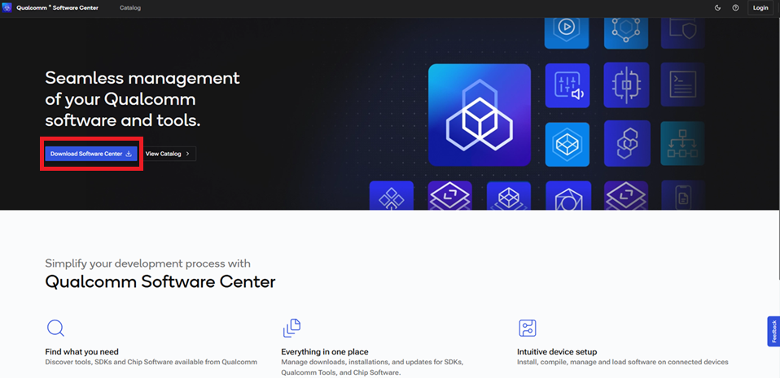
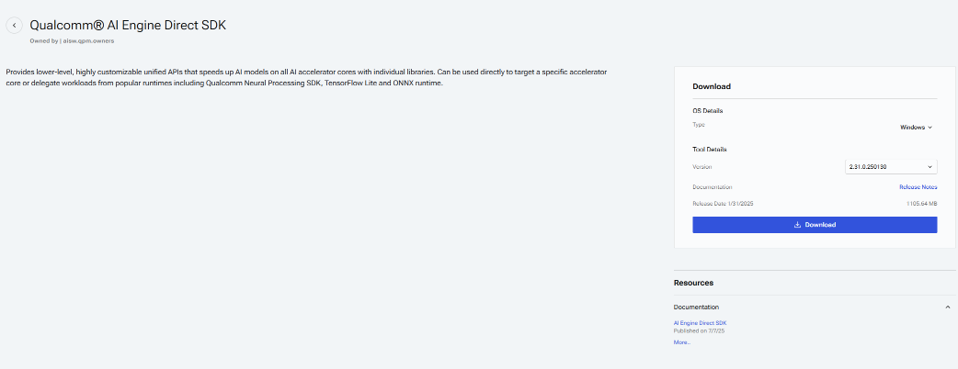

# Software Tools

## Table of Contents
- [Overview](#1-Overview)
- [Qualcomm software centre](#2-LM-Studio)
    - [Installation](#-21-introduction-to-lm-studio)
- [Qualcomm AI Engine Direct SDK](#-22-system-requirements)
    - [Installation](#-23-installation)
    
## 1. Overview
A layered architecture of tools, frameworks, and infrastructure used to develop, deploy, and run artificial intelligence systems including machine learning models, deep learning frameworks, and large language models (LLMs).

## 2. Qualcomm software centre
AI PCs are designed to leverage artificial intelligence capabilities to enhance user experience, performance, and productivity. These systems integrate AI technologies to provide advanced features such as voice recognition, predictive analytics, and more.

### 2.1. Installation
Download the Qualcomm software centre installer from the official website **[Download](https://softwarecenter.qualcomm.com/)**.

## 3.Qualcomm AI Engine Direct SDK
The Qualcomm AI Engine Direct SDK is a software development kit that provides developers with low-level, fine-grained control over AI workloads on Qualcomm® Snapdragon™ platforms, enabling efficient execution across heterogeneous compute cores like CPU, GPU, and DSP for optimized performance and power efficiency in AI applications..

### 3.1. Instalation
Download the Qualcomm software centre installer from the official website **[Download](https://www.qualcomm.com/developer/software/qualcomm-ai-engine-direct-sdk)**.

