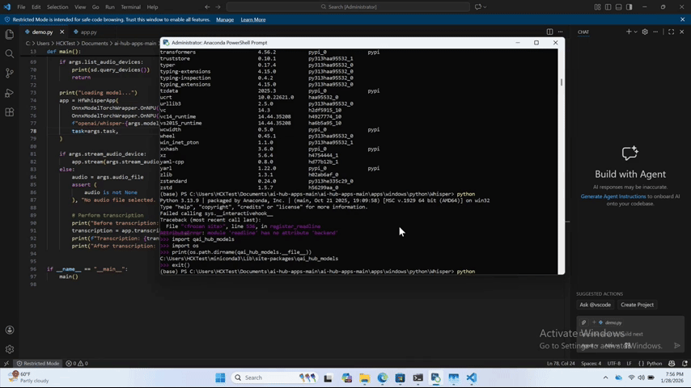

# [Startup_Demo](../../../)/[Others](../../)/[AI_PC](../)/[Automatic_Speech_Recognition](./)
# Automatic Speech Recognition: Python CLI Application on Windows with Whisper

This demo demonstrates how to run Whisper on Snapdragon X Elite. It supports speech-to-text transcription as well as translation of audio or spoken language into English written text.

## Table of Contents

- [Overview](#overview)
- [Repository Structure](#repository-structure)
- [Hardware and Software Requirements](#hardware-and-software-requirements)
	- [Hardware](#hardware)
	- [Software](#software)
- [Environment Setup](#environment-setup)
- [Model Preparation](#model-preparation)
- [Deployment Instructions](#deployment-instructions)
	- [Modify AI Hub model source code](#modify-ai-hub-model-source-code)
	- [Modify Demo code](#modify-demo-code)
- [Running The Demo](#running-the-demo)
	- [Executing Python app via CLI](#executing-python-app-via-cli)
	- [Example Output](#example-output)


## Overview

Automatic Speech Recognition application for Windows on Snapdragon&reg; with Whisper-Base using ONNX runtime.

Whisper is designed for automatic speech recognition (ASR) and speech translation. It is trained on 690k hours of labeled data. It can generalize to many datasets and domains without fine-tuning.

This application shows the entire workflow of how to deploy an AI Hub converted Whisper model on Snapdragon Neural Processing Unit (NPU).

## Repository Structure

```bash
Automatic Speech Recognition/
	├── build/               # Models
	├── docs/                # Screenshots, diagrams, documentation assets
	├── demo.py
	├── evaluate.py
	├── README.md
```
## Hardware and Software Requirements

### Hardware

- Snapdragon X Elite

### Software

- Qualcomm AI Hub
- Python 3.13
	- Set up instructions refer to [ai-hub-apps/apps/windows/python/Whisper at main · qualcomm/ai-hub-apps](https://github.com/qualcomm/ai-hub-apps/tree/v0.25.0/apps/windows/python/Whisper)
	- Required packages
		- standard-aifc
- [FFmpeg](https://github.com/BtbN/FFmpeg-Builds/releases/download/latest/ffmpeg-master-latest-win64-gpl.zip)
	- FFmpeg is required for handling multimedia files and streams.


## Environment Setup

Refer to [ai-hub-apps/apps/windows/python/Whisper/README.md at main · qualcomm/ai-hub-apps](https://github.com/qualcomm/ai-hub-apps/tree/v0.25.0/apps/windows/python/Whisper)

From Step 1 to Step 6, you will complete 99% of the environment setup. You might encounter 'ModuleNotFoundError: No module named `aifc`' when trying to run the demo. Just simply install the module via: `pip install standard-aifc` to solve the issue.

## Model Preparation
- Whisper-Base
	In Step 7, export the model from AI Hub. You can choose from four available model sizes: tiny, base, small, and large‑v3‑turbo. In this app demo, whisper-base is chosen.

## Deployment Instructions

- Physical device to deploy: Snapdragon X Elite
- OS: Windows 11
- Environment: Python 3.13

### Modify AI Hub model source code
- The official released sample app can only transcribe audio or spoken language to written text. To enable the translation feature, we need to modify the source code to add the appropriate translation tokens to the original script and update the provided demo code to include the translation functionality.
- Navigate to the directory where `qai-hub-models` is located.
	This is typically located under: 
	```bash
	YOUR_ENV_LOCATION\Lib\site-packages\qai_hub_models
	```
	Then go to:
	```bash
	models\_shared\hf_whisper
	```
	
	>**Note**  
	>*If the installation path is unclear, you can programmatically print the package location using Python by inspecting the `qai_hub_models` module.*
	>```python
	>import os
	>import qai_hub_models
	>print(os.path.dirname(qai_hub_models.__file__))
	>```

- Modify `app.py`
	In class `HfWhisperApp`, extend the initialization logic (`__init__`) so the app is **task‑aware**:
	1. Introduce a default task setting (e.g. transcribe or translate)
		- Store the task value as part of the class state
		- Prepare Whisper's special decoder tokens, including:
			- Start-of-transcript token
			- End-of-transcript token
			- Language token (can be left unset or inferred)
			- Task token (transcribe or translate)
		- These tokens should be grouped into a decoder start prompt, which controls Whisper's behavior at inference time.
		- Sample code script:
			```python
			def __init__(self, ...):
				...
				# After self.max_audio_samples = ...

				self.task = task

				# After self.clip_segment_tokens = ...

				# Whisper special tokens
				self.sot = self.config.decoder_start_token_id
				self.eot = self.config.eos_token_id

				# language token
				self.language = None

				lang_token = self.tokenizer.convert_tokens_to_ids(f"<|{self.language}|>")
				task_token = self.tokenizer.convert_tokens_to_ids(
					"<|translate|>" if self.task == "translate" else "<|transcribe|>"
				)

				# decoder start prompt
				self.decoder_prompt_ids = [self.sot, lang_token, task_token]
			```
			>**Reference**  
			>[openai/whisper-base · Hugging Face](https://huggingface.co/openai/whisper-base)\
			>Whisper determines whether it performs transcription or translation purely from the decoder prompt. No model change is required.

	2. In function `_transcribe_single_chunk`:
		- Locate where the decoder input is initialized
		- Replace the original behavior (which starts decoding with only the start-of-transcript token)
		- Initialized the decoder using the full decoder prompt created earlier (start token + language token + task token)
		- Sample code script:
			```python
			def _transcribe_single_chunk(self, ...):
				...
				# decoder
				output_ids = torch.tensor([self.decoder_prompt_ids], dtype=torch.int64)  # Start of transcript
			```

		>**Key point**  
		>This is the functional change that actually enables translations.

### Modify Demo code
- The demo application should expose the Whisper task selection without changing the default behavior.
- In `demo.py`:
	- Add a new command-line argument to allow users to specify the Whisper task
	- Supported values should include:
		- `transcribe` (default)
		- `translate`
	- Pass this argument through to the Whisper app initialization so it reaches `HfWhisperApp`
	- With this change, users can switch between transcription and translation using a single runtime option, while existing usage remains unchanged.
	- Sample code script:
	```python
	parser.add_argument(
        "--task",
        type=str,
        default="transcribe",
        choices=["transcribe", "translate"],
        help="Whisper task: transcribe (default) or translate to English.",
    )
	```


## Running The Demo

### Executing Python app via CLI

- Run with a sample audio file:
```bash
python demo.py --audio-file audio.wav
```
- Stream with your microphone:
```bash
python demo.py --list-audio-devices # Get microphone device number
python demo.py --stream-audio-device <device_number>
```
- Switch to translation:
```bash
python demo.py --audio-file audio.wav --task translate
```


### Example Output
