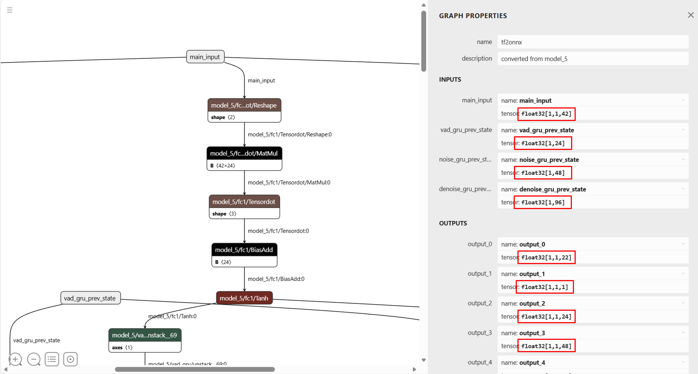
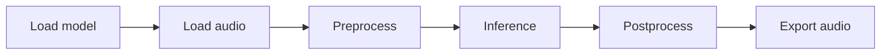
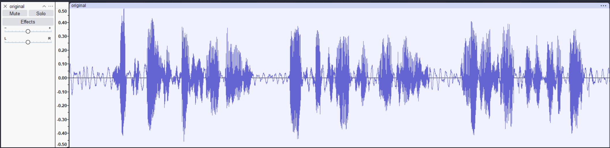
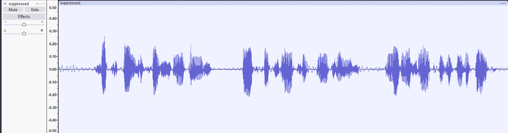

# [Startup_Demo](../../../)/[Others](../../)/[AI_PC](../)/[Noise_Suppression](./)
# Noise Suppression on Windows with rnnoise

This demo used a noise suppression model based on a recurrent neural network. It can help to remove noise from audio while maintaining any speech.

## Table of Contents
- [Overview](#overview)
- [Repository Structure](#repository-structure)
- [Requirements](#requirements)
	- [Platform](#platform)
	- [Tools and SDK](#tools-and-sdk)
- [Environment setup](#environment-setup)
	- [Install Git](#install-git)
	- [Clone the specific subfolder](#clone-the-specific-subfolder)
	- [Set up Python virtual environment](#set-up-python-virtual-environment)
- [Model Preparation](#model-preparation)
	- [Data Preparation](#data-preparation)
	- [Model Training](#model-training)
	- [Convert to onnx](#convert-to-onnx)
	- [Qualcomm AI Hub](#qualcomm-ai-hub)
- [Deployment Instructions](#deployment-instructions)
	- [Environment Setup](#environment-setup)
	- [Prepare Demo Code](#prepare-demo-code)
- [Running The Demo](#running-the-demo)

## Overview

This application demonstrates how to deploy an AI-based noise suppression solution on Snapdragon X Elite (Windows 11) using the RNNoise model and Qualcomm AI Hub. The main goal is to reduce background noise in audio signals while preserving speech quality, making it ideal for smart devices, edge computing, and embedded systems.

## Repository Structure

```bash
Noise Suppression/
	├── src/                 # All application source code (training, inference, utilities)
	├── models/              # Trained, converted, and AI Hub–generated models
	├── data/                # Downloaded datasets
	├── docs/                # Screenshots, diagrams, documentation assets
	├── requirements.txt
	├── README.md
```

## Requirements

### Platform

- Ubuntu 22.04 (Model Preparation)
- Windows on Snapdragon® (Snapdragon® X Elite)
- Windows 11

### Tools and SDK

#### AI Hub model conversion environment
- Ubuntu 22.04
- Python 3.10.12
	- `qai_hub==0.36.0`
- Github repo:
	- [xiph/rnnoise](https://github.com/xiph/rnnoise)
	- [Arm-Examples/ML-zoo](https://github.com/Arm-Examples/ML-zoo/tree/master/models/noise_suppression/RNNoise/tflite_int8)

⚠️ **Disclaimer:**
This project is based on the original rnnoise model and code scripts from Arm-Examples includes modifications and conversion via Qualcomm AI Hub for deployment on Qualcomm NPU platforms.  
The original model and its licensing remain with the original authors, and users must comply with the original license terms.

#### On-device inference environment
- Windows 11
- Python 3.10.11
	- `onnxruntime-qnn==1.24.4`
	- `tensorflow==2.4.3`
	- `numpy==1.19.5`
	- `librosa==0.8.1`
	- `SoundFile==0.10.3.post1`
	- `pesq==0.0.3`

## Environment setup

This section describes the development environment setup process for running the RNNoise noise suppression demo on Windows, including Git installation, selective repository cloning, Python virtual environment creation, and dependency installation.

### Install Git

Git is required for source control and for retrieving the demo code from the Startup-Demos repository.

For detailed installation and configuration steps, refer to the internal documentation: [Setup Git](https://github.qualcomm.com/Innovationlab/qilab_platform_apps/blob/1078a8b4587d71c694f28f4793f66ed8e9f8f10f/Hardware/Tools.md#git-setup)

### Clone the specific subfolder

To avoid cloning the entire repository, use Git sparse checkout to retrieve only the Noise Suppression demo.

Open Windows PowerShell and run:
```bash
git clone -n --depth=1 --filter=tree:0 https://github.com/qualcomm/Startup_Demo.git
cd Startup_Demo
git sparse-checkout set --no-cone Others/AI_PC/Noise_Suppression
git checkout
```

After completion, your local directory structure should contain:
```bash
Startup_Demo/
└── Others/
    └── AI_PC/
        └── Noise_Suppression/
```

### Set up Python virtual environment

Virtual environments provide an isolated Python runtime, preventing dependency conflicts between projects.

For detailed steps, refer to the internal documentation: [Virtual Environments](../../../Tools/Software/Python_Setup/README.md#4-virtual-environments).

> This application uses separate Python environments for different stages of the workflow.


#### AI Hub model conversion environment

This environment is used for model preparation and optimization, including training the original RNNoise model, converting it from HDF format to ONNX, and compiling the ONNX model using Qualcomm AI Hub.

Tested environment
- Ubuntu 22.04
- Python 3.10.12
	- qai_hub==0.31.0

Navigate to the project folder and create a virtual environment:
```bash
cd Startup-Demos/Others/AI_PC/Noise_Suppression

python3.10 -m venv aihub_env
source aihub_env/bin/activate
python -m pip install --upgrade pip
python -m pip install qai_hub==0.31.0
qai-hub configure --api_token INSERT_API_TOKEN
```

Install original RNNoise model and training scripts. The RNNoise model and training utilities are based on the following repositories:
- [rnnoise](https://github.com/xiph/rnnoise)
- [ML-Zoo RNNoise](https://github.com/Arm-Examples/ML-zoo/tree/master/models/noise_suppression/RNNoise/tflite_int8)

Clone both repositories into a working directory:
```bash
mkdir models
cd models
git clone --branch 0.1x https://github.com/xiph/rnnoise.git
git clone https://github.com/Arm-Examples/ML-zoo.git
```

Build RNNoise native tools required for feature generation:
```bash
cd rnnoise
./autogen.sh
./configure
make
```

The ML‑Zoo RNNoise directory provides scripts for dataset preparation, training, quantization, and conversion.

---

#### On-device inference environment

This environment is used to run RNNoise on a Snapdragon X Elite device using ONNX Runtime with QNN Execution Provider.

Platform and system requirements
- Device: Snapdragon® X Elite
- OS: Windows 11
- Python: 3.10.11
	- onnxruntime-qnn==1.24.4
	- numpy
	- librosa
	- SoundFile
	- tensorflow
	- h5py
	- pesq

Create a Python virtual environment in Windows PowerShell:
```bash
cd .\Startup-Demos\Others\AI_PC\Noise_Suppression
python -m venv inference_env
.\inference_env\Scripts\Activate.ps1
python -m pip install --upgrade pip
python -m pip install -r requirements.txt
```

Copy files from ML-Zoo to your workspace
```bash
mkdir src
cp -r .\models\ML-zoo\models\noise_suppression\RNNoise\tflite_int8\recreate_model\* .\src\
```

We'll need the python code files contains in `ML-Zoo` for on-device inference.

## Model Preparation

The model `rnnoise` is originated from [xiph/rnnoise](https://github.com/xiph/rnnoise), we need to clone it and follow the steps to download data and train model. The other repo [Arm-Examples/ML-zoo](https://github.com/Arm-Examples/ML-zoo/tree/master/models/noise_suppression/RNNoise/tflite_int8) provides scripts and steps to train the model, quantize the model, and convert the model to .tflite. After practical testing, the following steps were compiled.
	
### Data Preparation
- Download and unzip the data: `./get_data.sh`
	```bash
	cd Startup-Demos/Others/AI_PC/Noise_Suppression
	source aihub_env/bin/activate
	mkdir data
	cp models/ML-zoo/models/noise_suppression/RNNoise/tflite_int8/recreate_model/get_data.sh data/
	cd data 
	./get_data.sh
	# Four zip files will be downloaded and be unzipped -> clean_trainset_56spk_wav, clean_testset_wav, noisy_trainset_56spk_wav, noisy_testset_wav
	```

- Create test and training .h5 files, there're two options to do this. You can choose either one to get the .h5 files:
	
	- Option 1: Move to the directory where [xiph/rnnoise at 0.1.x](https://github.com/xiph/rnnoise/tree/0.1.x) is installed.
		```bash
		cd <ROOT>/Startup-Demos/Others/AI_PC/Noise_Suppression
		cd models/rnnoise/src/
		./compile.sh
		./denoise_training /<ROOT>/<Workspace>/data/clean_trainset_56spk_wav/ /<ROOT>/<Workspace>/data/noisy_trainset_56spk_wav/ 500000 > training.f32
		./denoise_training /<ROOT>/<Workspace>/data/clean_testset_wav/ /<ROOT>/<Workspace>/data/noisy_testset_wav/ 500000 > testing.f32
		cd ../training
		./bin2hdf5.py ../src/training.f32 500000 87 train.h5
		./bin2hdf5.py ../src/testing.f32 500000 87 test.h5
		```

	- Option 2: Move to the directory where [ML-zoo· GitHub](https://github.com/Arm-Examples/ML-zoo/tree/master/models/noise_suppression/RNNoise/tflite_int8/recreate_model) is installed:
		```bash
		cd <ROOT>/Startup-Demos/Others/AI_PC/Noise_Suppression
		cd src
		python data.py --clean_train_wav_folder=/<ROOT>/<Workspace>/data/clean_trainset_56spk_wav --noisy_train_wav_folder=/<ROOT>/<Workspace>/data/noisy_trainset_56spk_wav --clean_test_wav_folder=/<ROOT>/<Workspace>/data/clean_testset_wav --noisy_test_wav_folder=/<ROOT>/<Workspace>/data/noisy_testset_wav
		```

### Model Training
After the training and testing `.h5` files are generated, you can perform model training (and subsequent conversion steps) **using either of the following approaches**:

#### Option 1: Run the provided script directly

The easiest way is to execute the `train_and_quantise_model.sh` script, which automates the entire process:
```bash
cd <ROOT>/Startup-Demos/Others/AI_PC/Noise_Suppression
cd src
./train_and_quantise_model.sh
```

#### Option 2: Manually run the script step by step
Alternatively, you may review the content of train_and_quantise_model.sh and execute the commands manually, step by step.

This is useful if you want more control over the environment setup or intend to skip certain steps.

> Note: The commands below are extracted directly from train_and_quantise_model.sh.
Some steps (for example, virtual environment creation) are optional and may be skipped if you already have your own setup.
```bash
cd <ROOT>/Startup-Demos/Others/AI_PC/Noise_Suppression
cd src

# Not necessary. You can create your own environment
python3 -m venv venv
source venv/bin/activate
pip install --upgrade pip
# Install required libraries.
pip install -r requirements.txt

# Model training
python train.py --train_data_h5=./train.h5 --test_data_h5=./test.h5

# Convert to tflite. You can choose to delete this line, since we need to convert to onnx in order to compile on AI Hub.
python convert.py --ckpt_path=./ckpts/120.weights.h5 --h5_path=./test.h5
```

### Convert to onnx

Once the model has completed training, we then need to convert the model to either PyTorch or ONNX format (in this demo, ONNX is chosen). Herein, we can refer to [ML-zoo· GitHub](https://github.com/Arm-Examples/ML-zoo/tree/master/models/noise_suppression/RNNoise/tflite_int8/recreate_model) and [tensorflow-onnx· GitHub](https://github.com/onnx/tensorflow-onnx/blob/main/tutorials/keras-resnet50.ipynb), write a python script which can convert HDF format to ONNX format.

Run the following command to convert the HDF file to ONNX format:
```bash
python hdf2onnx.py --ckpt_path ./ckpts/120.weights.h5 --output_path rnnoise_1.onnx
```

> Reference to: [ML-zoo/models/noise_suppression/RNNoise/tflite_int8/recreate_model at master · Arm-Examples/ML-zoo · GitHub](https://github.com/Arm-Examples/ML-zoo/tree/master/models/noise_suppression/RNNoise/tflite_int8/recreate_model), [https://github.com/onnx/tensorflow-onnx/blob/main/tutorials/keras-resnet50.ipynb](https://github.com/onnx/tensorflow-onnx/blob/main/tutorials/keras-resnet50.ipynb) 

### Qualcomm AI Hub

The [Qualcomm AI Hub](https://aihub.qualcomm.com/) provides a cloud-based workflow for compiling, optimizing, and profiling AI models on Qualcomm devices. 

If you have never used AI Hub before, it is recommended to review the official getting-started guide:

[📘 Official Documentation](https://workbench.aihub.qualcomm.com/docs/hub/getting_started.html)

This section summarizes the essential steps required to take your trained RNNoise model, upload it to AI Hub, and prepare it for deployment on Snapdragon X Elite.

Here we use python script to do the whole process. Follow the [Qualcomm AI Hub Documentation](https://workbench.aihub.qualcomm.com/docs/hub/getting_started.html#compute) to complete the model conversion.

1. Preparing Your Model for AI Hub
	
	Before uploading your model, ensure:
	- Your model is already converted to ONNX format (e.g., rnnoise.onnx)
	- You know the model's `input shapes` and `output node` names. You can inspect these using tools like [Netron](https://netron.app/)
	

	Understanding input sizes is important because AI Hub requires you to specify the `input_specs` when submitting a compilation job.

	Then you can define model name, input specs, output names, for instance:
	```python
	model_name = "rnnoise"
	output_names = ["denoise_output", "vad_out", "vad_gru_state", "noise_gru_state", "denoise_gru_state"]
	input_specs = {'main_input': ((1, 1, 42), 'float32'), 'vad_gru_prev_state': ((1, 24), 'float32'), 'noise_gru_prev_state': ((1, 48), 'float32'), 'denoise_gru_prev_state': ((1, 96), 'float32')}
	```

2. Compiling the Model on AI Hub

	Just simply execute the following command then you'll complete the model optimized by Qualcomm AI Hub:
	```bash
	cd .\<ROOT>\Startup-Demos\Others\AI_PC\Noise_Suppression
	python .\src\aihub_conversion.py --onnx_model .\models\rnnoise_1.onnx -out .\models\rnnoise_qaihub.onnx
	```

	

## Deployment Instructions

- Physical device to deploy: Snapdragon X Elite
- OS: Windows 11
- Environment: Python 3.10.11
- Required:
	- Python package: onnx, onnxruntime-qnn, numpy, soundfile, tensorflow, h5py, librosa, pesq
	- Github repositories: [Arm-Examples/ML-zoo/.. /noise_suppression/RNNoise/tflite_int8/recreate_model](https://github.com/Arm-Examples/ML-zoo/blob/master/models/noise_suppression/RNNoise/tflite_int8/recreate_model)
- Reference:
	- [Qualcomm - QNN | onnxruntime](https://onnxruntime.ai/docs/execution-providers/QNN-ExecutionProvider.html)
	- [ML-zoo/models/noise_suppression/RNNoise/tflite_int8/recreate_model at master · Arm-Examples/ML-zoo · GitHub](https://github.com/Arm-Examples/ML-zoo/tree/master/models/noise_suppression/RNNoise/tflite_int8/recreate_model)

> Follow the steps in section [On-device inference environment](#on-device-inference-environment-1)

	
### Prepare Demo Code

After setting up dependencies, prepare the demo using the following steps. Here is the reasoning workflow:



1. Initialize ONNX Runtime with QNN Execution Provider
	- Configure the session to use the QNN EP
	- Provide QNN backend library path and any needed runtime options

2. Load the Converted Model	
	- Load the AI Hub-generated `.onnx` model into an ONNX Runtime session
	- Inspect model input names and shapes if needed

3. Prepare Preprocessing Utilities
	
	Use the RNNoise preprocessing functions from ML-Zoo to:
	- Load the noisy audio file
	- Break audio into frames
	- Extract RNNoise feature vectors
	- Initialize recurrent state tensors (VAD state, noise state, denoise state)

4. Run Frame-by-Frame Inference
	
	For each audio frame:
	- Preprocess the frame into RNNoise features
	- Feed features and recurrent states into the model
	- Receive denoised output and updated recurrent states
	- Apply RNNoise post-processing to obtain the final audio frame

5. Reconstruct and Save Output Audio
	- Concatenate all denoised frames
	- Save a `.wav` file using standard audio-writing libraries


## Running The Demo

```bash
python .\src\Noise_Reduction_ONNX.py `
	--onnx_model .\model\rnnoise_qaihub.onnx\model.onnx\model.onnx `
	--noisy_wav .\data\noisy_testset_wav\p232_003.wav
```


### Result (Plotted with [Audacity](https://www.audacityteam.org/))

Original Audio (wave diagram)


Processed Audio (wave diagram)
