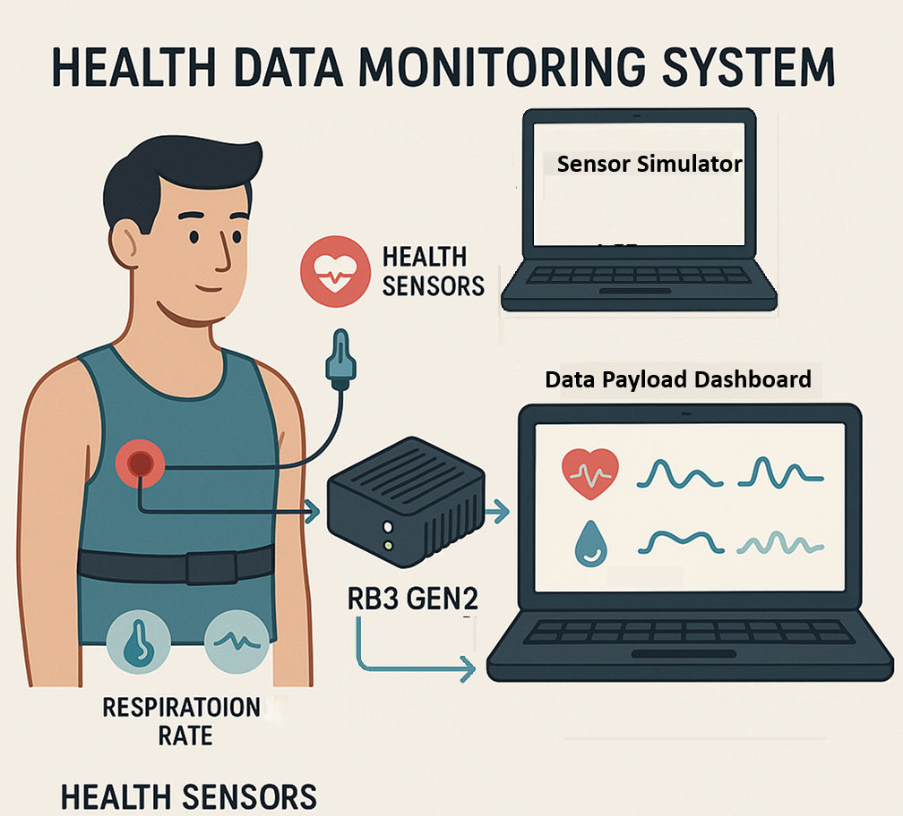
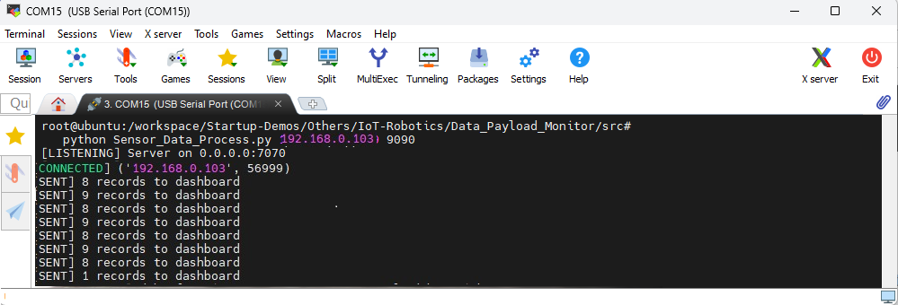
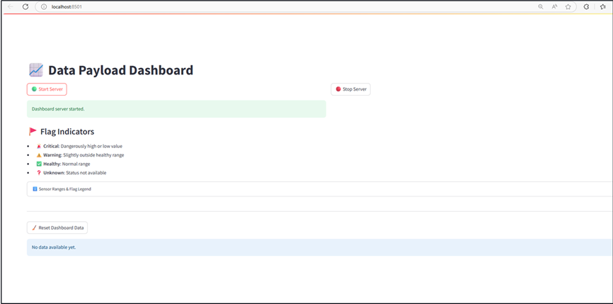
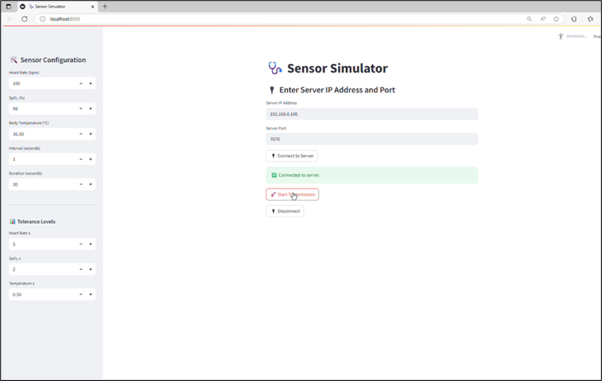

# [Startup_Demo](../../../)/[Others](../../)/[IoT-Robotics](../)/[Data-Payload-Monitor](./)

# Data Payload Monitor Application

## Table of Contents
- [Overview](#1-Overview)
- [Application Requirements](#2-Application-Requirements)
- [Setting Up RB3 Gen2 Device](#3-Setting-Up-RB3-Gen2-Device)
    - [RB3 Gen2 Ubuntu Setup Guide](#31-RB3-Gen2-Ubuntu-Setup-Guide)
    - [Device Network ,USB and SSH Setup ssh](#32-device-network-usb-and-ssh-setup-ssh)
  - [Environment Setup](#-4-environment-setup)
    - [Miniconda Installation](#-41-miniconda-installation)
    - [Git Configuration](#-42-git-configuration)
- [Source Code Setup Instructions for Windows PCs](#%EF%B8%8F-5-source-code-setup-instructions-for-windows-pcs)
- [Source Code Setup Instruction for RB3](#-6-source-code-setup-instruction-for-rb3)
- [Running Data Payload Monitor Application](#-7-running-data-payload-monitor-application)
    - [On RB3 (Data Processor)](#71--on-rb3-data-processor)
    - [On Windows PC 1 (Sensor Dashboard)](#72-%EF%B8%8F-on-windows-pc-1-sensor-dashboard)
    - [On Windows PC 2 (Sensor Simulator)](#73--on-windows-pc-2-sensor-simulator)
- [Dashboard Output and Visualization](#-74-dashboard-output-and-visualization)

# 1. Overview

This application is designed to monitor and analyze data payloads in real-time, providing valuable insights into system performance and health. The intention of this application is to enable efficient data management, reduce errors, and improve overall system reliability by providing a centralized platform for data monitoring and analysis.

A distributed system for real-time sensor data simulation, processing, and visualization using Python and Streamlit. This project is designed to simulate sensor data, process it on an edge device, and visualize it on a remote dashboard.

## 🎯 System Overview

This application consists of **three independent components**, each running on a separate device within the **same local network**:

1. **Sensor Simulation (PC)**
   Simulates real-time sensor data (Heart Rate, SpO₂, Body Temperature) and sends it over TCP.

2. **Data Processing Server (RB3 / Edge Device)**  
   Receives sensor data, processes it (e.g., adds health status), and forwards it to the dashboard.

3. **Dashboard Application (PC)**
   Visualizes incoming data in real-time using Streamlit, with charts, status indicators, and historical tracking.

## 🧠 User Intention

This setup is ideal for:
- Demonstrating real-time IoT data flow
- Monitoring health metrics in a simulated environment
- Testing edge processing and visualization pipelines
- Educational or demo purposes in AI, IoT, or healthcare tech



# 2. Application Requirements

1. **Requirements** Ensure you have two Windows PCs and one RB3 Gen2 device for running the application.
2. **Setting Up RB3 Gen2 Device** Ensure the device is properly installed and connected to the PC.
3. **Setting Up Development Environment** To set up the development environment, utilize the provided source code setup and follow the instructions for compiling and running the application.
4. **Run the Data Payload Monitor Application** Execute the application on the RB3 Gen2 device to start monitoring and analyzing health data.

# 3. Setting Up RB3 Gen2 Device

To set up the RB3 Gen2 device, it is essential to ensure that all necessary hardware components are properly connected and configured.

Configure the RB3 Gen2 device in Linux-based environment correctly, refer to the [RB3 Gen2 Device Setup Guide](https://docs.qualcomm.com/bundle/publicresource/topics/80-82645-1/Getting_started_1.html?product=1601111740057201&facet=Dev%20Kit%20Quick%20Start) for a comprehensive overview of the setup process.

To ensure the proper functioning of the data payload monitor application, follow the guides below and complete `sections 3.1 and 3.2`. It is crucial to highlight each step and complete it before moving on to the next one. By doing so, you will be able to successfully set up the device and proceed with the application setup. This will involve carefully following the instructions for setting up the RB3 Gen2 device, including the Ubuntu setup guide and device network, USB, and SSH setup.

## 3.1 RB3 Gen2 Ubuntu Setup Guide

1. **Requirements**: Ensure you have all the necessary hardware and software components as specified in the [Requirements](../../../Hardware/IoT-Robotics/RB3-Gen2.md#2-requirements) section, Additionally needed One Micro-USB to USB Type-A cable for the UART debug port
2. **Tools Installation**: Install the required tools and software as described in the [Tools Installation](../../../Hardware/IoT-Robotics/RB3-Gen2.md#3-tools-installation) section, Additionally need to install [Putty](https://www.putty.org/) and configured the debug UART.
3. **Download the Ubuntu OS image and boot firmware**: Download the ubuntu os image and firmware 22.04 version as outlined in the [Download OS Image and Boot Firmware](https://docs.qualcomm.com/bundle/publicresource/topics/80-82645-1/Integrate_and_flash_software_2.html#panel-0-v2luzg93cybob3n0tab$download-the-ubuntu-os-image-and-boot-firmware) section.

### List of Downloadable Files

- [Download Ubuntu raw image](https://people.canonical.com/~platform/images/qualcomm-iot/rb3-22.04/rb3-server-22.04-x08/ubuntu-22.04-preinstalled-server-arm64+rb3g2-x08.img.xz) (ubuntu-22.04-preinstalled-server-arm64+rb3g2-x0X.img.xz)
- [Download Partition file](https://people.canonical.com/~platform/images/qualcomm-iot/rb3-22.04/rb3-server-22.04-x08/rawprogram0.xml) (rawprogram0.xml)
- [Download Boot Firmware](https://artifacts.codelinaro.org/artifactory/qli-ci/flashable-binaries/ubuntu-fw/QLI.1.2-Ver.1.1-ubuntu-nhlos-bins.tar.gz) (QLI.1.x-Ver.1.x-ubuntu-nhlos-bins.tar.gz)

4. **Integrate flashable images on Windows host**: Integrate flashable images as described in the [Integrate Flashable Images ](https://docs.qualcomm.com/bundle/publicresource/topics/80-82645-1/Integrate_and_flash_software_2.html#panel-0-v2luzg93cybob3n0tab$integrate-flashable-images-on-windows-host) section.
5. **Flash RB3 Gen 2 on Windows host**: Flash RB3 Gen 2 on Windows host as described in the [Flash RB3 Gen 2 on Windows host](https://docs.qualcomm.com/bundle/publicresource/topics/80-82645-1/Integrate_and_flash_software_2.html#panel-0-v2luzg93cybob3n0tab$flash-rb3-gen-2-on-windows-host) section.

## 3.2 Device Network ,USB and SSH Setup ssh

To configure the RB3 Gen2 device correctly, refer to the [Use Ubuntu on RB3 Gen2](https://docs.qualcomm.com/bundle/publicresource/topics/80-82645-1/Use_Ubuntu_on_RB3_Gen2_3.html) for a comprehensive overview of the setup process, which includes detailed instructions on network connection, USB setup, and SSH setup, ensuring a proper and successful configuration of the device.

1. **Verify reboot and log in to the RB3 Gen2 Ubuntu console**: After flashing the device, it is crucial to verify that the RB3 Gen2 reboots correctly and that you can successfully log in to the Ubuntu console,as outlined in the [Verify reboot and log in to the RB3 Gen2 Ubuntu console](https://docs.qualcomm.com/bundle/publicresource/topics/80-82645-1/Use_Ubuntu_on_RB3_Gen2_3.html#verify-reboot-and-log-in-to-the-rb3-gen2-ubuntu-console) section.
2. **Wifi-Setup**: To ensure seamless connectivity, update the device software to the latest version as outlined in the [WiFi-Setup](https://docs.qualcomm.com/bundle/publicresource/topics/80-82645-1/Use_Ubuntu_on_RB3_Gen2_3.html#access-ubuntu-and-update-packages) section.
3. **Activate Renesas USB hub**: Activating the Renesas USB hub is necessary to enable USB connectivity on the device. Refer to the [Activate Renesas USB hub](https://docs.qualcomm.com/bundle/publicresource/topics/80-82645-1/Use_Ubuntu_on_RB3_Gen2_3.html#activate-renesas-usb-hub) section.
4. **How to use SSH**: Configuring SSH on the device enables secure remote access, allowing you to access the device remotely. and it is outlined in the [How to use SSH](https://docs.qualcomm.com/bundle/publicresource/topics/80-82645-1/Use_Ubuntu_on_RB3_Gen2_3.html#how-to-use-ssh) section.

By following these instructions, you will be able to set up SSH and access the device remotely, which will greatly simplify the development and testing process.

# 🧪 4. Environment Setup

To set up the Python environment required for running the application, follow the steps below. This ensures all dependencies are installed in an isolated and reproducible environment.

## 💻 Common Setup for Two Windows PCs (Sensor Simulator & Dashboard)
These steps must be followed on both Windows PCs that will run the Sensor Simulator and Dashboard applications.

Before proceeding further, please ensure that **all the setup steps outlined below are completed in the specified order**. These instructions are essential for configuring the various tools required to successfully run the application in both PCs.

Each section provides a reference to internal documentation for detailed guidance. Please follow them carefully to avoid any setup issues later in the process.

- RB3 Gen2 Device: Runs the Data Processor
- Windows PC 1: Runs the Sensor Dashboard
- Windows PC 2: Runs the Sensor Simulator

## 📦 4.1 Miniconda Installation

Miniconda is required to manage the application's Python environment and dependencies. Please follow the setup instructions carefully to ensure a consistent and reproducible environment.

For detailed steps, refer to the internal documentation:  
[Set up Miniconda]( ../../../Hardware/Tools.md#miniconda-setup)

## 🔧 4.2 Git Configuration

Git is required for version control and collaboration. Proper configuration ensures seamless integration with repositories and development workflows.

For detailed steps, refer to the internal documentation:  
[Setup Git]( ../../../Hardware/Tools.md#git-setup)

---

# 🛠️ 5. Source Code Setup Instructions for Windows PCs

The following steps are required to set up the source code for the application on Windows PCs.


## 🔧 Steps

1. **Create your working directory** :
   ```bash
   mkdir my_working_directory
   cd my_working_directory
   ```

2. **Download Your Application** :
   ```bash
    git clone -n --depth=1 --filter=tree:0 https://github.com/qualcomm/Startup-Demos.git
    cd Startup-Demos
    git sparse-checkout set --no-cone /Others/IoT-Robotics/Data_Payload_Monitor/
    git checkout
   ```
   
3. **Navigate to Application Directory** :
   ```bash
   cd ./Others/IoT-Robotics/Data_Payload_Monitor/
   ```

4. **Create a new Conda environment** with Python 3.12:
   ```bash
   conda create -n myenv python=3.10
   ```

5. **Activate the environment**:
   ```bash
   conda activate myenv
   ```

6. **Install the required dependencies**:
   ```bash
   pip install -r requirements.txt
   ```

⚠️ **Note:** To ensure a successful setup, it is essential to follow the steps outlined in `section 4` and `sections 5` for both Windows PCs. This will guarantee that the Sensor Simulator and Dashboard applications are properly configured and ready for use.

# 🤖 6. Source Code Setup Instruction for RB3

The following steps are required to set up the source code on RB3 Device.

Ensure the RB3 device is connected to the network and Access the RB3 device via SSH from your host machine:
## 🔧 Steps

1. **Create your working directory** :
   ```bash
   mkdir my_working_directory
   cd my_working_directory
   ```

2. **install the Packages** :
   ```bash
   sudo apt update && sudo apt install git python3-pip  
   ```

3. **Download Your Application** :
   ```bash
   git clone -n --depth=1 --filter=tree:0 https://github.com/qualcomm/Startup-Demos.git
   cd Startup-Demos
   git sparse-checkout set --no-cone /Others/IoT-Robotics/Data_Payload_Monitor/
   git checkout
   ```

# 🚀 7. Running Data Payload Monitor Application

This application runs across three devices on the same local network:

## ✅ Execution Order Summary

- RB3 Gen2 Device: Start the Data Processor on RB3 (this must be done first).
- Windows PC 1: Start the Dashboard on Windows PC 1.
- Windows PC 2: Launch the Sensor Simulator on Windows PC 2 and begin transmission.

## 🌐 Network & Port Configuration

- All devices **must be connected to the same local network** (Wi-Fi or LAN).
- Ensure **firewalls allow TCP traffic** on the following ports:
  - `PORT 7070`: Used by the Data Processor to receive data from the Sensor Simulator
  - `PORT 9090`: Used by the Dashboard to receive data from the Data Processor

> ⚠️ **Note:** Use static or known IP addresses. You can find them using `ipconfig` (Windows) or `ifconfig` (Linux/macOS).

## 7.1 🤖 On RB3 (Data Processor)

This script receives sensor data, classifies it, and forwards it to the dashboard.
**Step1 : Navigate to Application Directory** :
```bash
cd ./Others/IoT-Robotics/Data_Payload_Monitor/src
```
**Step2 : Run the server application**
```bash
python3 Sensor_Data_Process.py <DASHBOARD_IP> 9090
```


**Replace <DASHBOARD_IP> with the IP address of Windows PC 1**

## 7.2 🖥️ On Windows PC 1 (Sensor Dashboard)

This dashboard receives and visualizes data from the Data Processor.
### ✅ Features:
   - 🟢 Start Server: Begin listening for data on port 9090.
   - 🔴 Stop Server: Stop listening.
   - 🧹 Reset Dashboard Data: Clear all stored data.
   - 📋 Historical Table: Shows sensor data with flag indicators.
   - 📊 Real-Time Charts: Visualizes Heart Rate, SpO₂, and Temperature.
   - ⚠️ Timeout Warning: Alerts if no data is received in 30 seconds.

**Step1 : Navigate to Application Directory** :
```bash
cd ./Others/IoT-Robotics/Data_Payload_Monitor/src
```

**Step2 : Run the Data Payload Dashboard Application and Start the Server**

```bash
streamlit run Data_Payload_Dashboard.py
```


## 7.3 💻 On Windows PC 2 (Sensor Simulator)

This simulator sends randomized sensor data to the Data Processor.
### ✅ Features:
   - 🔌 Connect to Server: Enter RB3 IP and port 7070.
   - 🛠️ Sensor Configuration: Set base values and transmission settings.
   - 📊 Tolerance Levels: Add variability to simulate real-world data.
   - 🚀 Start Transmission: Begin sending data.
   - 🔌 Disconnect: Close the connection.

**Step1 : Navigate to Application Directory** :
```bash
cd ./Others/IoT-Robotics/Data_Payload_Monitor/src
```

**Step2 : Run the Sensor Simulator Application and Connect to the RB3 Server**

Ensure that the RB3 IP address and port 7070 are correctly entered in the Sensor Simulator application to establish a successful connection.
```bash
streamlit run Sensor_Data_Simulator.py
```



## Step 3: Start Transmitting Data to the Data Processor

To begin transmitting data, click the "Start Transmission" button on the Sensor Simulator application. This will initiate the sending of randomized sensor data to the Data Processor on the RB3 Gen2 device.


## 📊 7.4 Dashboard Output and Visualization

Once the data transmission begins from PC2, the dashboard will automatically update in real time. It displays incoming sensor readings with visual indicators for health status, historical logs, and dynamic charts in PC1.

