# [Startup_Demo](../../../)/[Others](../../)/[IoT-Robotics](../)/[Dog_Bark_Detector](./)

# Dog Bark Detector

## Table of Contents
- [1. Overview](#1-overview)
- [2. Requirements](#2-requirements)
  - [2.1 Hardware](#21-hardware)
  - [2.2 Software](#22-software)
- [3. Dog Sound Classification Workflow](#3-dog-sound-classification-workflow)
- [4. Setup Instructions](#4-setup-instructions)
  - [4.1 Setting Up Visual Studio Code (VS Code)](#41-setting-up-visual-studio-code-vs-code)
  - [4.2 Setting Up Arduino App Lab](#42-setting-up-arduino-app-lab)
  - [4.3 Setting Up Arduino Flasher Cli](#43-setting-up-arduino-flasher-cli)
  - [4.4 Setting Up Arduino UNO-Q Device](#44-setting-up-arduino-uno-q-device)
- [5. Get the Model from Edge Impulse](#5-get-the-model-from-edge-impulse)
  - [5.1 Setup an Edge Impulse Account](#51-setup-an-edge-impulse-account)
  - [5.2 Clone the Edge Impulse Project](#52-clone-the-edge-impulse-project)
- [6. Retrain the Model Using the Dataset](#6-retrain-the-model-using-the-dataset)
- [7. Build and Download Deployable Model](#7-build-and-download-deployable-model)
- [8. Prepare the Application in Arduino® UNO Q Device](#8-prepare-the-application-in-arduino-uno-q-device)
  - [8.1 Source Code Setup on Device](#81-source-code-setup-on-device)
  - [8.2 Upload Model to the Device](#82-upload-model-to-the-device) 
  - [8.3 Download the Audio files](#83-download-the-audio-files)
  - [8.4 Modify the Configuration file](#84-modify-the-configuration-file)
- [9 Run the Dog Bark Detector Application](#9-run-the-dog-bark-detector-application)
- [10 Application Output](#10-application-output)

## 1. Overview.

The **Dog Bark Detector** application demonstrates the edge‑AI capabilities of the **Arduino® UNO Q** combined with a audio‑based machine‑learning model trained using **Edge Impulse**.

This project enables detection of dog barking sounds. The application is intended for security and safety use cases, such as monitoring restricted areas, workplaces, warehouses, or residential environments, where detecting unexpected barking activity can help indicate the presence of animals or potential intrusions and trigger timely alerts.

## 2. Requirements

- 📂 **Audio Dataset Input (File‑Based)**: Uses pre‑recorded audio samples (uploaded .wav files) containing dog barking and non‑barking sounds. These files serve as input data for training, testing, and validating the sound classification model.
- 🧠 **AI‑Powered Sound Classification**: Utilizes an Edge Impulse audio classification model that processes uploaded audio samples using time‑frequency DSP techniques (such as MFCC or Spectrogram) to identify and classify dog barking sounds.
- 🔄 **Batch and Sample‑Based Evaluation**: The model evaluates audio samples in fixed‑length windows, enabling consistent and repeatable classification results across uploaded datasets and example files.
- 🌐 **Web‑Based Interface**: Managed through an interactive web interface that allows users to upload audio files, trigger model inference, and visualize classification results.

### 2.1 Hardware.

- **[Arduino® UNO Q](../../../Hardware/Arduino_UNO-Q.md#arduino-uno-q)**
- USB-C® hub adapter with external power (x1)
- A power supply (5 V, 3 A) for the USB hub (e.g., a phone charger)
- Personal computer with internet access.

### 2.2 Software.

- [Arduino App Lab](../../../Tools/Software/Arduino_App_Lab/README.md)
- [Edge Impulse](../../../Tools/Software/Edge_Impluse/README.md)
- [Bricks](../../../Tools/Software/Arduino_App_Lab/README.md#25-bricks)
- [VS Code](../../../Hardware/Tools.md#vscode-setup)

## 3. Dog Sound Classification Workflow

```mermaid
flowchart LR
    A[Start] --> B[Set Up Arduino® UNO Q Environment]
    B --> C[Upload Dog Sound Audio Samples / Prepare Dataset]
    C --> D[Train the Audio Classification Model in Edge Impulse and Download the Deployment File]
    D --> E[Create the Dog Sound Classification Application]
    E --> F[Run the Application Using Uploaded Sample Audio Files]
    F --> G[✅ Dog Sound Classification Output]
```



## 4. Setup Instructions.

Before proceeding further, please ensure that **all the setup steps outlined below are completed in the specified order**. These instructions are essential for configuring the various tools required to successfully run the application.

Each section provides a reference to internal documentation for detailed guidance. Please follow them carefully to avoid any setup issues later in the process.

## 4.1 Setting Up Visual Studio Code (VS Code).
Visual Studio Code is the recommended IDE for editing, debugging, and managing the project’s source code. It provides essential extensions and integrations that streamline development workflows. Please follow the setup instructions carefully to ensure compatibility with the project environment.

For detailed steps, refer to the internal documentation:
[Set up VS Code](../../../Tools/Software/VScode_Setup/README.md#34-configure-ssh)

## 4.2. Setting Up Arduino App Lab.
Arduino App Lab enables you to create and deploy Apps directly on the Arduino® UNO Q board, which integrates both a microcontroller and a Linux-based microprocessor. The App Lab runs seamlessly on personal computers (Windows, macOS, Linux) and comes pre-installed on the UNO Q, with automatic updates. Please follow the setup instructions carefully to ensure smooth development and deployment of Apps.

For detailed steps, refer to the documentation: 
[Set up Arduino App Lab]( ../../../Tools/Software/Arduino_App_Lab/README.md#4-installation)

## 4.3. Setting Up Arduino Flasher Cli.
Arduino Flasher CLI provides a streamlined way to flash Linux images onto your Arduino UNO Q board. Please follow the setup instructions carefully to avoid flashing errors and ensure proper board initialization.

For detailed steps, refer to the documentation: 
[Arduino Flasher CLI]( ../../../Hardware/Arduino_UNO-Q.md#flashing-a-new-image-to-the-uno-q)

## 4.4. Setting Up Arduino UNO-Q Device.
Arduino UNO-Q must be properly configured to ensure reliable communication with the host system and accurate sensor data acquisition. Please follow the setup instructions carefully to avoid hardware conflicts and ensure seamless integration with the software stack.

For detailed steps, refer to the documentation: 
[Set up Arduino UNO-Q]( ../../../Hardware/Arduino_UNO-Q.md#uno-q-as-a-single-board-computer).

## 5. Get the Model from Edge Impulse.
Edge Impulse empowers you to build datasets, train machine learning models, and optimize libraries for deployment directly on-device.

Click here to know more about [Edge Impluse]( ../../../Tools/Software/Edge_Impluse/README.md)

### 5.1 Setup an Edge Impulse Account.
An Edge Impulse account is required to access the platform’s full suite of tools for building, training, and deploying machine learning models on the Arduino UNO Q. Please follow the setup instructions carefully to ensure proper integration with your device and development workflow.

Follow the instructions to sign up: 
[Signup Instructions]( ../../../Tools/Software/Edge_Impluse/README.md#22-login-or-signup)

### 5.2 Clone the Edge Impulse Project.

Cloning an Edge Impulse project allows you to replicate existing machine learning workflows, datasets, and configurations for customization or deployment on the Arduino UNO Q. Please follow the setup instructions carefully to ensure proper synchronization and compatibility with your device.

Clone the [Dog Bark Detector](https://studio.edgeimpulse.com/public/892260/live)

For detailed steps, refer to the documentation: 
[Clone the Repository]( ../../../Tools/Software/Edge_Impluse/README.md#29-clone-project-repository)

## 6. Retrain the Model Using the Dataset

### Step 1: Verify the Impulse Configuration

- Go to Impulse Design → Create Impulse.
- Ensure the following parameters are configured correctly:
- Labels are correctly detected (dog_barking, dog_howling, noise)
- Frequency (Hz) matches dataset sampling rate - (`16000 Hz`)
- Window size (`1000ms`)and window stride (`500ms`) are appropriate for vibration data.
- Review all settings to confirm they match your application requirements.
- Directly click the Retain Model block in Step 2. Do not change any settings in the Create impulse, MFCC and Classifier all values at their default


### Step 2: Retrain the Model

- Navigate to Retrain model section in Edge Impulse Studio.
- Click on Start Training to train the model with the newly uploaded dataset.


## 7. Build and Download Deployable Model.
Edge Impulse allows you to build optimized machine learning models tailored for deployment on the Arduino UNO Q. Once trained, models can be compiled into efficient libraries and downloaded for direct integration with your device. Please follow the setup instructions carefully to ensure the model is compatible with your hardware and application requirements.

**Mandatory step:**
1. Select Arduino UNO Q Hardware while configuring your deployment at the Deployment stage.
2. Build the model (It automatically downloads the deployable model).


For detailed steps, refer to the documentation: 
[Build and Deploy Model]( ../../../Tools/Software/Edge_Impluse/README.md#28-download-deployable-model)

## 8. Prepare the Application in Arduino® UNO Q Device.

This section will guide you on how to create a new application from an existing example, configure Edge Impulse models, set up the application parameters, and build the final App for deployment on the Arduino UNO Q.Starting from a pre-built example is recommended for first-time users to better understand the structure and workflow.


### 8.1. Source Code Setup on Device:

Clone the repository and transfer the source code to the device’s application directory. The following commands should be run in the terminal or command prompt. Ensure that the device is connected via ADB before proceeding.

   ```bash
   adb shell
   ```

   ```bash
   cd ~
   git clone -n --depth=1 --filter=tree:0 https://github.com/qualcomm/Startup-Demos.git
   cd Startup-Demos
   git sparse-checkout set --no-cone /Others/IoT-Robotics/Dog_Bark_Detector
   git checkout
   chmod +x ./Others/IoT-Robotics/Dog_Bark_Detector/setup_dog_dark_detector.sh
   ./Others/IoT-Robotics/Dog_Bark_Detector/setup_dog_dark_detector.sh
   ```


### 8.2. Upload Model to the Device.

Once the deployable model is built in Edge Impulse, it must be uploaded to the Arduino UNO Q to enable real-time inference and application integration. This section will guide you through transferring the compiled model to the device, verifying compatibility, and preparing it for execution within your App Lab application.

Here mention about usage of the model which download from edge impulse in the previous step.
[Build and Deploy Model](../../../CV_VR/Arduino_UNO-Q/GestureDetection/README.md#53-build-and-download-deployable-model)

**Upload location**:Make sure to upload the model file to **/home/arduino/.arduino-bricks/ei-models/dog-sound-classification.eim**

For detailed steps, refer to the documentation: 
[Upload Model]( ../../../Tools/Software/Arduino_App_Lab/README.md#upload-model-to-device)

### 8.3 Download the Audio files

Download the audio files and place them on the device in the following directory: **/home/arduino/ArduinoApps/Dog_Bark_Detector/assets/audio**. 

- Sample dog barking sound - [dog_barking.1724780284355.wav](https://studio.edgeimpulse.com/v1/api/892260/raw-data/2561413591/wav?axisIx=0)
- Sample dog howling sound - [dog_howling.1724703273636.wav](https://studio.edgeimpulse.com/v1/api/892260/raw-data/2561413457/wav?axisIx=0)
- Background noise sample - [noise.56m468g1.s73.wav](https://studio.edgeimpulse.com/v1/api/892260/raw-data/2561416546/wav?axisIx=0)

### 8.4. Modify the Configuration file.

The `app.yaml` file defines the structure, behavior, and dependencies of your Arduino App Lab application. Modifying this configuration allows you to customize how your app interacts with hardware, integrates Edge Impulse models, and launches on the Arduino UNO Q. 

This section guides you through editing key parameters such as bricks, model paths, and runtime settings. Follow the setup instructions carefully to ensure that the application name and the `.eim` file match the generated names and that the application runs as expected.

   ```yaml
   name: Dog_Bark_Detector
   description: "Detection of dog barking sounds Classifications"
   ports: []
   bricks:
   - arduino:audio_classification: {
       variables: {
         EI_AUDIO_CLASSIFICATION_MODEL: /home/arduino/.arduino-bricks/ei-models/dog-sound-classification.eim
       }
     }
   - arduino:web_ui: {}

   icon: 🦮
   ```

## 9. Run the Dog Bark Detector Application.

Once your application is configured and built in Arduino App Lab, it can be deployed and executed directly on the Arduino UNO Q. This section will guide you through launching the application, verifying modulino movement sensor data, and observing real-time monitoring.

 

For detailed steps, refer to the documentation: 
[Run Application](../../../Tools/Software/Arduino_App_Lab/README.md#run-example-apps-in-arduino-app-lab)

## 10. Application Output.

This section describes the output of the application.

Load the audio files and click **Run Classification**. The application displays the detected class name along with the corresponding confidence value.

 
