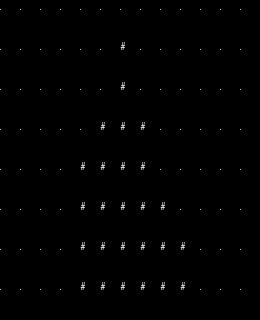

# [Startup_Demo](../../../)/[Others](../../)/[IoT-Robotics](../)/[LED-Matrix-Generator](./)

# LED Matrix Generator

## Table of Contents
- [Overview](#1-overview)
- [Features](#2-features)
- [Requirements](#3-requirements)
- [Environment Setup](#4-environment-setup)
  - [Python Installation](#41-python-installation)
  - [Git Configuration](#42-git-configuration)
- [Source Code Setup Instructions for Windows PCs](#5-source-code-setup-instructions-for-windows-pcs)
  - [Steps](#51-steps)
- [Application Usage](#6-application-usage)
    - [Animation Showcase](#61-animation-showcase)
    - [Preparing Your Images](#62-preparing-your-images)
    - [Image Conversion](#63-image-conversion)
- [Output](#7-output)

# 1. Overview

This application converts images to LED matrix animations for display on 13x8 LED matrices. It provides various animation effects including AI-powered transformations.

# 2. Features

- Convert images to 13x8 monochrome bitmap format
- Generate various animation types:
  - Edge Pulse (AI Edge Detection)
  - Morphological (AI Erosion/Dilation)
  - Contour Wave (AI Contour Detection)
  - Zoom (AI Breathing Effect)
  - Wave Distort (AI Image Warping)
  - Saliency (AI Focus Detection)
  - Threshold Sweep (Classic)
  - Rotation (Classic)
  - Flip (Classic)
- Export animations as Arduino-compatible header files

# 3. Requirements

- Windows PC or Ubuntu PC
- Python 3.12 with Pillow (PIL)
- Numpy for array operations
- Scikit-image, scipy, and matplotlib for animation and visualization

# 4. Environment Setup

To set up the Python environment required for running the application, follow the steps below. This ensures all dependencies are installed in an isolated and reproducible environment.

## 4.1 Python Installation

- Python 3.12 is required for this application.
- Install Python (64-bit) by following the [installation guide](../../../Tools/Software/Python_Setup/README.md#21-download-python-installer).
- Make sure you have Python installed and properly configured in your system path.

```bash
# Check Python version
python --version
```

## 4.2 Git Configuration

Git is required for version control and collaboration. Proper configuration ensures seamless integration with repositories and development workflows.

For detailed steps, refer to the internal documentation:  
[Setup Git](../../../Hardware/Tools.md#git-setup)


# 5. Source Code Setup Instructions for Windows PCs

The following steps are required to set up the source code for the application on Windows PCs.

## 5.1 Steps

1. **Create your working directory**:
   ```bash
   mkdir my_working_directory
   cd my_working_directory
   ```

2. **Download Your Application**:
   ```bash
    git clone -n --depth=1 --filter=tree:0 https://github.com/qualcomm/Startup-Demos.git
    cd Startup-Demos
    git sparse-checkout set --no-cone /Others/IoT-Robotics/LED_Matrix_Generator/
    git checkout
   ```
   
3. **Navigate to Application Directory**:
   ```bash
   cd ./Others/IoT-Robotics/LED_Matrix_Generator/
   ```

4. **Install the required dependencies**:
   ```bash
   pip install -r requirements.txt
   ```

⚠️ **Note:** To ensure a successful setup, it is essential to follow the steps outlined above. This will guarantee that the LED Matrix Generator application is properly configured and ready for use.

# 6. Application Usage

## 6.1 Animation Showcase

To run a continuous showcase of all animation types:

```bash
cd src
python animation_showcase.py
```

## 6.2 Preparing Your Images

Before running specific animations or conversions, copy the image you want to convert to the `src/` directory:

```bash
# Example: Copy your image to the src directory
cp your_image.png src/
```

## 6.3 Image Conversion

To convert a single image to LED matrix format:

```bash
cd src
python img_to_13x8_u32.py image.png [options]
```

```bash
# Example (creating a wave distortion animation of fire with 16 frames):
cp /images/test.png src/
python img_to_13x8_u32.py test.png --frames 16 -o frame.h --animate wave-distort --threshold 64
```

Options:
- `--threshold VALUE`: Grayscale threshold (0-255, default: 128)
- `--invert`: Invert binary output (dark becomes ON)
- `--rotate ANGLE`: Rotate image (0, 90, 180, 270 degrees)
- `--mirror`: Mirror horizontally (left-right)
- `--flip`: Flip vertically (top-bottom)
- `--c-array`: Output C/Arduino array format
- `--output FILE`: Output header file
- `--animate TYPE`: Generate animation frames
- `--frames COUNT`: Number of animation frames (default: 8)


# 7. Output

The application can output:
- ASCII art preview in the terminal.
- C/Arduino header files (Example:frames.h) for use in embedded projects.
- Live animation preview in the terminal.
  
  
