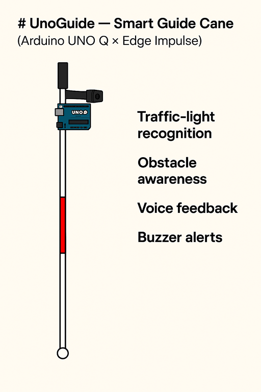
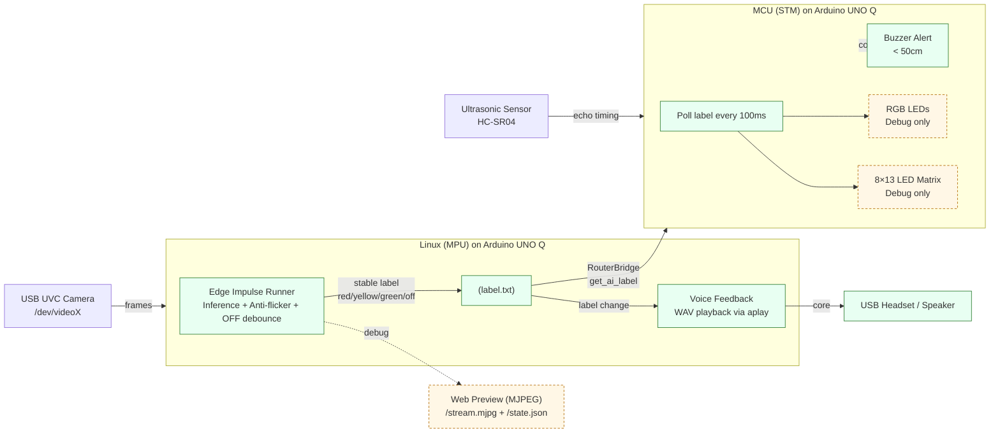
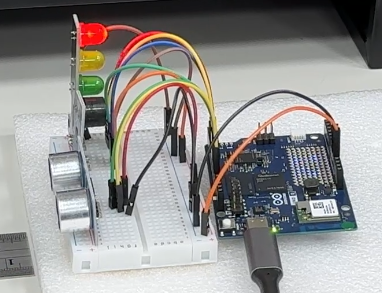
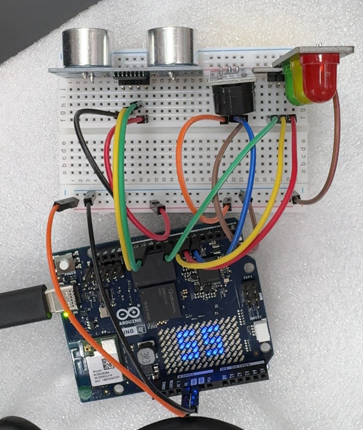
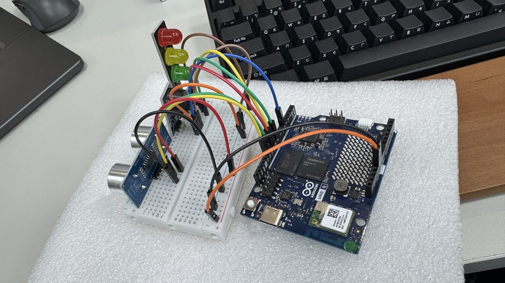
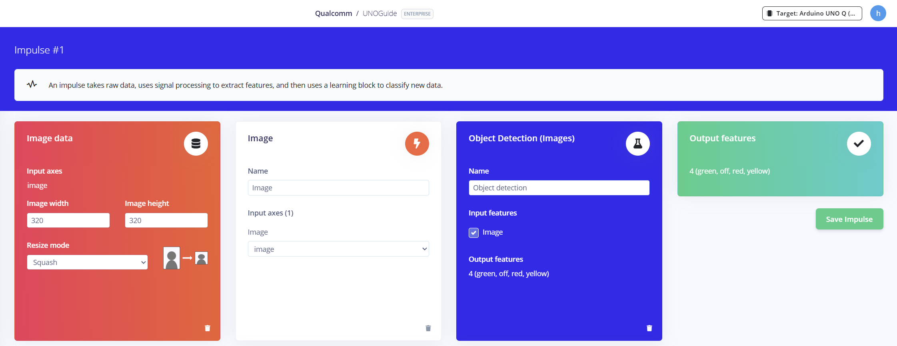
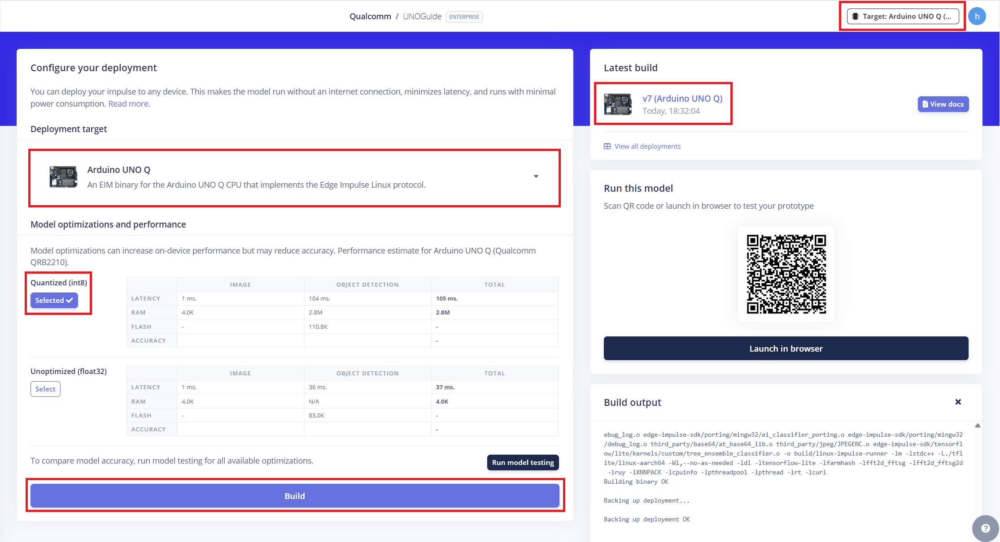
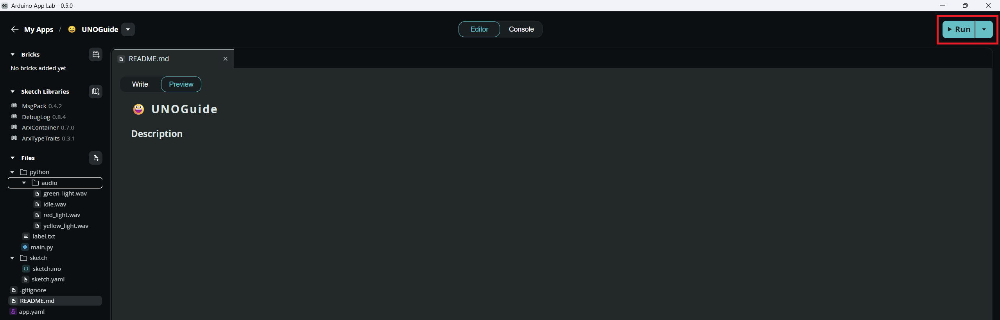
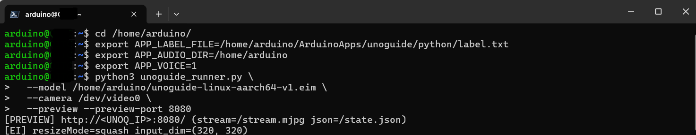

# [Startup_Demo](../../../)/[Others](../../)/[IoT-Robotics](../)/[Smart-Guide-Cane](./)

# UnoGuide — Smart Guide Cane (Arduino® UNO Q × Edge Impulse)
UnoGuide is a **smart guide cane** prototype built on **Arduino® UNO Q** (Linux MPU + STM MCU) with **Edge Impulse** vision inference. It provides **traffic‑light recognition** and **obstacle awareness**, delivering voice feedback and buzzer alerts as the primary user interface for visually impaired users.

## Table of Contents
- [1. Overview](#1-overview)
- [2. System Architecture](#2-system-architecture)
- [3. Hardware](#3-hardware)
- [4. Software](#4-software)
- [5. Get the Model from Edge Impulse](#5-get-the-model-from-edge-impulse)
  - [5.1 Setup an Edge Impulse Account](#51-setup-an-edge-impulse-account)
- [6. Retrain the Model Using the Dataset](#6-retrain-the-model-using-the-dataset)
- [7. Build and Download Deployable Model](#7-build-and-download-deployable-model)
- [8. Setup Network, SSH, and Edge Impulse on Arduino® UNO Q](#8-setup-network-ssh-and-edge-impulse-on-arduino-uno-q)
  - [8.1 Connect to Device and Configure Network](#81-connect-to-device-and-configure-network)
  - [8.2 Setup SSH Server](#82-setup-ssh-server)
  - [8.3 Install Edge Impulse Dependencies](#83-install-edge-impulse-dependencies)
  - [8.4 Connect to Edge Impulse](#84-connect-to-edge-impulse)
- [9. Setup Arduino® App Lab and Deploy Application](#9-setup-arduino-app-lab-and-deploy-application)
  - [9.1 Connect to Arduino® UNO Q via SSH](#91-connect-to-arduino-uno-q-via-ssh)
  - [9.2 Setup Application Source Code](#92-setup-application-source-code)
  - [9.3 Transfer Edge Impulse Model](#93-transfer-edge-impulse-model)
- [10. Project Structure](#10-project-structure)
- [11. Setup Instructions](#11-setup-instructions)
  - [11.1 MCU Setup](#111-mcu-setup)
  - [11.2 Linux (MPU) Setup](#112-linux-mpu-setup)
  - [11.3 Voice Feedback Setup](#113-voice-feedback-setup)
- [12. Running the Application](#12-running-the-application)
- [13. Deployment Mode and Debug Feature Control](#13-deployment-mode-and-debug-feature-control)
- [14. Testing Guide](#14-testing-guide)
- [15. Demo Output](#15-demo-output)

## 1. Overview

A **Smart Guide Cane** prototype designed to assist visually impaired users with traffic‑light awareness, upper‑body obstacle detection, and voice feedback. The system combines Arduino® UNO Q (Linux MPU + STM MCU) with an Edge Impulse vision model. AI inference runs on the Linux side and writes stable results to label.txt; the MCU polls this label to drive the core assistive feedback (voice + buzzer).

⚠️ Debug / Development Notice
RGB LEDs, the onboard 8×13 LED matrix, and the web preview are debug & development aids only. They are not required for end‑user operation and can be safely disabled in real‑world deployment to reduce power consumption and avoid user distraction.
In parallel, the Linux app plays pre‑recorded WAV prompts for hands‑free guidance.

UnoGuide enhances a traditional guide cane with:

- 🚦 AI‑based traffic light recognition (red / yellow / green)
- 📏 Upper‑body obstacle detection using an ultrasonic sensor
- 🔔 Assistive feedback for safe navigation
- 🗣️ Voice feedback (primary user feedback)
- 🔊 Buzzer alerts for close‑range obstacles
- 🧪 Debug & development interfaces (can be disabled)RGB LEDs
  - 8×13 LED matrix
  - Web preview (MJPEG + JSON)
- 🔌 Fully on‑device processing (offline capable)



## 2. System Architecture



### Linux (MPU)

- Runs Edge Impulse Linux SDK for camera‑based inference (unoguide_runner.py)
- Performs anti‑flicker, OFF debouncing, and stable label decision.
- Writes stable results to label.txt (red_light, yellow_light, green_light, off).
- Voice feedback plays WAV prompts on stable label changes.
- Optional Web preview (MJPEG) for debugging (can be disabled in deployment).

### Voice Feedback (Primary User Interface)

- Implemented in the Linux app (main.py)
- Monitors label.txt at 10 Hz
- Triggers WAV audio prompts when the label changes
- Uses ALSA `aplay` for audio output
- Includes:
  - Cooldown (default `2500 ms`)
  - Repeat playback (default `3×` with gap)

✅ This is the main feedback channel for visually impaired users

### MCU (STM)

- Polls get_ai_label every 100 ms via RouterBridge.
- Controls buzzer (primary alert) and RGB LEDs (debug only).



- Reads ultrasonic distance and triggers buzzer when < 50 cm.
- 8×13 LED matrix displays distance (debug only).



### Core Assistive Outputs

- 🔊 Buzzer
  - Activated when obstacle distance < 50 cm

### Debug / Visualization Outputs (Optional)

- RGB LEDs — traffic‑light state visualization (debug only)
- 8×13 LED matrix — distance display (debug only)
Linux → File (`label.txt`) → MCU is used as a simple and robust IPC mechanism.


## 3. Hardware

- **[Arduino® UNO Q](../../../Hardware/Arduino_UNO-Q.md#arduino-uno-q)**
- USB camera (x1)
- USB-C® hub adapter with external power (x1)
- A power supply (5V, 3A) for the USB hub (e.g., a phone charger)
- Personal computer with internet access.
- HC-SR04 ultrasonic sensor
- Buzzer (core assistive output)
- USB headset / speaker (for voice feedback)
- RGB LEDs (debug only)


### Pin Mapping (MCU)

| Function          | Pin | Notes               |
|-------------------|-----|---------------------|
| Ultrasonic Trig   | D11 | Core sensor         |
| Ultrasonic Echo   | D12 | Core sensor         |
| Buzzer            | D5  | Primary user alert  |
| Red LED           | D6  | Debug only          |
| Yellow LED        | D7  | Debug only          |
| Green LED         | D8  | Debug only          |




## 4. Software

### MCU Libraries

- [Edge Impulse](../../../Tools/Software/Edge_Impluse/README.md)
- [Arduino® App Lab](../../../Tools/Software/Arduino_App_Lab/README.md)
- Python 3 (Linux side)
- ALSA (aplay) for audio playback

### Linux Packages

```
python3 -m venv ~/venvs/ei
source ~/venvs/ei/bin/activate
pip install edge_impulse_linux opencv-python-headless six pyaudio
sudo apt install -y portaudio19-dev
```

### Voice / Audio Runtime

- ALSA aplay (/usr/bin/aplay)
- Optional audio device selection via: `export APLAY_DEVICE="<alsa_device_name>"`


## 5. Get the Model from Edge Impulse

The traffic‑light recognition model is built and managed using Edge Impulse. You may either reuse an existing public project, or create your own dataset by capturing and labeling traffic‑light images.

### 5.1 Setup an Edge Impulse Account

1. Go to https://studio.edgeimpulse.com/
2. Sign up for a free Edge Impulse account
3. Create a new project (e.g. UNOGuide)
  - Image: 320*320
  - Resize mode: Squash
  - Object Detection



## 6. Retrain the Model Using the Dataset
### Dataset Options

#### Option A: Use Existing Traffic‑Light Datasets

- Public academic / open‑source traffic‑light datasets
- Dash‑cam or street‑scene datasetsLabels must be consistent:
  - red_light
  - yellow_light
  - green_light

#### Option B: Capture and Label Your Own Images (Recommended)

1. Capture traffic‑light images using a USB or phone camera
2. Upload images to Edge Impulse Studio
3. Label bounding boxes for red / yellow / green lights
4. Include environmental variations (day/night, distance, backlight)

✅ Self‑collected data significantly improves real‑world robustness

### Model Training

- Use Object Detection pipeline (e.g. YOLO‑based)
- Train and evaluate in Edge Impulse Studio

## 7. Build and Download Deployable Model

1. Go to Deployment in Edge Impulse Studio
2. Select Linux (AArch64) as the target
3. Build and download the `.eim` model (e.g. `unoguide-linux-aarch64-v1.eim`)



## 8. Setup Network, SSH, and Edge Impulse on Arduino® UNO Q

This section covers network setup, SSH access, and Edge Impulse installation on the Arduino® UNO Q, preparing the device for model deployment and on-device inference.

### 8.1 Connect to Device and Configure Network

Once installed, confirm your UNO Q is connected by running:
```bash
adb devices
```

If the device appears, log in:
```bash
adb shell
```

Connect to Wi-Fi:
```bash
sudo nmcli dev wifi connect <WiFi-SSID> password <WiFi-password>
```

Check IP address:
```bash
hostname -I
```

### 8.2 Setup SSH Server

```bash
sudo apt install openssh-server -y
sudo systemctl enable ssh
sudo systemctl stop sshd
sudo ssh-keygen -A
sudo systemctl start sshd
```
Now you’re ready to connect from your local machine using the terminal:
```bash
ssh arduino@<arduino ip address>
```

### 8.3 Install Edge Impulse Dependencies
```bash
sudo apt update
curl -sL https://deb.nodesource.com/setup_20.x | sudo bash -
sudo apt install -y gcc g++ make build-essential nodejs sox gstreamer1.0-tools gstreamer1.0-plugins-good gstreamer1.0-plugins-base gstreamer1.0-plugins-base-apps
sudo npm install edge-impulse-linux -g --unsafe-perm
```
### 8.4 Connect to Edge Impulse
Plug in your camera,speaker then run:
```bash
edge-impulse-linux
```
Follow the wizard to log in and select your project.

To switch projects:
```bash
edge-impulse-linux --clean
```

Please refer to the [Edge Impulse with Arduino UNO Q](http://docs.edgeimpulse.com/hardware/boards/arduino-uno-q).

## 9. Setup Arduino® App Lab and Deploy Application

Arduino® App Lab lets you build and deploy apps directly on the Arduino® UNO Q, which combines a microcontroller and a Linux-based processor. It runs on Windows, macOS, and Linux, is pre-installed on the UNO Q, and updates automatically. 

For detailed steps, refer to the documentation: [Set up Arduino® App Lab]( ../../../Tools/Software/Arduino_App_Lab/README.md#4-installation)

### 9.1 Connect to Arduino® UNO Q via SSH

From your local machine, connect to the device using:
```bash
ssh arduino@<arduino ip address>
```

## 9.2 Setup Application Source Code

Clone the repository and copy the required source code to the device’s application directory.
Make sure the device is connected via SSH or ADB before proceeding:

  ```bash
  cd /home/Arudino

  git clone -n --depth=1 --filter=tree:0 https://github.com/qualcomm/Startup-Demos.git

  cd Startup-Demos

  git sparse-checkout init --no-cone
  git sparse-checkout set Others/IoT-Robotics/Smart_Guide_Cane
  git checkout

  cp -R Smart_Guide_Cane/ArduinoApps/unoguide /home/Arduino/ArduinoApps/

  cp Smart_Guide_Cane/unoguide/unoguide_runner.py /home/Arduino/

  ```

### 9.3 Transfer Edge Impulse Model

After building your model in Edge Impulse, download the `.eim` file (e.g. `unoguide-linux-aarch64-v1.eim`) to your local machine.

Use `scp` to transfer the model file to the Arduino® UNO Q:

```bash
scp unoguide-linux-aarch64-v1.eim arduino@<arduino-ip-address>:/home/Arduino/
```

- Ensure the destination directory exists before copying files
- Use sudo if permission errors occur
- Verify the source path if files are not found

## 10. Project Structure

```
ArduinoApps/
└── unoguide/
    ├── python/
    │   ├── label.txt                # Shared AI state
    │   ├── main.py                  # Voice feedback + label monitor
    │   └── audio/                   # Voice prompts
    ├── sketch/
    │   ├── sketch.ino               # MCU firmware
    └───└── sketch.yaml  
/home/arduino/unoguide_runner.py     # AI inference + web preview (optional)
/home/arduino/unoguide-linux-aarch64-v1.eim
```

## 11. Setup Instructions

### 11.1 MCU Setup

1. Install required Arduino® libraries in Arduino® App lab:
    - MsgPack 0.4.2
    - DebugLog 0.8.4
    - ArxContainer 0.7.0
    - ArxTypeTraits 0.3.1
2. Upload sketch.ino to the Arduino® UNO Q (STM MCU)
3. (Optional) Disable RGB LED / LED matrix related code paths for deployment


### 11.2 Linux (MPU) Setup

1. Copy the Edge Impulse deployable model to the device:
 `/home/arduino/unoguide-linux-aarch64-v1.eim`
2. Ensure application directory exists: `/home/arduino/ArduinoApps/unoguide/python/`
3. Verify camera device: `ls /dev/video*`
4. (Optional – Deployment mode) Run without web preview to disable debug UI

### 11.3 Voice Feedback Setup

#### Voice feedback is the primary user interface for visually impaired users.
WAV mapping (defined in main.py):
- red_light → red_light.wav
- yellow_light → yellow_light.wav
- green_light → green_light.wav
- off → idle.wav

#### USB Headset Audio Setup (ALSA / aplay)
When running UnoGuide on Arduino® UNO Q (embedded Linux), audio playback is handled via ALSA (aplay). Unlike desktop Linux, there is usually no default audio device configured.

1. Identify the USB Audio Device

    ```aplay -l```

    Example output:
    card 1: II [Jabra EVOLVE 30 II], device 0: USB Audio [USB Audio]

2. Use plughw Instead of hw
    ```
    export APLAY_DEVICE=plughw:1,0
    aplay -D plughw:1,0 green_light.wav
    ```
3.  Application Integration
    ```
    export APLAY_DEVICE=plughw:1,0
    export APP_VOICE=1
    ```

#### Configurable parameters in main.py:

- COOLDOWN_MS – debounce interval between voice prompts
- REPEAT_COUNT – number of repetitions per trigger
- REPEAT_GAP_MS – gap between repeated playbacks
Ensure all WAV files are placed under:
`/app/python/audio/`

## 12. Running the Application

1. Connect to the Arduino® UNO Q via Arduino® App Lab over Wi‑Fi
2. Click the Run button in Arudino app lab


3. Execute unoguide_runner.py
    
    From your local machine, connect to the device using:
    ```bash
    ssh arduino@<arduino ip address>
    ```

    ```
    cd /home/arduino/
    export APP_LABEL_FILE=/home/arduino/ArduinoApps/unoguide/python/label.txt
    export APP_AUDIO_DIR=/home/arduino
    export APP_VOICE=1

    python3 unoguide_runner.py \
      --model /home/arduino/unoguide-linux-aarch64-v1.eim \
      --camera /dev/video0 \
      --preview --preview-port 8080
    ```
    
    

4. Preview (debug only): http://<UNOQ_IP>:8080/


## 13. Deployment Mode and Debug Feature Control

### One‑Click Deployment Mode
#### Linux (MPU)
```export APP_DEPLOYMENT=1```
- Web preview disabled automatically
- Debug logs disabled
- Voice feedback remains enabled

#### MCU (STM)
```#define DEPLOYMENT_MODE 1```

- RGB LEDs ❌
- LED matrix ❌
- Buzzer ✅

#### Individual Debug Toggles

- DBG_RGB_LED (MCU)
- DBG_LED_MATRIX (MCU)
- APP_WEBPREVIEW (Linux)
- APP_DEBUG (Linux)

### Notes & Customization

- Voice + buzzer are the only required outputs in real‑world deployment.
- Debug interfaces can be disabled to reduce power consumption and distraction.
- Adjust thresholds, cooldowns, and repeat counts to tune UX.


## 14. Testing Guide

- Point the camera at traffic lights and observe voice prompts.
- Move an object within 50 cm to trigger the buzzer.
- Use web preview only during development.

## 15. Demo Output

Traffic-light recognition and obstacle awareness run at the same time. They were recorded separately, each with a different focus.

Please follow [Section 12. Running the Application](#12-running-the-application) to run UnoGuide.

### Traffic-light recognition


### obstacle awareness


