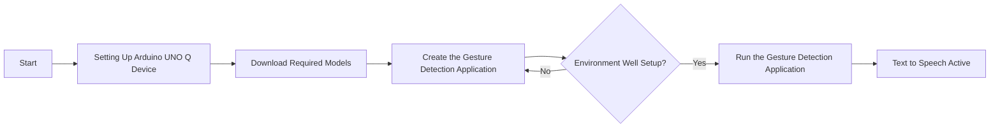
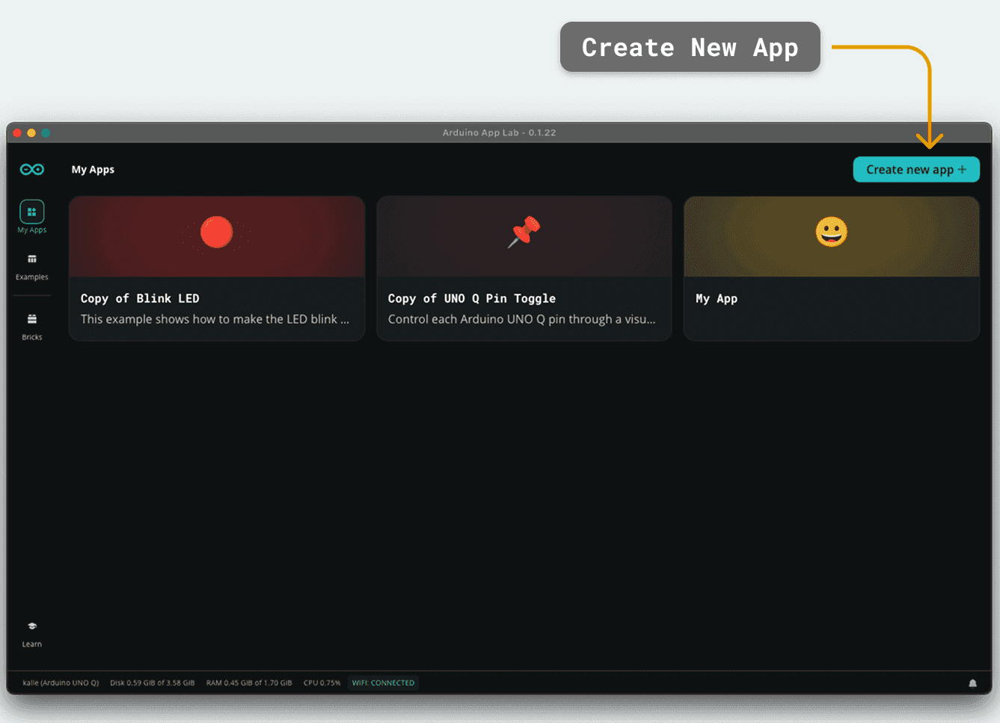
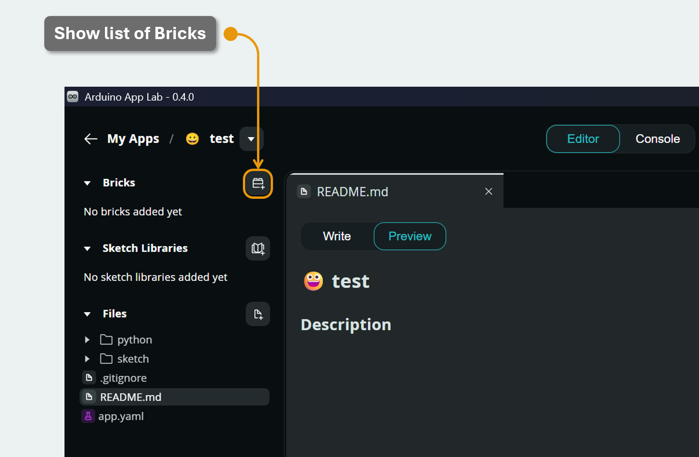
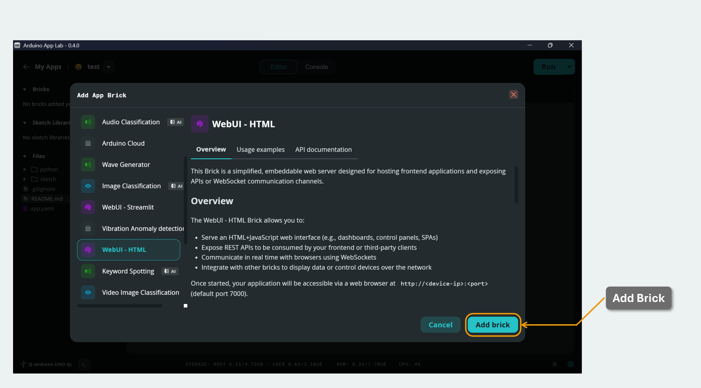
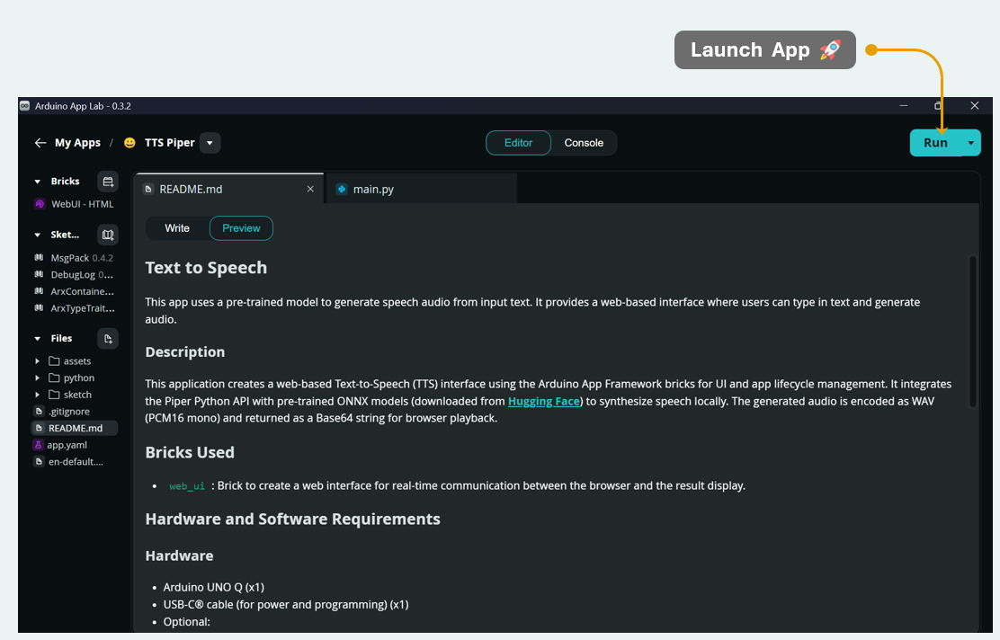
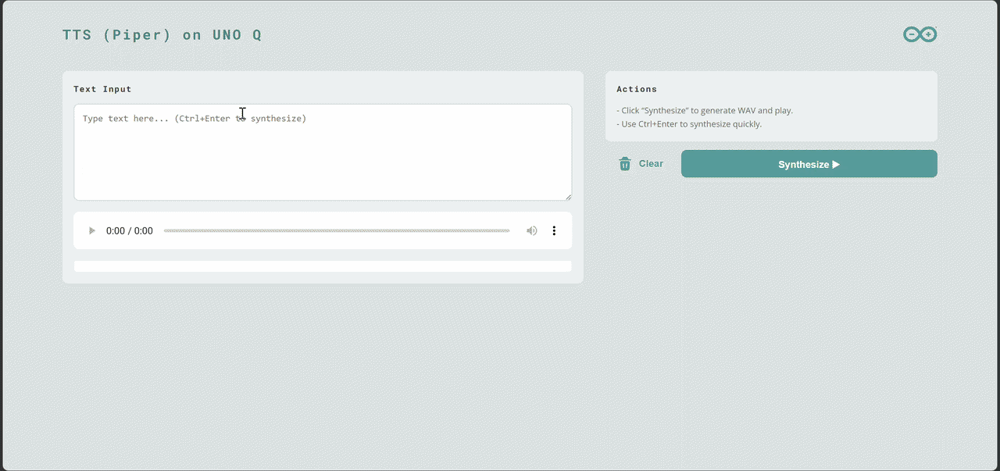

# # [Startup_Demo](../../../)/[Others](../../)/[IoT-Robotics](../)/[Text to Speech](./)

This app uses a pre-trained model to generate speech audio from input text. It provides a web-based interface where users can type in text and generate audio.

## Table of Contents
- [1. Overview](#1-overview)
- [2. Requirements](#2-requirements)
	- [2.1 Hardware](#21-hardware)
	- [2.2 Software](#22-software)
- [3. Text to Speech Workflow](#3-text-to-speech-workflow)
- [4. Setup Instructions](#4-setup-instructions)
	- [4.1 Setting Up Arduino App Lab](#41-setting-up-arduino-app-lab)
	- [4.2 Setting Up Arduino Flasher CLI](#42-setting-up-arduino-flasher-cli)
	- [4.3 Setting Up Arduino UNO-Q Device](#43-setting-up-arduino-uno-q-device)
- [5. Detailed Steps](#5-detailed-steps)
- [6. Run the Text to Speech application](#6-run-the-text-to-speech-application)

## 1. Overview

This application creates a web-based Text-to-Speech (TTS) interface using the Arduino App Framework bricks for UI and app lifecycle management. It integrates the Piper Python API with pre-trained ONNX models (downloaded from [Hugging Face](https://huggingface.co/rhasspy/piper-voices)) to synthesize speech locally. The generated audio is encoded as WAV (PCM16 mono) and returned as a Base64 string for browser playback.

## 2. Requirements

### 2.1 Hardware

- Arduino UNO Q (x1)
- USB-C® cable (for power and programming) (x1)
- Optional:
  - USB-C Hub (x1)
  - Headphone or microphone (x1)

### 2.2 Software

- Arduino App Lab
- Bricks:
	- `web_ui`: Brick to create a web interface for real-time communication between the browser and the result display.
- Required Python packages:
	- `piper-tts`
- Voice model & config placed under `assets/`:
	- Download the model files here: [rhasspy/piper-voices](https://huggingface.co/rhasspy/piper-voices/tree/main/en/en_US/amy/low)
	- Example (English):
		- `assets/en_US-amy-low.onnx`
		- `assets/en_US-amy-low.onnx.json`

## 3. Text to Speech Workflow



## 4. Setup Instructions.

Before proceeding further, please ensure that **all the setup steps outlined below are completed in the specified order**. These instructions are essential for configuring the various tools required to successfully run the application.

Each section provides a reference to internal documentation for detailed guidance. Please follow them carefully to avoid any setup issues later in the process.

### 4.1. Setting Up Arduino App Lab.
Arduino App Lab enables you to create and deploy Apps directly on the Arduino® UNO Q board, which integrates both a microcontroller and a Linux-based microprocessor. The App Lab runs seamlessly on personal computers (Windows, macOS, Linux) and comes pre-installed on the UNO Q, with automatic updates. Please follow the setup instructions carefully to ensure smooth development and deployment of Apps.

For detailed steps, refer to the documentation: 
[Set up Arduino App Lab]( ../../../Tools/Software/Arduino_App_Lab/README.md#4-installation)

### 4.2. Setting Up Arduino Flasher CLI.
Arduino Flasher CLI provides a streamlined way to flash Linux images onto your Arduino UNO Q board. Please follow the setup instructions carefully to avoid flashing errors and ensure proper board initialization.

For detailed steps, refer to the documentation: 
[Arduino Flasher CLI]( ../../../Hardware/Arduino_UNO-Q.md#flashing-a-new-image-to-the-uno-q)

### 4.3. Setting Up Arduino UNO-Q Device.
Arduino UNO-Q must be properly configured to ensure reliable communication with the host system and accurate sensor data acquisition. Please follow the setup instructions carefully to avoid hardware conflicts and ensure seamless integration with the software stack.

For detailed steps, refer to the documentation: 
[Set up Arduino UNO-Q]( ../../../Hardware/Arduino_UNO-Q.md#uno-q-as-a-single-board-computer).

## 5. Detailed Steps
  
  **Note:** Currently, we have not found a more suitable process, so we are temporarily using this workaround approach.:

1. Create a new app
	

2. Add Bricks
	By clicking on the button (seen in the image below), and selecting the "WebUI - HTML" brick to include it in the app.
	
	
	

	This will update the `app.yaml` file:
	```yaml
	bricks:
		- arduino:web_ui
	```


3. Run the app
	In  `python/main.py`, you'll see the default code as following
	```python
	import time
	from arduino.app_utils import App

	print("Hello world!")
	
	def loop():
	    """This function is called repeatedly by the App framework."""
	    # You can replace this with any code you want your App to run repeatedly.
	    time.sleep(10)
	# See: https://docs.arduino.cc/software/app-lab/tutorials/getting-started/#app-run
	App.run(user_loop=loop)
	```

	Add `from arduino.app_bricks.web_ui import WebUI` to import `web_ui` brick.
	Click `Run` to execute the app directly. The system will launch the app inside a Docker container.
	
4. Identify the running container
	Using the following command to list active containers and find the one associated with your app:
	- Identify the container running the app:
		```bash
		docker ps
		```
		
		which gets:
		```bash
		CONTAINER ID   IMAGE          COMMAND                ...  PORTS                    NAMES
		09b93464c2f7   nginx:latest   "nginx -g 'daemon off" ...  80/tcp, 443/tcp          myrunoob
		
		```

	- Enter the container with root:
		```bash
		docker exec -it --user root <CONTAINER_ID> bash
		```
	- Set up the environment inside the container (Update package lists, upgrade pip, install Python tools, etc.):
		```bash
		apt-get install espeak-ng
		pip install --upgrade pip
		pip install piper-tts
		```
	After the environment is set, you can stop the app.
	
5. Start preparing the code
	
	Prepare the model:
	Download the pretrained model from [rhasspy/piper-voices](https://huggingface.co/rhasspy/piper-voices/tree/main/en/en_US/amy/low).

	Prepare the inference code:
	Follow the tutorial in [OHF-Voice/poper1-gpl](https://github.com/OHF-Voice/piper1-gpl/blob/main/docs/API_PYTHON.md) to write your own inference code.

	Prepare the Web UI script:
	For detailed steps and UI design, refer to the [existing samples](https://github.com/arduino/app-bricks-examples/tree/main/examples/object-detection/assets). You can copy the scripts and assets, such as `fonts`, `img`, and `libs`, and then modify the HTML, CSS, and JavaScript files.
	
6. Upload the model to device
	```bash
	adb push en_US-amy-low.onnx assets/en_US-amy-low.onnx /home/arduino/
	adb push en_US-amy-low.onnx.json assets/en_US-amy-low.onnx.json /home/arduino/
	```
	or
	```bash
	scp en_US-amy-low.onnx assets/en_US-amy-low.onnx arduino@<boardname>.local:/home/arduino/ #replace <boardname> with your board name
	scp en_US-amy-low.onnx.json assets/en_US-amy-low.onnx.json arduino@<boardname>.local:/home/arduino/ #replace <boardname> with your board name
	```


7. Check the folder
	```
	├── tts
	│   ├── app.yaml
	│   ├── README.md
	│   ├── python
	│   │    └── main.py
	│   ├── assets
	│   │    ├── en_US-amy-low.onnx
	│   │    ├── en_US-amy-low.onnx.json
	│   │    ├── index.html
	│   │    ├── style.css
	│   │    ├── app.js
	│   │    └── docs_assets
	│   │            └── ...
	└── └──  .cache/       # Temporary files and dependencies of the App
	```

## 6. Run the Text to Speech application

Once the text to speech application is built in Arduino App Lab, it can be deployed and executed directly on the Arduino UNO Q.


### 6.1 Demo Output


