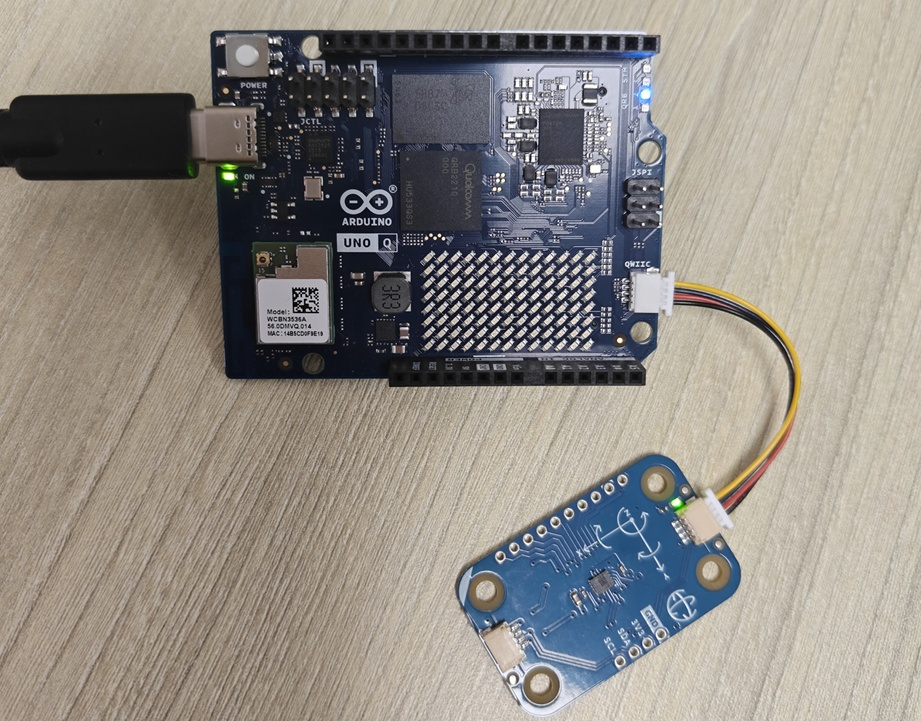
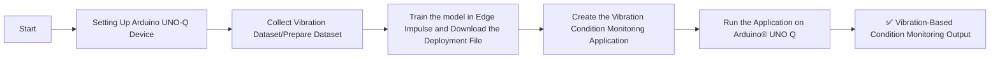
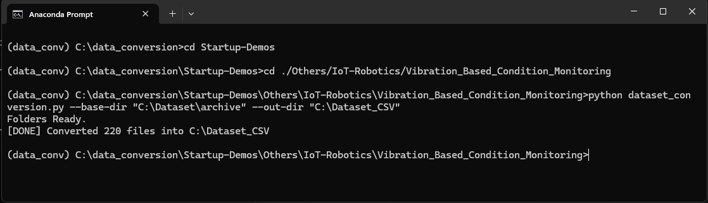
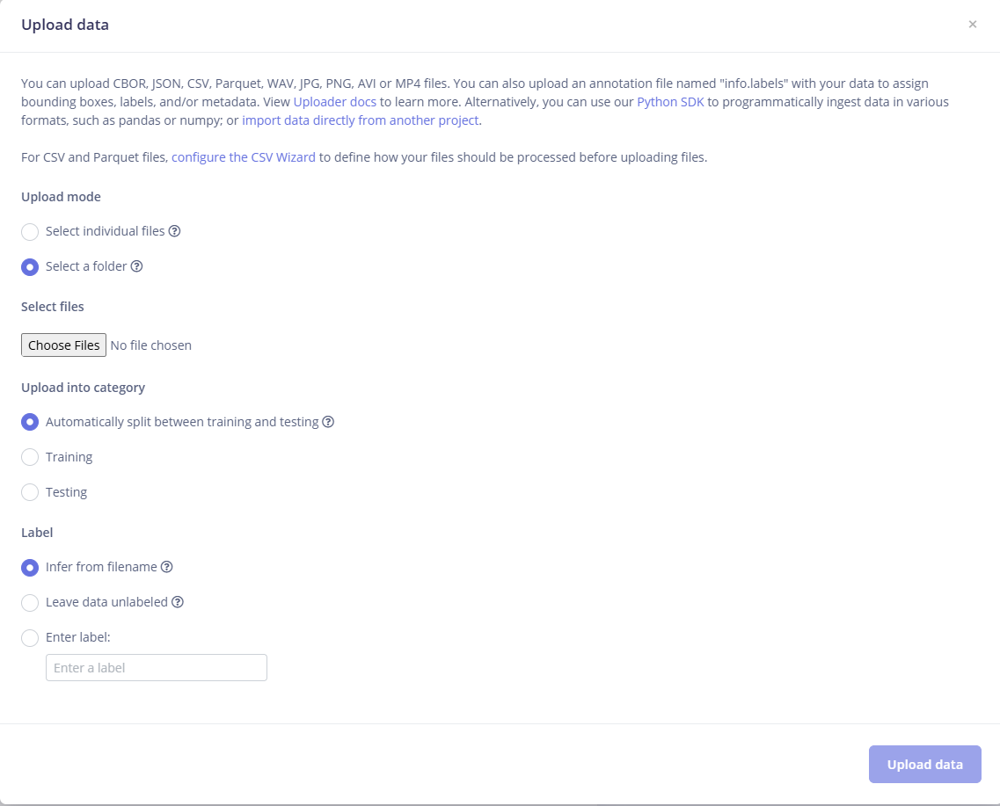
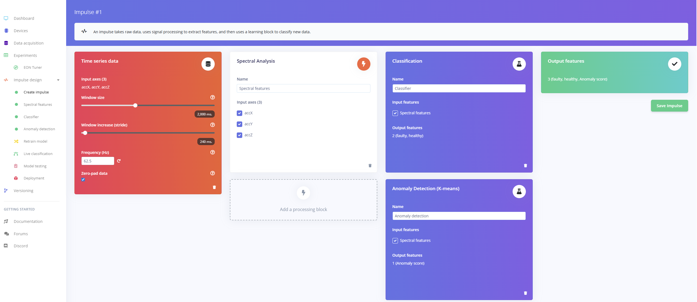
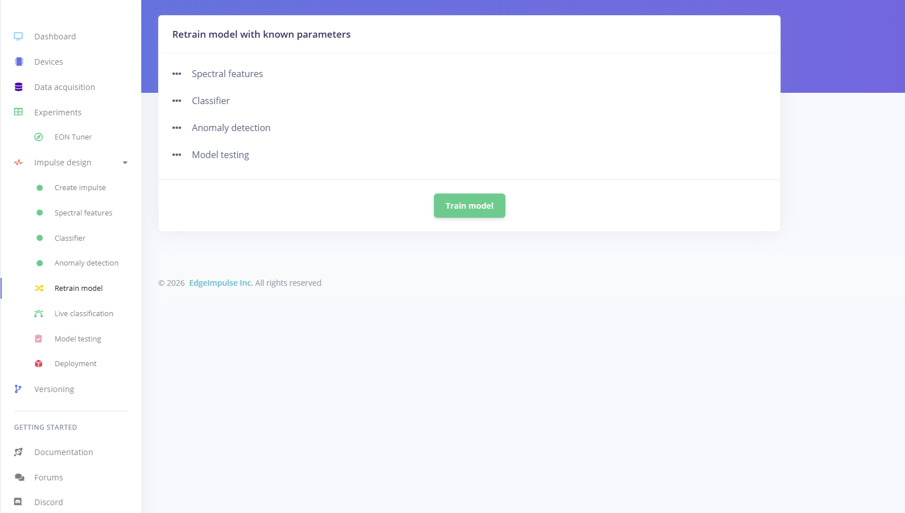
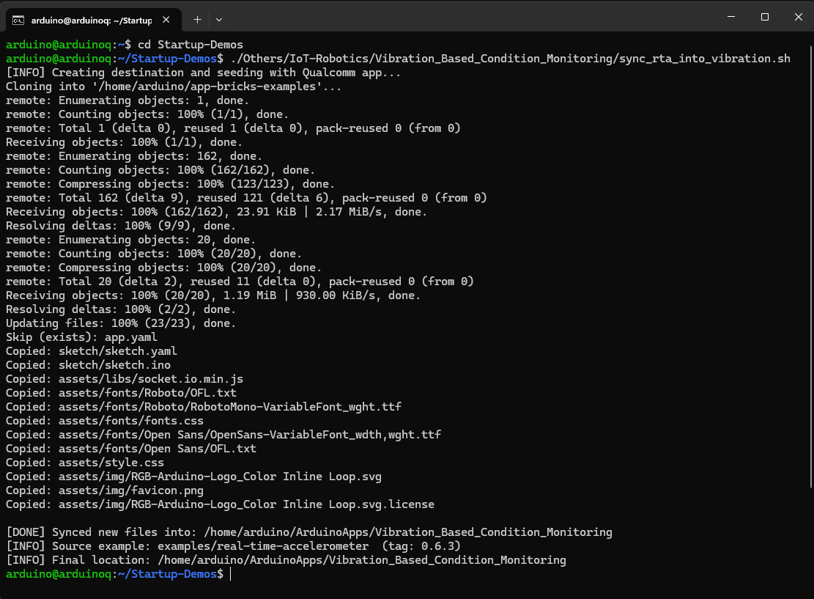
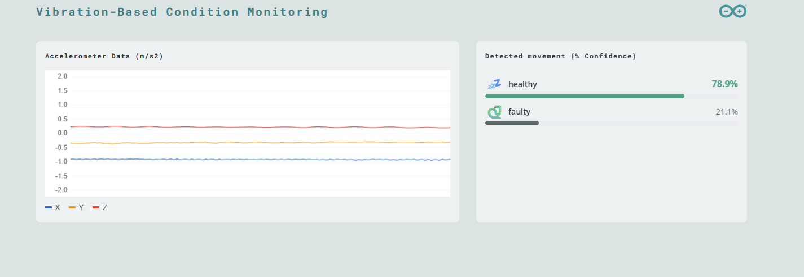

# [Startup_Demo](../../../)/[Others](../../)/[IoT-Robotics](../)/[Vibration_Based_Condition_Monitoring](./)

# Vibration-Based Condition Monitoring

## Table of Contents
- [1. Overview](#1-overview)
- [2. Requirements](#2-requirements)
  - [2.1 Hardware](#21-hardware)
  - [2.2 Software](#22-software)
  - [2.2.1 Arduino® UNO Q + Modulino Movement Sensor Setup ](#211-arduino-uno-q--modulino-movement-sensor-setup)
- [3. Vibration-Based Condition Monitoring Workflow](#3-vibration-based-condition-monitoring-workflow)
- [4. Setup Instructions](#4-setup-instructions)
  - [4.1 Setting Up Visual Studio Code (VS Code)](#41-setting-up-visual-studio-code-vs-code)
  - [4.2 Setting Up Arduino App Lab](#42-setting-up-arduino-app-lab)
  - [4.3 Setting Up Arduino Flasher Cli](#43-setting-up-arduino-flasher-cli)
  - [4.4 Setting Up Arduino UNO-Q Device](#44-setting-up-arduino-uno-q-device)
- [5. Get the Model from Edge Impulse](#5-get-the-model-from-edge-impulse)
  - [5.1 Setup an Edge Impulse Account](#51-setup-an-edge-impulse-account)
  - [5.2 Clone the Edge Impulse Project](#52-clone-the-edge-impulse-project)
- [6. Dataset Preparation (.mat → .csv) on Windows PC](#6-dataset-preparation-mat--csv-on-windows-pc)
  - [6.1 Download the Dataset.](#61-download-the-dataset)
  - [6.2 Preparing the Dataset in CSV Format](#62-preparing-the-dataset-in-csv-format)
- [7. Uploading the Dataset and Retraining the Model in Edge Impulse](#7-uploading-the-dataset-and-retraining-the-model-in-edge-impulse)
  - [7.1 Upload all CSV Datasets](#71-upload-all-csv-datasets)
  - [7.2 Retrain the Model Using the Dataset](#72-retrain-the-model-using-the-dataset)
- [8. Build and Download Deployable Model](#8-build-and-download-deployable-model)
- [9. Prepare the Application in Arduino® UNO Q Device](#9-prepare-the-application-in-arduino-uno-q-device)
  - [9.1 Source Code Setup on Device](#91-source-code-setup-on-device)
  - [9.2 Upload Model to the Device](#92-upload-model-to-the-device)
  - [9.3 Modify the Configuration file](#93-modify-the-configuration-file)
- [10 Run the Vibration_Based_Condition_Monitoring Application](#10-run-the-vibration_based_condition_monitoring-application)
- [11 Demo Output](#11-demo-output)

## 1. Overview.

The **Vibration-Based Condition Monitoring** application demonstrates the edge‑AI capabilities of the **Arduino® UNO Q** combined with a vibration‑based machine‑learning model trained using **Edge Impulse**.
This project enables real‑time detection of machine health, identifying whether a machine is operating in a Healthy or Faulty state based on live vibration data from an onboard motion sensor.

## 2. Requirements

- 📡 **Real-Time Vibration Monitoring**: Continuously reads live accelerometer data (X, Y, Z axes) from the Modulino Movement sensor connected to the Arduino UNO Q. These signals represent the mechanical vibration of the machine.
- 🧠 **AI‑Powered Fault Classification**: Utilizes an optimized Edge Impulse accelerometer model that processes vibration signals using FFT‑based DSP and identifies whether the machine is in a healthy or faulty operational state.
- 🔄  **Continuous Health Evaluation**: The device evaluates every 1‑second vibration window (with overlapping analysis) to provide frequent and reliable updates about machine condition.
- 🌐 **Web-Based Interface**: Managed through an interactive web interface for seamless control and monitoring.

### 2.1 Hardware.

- **[Arduino® UNO Q](../../../Hardware/Arduino_UNO-Q.md#arduino-uno-q)**
- USB camera (x1)
- USB-C® hub adapter with external power (x1)
- A power supply (5 V, 3 A) for the USB hub (e.g., a phone charger)
- Personal computer with internet access.
- Windows PC for Data_Conversion.
- [Modulino Movement Sensor](https://docs.arduino.cc/hardware/modulino-movement/) to [Buy](https://robu.in/product/official-arduino-modulino-movement-module-abx00101/?)
- Qwiic cable

### 2.1.1 Arduino® UNO Q + Modulino Movement Sensor Setup 

- Connect the board to a computer using a USB-C® cable.

- Connect the Modulino® Movement to the board using the Qwiic connector.




### 2.2 Software.

- [Arduino App Lab](../../../Tools/Software/Arduino_App_Lab/README.md)
- [Edge Impulse](../../../Tools/Software/Edge_Impluse/README.md)
- [Bricks](../../../Tools/Software/Arduino_App_Lab/README.md#25-bricks)
- [VS Code](../../../Hardware/Tools.md#vscode-setup)

## 3. Vibration-Based Condition Monitoring Workflow.


## 4. Setup Instructions.

Before proceeding further, please ensure that **all the setup steps outlined below are completed in the specified order**. These instructions are essential for configuring the various tools required to successfully run the application.

Each section provides a reference to internal documentation for detailed guidance. Please follow them carefully to avoid any setup issues later in the process.

## 4.1 Setting Up Visual Studio Code (VS Code).
Visual Studio Code is the recommended IDE for editing, debugging, and managing the project’s source code. It provides essential extensions and integrations that streamline development workflows. Please follow the setup instructions carefully to ensure compatibility with the project environment.

For detailed steps, refer to the internal documentation:
[Set up VS Code](../../../Tools/Software/VScode_Setup/README.md#34-configure-ssh)

## 4.2. Setting Up Arduino App Lab.
Arduino App Lab enables you to create and deploy Apps directly on the Arduino® UNO Q board, which integrates both a microcontroller and a Linux-based microprocessor. The App Lab runs seamlessly on personal computers (Windows, macOS, Linux) and comes pre-installed on the UNO Q, with automatic updates. Please follow the setup instructions carefully to ensure smooth development and deployment of Apps.

For detailed steps, refer to the documentation: 
[Set up Arduino App Lab]( ../../../Tools/Software/Arduino_App_Lab/README.md#4-installation)

## 4.3. Setting Up Arduino Flasher Cli.
Arduino Flasher CLI provides a streamlined way to flash Linux images onto your Arduino UNO Q board. Please follow the setup instructions carefully to avoid flashing errors and ensure proper board initialization.

For detailed steps, refer to the documentation: 
[Arduino Flasher CLI]( ../../../Hardware/Arduino_UNO-Q.md#flashing-a-new-image-to-the-uno-q)

## 4.4. Setting Up Arduino UNO-Q Device.
Arduino UNO-Q must be properly configured to ensure reliable communication with the host system and accurate sensor data acquisition. Please follow the setup instructions carefully to avoid hardware conflicts and ensure seamless integration with the software stack.

For detailed steps, refer to the documentation: 
[Set up Arduino UNO-Q]( ../../../Hardware/Arduino_UNO-Q.md#uno-q-as-a-single-board-computer).

## 5. Get the Model from Edge Impulse.
Edge Impulse empowers you to build datasets, train machine learning models, and optimize libraries for deployment directly on-device.

Click here to know more about [Edge Impluse]( ../../../Tools/Software/Edge_Impluse/README.md)

### 5.1 Setup an Edge Impulse Account.
An Edge Impulse account is required to access the platform’s full suite of tools for building, training, and deploying machine learning models on the Arduino UNO Q. Please follow the setup instructions carefully to ensure proper integration with your device and development workflow.

Follow the instructions to sign up: 
[Signup Instructions]( ../../../Tools/Software/Edge_Impluse/README.md#22-login-or-signup)

### 5.2 Clone the Edge Impulse Project.

Cloning an Edge Impulse project allows you to replicate existing machine learning workflows, datasets, and configurations for customization or deployment on the Arduino UNO Q. Please follow the setup instructions carefully to ensure proper synchronization and compatibility with your device.

Clone the [Vibration_Based_Condition_Monitoring](https://studio.edgeimpulse.com/public/889886/live)

For detailed steps, refer to the documentation: 
[Clone the Repository]( ../../../Tools/Software/Edge_Impluse/README.md#29-clone-project-repository)

## 6 Dataset Preparation (.mat → .csv) on Windows PC

This section explains how to prepare, convert, and upload a private dataset into Edge Impulse Studio for model training.
As an example, we demonstrate this process using the Vibration Faults Dataset from Kaggle. if any formate of data is not supported by Edge Impulse, it needs to be converted to CSV format before uploading. This conversion ensures compatibility with the Edge Impulse platform's data ingestion pipeline.

### 6.1 Download the Dataset.

Follow the steps below to download the sample dataset:

- Visit the Kaggle dataset page: [Vibration Faults Dataset for Rotating Machines](https://www.kaggle.com/datasets/sumairaziz/vibration-faults-dataset-for-rotating-machines)
- Click the Download button to download the dataset ZIP file.
- Extract the ZIP file and organize the files into a folder structure similar to the `C:\Dataset\archive` shown in the .ipynb file.

⚠️ **Disclaimer:** The dataset referenced in this project is hosted on Kaggle. Kindly review and comply with the dataset’s license terms and conditions as specified on the Kaggle dataset page before accessing, using, or redistributing the data.
 
 ### 6.2 Preparing the Dataset in CSV Format.

- Edge Impulse supports data ingestion using CSV file format, so the raw files (which are in .mat format in this example) must be converted to CSV before uploading.

For detailed steps, refer to the documentation:
[CSV format](https://docs.edgeimpulse.com/tools/specifications/data-acquisition/csv)

### 🛠️  Setup Instructions 

Before proceeding further, please ensure that **all the setup steps outlined below are completed in the specified order**. These instructions are essential for configuring the various tools required to successfully run the application.

Each section provides a reference to internal documentation for detailed guidance. Please follow them carefully to avoid any setup issues later in the process.

---

### 📦 Step1: Miniconda Installation

Miniconda is required to manage the application's Python environment and dependencies. Please follow the setup instructions carefully to ensure a consistent and reproducible environment.

For detailed steps, refer to the internal documentation:  
[Set up Miniconda]( ../../../Hardware/Tools.md#miniconda-setup)

### 🔧 Step2: Git Configuration

Git is required for version control and collaboration. Proper configuration ensures seamless integration with repositories and development workflows.

For detailed steps, refer to the internal documentation:  
[Setup Git]( ../../../Hardware/Tools.md#git-setup)

---
### 🧪 Step3: Environment Setup

To set up the Python environment required for running the application, follow the steps below. This ensures all dependencies are installed in an isolated and reproducible environment.

### 🔧 Steps

1. **Create your working directory** :
   ```bash
   mkdir my_working_directory
   cd my_working_directory
   ```

2. **Download Your Application** :
   ```bash
   git clone -n --depth=1 --filter=tree:0 https://github.com/qualcomm/Startup-Demos.git
   cd Startup-Demos
   git sparse-checkout set --no-cone /Others/IoT-Robotics/Vibration_Based_Condition_Monitoring
   git checkout
   ```
   
3. **Navigate to Application Directory** :
   ```bash
   cd ./Others/IoT-Robotics/Vibration_Based_Condition_Monitoring
   ```

4. **Create a new Conda environment** with Python 3.10:
   ```bash
   conda create -n myenv python=3.10
   ```

5. **Activate the environment**:
   ```bash
   conda activate myenv
   ```

6. **Install the required dependencies**:
   ```bash
   pip install -r requirements.txt
   ```

7. **Run the Dataset_Conversion.py Script**:
   ```bash
   python dataset_conversion.py --base-dir "C:\Dataset\archive" --out-dir "C:\Dataset_CSV"
   ```



## 7 Uploading the Dataset and Retraining the Model in Edge Impulse

This section will guide you through uploading the dataset to Edge Impulse and retraining the machine‑learning model using the collected vibration data.

### 7.1 Upload all CSV Datasets

- Click Upload Data in the Data Acquisition tab.
- Select the new CSV files that were generated in `Section 6.2`.
- As shown in the figure, select the highlighted options and click the Upload button to proceed.
- Confirm upload and verify that all files appear properly.



### 7.2 Retrain the Model Using the Dataset

#### Step 1: Verify the Impulse Configuration

- Go to Impulse Design → Create Impulse.
- Ensure the following parameters are configured correctly:
- Labels are correctly detected (faulty, healthy)
- Frequency (Hz) matches dataset sampling rate - (`62.5 Hz`)
- Window size (`2000ms`)and window stride (`240ms`) are appropriate for vibration data.
- Ensure that the learning blocks include a Classification block and an Anomaly Detection (K‑means) block.
- Review all settings to confirm they match your application requirements.
- Directly click the Retain Model block in Step 2. Do not change any settings in the Spectral Features, Classification, or Anomaly Detection blocks—keep all values at their default



#### Step 2: Retrain the Model

- Navigate to Retrain model section in Edge Impulse Studio.
- Click on Start Training to train the model with the newly uploaded dataset.




## 8 Build and Download Deployable Model.
Edge Impulse allows you to build optimized machine learning models tailored for deployment on the Arduino UNO Q. Once trained, models can be compiled into efficient libraries and downloaded for direct integration with your device. Please follow the setup instructions carefully to ensure the model is compatible with your hardware and application requirements.

**Mandatory step:**
1. Select Arduino UNO Q Hardware while configuring your deployment at the Deployment stage.
2. Build the model (It automatically downloads the deployable model).


For detailed steps, refer to the documentation: 
[Build and Deploy Model]( ../../../Tools/Software/Edge_Impluse/README.md#28-download-deployable-model)

## 9. Prepare the Application in Arduino® UNO Q Device.

This section will guide you on how to create a new application from an existing example, configure Edge Impulse models, set up the application parameters, and build the final App for deployment on the Arduino UNO Q.Starting from a pre-built example is recommended for first-time users to better understand the structure and workflow.


### 9.1 Source Code Setup on Device:

Clone the repository and transfer the source code to the device’s application directory. The following commands should be run in the terminal or command prompt. Ensure that the device is connected via ADB before proceeding.

   ```bash
   adb shell
   ```

   ```bash
   cd ~
   git clone -n --depth=1 --filter=tree:0 https://github.com/qualcomm/Startup-Demos.git
   cd Startup-Demos
   git sparse-checkout set --no-cone /Others/IoT-Robotics/Vibration_Based_Condition_Monitoring
   git checkout
   chmod +x ./Others/IoT-Robotics/Vibration_Based_Condition_Monitoring/setup_vibration_condition_monitor.sh
   ./Others/IoT-Robotics/Vibration_Based_Condition_Monitoring/setup_vibration_condition_monitor.sh
   ```



### 9.2 Upload Model to the Device.

Once the deployable model is built in Edge Impulse, it must be uploaded to the Arduino UNO Q to enable real-time inference and application integration. This section will guide you through transferring the compiled model to the device, verifying compatibility, and preparing it for execution within your App Lab application.

Here mention about usage of the model which download from edge impulse in the previous step.
[Build and Deploy Model](../../../Others/IoT-Robotics/Vibration_Based_Condition_Monitoring/README.md#8-build-and-download-deployable-model)

**Upload location**:Make sure to upload the model file to **/home/arduino/.arduino-bricks/ei-models/Vibration-Based-Condition-Monitoring.eim**

### 9.3 Modify the Configuration file.

The `app.yaml` file defines the structure, behavior, and dependencies of your Arduino App Lab application. Modifying this configuration allows you to customize how your app interacts with hardware, integrates Edge Impulse models, and launches on the Arduino UNO Q. 

This section guides you through editing key parameters such as bricks, model paths, and runtime settings. Follow the setup instructions carefully to ensure that the application name and the `.eim` file match the generated names and that the application runs as expected.

   ```yaml
   name: Vibration_Based_Condition_Monitoring
   description: "Vibration-Based-Condition-Monitoring using the Modulino Movement sensor"
   ports: []
   bricks:
   - arduino:motion_detection: {
       variables: {
         EI_MOTION_DETECTION_MODEL: /home/arduino/.arduino-bricks/ei-models/Vibration-Based-Condition-Monitoring.eim
       }
     }
   - arduino:web_ui: {}

   icon: 🐍
   ```

## 10. Run the Vibration_Based_Condition_Monitoring Application.

Once your application is configured and built in Arduino App Lab, it can be deployed and executed directly on the Arduino UNO Q. This section will guide you through launching the application, verifying modulino movement sensor data, and observing real-time monitoring.

 

For detailed steps, refer to the documentation: 
[Run Application](../../../Tools/Software/Arduino_App_Lab/README.md#run-example-apps-in-arduino-app-lab)

## 11. Demo Output.

- Launch the application and wait for it to start.
- Open a web browser and go to (http://<UNO-Q-IP-ADDRESS>:7000) or (This may open automatically).
- The web page shows real-time X, Y, and Z accelerometer data from the Modulino® Movement sensor, displayed on a live chart.
- The data is analyzed using a pre-trained machine‑learning model, which classifies the device state as Healthy or Faulty.
 

 > 💡 Refer to the Kaggle [Vibration Faults Dataset for Rotating Machines](https://www.kaggle.com/datasets/sumairaziz/vibration-faults-dataset-for-rotating-machines) page for more information and to explore the vibration patterns used. The model analyzes these input vibration signals and determines whether the motor condition is `Healthy` or `Faulty`
