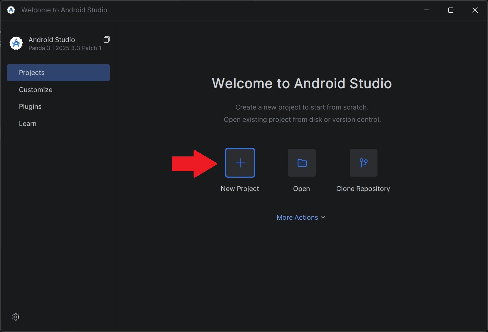
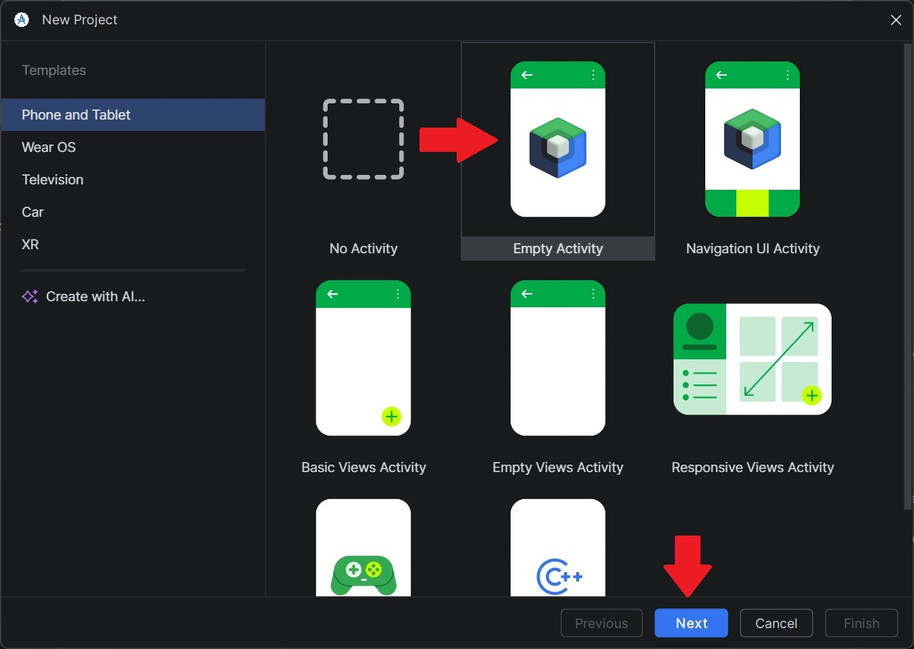
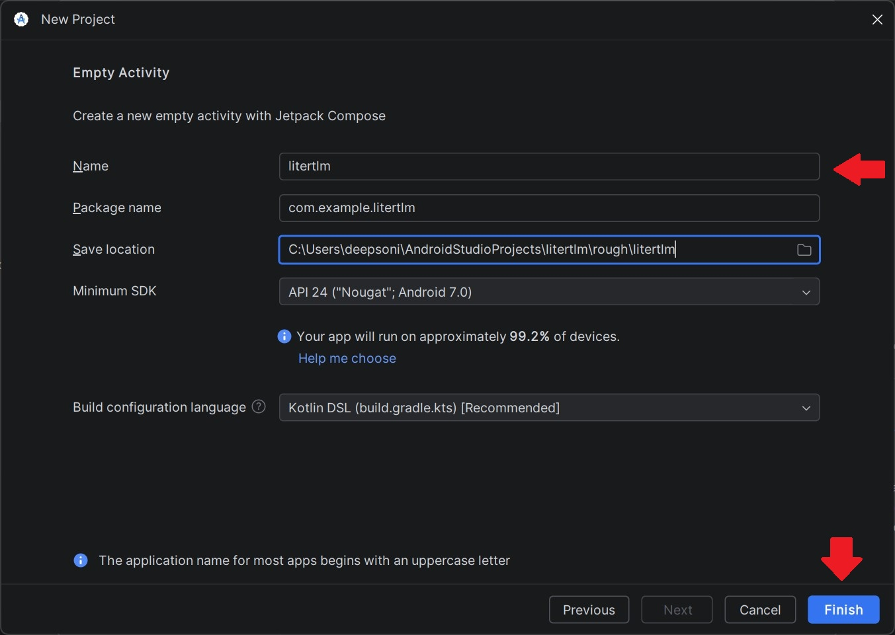

<!--
===--README.md---------------------------------------------------===//
Part of the Startup-Demos Project, under the MIT License
See https://github.com/qualcomm/Startup-Demos/blob/main/LICENSE.txt
for license information.
Copyright (c) Qualcomm Technologies, Inc. and/or its subsidiaries.
SPDX-License-Identifier: MIT
===----------------------------------------------------------------------===//
-->

# Create android studio Empty Activity project

## Introduction

This guide explains how to create a new Empty Activity project in Android Studio.
Use these steps when starting a basic Android application that needs a simple default activity and standard project setup.

### Step 1

- Open android studio
- Click on New Project
- Note: If a project is already open close it 

---

### Step 2

- Click on Empty Activity (it is a project template)
- Click Next

---

### Step 3

- Give project your desired name
- Set package name, file location, SDK version and language
  - Usually the default ones work

