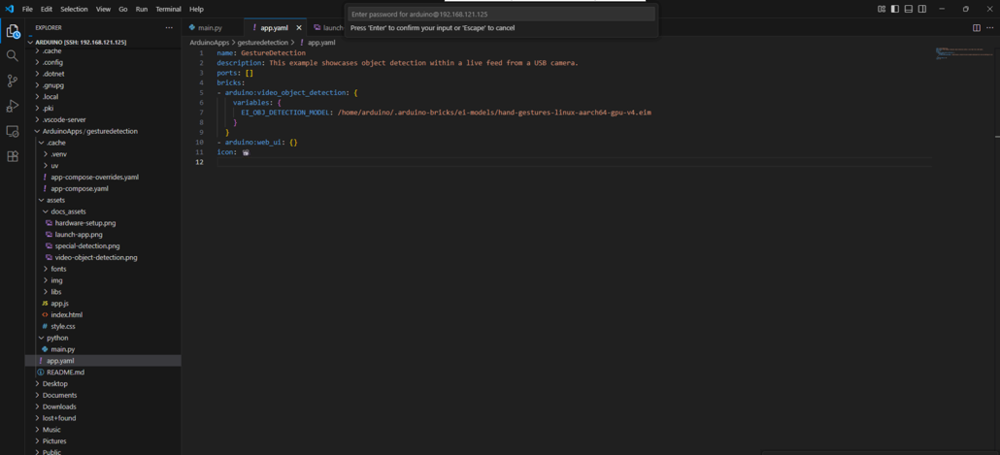

# Arduino App Lab

## Table of Contents
- [Overview](#1-overview)
- [Hardware Requirements](#2-hardware-requirements)
- [Software](#3-software)
- [Installation](#4-installation)
- [Board Modes](#5-board-modes)
- [Getting Started](#6-getting-started)
  - [Apps](#61-apps)
  - [Bricks](#62-bricks)
- [Create & Run Apps in Arduino App Lab](#7-create--run-apps-in-arduino-app-lab)
  - [Run Example Apps in Arduino App Lab](#run-example-apps-in-arduino-app-lab)
  - [Application Running Status](#application-running-status)
  - [Create a New App](#create-a-new-app)
  - [Duplicate an Existing Example](#duplicate-an-existing-example)
  - [Upload Model to device](#upload-model-to-device)
    - [Manual procedure](#1-manual-procedure)
    - [VScode](#2-vscode)

## 1. Overview
Arduino App Lab is a powerful development environment designed for the Arduino® UNO Q board, which uniquely combines a microcontroller and a Linux-based microprocessor. This platform enables users to create and deploy applications (Apps) that run on the UNO Q, leveraging both hardware and software capabilities.

### Key Features

- Cross-platform support: Available for Windows, macOS, and Linux.
- Dual-mode operation: Runs on a PC or directly on the UNO Q board.
- App-based architecture: Combines Python scripts and Arduino sketches.
- Modular development: Uses “Bricks” – pre-packaged code modules for AI, web servers, and APIs.
- Bridge tool: Facilitates communication between the microcontroller and microprocessor.

## 2. Hardware Requirements
To begin developing with Arduino App Lab, you’ll need specific hardware depending on how you plan to use the Arduino® UNO Q board. The board supports multiple modes of operation, each with its own hardware setup.

### Essential Hardware
- Computer: Windows, macOS, or Linux
- Arduino® UNO Q Board
- USB-C® Cable: For connecting the UNO Q to your computer

For detailed steps, refer to the documentation: 
[Hardware Requirements](https://docs.arduino.cc/software/app-lab/tutorials/getting-started/#hardware)

## 3. Software
The Arduino App Lab software is a cross-platform development tool designed to work with the Arduino® UNO Q board, enabling users to build and run applications that integrate both microcontroller and microprocessor functionalities.

For detailed steps, refer to the documentation: 
[Software](https://docs.arduino.cc/software/app-lab/tutorials/getting-started/#software)


## 4. Installation
To install Arduino App Lab, follow these steps:

1. Download the Arduino App Lab installer from the official Arduino website.
2. Run the installer and follow the on-screen instructions.
3. Connect your Arduino UNO Q board to your computer using a USB-C cable.
4. Launch Arduino App Lab.
5. Follow the setup wizard to configure your development environment.

To get started with installation and setup, please refer to the official documentation:
[Installation](https://docs.arduino.cc/software/app-lab/tutorials/getting-started/#install--set-up-arduino-app-lab)

## 5. Board Modes
The Arduino® UNO Q board supports multiple operating modes to accommodate different development workflows and hardware configurations. These modes define how the board interacts with the App Lab environment and how it executes code.

To understand and configure the board modes correctly, refer to the official Arduino documentation:
[Board modes](https://docs.arduino.cc/software/app-lab/tutorials/getting-started/#board-modes)


## 6. Getting Started 
The Arduino App Lab interface is designed to provide a streamlined and intuitive development experience for users working with the Arduino® UNO Q board. The UI includes essential components such as:

- Project Explorer for managing files and folders
- Code Editor with syntax highlighting and auto-completion
- Serial Monitor for real-time communication with the board
- Board Status Panel to view connection and mode details
- Toolbar for quick access to build, upload, and run commands

To explore the UI in detail and understand each component's functionality, refer to the official documentation:
[Getting Started](https://docs.arduino.cc/software/app-lab/tutorials/getting-started/#arduino-app-lab-ui-overview)

### 6.1 Apps
In Arduino App Lab, an App is a self-contained project that runs on the Arduino® UNO Q board, combining microcontroller and microprocessor logic. Apps are the core units of development and deployment within the App Lab environment.

To learn more about how Apps work and how to manage them, refer to the official documentation:
[Apps](https://docs.arduino.cc/software/app-lab/tutorials/getting-started/#what-are-apps)

### 6.2 Bricks 
Bricks are modular software components in Arduino App Lab that extend the functionality of your App. They act like plug-ins or building blocks that can be added to your project to enable specific features, such as:

- Peripheral drivers (e.g., sensors, displays).
- Communication protocols (e.g., Wi-Fi, Bluetooth).
- System utilities (e.g., file system, logging).

Bricks simplify development by providing reusable, pre-tested modules that integrate seamlessly with the Arduino® UNO Q board environment.

To learn more about Bricks and how to use them in your projects, refer to the official documentation:
[Bricks ](https://docs.arduino.cc/software/app-lab/tutorials/getting-started/#what-are-bricks)

## 7. Create & Run Apps in Arduino App Lab
Creating and running applications in Arduino App Lab is a streamlined process designed for rapid development on the Arduino® UNO Q board. The platform allows users to build embedded applications that combine microcontroller and microprocessor logic.

### Run Example Apps in Arduino App Lab
Arduino App Lab provides a collection of example apps to help users quickly understand how to develop and deploy applications on the Arduino® UNO Q board. These examples serve as ready-to-use templates and learning tools, showcasing various features and use cases.

To explore and run example apps, refer to the official documentation:
To learn more, refer to the official documentation:
**[Example Helloword](https://docs.arduino.cc/software/app-lab/tutorials/getting-started/#run-example-apps)**

### Application Running Status
Once an app is deployed to the Arduino® UNO Q board, it's important to verify whether it is actively running. Arduino App Lab provides clear indicators to help users confirm the app's execution status.

You can check if your app is running by:

- Observing the Board Status Panel – It displays real-time information about the board’s current mode and app activity.
- Using the Serial Monitor – Output logs and messages from the running app can be viewed here.
- Checking the UI Indicators – Visual cues in the App Lab interface show whether the app is idle, running, or stopped.

To learn more, refer to the official documentation:
[Status](https://docs.arduino.cc/software/app-lab/tutorials/getting-started/#how-do-i-know-my-app-is-running)

### Create a New App
Creating a new application in Arduino App Lab is the first step toward building custom projects for the Arduino® UNO Q board. The platform provides a guided interface to help users start from scratch with ease.

To create a new app:
- Open App Lab – Launch the development environment.
- Click on “New App” – Start a fresh project.
- Name Your App – Choose a unique name for your application.
- Select Configuration Options – Define initial settings such as board mode and bricks.
- Begin Coding – Use the built-in editor to write your application logic.

To follow the step-by-step guide, refer to the official documentation:
[Create New](https://docs.arduino.cc/software/app-lab/tutorials/getting-started/#create-a-new-app)

### Duplicate an Existing Example
Duplicate an Existing Example in Arduino App Lab
Arduino App Lab allows users to duplicate existing example apps to use as a starting point for custom development. This feature is especially useful for learning, experimentation, and rapid prototyping on the Arduino® UNO Q board.

Duplicating an example involves:
- Selecting an Example App – Browse the available examples in the App Lab interface.
- Using the Duplicate Option – Create a copy of the selected app with a new name.
- Modifying the App – Customize the duplicated app’s code and configuration to suit your needs.

To learn how to duplicate an example step-by-step, refer to the official documentation:
[Copy And Edit](https://docs.arduino.cc/software/app-lab/tutorials/getting-started/#duplicate-an-existing-example)

### Upload Model to device
After downloading your deployable model from Edge Impulse, you can upload it to your target device using two common methods: VS Code integration or manual file copy. These approaches are useful when working with custom firmware or Linux-based boards like Arduino UNO Q.

#### 1. Manual procedure

```bash
cd ~/.local/share/arduino-app-cli/examples/<name of your application>

cp -r assets/* /home/arduino/ArduinoApps/<name of your application>

cp python/main.py /home/arduino/ArduinoApps/<name of your application>/python/

python3 main.py
```

#### 2. VScode
1. Configure SSH in VScode.

 

2. Upload file to loaction 
**Upload location**:Make sure to upload the model file to **/home/arduino/.arduino-bricks/ei-models/**
